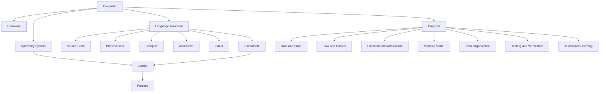
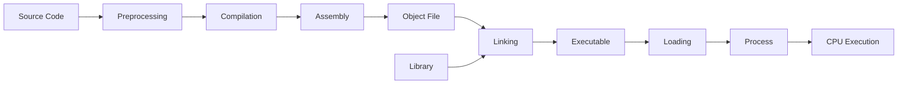
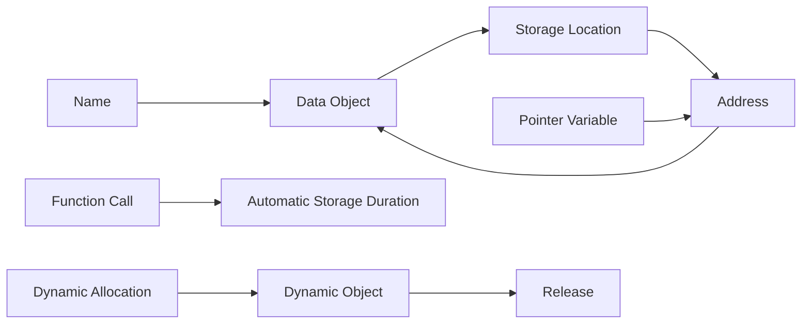
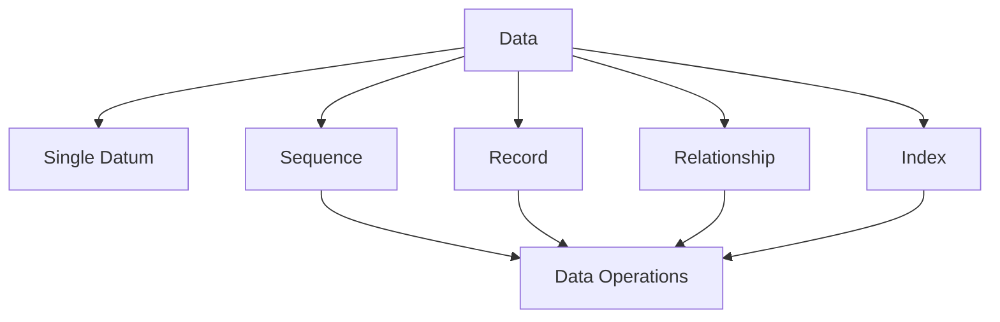

# Programming Domain Model

Version: 0.1.1  
Status: Architecture draft  
Corresponding Chinese version: [程式設計領域模型](03-programming-domain-model.zh-TW.md)

## Document Purpose

This document describes the core concepts that exist in the programming domain and how those concepts relate to one another.

It is not a course sequence, prerequisite graph, or assessment document. It provides the shared semantic foundation for the knowledge dependency graph, competency map, scope boundary, teaching materials, and assessments.

## Constitutional Compliance

- The Chinese and English versions use the same concepts, identifiers, and relationships.
- Relationships that benefit from visualization are shown visually.
- Visuals and prose complement each other, and the domain model is not treated as a teaching sequence.
- AI is modeled as a collaborator in learning and verification, not as a replacement for student thinking.

## Boundary Between Domain Model and Knowledge Graph

| Document | Question Answered |
|---|---|
| Domain model | What concepts exist in this world, and how are they related? |
| Knowledge dependency graph | What concepts are usually needed before another concept can be understood? |
| Competency map | What must students be able to do? |

Connections in the domain model represent existence, composition, interaction, or data-flow relationships. They do not define one mandatory learning sequence.

## First-Level Domains

## Core Entities and Relationships

### DM-E: Translation and Execution Domain

| ID | Concept | Domain Relationship |
|---|---|---|
| DM-E01 | Source code | Written by humans and processed by the toolchain. |
| DM-E02 | Preprocessor | Handles inclusion, macros, and conditional content. |
| DM-E03 | Compiler | Converts a high-level language into a lower-level representation. |
| DM-E04 | Assembler | Converts assembly language into object code. |
| DM-E05 | Linker | Combines object files and libraries. |
| DM-E06 | Executable | A loadable program image produced by the toolchain. |
| DM-E07 | Loader | Maps a program into a process through the operating system. |
| DM-E08 | Process | A running program together with its resources and state. |
| DM-E09 | CPU | Changes process state according to machine instructions. |

### DM-D: Data and State Domain

| ID | Concept | Domain Relationship |
|---|---|---|
| DM-D01 | Value | Information processed by a program. |
| DM-D02 | Type | Constrains representation, range, and operations. |
| DM-D03 | Variable | Gives a name to mutable state. |
| DM-D04 | Constant | Represents a value that should not change within a semantic context. |
| DM-D05 | Operator | Performs an operation on values or state. |
| DM-D06 | Expression | Can be evaluated from values, names, and operators. |
| DM-D07 | Assignment | Writes a result into a storage location. |
| DM-D08 | Input and output | Exchanges data with an external environment. |
| DM-D09 | Scope | The program region in which a name may be used. |
| DM-D10 | Lifetime | The period during which a data entity exists. |

### DM-C: Flow and Control Domain

| ID | Concept | Domain Relationship |
|---|---|---|
| DM-C01 | Statement | A basic executable action. |
| DM-C02 | Sequence | Statements execute in temporal order by default. |
| DM-C03 | Condition | Produces a true-or-false judgment from current state. |
| DM-C04 | Selection | Chooses an execution path from a condition. |
| DM-C05 | Repetition | Repeats execution under a condition and state update. |
| DM-C06 | Termination | Defines when repetition or a process ends. |

### DM-F: Functions and Abstraction Domain

| ID | Concept | Domain Relationship |
|---|---|---|
| DM-F01 | Problem | A goal to be handled programmatically. |
| DM-F02 | Decomposition | Divides a larger responsibility into smaller ones. |
| DM-F03 | Function | A named unit that encapsulates one responsibility. |
| DM-F04 | Interface | Describes how a function is used. |
| DM-F05 | Parameter | Data passed from a caller into a function. |
| DM-F06 | Return value | A result provided through the function interface. |
| DM-F07 | Call | Transfers control from the caller to a function. |
| DM-F08 | Module | Organizes related interfaces and implementations. |

### DM-M: Memory Domain

| ID | Concept | Domain Relationship |
|---|---|---|
| DM-M01 | Storage location | A memory region in which a data entity resides. |
| DM-M02 | Address | A value that identifies a storage location. |
| DM-M03 | Pointer | A typed variable that stores an address. |
| DM-M04 | Address-of | Obtains the address of an object. |
| DM-M05 | Dereference | Accesses a target object through an address. |
| DM-M06 | Automatic storage duration | Commonly associated with function calls and the stack. |
| DM-M07 | Dynamic storage duration | Acquired and released during execution. |
| DM-M08 | Ownership and lifetime responsibility | Determines when a resource is valid and who must release it. |

### DM-O: Data Organization Domain

This domain describes how programs organize data without deciding in advance which advanced data structures belong in the course.

| ID | Concept | Domain Relationship |
|---|---|---|
| DM-O01 | Single datum | One value or data object. |
| DM-O02 | Sequence | Organizes multiple elements by position or order. |
| DM-O03 | Record | Groups multiple fields describing one entity. |
| DM-O04 | Relationship | Describes links among data entities. |
| DM-O05 | Index | Locates data through a position or key. |
| DM-O06 | Operation | Includes create, read, update, delete, search, and rearrangement. |

### DM-V: Testing, Debugging, and Verification Domain

| ID | Concept | Domain Relationship |
|---|---|---|
| DM-V01 | Requirement | Defines the behavior a program should exhibit. |
| DM-V02 | Expected result | A result derived from the requirement before execution. |
| DM-V03 | Test case | Makes input, conditions, and expected results concrete. |
| DM-V04 | Actual result | The observed outcome after execution. |
| DM-V05 | Comparison | Determines whether expected and actual results agree. |
| DM-V06 | Error | A state that violates syntax, execution conditions, or requirements. |
| DM-V07 | Debugging | Collects evidence, forms hypotheses, and tests causes. |
| DM-V08 | Confidence | Is supported by multiple forms of evidence, not one successful run. |

### DM-A: AI-assisted Learning Domain

| ID | Concept | Domain Relationship |
|---|---|---|
| DM-A01 | Learner understanding | The learner's initial judgment about the problem and current state before using AI. |
| DM-A02 | Question | Communicates the goal, evidence, and point of difficulty to AI. |
| DM-A03 | AI suggestion | An explanation, hint, program, or testing perspective generated by AI. |
| DM-A04 | Human review | The learner evaluates whether the suggestion is appropriate. |
| DM-A05 | Technical verification | Uses documentation, compilation, execution, and testing. |
| DM-A06 | Decision | Accepts, modifies, or rejects a suggestion. |
| DM-A07 | Transparent record | Explains how AI was used and why a decision was made. |

## Principles for Using the Domain Model

1. This document preserves stable concepts and semantics rather than weekly scheduling.
2. Before adding a concrete syntax feature, tool, or data structure, identify the domain concept it represents.
3. The knowledge dependency graph may reference these concepts, but domain relationships must not be treated as the only prerequisite order.
4. The competency map must convert concepts into observable behavior.
5. The scope boundary determines when and to what maturity a concept is taught; it does not remove concepts that objectively exist in the domain.

## Navigation

- [Back to Instructional Design Workspace](README.en.md)
- [繁體中文版](03-programming-domain-model.zh-TW.md)
- [Next stage: Programming Language Knowledge Dependency Graph](04-programming-language-knowledge-graph.en.md)
