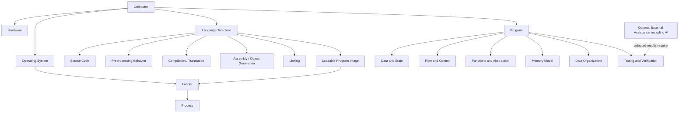
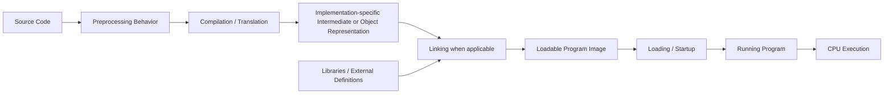
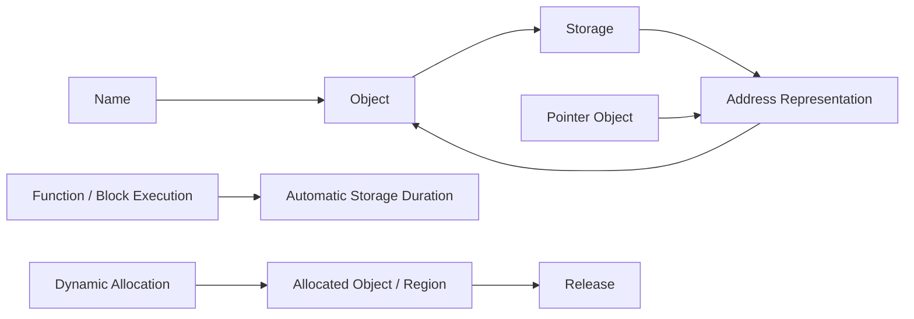
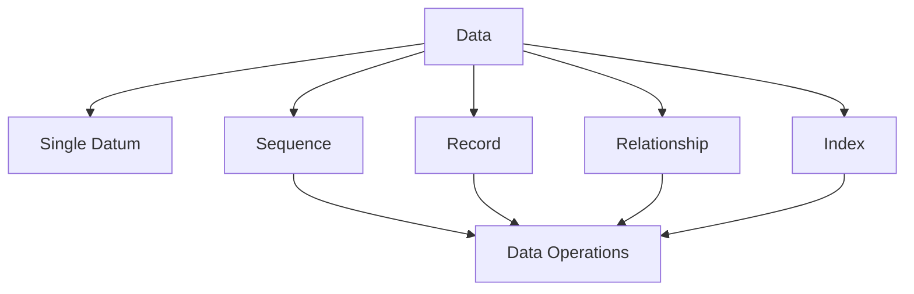

# Programming Domain Model

Version: 0.1.2  
Status: Revisable planning model  
Authority: The Constitution and official learning/assessment policy take precedence over this document  
Corresponding Chinese version: [程式設計領域模型](03-programming-domain-model.zh-TW.md)

## Document Purpose

This document describes major concepts in the programming domain and the relationships among them.

It is not a course sequence, prerequisite graph, assessment policy, or governing source. It is a revisable semantic planning model that later knowledge-dependency, competency, scope, material, and assessment documents may reference. If this model conflicts with the Constitution, an approved design standard, or the official learning and assessment policy, the higher-authority source prevails.

## Constitution 2.0 Alignment

- The Chinese and English versions use the same concepts, identifiers, relationships, status, and version.
- Relationships that benefit from visualization are shown visually, while prose states important boundaries and caveats.
- Domain relationships must not be treated as one mandatory teaching sequence.
- Testing, debugging, and verification remain core programming responsibilities.
- AI and other external tools are optional by default. When a learner chooses to adopt external assistance, the learner remains responsible for understanding, review, modification, and technical verification.
- Not using AI is not evidence of missing capability and does not create a completion, participation, or assessment deficit.

## Boundary Between Domain Model and Knowledge Graph

| Document | Question Answered |
|---|---|
| Domain model | What concepts exist, and how are they related? |
| Knowledge dependency graph | What concepts are usually helpful or necessary before another concept? |
| Competency map | What must students be able to do? |

Connections in the domain model represent existence, composition, interaction, responsibility, or data-flow relationships. They do not define one mandatory learning path.

## First-Level Domains

The toolchain nodes above form a conceptual model for teaching build responsibilities. Real C implementations may combine, omit as visible artifacts, or internally restructure preprocessing, compilation, assembly, object generation, and linking. The C language standard does not require a particular set of standalone programs or intermediate files. Materials must describe the actual target toolchain when concrete commands or artifacts matter.

## Core Entities and Relationships

### DM-E: Translation and Execution Domain

| ID | Concept | Domain Relationship |
|---|---|---|
| DM-E01 | Source code | Human-readable program text supplied to an implementation. |
| DM-E02 | Preprocessing behavior | Handles directives, inclusion, macro replacement, and conditional source processing as part of translation. |
| DM-E03 | Compilation / translation | Translates a C translation unit toward a lower-level or executable representation; implementation structure varies. |
| DM-E04 | Assembly / object generation | Common native toolchains may produce assembly or object code, but these need not appear as standalone artifacts. |
| DM-E05 | Linking | Where applicable, resolves and combines translated units, libraries, and external symbols into a loadable image. |
| DM-E06 | Loadable program image | A program representation that the target environment can load or otherwise execute. |
| DM-E07 | Loader | Maps or prepares a program for execution in the target environment. |
| DM-E08 | Process | A running program together with its resources and state. |
| DM-E09 | CPU | Executes machine-level operations that change program state. |

This diagram is conceptual rather than a guarantee that every implementation exposes each step or artifact separately.

### DM-D: Data and State Domain

| ID | Concept | Domain Relationship |
|---|---|---|
| DM-D01 | Value | Information processed by a program. |
| DM-D02 | Type | Constrains representation, range, and operations. |
| DM-D03 | Variable | Gives a name to mutable program state. |
| DM-D04 | Constant | Represents a value that should not change within a defined semantic context. |
| DM-D05 | Operator | Performs an operation on values or state. |
| DM-D06 | Expression | Can be evaluated from values, names, and operators. |
| DM-D07 | Assignment | Writes a result to an object or storage location. |
| DM-D08 | Input and output | Exchanges data with an external environment. |
| DM-D09 | Scope | The program region in which a name may be used. |
| DM-D10 | Lifetime | The period during which an object or other entity exists. |

### DM-C: Flow and Control Domain

| ID | Concept | Domain Relationship |
|---|---|---|
| DM-C01 | Statement | A basic executable or control action. |
| DM-C02 | Sequence | Establishes an order in which actions are evaluated or executed. |
| DM-C03 | Condition | Produces a truth-valued decision from current data or state. |
| DM-C04 | Selection | Chooses an execution path from a condition. |
| DM-C05 | Repetition | Repeats work while state and a continuation condition evolve. |
| DM-C06 | Termination | Defines when repetition or a process stops. |

### DM-F: Functions and Abstraction Domain

| ID | Concept | Domain Relationship |
|---|---|---|
| DM-F01 | Problem | A goal to be handled programmatically. |
| DM-F02 | Decomposition | Divides a larger responsibility into smaller responsibilities. |
| DM-F03 | Function | A named unit that encapsulates a responsibility. |
| DM-F04 | Interface | Describes how a function or module is used. |
| DM-F05 | Parameter | Data supplied through a function interface. |
| DM-F06 | Return value | A result provided through a function interface. |
| DM-F07 | Call | Transfers control and data between caller and callee. |
| DM-F08 | Module | Organizes related interfaces and implementations. |

### DM-M: Memory Domain

| ID | Concept | Domain Relationship |
|---|---|---|
| DM-M01 | Storage location | A memory region associated with an object or representation. |
| DM-M02 | Address | A value or representation used to identify a storage location. |
| DM-M03 | Pointer | A typed object whose value can represent an address or null pointer value. |
| DM-M04 | Address-of | Obtains an address for an eligible object or function. |
| DM-M05 | Dereference | Accesses a target through a valid pointer under the operation's preconditions. |
| DM-M06 | Automatic storage duration | Lifetime commonly associated with block execution and function calls. |
| DM-M07 | Allocated storage duration | Storage acquired and released through dynamic-memory facilities. |
| DM-M08 | Ownership and lifetime responsibility | Determines who may use or release a resource and when it becomes invalid. |

### DM-O: Data Organization Domain

This domain describes how programs organize data without deciding in advance which advanced data structures belong in the course.

| ID | Concept | Domain Relationship |
|---|---|---|
| DM-O01 | Single datum | One value or data object. |
| DM-O02 | Sequence | Organizes multiple elements by position or order. |
| DM-O03 | Record | Groups multiple fields that describe one entity. |
| DM-O04 | Relationship | Describes links among data entities. |
| DM-O05 | Index | Locates data through a position or key. |
| DM-O06 | Operation | Includes creation, reading, updating, deletion, search, and rearrangement. |

### DM-V: Testing, Debugging, and Verification Domain

| ID | Concept | Domain Relationship |
|---|---|---|
| DM-V01 | Requirement | Defines the behavior or constraint that should be satisfied. |
| DM-V02 | Expected result | A result or property derived before observing the implementation outcome. |
| DM-V03 | Test case | Makes inputs, conditions, and expectations concrete. |
| DM-V04 | Actual result | The observed outcome of translation, execution, or inspection. |
| DM-V05 | Comparison | Judges conformance between expectations and evidence. |
| DM-V06 | Error | A condition that violates syntax, translation requirements, runtime preconditions, or intended behavior. |
| DM-V07 | Debugging | Collects evidence, forms hypotheses, and tests candidate causes. |
| DM-V08 | Confidence | Is supported by multiple relevant pieces of evidence rather than one successful run. |

### DM-A: Optional External Assistance and Verification

This conditional domain applies only when a learner chooses to use AI or another external tool or suggestion. It is not part of core completion and is not a prerequisite for programming capability.

| ID | Concept | Domain Relationship |
|---|---|---|
| DM-A01 | Independent initial reasoning | The learner forms an initial understanding, expectation, or diagnosis without treating an external suggestion as authoritative. |
| DM-A02 | Optional assistance request | The learner may ask an AI system or other tool for an explanation, hint, code idea, or testing perspective. |
| DM-A03 | External suggestion | A non-authoritative result that may be accepted, modified, or rejected. |
| DM-A04 | Human review | The learner checks relevance, assumptions, and limitations. |
| DM-A05 | Technical verification | Uses programs, tests, compiler diagnostics, reliable references, or other reproducible evidence. |
| DM-A06 | Adoption decision | The learner accepts, modifies, or rejects the suggestion and remains responsible for the adopted result. |
| DM-A07 | Contextual disclosure | Records or explains tool use only when a specific activity, integrity rule, or assessment condition requires it; non-use requires no declaration. |

## Principles for Using the Domain Model

1. This file is a revisable planning model, not a source of policy or grading rules.
2. It preserves stable concepts and relationships rather than weekly scheduling.
3. Before adding a concrete syntax feature, tool, or data structure, identify the domain concept it represents.
4. The knowledge dependency graph may reference these concepts, but domain relationships must not be treated as the only prerequisite order.
5. The competency map converts concepts into observable behavior, while the scope model decides when and to what maturity a concept is taught.
6. Optional tools must not be promoted into universal capability requirements merely because they are represented in this model.
7. Concrete technical claims must be verified against the specified C standard and target implementation when implementation details matter.

## Related Documents

- [Instructional Design Workspace](README.en.md)
- [Programming Language Knowledge Dependency Graph](04-programming-language-knowledge-graph.en.md)
- [Programming Competency Map](05-competency-map.en.md)
- [Official Learning and Assessment Policy](13-learning-assessment-policy.en.md)
- [繁體中文版](03-programming-domain-model.zh-TW.md)
