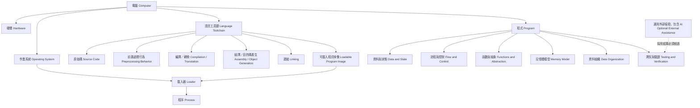
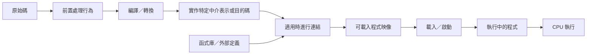
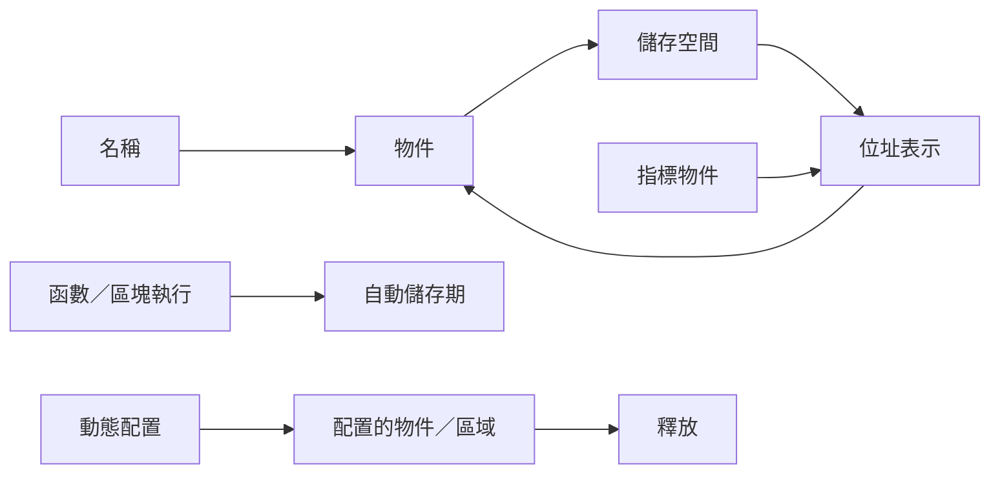
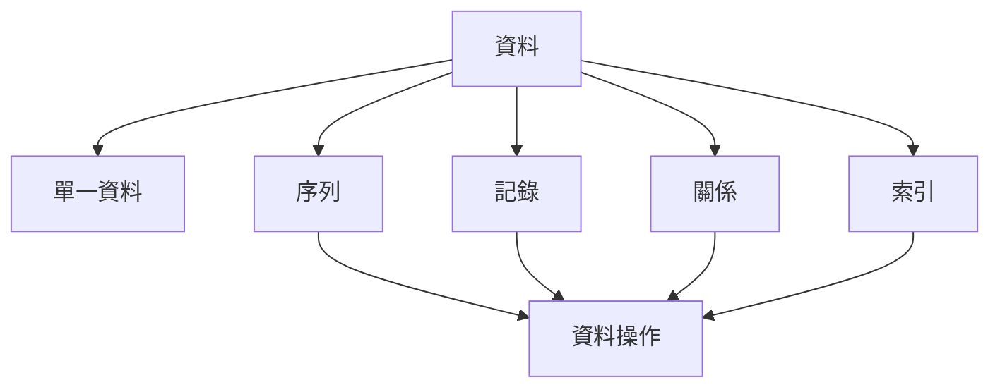

# 程式設計領域模型

版本：0.1.2  
狀態：可修訂的規劃模型  
權威關係：若與 Constitution 或正式學習與評量制度衝突，以上位文件為準  
對應英文版本：[Programming Domain Model](03-programming-domain-model.en.md)

## 文件目的

本文件描述程式設計領域中的主要概念，以及這些概念彼此之間的關係。

它不是課程順序、先備知識圖、評量政策或治理來源，而是一份可持續修訂的共同語意規劃模型。後續知識依賴圖、能力、範圍、教材與評量文件可引用本模型；若本模型與 Constitution、已核定設計標準或正式學習與評量制度衝突，以上位來源為準。

## Constitution 2.0 對齊原則

- 中文版與英文版使用相同概念、識別碼、關係、狀態與版本。
- 適合視覺化的關係以圖示呈現，重要邊界與例外則以文字明確說明。
- 領域關係不得被當成唯一且強制的授課順序。
- 測試、除錯與驗證屬於程式設計核心責任。
- AI 與其他外部工具預設為選用；學生若選擇採用外部協助，仍須自己負責理解、審查、修改與技術驗證。
- 不使用 AI 不代表能力不足，也不得因此影響完成、課堂參與或評量。

## 領域模型與知識圖的邊界

| 文件 | 回答的問題 |
|---|---|
| 領域模型 | 這個領域有哪些概念？概念之間如何關聯？ |
| 知識依賴圖 | 理解某概念前，通常哪些概念有幫助或屬必要條件？ |
| 能力地圖 | 學生必須能做到什麼？ |

領域模型中的連線表示存在、組成、作用、責任或資料流關係，不定義唯一學習路徑。

## 第一層領域

以上工具鏈節點是用來說明建置責任的概念模型。實際 C 實作可能把前置處理、編譯、組譯、目的碼產生與連結合併、隱藏為內部步驟，或不產生可見的中介檔案。C 語言標準並不要求特定的一組獨立工具或中介產物；當教材涉及具體命令或檔案時，必須以指定的目標工具鏈為準。

## 核心實體與關係

### DM-E：轉換與執行領域

| ID | 概念 | 領域關係 |
|---|---|---|
| DM-E01 | 原始碼 | 提供給實作處理的人類可閱讀程式文字。 |
| DM-E02 | 前置處理行為 | 作為翻譯流程的一部分，處理指令、引入、巨集替換與條件內容。 |
| DM-E03 | 編譯／轉換 | 將 C translation unit 轉為較低階或可執行表示；實作內部結構可能不同。 |
| DM-E04 | 組譯／目的碼產生 | 常見原生工具鏈可能產生組合語言或目的碼，但不保證這些是獨立可見產物。 |
| DM-E05 | 連結 | 在適用時，解析並組合多個翻譯單元、函式庫與外部符號，形成可載入映像。 |
| DM-E06 | 可載入程式映像 | 目標環境可載入或以其他方式執行的程式表示。 |
| DM-E07 | 載入器 | 在目標環境中將程式映射或準備為可執行狀態。 |
| DM-E08 | 程序 | 執行中的程式及其資源與狀態。 |
| DM-E09 | CPU | 執行機器層級操作並改變程式狀態。 |

此圖是概念模型，不保證每個實作都將所有步驟或產物分開呈現。

### DM-D：資料與狀態領域

| ID | 概念 | 領域關係 |
|---|---|---|
| DM-D01 | 值 | 程式處理的資訊內容。 |
| DM-D02 | 型別 | 約束值的表示、範圍與操作。 |
| DM-D03 | 變數 | 以名稱指涉可改變的程式狀態。 |
| DM-D04 | 常數 | 表示在明確語意範圍內不應改變的值。 |
| DM-D05 | 運算子 | 對值或狀態執行操作。 |
| DM-D06 | 運算式 | 可由值、名稱與運算子構成並求值。 |
| DM-D07 | 指定 | 將結果寫入物件或儲存位置。 |
| DM-D08 | 輸入與輸出 | 程式與外部環境交換資料。 |
| DM-D09 | 範圍 | 名稱可被使用的程式區域。 |
| DM-D10 | 生命週期 | 物件或其他實體存在的時間範圍。 |

### DM-C：流程與控制領域

| ID | 概念 | 領域關係 |
|---|---|---|
| DM-C01 | 敘述 | 基本可執行或控制動作。 |
| DM-C02 | 順序 | 建立動作被求值或執行的先後關係。 |
| DM-C03 | 條件 | 根據目前資料或狀態形成真假判定。 |
| DM-C04 | 選擇 | 根據條件選擇執行路徑。 |
| DM-C05 | 重複 | 隨狀態與持續條件改變而重複工作。 |
| DM-C06 | 終止 | 定義重複或程序何時停止。 |

### DM-F：函數與抽象領域

| ID | 概念 | 領域關係 |
|---|---|---|
| DM-F01 | 問題 | 需要被程式化處理的目標。 |
| DM-F02 | 分解 | 將較大責任拆成較小責任。 |
| DM-F03 | 函數 | 封裝一項責任的具名單位。 |
| DM-F04 | 介面 | 描述函數或模組如何被使用。 |
| DM-F05 | 參數 | 透過函數介面傳入的資料。 |
| DM-F06 | 回傳值 | 透過函數介面提供的結果。 |
| DM-F07 | 呼叫 | 在呼叫者與被呼叫者之間移交控制與資料。 |
| DM-F08 | 模組 | 組織相關介面與實作。 |

### DM-M：記憶體領域

| ID | 概念 | 領域關係 |
|---|---|---|
| DM-M01 | 儲存位置 | 與物件或表示相關聯的記憶體區域。 |
| DM-M02 | 位址 | 用來識別儲存位置的值或表示。 |
| DM-M03 | 指標 | 其值可表示位址或 null pointer value 的具型別物件。 |
| DM-M04 | 取址 | 對符合條件的物件或函數取得其位址。 |
| DM-M05 | 解參考 | 在操作前提成立時，透過有效指標存取目標。 |
| DM-M06 | 自動儲存期 | 常與區塊執行及函數呼叫相關的生命週期。 |
| DM-M07 | 配置儲存期 | 透過動態記憶體機制取得與釋放的儲存空間。 |
| DM-M08 | 所有權與生命週期責任 | 決定誰可以使用或釋放資源，以及資源何時失效。 |

### DM-O：資料組織領域

本領域描述程式如何組織資料，不預先決定哪些進階資料結構屬於課程範圍。

| ID | 概念 | 領域關係 |
|---|---|---|
| DM-O01 | 單一資料 | 一個值或資料物件。 |
| DM-O02 | 序列 | 依位置或順序組織多個元素。 |
| DM-O03 | 記錄 | 將描述同一實體的多個欄位組合。 |
| DM-O04 | 關係 | 描述資料實體之間的連結。 |
| DM-O05 | 索引 | 透過位置或鍵找到資料。 |
| DM-O06 | 操作 | 包含建立、讀取、更新、刪除、搜尋與重新排列。 |

### DM-V：測試、除錯與驗證領域

| ID | 概念 | 領域關係 |
|---|---|---|
| DM-V01 | 需求 | 定義應符合的行為或限制。 |
| DM-V02 | 預期結果 | 在觀察實作結果前先推導出的結果或性質。 |
| DM-V03 | 測試案例 | 將輸入、條件與預期具體化。 |
| DM-V04 | 實際結果 | 翻譯、執行或檢查後觀察到的結果。 |
| DM-V05 | 比較 | 以預期與證據判斷是否符合需求。 |
| DM-V06 | 錯誤 | 違反語法、翻譯要求、執行前提或預期行為的狀態。 |
| DM-V07 | 除錯 | 蒐集證據、形成假設並測試可能原因。 |
| DM-V08 | 信心 | 由多項相關證據支持，而非來自單次成功。 |

### DM-A：選用外部協助與驗證

本條件式領域只在學生自行選擇使用 AI 或其他外部工具／建議時適用。它不是核心完成條件，也不是程式能力的先備要求。

| ID | 概念 | 領域關係 |
|---|---|---|
| DM-A01 | 獨立初步推理 | 學生先形成自己的理解、預期或診斷，不把外部建議視為權威答案。 |
| DM-A02 | 選用協助請求 | 學生可向 AI 系統或其他工具尋求解釋、提示、程式想法或測試觀點。 |
| DM-A03 | 外部建議 | 非權威結果，可被採用、修改或拒絕。 |
| DM-A04 | 人工審查 | 學生檢查建議的相關性、假設與限制。 |
| DM-A05 | 技術驗證 | 使用程式、測試、編譯器診斷、可靠來源或其他可重現證據驗證。 |
| DM-A06 | 採用決策 | 學生決定採用、修改或拒絕建議，並對採用結果負責。 |
| DM-A07 | 情境式揭露 | 只有在特定活動、學術誠信規則或評量條件要求時，才記錄或說明工具使用；未使用時不需提出未使用聲明。 |

## 領域模型的使用原則

1. 本文件是可修訂的規劃模型，不是政策或成績規則來源。
2. 本文件維持相對穩定的概念與關係，不直接記錄週次。
3. 新增具體語法、工具或資料結構前，先確認它對應哪個領域概念。
4. 知識依賴圖可引用本文件概念，但不得把領域關係直接當成唯一先備順序。
5. 能力地圖將概念轉換為可觀察行為；範圍模型決定何時教到何種成熟度。
6. 選用工具不得因為出現在本模型中，就被提升為全體學生的普遍能力要求。
7. 涉及實作細節的技術敘述，必須在需要時依指定 C 標準與目標實作驗證。

## 相關文件

- [教學內容設計區](README.zh-TW.md)
- [程式語言知識依賴圖](04-programming-language-knowledge-graph.zh-TW.md)
- [程式設計能力地圖](05-competency-map.zh-TW.md)
- [正式學習與評量制度](13-learning-assessment-policy.zh-TW.md)
- [English version](03-programming-domain-model.en.md)
