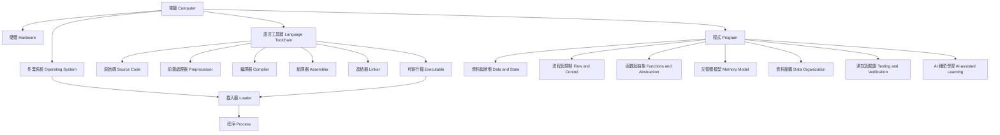
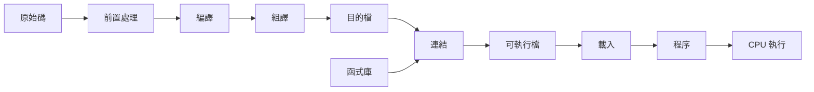
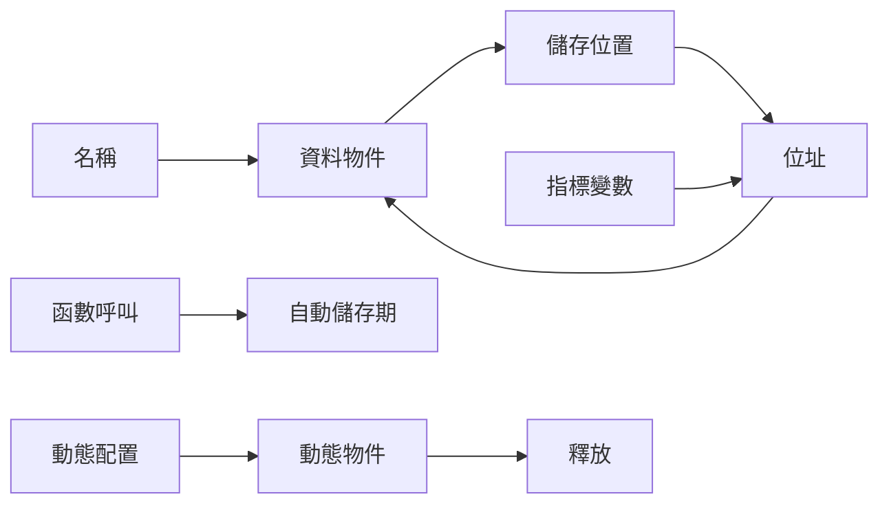
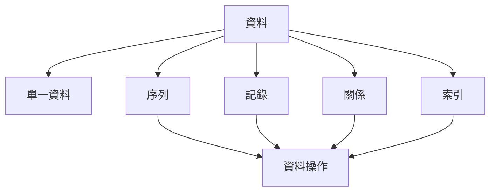

# 程式設計領域模型

版本：0.1.0  
狀態：架構草案  
對應英文版本：[Programming Domain Model](03-programming-domain-model.en.md)

## 文件目的

本文件描述「程式設計這個領域有哪些核心概念，以及這些概念在世界中如何互相連結」。

它不是課程順序、先備知識圖或能力評量文件，而是課程設計的共同語意基礎。後續知識依賴圖、能力地圖、範圍邊界、教材與評量都必須使用本文件的概念與關係。

## 憲法遵循

- 中文版與英文版使用相同概念、識別碼與關係。
- 能以圖形清楚表示的概念關係必須視覺化。
- 圖形與文字互補，不把領域模型誤當成授課順序。
- AI 被描述為學習與驗證活動中的協作者，不是學生思考的替代者。

## 領域模型與知識圖的邊界

| 文件 | 回答的問題 |
|---|---|
| 領域模型 | 這個世界有哪些概念？概念之間是什麼關係？ |
| 知識依賴圖 | 要理解某概念，通常需要先理解哪些概念？ |
| 能力地圖 | 學生必須能做到什麼？ |

領域模型中的連線表示「存在關係、組成關係、作用關係或資料流關係」，不表示唯一學習順序。

## 第一層領域

## 核心實體與關係

### DM-E：轉換與執行領域

| ID | 概念 | 領域關係 |
|---|---|---|
| DM-E01 | 原始碼 | 由人類撰寫，交由工具鏈處理。 |
| DM-E02 | 前置處理器 | 處理引入、巨集與條件內容。 |
| DM-E03 | 編譯器 | 將高階語言轉為較低階表示。 |
| DM-E04 | 組譯器 | 將組合語言轉為目的碼。 |
| DM-E05 | 連結器 | 組合目的檔與函式庫。 |
| DM-E06 | 可執行檔 | 工具鏈產出的可載入程式映像。 |
| DM-E07 | 載入器 | 由作業系統將程式映射為程序。 |
| DM-E08 | 程序 | 執行中的程式及其資源與狀態。 |
| DM-E09 | CPU | 依機器指令改變程序狀態。 |

### DM-D：資料與狀態領域

| ID | 概念 | 領域關係 |
|---|---|---|
| DM-D01 | 值 | 程式處理的資訊內容。 |
| DM-D02 | 型別 | 約束值的表示、範圍與操作。 |
| DM-D03 | 變數 | 以名稱指涉可改變的狀態。 |
| DM-D04 | 常數 | 表示在指定語意範圍內不應改變的值。 |
| DM-D05 | 運算子 | 對值或狀態執行操作。 |
| DM-D06 | 運算式 | 由值、名稱與運算子構成並可求值。 |
| DM-D07 | 指定 | 將結果寫入儲存位置。 |
| DM-D08 | 輸入與輸出 | 程式與外部環境交換資料。 |
| DM-D09 | 範圍 | 名稱可被使用的程式區域。 |
| DM-D10 | 生命週期 | 資料實體存在的時間範圍。 |

### DM-C：流程與控制領域

| ID | 概念 | 領域關係 |
|---|---|---|
| DM-C01 | 敘述 | 程式可執行的基本動作。 |
| DM-C02 | 順序 | 敘述預設依時間順序執行。 |
| DM-C03 | 條件 | 依目前狀態產生真假判定。 |
| DM-C04 | 選擇 | 根據條件決定執行路徑。 |
| DM-C05 | 重複 | 在條件與狀態更新下重複執行。 |
| DM-C06 | 終止 | 定義重複或程序何時結束。 |

### DM-F：函數與抽象領域

| ID | 概念 | 領域關係 |
|---|---|---|
| DM-F01 | 問題 | 需要被程式化處理的目標。 |
| DM-F02 | 分解 | 將較大責任拆成較小責任。 |
| DM-F03 | 函數 | 封裝一項責任的具名單位。 |
| DM-F04 | 介面 | 描述函數如何被使用。 |
| DM-F05 | 參數 | 呼叫者傳入函數的資料。 |
| DM-F06 | 回傳值 | 函數透過介面提供的結果。 |
| DM-F07 | 呼叫 | 控制權由呼叫者移交給函數。 |
| DM-F08 | 模組 | 組織相關介面與實作。 |

### DM-M：記憶體領域

| ID | 概念 | 領域關係 |
|---|---|---|
| DM-M01 | 儲存位置 | 資料實體所在的記憶體區域。 |
| DM-M02 | 位址 | 識別儲存位置的值。 |
| DM-M03 | 指標 | 保存位址的具型別變數。 |
| DM-M04 | 取址 | 從物件取得其位址。 |
| DM-M05 | 解參考 | 透過位址存取目標物件。 |
| DM-M06 | 自動儲存期 | 常與函數呼叫及 Stack 配合。 |
| DM-M07 | 動態儲存期 | 於執行期依需求取得與釋放。 |
| DM-M08 | 所有權與生命週期責任 | 決定資源何時有效及由誰釋放。 |

### DM-O：資料組織領域

本領域只描述程式如何組織資料，不預先決定進階資料結構的授課範圍。

| ID | 概念 | 領域關係 |
|---|---|---|
| DM-O01 | 單一資料 | 一個值或一個資料物件。 |
| DM-O02 | 序列 | 依位置或順序組織多個元素。 |
| DM-O03 | 記錄 | 將描述同一實體的多個欄位組合。 |
| DM-O04 | 關係 | 描述資料實體之間的連結。 |
| DM-O05 | 索引 | 透過位置或鍵找到資料。 |
| DM-O06 | 操作 | 包含建立、讀取、更新、刪除、搜尋與重新排列。 |

### DM-V：測試、除錯與驗證領域

| ID | 概念 | 領域關係 |
|---|---|---|
| DM-V01 | 需求 | 定義程式應呈現的行為。 |
| DM-V02 | 預期結果 | 執行前根據需求推導的結果。 |
| DM-V03 | 測試案例 | 將輸入、條件與預期結果具體化。 |
| DM-V04 | 實際結果 | 程式執行後觀察到的結果。 |
| DM-V05 | 比較 | 判定預期與實際是否一致。 |
| DM-V06 | 錯誤 | 不符合語法、執行條件或需求的狀態。 |
| DM-V07 | 除錯 | 蒐集證據、形成假設並驗證原因。 |
| DM-V08 | 信心 | 由多項證據支持，而非由單次成功產生。 |

### DM-A：AI 輔助學習領域

| ID | 概念 | 領域關係 |
|---|---|---|
| DM-A01 | 學習者理解 | 使用 AI 前對問題與現況的初步判斷。 |
| DM-A02 | 提問 | 將目標、證據與卡點表達給 AI。 |
| DM-A03 | AI 建議 | AI 產生的解釋、提示、程式或測試觀點。 |
| DM-A04 | 人工審查 | 由學習者檢查建議的適切性。 |
| DM-A05 | 技術驗證 | 透過文件、編譯、執行與測試驗證。 |
| DM-A06 | 決策 | 採用、修改或拒絕建議。 |
| DM-A07 | 透明紀錄 | 說明 AI 使用方式與決策理由。 |

## 領域模型的使用原則

1. 本文件維持穩定概念與語意，不直接記錄週次。
2. 新增具體語法、工具或資料結構前，先確認它對應哪個領域概念。
3. 知識依賴圖可引用本文件概念，但不得把領域關係直接當成唯一先備順序。
4. 能力地圖必須將概念轉換成可觀察行為。
5. 範圍邊界決定概念在哪個階段教到何種成熟度，而不是刪除領域中客觀存在的概念。

## 導覽

- [返回教學內容設計區](README.zh-TW.md)
- [English version](03-programming-domain-model.en.md)
- [下一階段：程式語言知識依賴圖](04-programming-language-knowledge-graph.zh-TW.md)
