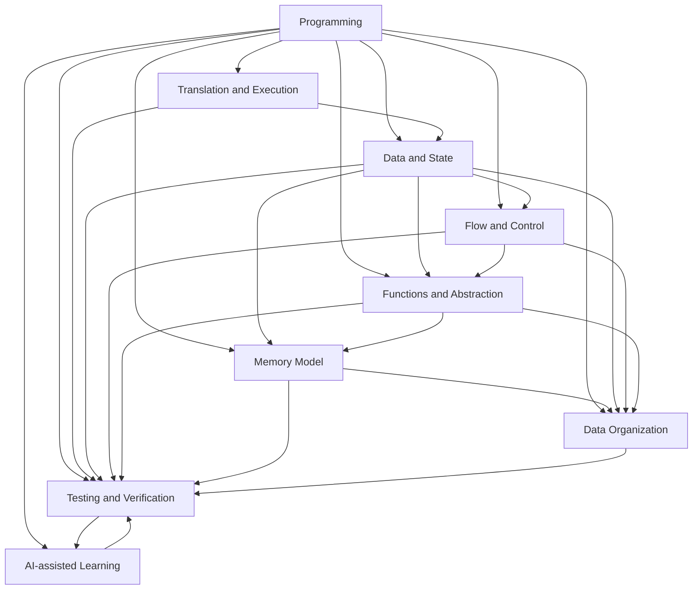
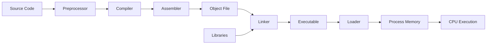
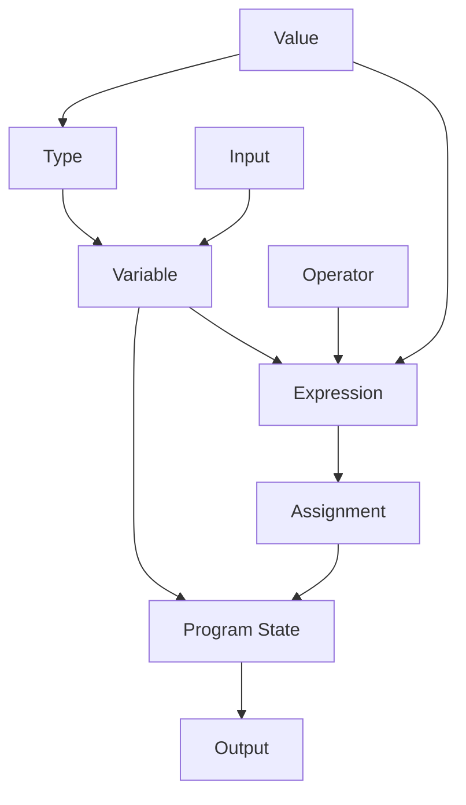
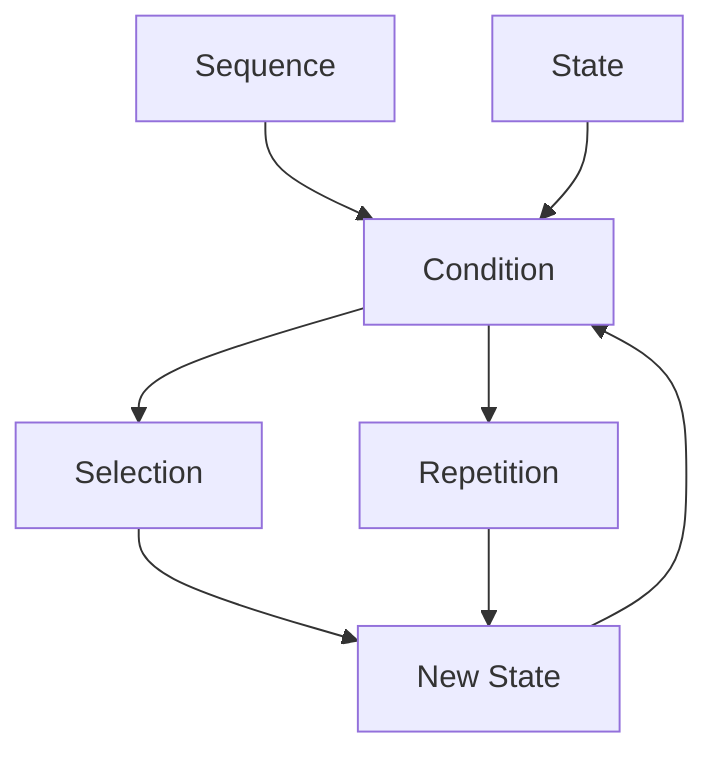
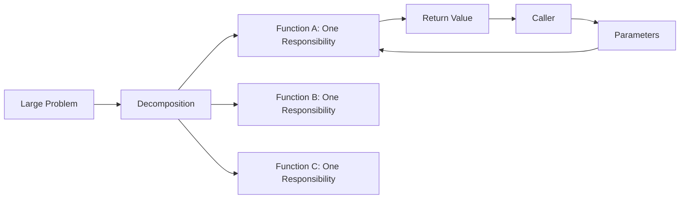
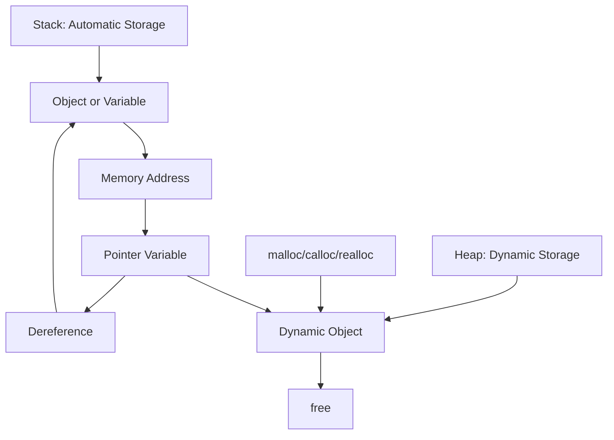
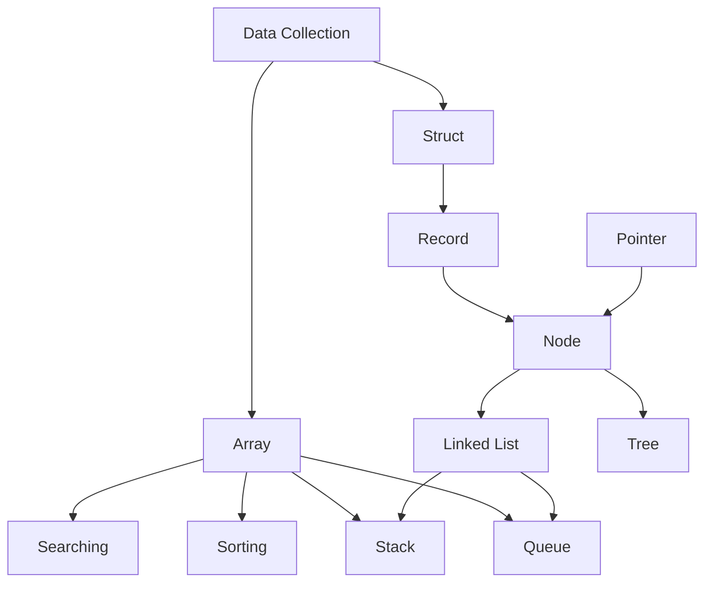
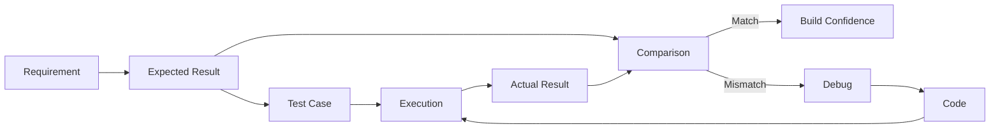
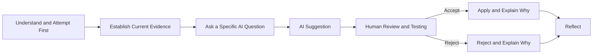
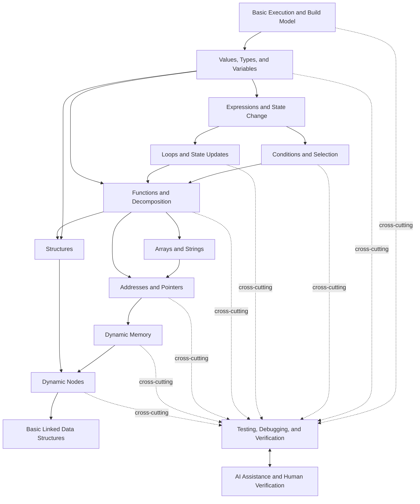

# Programming Language Knowledge Graph

Version: 0.1.0  
Status: Architecture draft  
Corresponding Chinese version: [程式語言知識圖](03-programming-language-knowledge-graph.zh-TW.md)

## Document Purpose

This document defines the shared knowledge space, concept relationships, and major dependencies for the C preparatory course and the subsequent 16-week formal course.

It is not a weekly schedule and not a textbook table of contents. It answers:

1. What basic problems must a programming language solve?
2. What logic does C use to solve those problems?
3. Why does each concept exist?
4. Which concepts are prerequisites for others?
5. Which mental models should students build that can transfer to other languages?

The later competency map, scope boundary, delivery plan, teaching materials, and assessments must all remain traceable to this knowledge graph.

## Constitutional Compliance

This document follows these principles:

- Explain the need, design purpose, and language logic before presenting syntax.
- Treat understanding, explanation, modification, testing, debugging, and verification as evidence of completion.
- Show visual relationships whenever they materially improve understanding, together with necessary prose.
- Treat AI as a cross-cutting learning tool, not a replacement for core thinking.
- Use the same nodes, relationships, identifiers, and structure in both language versions.

## Core View

Programming is not a collection of syntax. It is the use of a programming language to construct an executable solution to a problem.

The knowledge of a programming language can be organized around these questions:

- How does a program become executable behavior from written text?
- How does a program represent and preserve data?
- How does a program decide what happens next?
- How does a program decompose a large problem into smaller ones?
- How does a program correspond to memory and data locations?
- How does a program organize large or complex data?
- How does a program establish that its results are trustworthy?
- How can learners use AI for support while retaining responsibility for judgment?

## First-Level Knowledge Architecture

The arrows indicate major conceptual or prerequisite relationships, not one mandatory teaching order.

---

# KG-E: Program Translation and Execution

## Core Question

> How does human-readable C source code become a program the computer can execute?

## Language Logic

C source code is not directly executable by the CPU. It passes through several translation stages and is then loaded into memory and executed with operating-system support.

## Major Nodes

| ID | Concept | Reason for Existence and Core Logic |
|---|---|---|
| KG-E01 | Source code | Allows humans to describe a program in readable form. |
| KG-E02 | Preprocessing | Handles `#include`, macros, and conditional compilation before compilation. |
| KG-E03 | Compiler | Analyzes high-level syntax and semantics and translates them into a lower-level representation. |
| KG-E04 | Assembler | Converts assembly language into machine-code form in an object file. |
| KG-E05 | Linker | Combines object files and library symbols into an executable. |
| KG-E06 | Loader | Maps an executable into process memory through the operating system. |
| KG-E07 | Execution flow | The CPU changes program state according to instructions and control flow. |
| KG-E08 | Standard library | Provides preimplemented general functions such as I/O and memory management. |
| KG-E09 | Build-stage error classification | Distinguishes preprocessing, compilation, assembly, linking, and runtime failures. |

## What Must Not Be Rote Memorization

Students should not merely remember to press a Run button. They should be able to identify the stage in which an error occurs and explain why the compiler, assembler, and linker are different tools.

---

# KG-D: Data and State

## Core Question

> How does a program represent, preserve, read, and change information?

## Language Logic

Program execution can be understood as continuing changes in state. A variable is a named data entity with a type, value, lifetime, scope, and memory location.

## Major Nodes

| ID | Concept | Reason for Existence and Core Logic |
|---|---|---|
| KG-D01 | Value | The actual information processed by a program. |
| KG-D02 | Type | Defines representation, valid values, and permitted operations. |
| KG-D03 | Variable | Gives a name to mutable program state. |
| KG-D04 | Constant | Expresses a value that should not change within a given semantic context. |
| KG-D05 | Operator | Defines basic operations among values. |
| KG-D06 | Expression | Combines values, variables, and operators into something that can be evaluated. |
| KG-D07 | Assignment | Writes a result to a data location and changes program state. |
| KG-D08 | Input and output | Exchanges data with users, files, or the external environment. |
| KG-D09 | Casting and conversion | Handles changes between different data representations. |
| KG-D10 | Scope and lifetime | Determines where a name is visible and how long its data exists. |

---

# KG-C: Flow and Control

## Core Question

> How does a program decide which action executes next?

## Language Logic

Programs execute sequentially by default. Selection changes the execution path, and loops repeat while a condition holds. All control flow depends on evaluable conditions and state that can change.

## Major Nodes

| ID | Concept | Reason for Existence and Core Logic |
|---|---|---|
| KG-C01 | Sequential execution | Establishes the most basic order of time and causality. |
| KG-C02 | Boolean condition | Evaluates the current state as true or false. |
| KG-C03 | Conditional selection | Chooses an execution path based on a condition. |
| KG-C04 | Multiway selection | Chooses among several mutually exclusive or prioritized paths. |
| KG-C05 | Loop state | Describes the data that changes during repetition. |
| KG-C06 | Termination condition | Defines when repetition stops and prevents infinite loops. |
| KG-C07 | Counting and accumulation | Uses repetition to process counts, totals, and state updates. |
| KG-C08 | Nested control | Combines multiple levels of selection and repetition. |
| KG-C09 | Early exit | Changes the expected control path under a specific condition. |

---

# KG-F: Functions and Abstraction

## Core Question

> When a problem becomes large, how can a program be divided into understandable, testable, and reusable units?

## Language Logic

A function gives a name to one responsibility, receives data through parameters, and provides results through a return value or another explicit interface. A function is not merely a way to shorten code; it creates an abstraction boundary.

## Major Nodes

| ID | Concept | Reason for Existence and Core Logic |
|---|---|---|
| KG-F01 | Function responsibility | Encapsulates one explainable task under a clear name. |
| KG-F02 | Declaration and definition | Separates an interface description from implementation. |
| KG-F03 | Call | Transfers control and input data to another functional unit. |
| KG-F04 | Parameters | Define what input a function requires. |
| KG-F05 | Return value | Returns a result through an explicit interface. |
| KG-F06 | Local variables and scope | Isolate internal state and reduce unintended interaction. |
| KG-F07 | Call stack | Preserves return locations and local state across nested calls. |
| KG-F08 | Modularization | Organizes related functions and data into maintainable units. |
| KG-F09 | Recursion | Represents a problem that can be decomposed into similar subproblems through self-calls. |

---

# KG-M: Memory Model

## Core Question

> Where does program data actually exist, and how are names, values, and addresses related?

## Language Logic

C treats memory addresses as manipulable data. A pointer is a typed variable that stores an address; address-of and dereference operations connect names, locations, and target objects.

## Major Nodes

| ID | Concept | Reason for Existence and Core Logic |
|---|---|---|
| KG-M01 | Address | Uniquely identifies a data location in memory. |
| KG-M02 | Pointer | Allows addresses to be stored, passed, and manipulated. |
| KG-M03 | Address-of | Obtains the memory location of an existing object. |
| KG-M04 | Dereference | Accesses an object through its address. |
| KG-M05 | Arrays and contiguous memory | Represents same-type sequences through contiguous allocation. |
| KG-M06 | Pointer arithmetic | Moves among contiguous objects according to the pointed-to type size. |
| KG-M07 | Call stack | Manages function calls and automatic-storage data. |
| KG-M08 | Dynamic memory | Obtains storage during execution according to actual need. |
| KG-M09 | Allocation and release | Establishes ownership and lifetime responsibilities for dynamic resources. |
| KG-M10 | Memory errors | Includes leaks, dangling pointers, double frees, and out-of-bounds access. |

---

# KG-O: Data Organization

## Core Question

> When data grows in volume, contains several fields, or has relationships, how should it be represented and manipulated?

## Language Logic

Different problems require different organizations. Arrays emphasize contiguity and indexing; structures combine heterogeneous fields into one entity; dynamic nodes and pointers represent relationships that can change during execution.

## Major Nodes

| ID | Concept | Reason for Existence and Core Logic |
|---|---|---|
| KG-O01 | Array | Uses indexes to manage a fixed or prebounded collection of same-type data. |
| KG-O02 | Character arrays and strings | Represents text as a character sequence with a terminator. |
| KG-O03 | Structure | Combines fields of different types that describe one entity. |
| KG-O04 | Array of structures | Manages many records that share the same field layout. |
| KG-O05 | Searching | Locates an element that satisfies a condition. |
| KG-O06 | Sorting | Rearranges data according to a rule for interpretation or later processing. |
| KG-O07 | Node | Combines data and relationship information in a dynamic unit. |
| KG-O08 | Linked list | Connects dynamically changing nodes through pointer relationships. |
| KG-O09 | Stack data structure | Manages pending items using last-in, first-out behavior. |
| KG-O10 | Queue data structure | Manages pending items using first-in, first-out behavior. |
| KG-O11 | Basic tree concept | Represents branching relationships through parent-child hierarchy. |

## Scope Note

Basic data structures are included mainly to integrate variables, control flow, functions, pointers, dynamic memory, and structures. Algorithm analysis and advanced operations may be deepened in a later data structures course.

---

# KG-V: Testing, Debugging, and Verification

## Core Question

> How can we know that a program satisfies its requirements rather than merely producing one correct-looking result?

## Language Logic

Program correctness must be supported by requirements, expected results, tests, and execution evidence. Error messages and unexpected output are evidence for diagnosis, not merely failure.

## Major Nodes

| ID | Concept | Reason for Existence and Core Logic |
|---|---|---|
| KG-V01 | Requirements and acceptance criteria | Define observable behavior for a correct program. |
| KG-V02 | Manual derivation | Establishes expected results before execution. |
| KG-V03 | Normal case | Verifies ordinary use. |
| KG-V04 | Boundary case | Verifies threshold values and data ranges. |
| KG-V05 | Exceptional case | Verifies behavior under invalid or unexpected input. |
| KG-V06 | Execution tracing | Observes variables, conditions, calls, and memory state step by step. |
| KG-V07 | Error classification | Distinguishes build, runtime, and logic failures. |
| KG-V08 | Debugging hypothesis | Proposes a cause based on evidence and eliminates alternatives through tests. |
| KG-V09 | Regression testing | Confirms that a fix does not break previously correct behavior. |
| KG-V10 | Explanation and justification | Explains why the current result should be trusted. |

---

# KG-A: AI-assisted Learning

## Core Question

> How can AI improve understanding, testing, and reflection without replacing students’ core thinking?

## Language Logic

AI is a cross-cutting support system rather than an independent syntax topic. It can offer explanations, hints, testing perspectives, and debugging hypotheses, but all suggestions must be understood and verified by the learner.

## Major Nodes

| ID | Concept | Reason for Existence and Core Logic |
|---|---|---|
| KG-A01 | Problem formulation | Clearly states the goal, current program state, and attempted methods. |
| KG-A02 | Staged hints | Requests the next useful clue instead of a complete answer. |
| KG-A03 | Explanation comparison | Requests alternate models, examples, or visuals for one concept. |
| KG-A04 | Testing collaboration | Asks AI to suggest overlooked normal and boundary cases. |
| KG-A05 | Debugging collaboration | Uses error messages, a minimal reproduction, and hypotheses in discussion. |
| KG-A06 | Answer verification | Checks AI suggestions through documentation, compilation, execution, and tests. |
| KG-A07 | Adoption decision | Explains why a suggestion was accepted, modified, or rejected. |
| KG-A08 | Transparency of use | Preserves prompts, outputs, and personal judgment where required. |
| KG-A09 | Dependency risk | Detects AI output that cannot be explained, modified, or verified. |

---

# Main Concept Dependency Spine

The following shows the current major knowledge dependencies, not a fixed delivery schedule:

## Dependencies Are Not Absolutely Linear

Some concepts should be revisited spirally:

- Introduce a simplified memory model with variables, then deepen it with pointers and dynamic allocation.
- Functions may first appear as provided tools, then later be studied through interfaces, scope, and the call stack.
- Testing, debugging, and AI verification begin with the first program and grow in sophistication.
- Establish the whole build pipeline early, then revisit preprocessing, multiple files, and linker errors later.

---

# Future Specification for Each Knowledge Node

When the competency map is created, each knowledge node must include at least:

| Field | Description |
|---|---|
| ID | Stable identifier such as `KG-M02`. |
| Need | Why the concept is needed. |
| Language Logic | How C understands or solves the problem. |
| Syntax | Concrete C syntax and constraints. |
| Prerequisites | Required prior knowledge and abilities. |
| Visual Model | Required diagram or dynamic representation. |
| Misconceptions | Common incorrect mental models. |
| Evidence | How students can demonstrate understanding. |
| AI Role | What AI may and may not do. |
| Course Scope | Required maturity in the preparatory, formal, or later course. |

## Suggested Types of Learning Evidence

Each major node should use several of the following instead of checking only syntax output:

- Explain the reason for the concept in the student’s own words.
- Represent program, data, or memory state visually.
- Predict execution results.
- Trace state changes step by step.
- Build a minimal implementation.
- Modify an existing program for a changed requirement.
- Locate and correct an error.
- Design test cases.
- Compare trade-offs between two approaches.
- Verify and critique an AI suggestion.

---

# Decisions Still Open

This version defines the full knowledge space but does not yet decide:

1. The maturity level required for each node in the 16-week formal course.
2. Which nodes belong in the preparatory course and whether they require awareness or implementation.
3. The depth and number of basic data structures in the formal course.
4. The formal-course positions of recursion, file handling, and multi-file compilation.
5. The standard visual model and visual-library rules for each node.
6. The actual delivery split for the Chinese-taught and English-taught classes.

Those decisions will be made in the competency map, scope boundary, and delivery map.

## Navigation

- [Back to the Instructional Design Workspace](README.en.md)
- [繁體中文版](03-programming-language-knowledge-graph.zh-TW.md)
- [Course Product Vision](01-product-vision.en.md)
- [Instructional Requirements Map](02-requirements-map.en.md)
- [Course Constitution](../CONSTITUTION.en.md)
