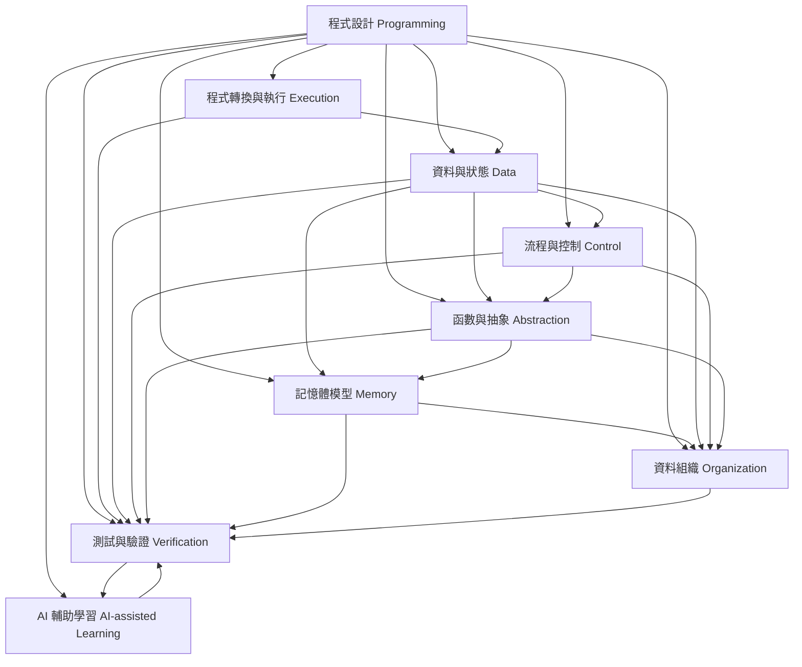
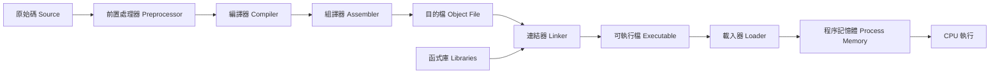
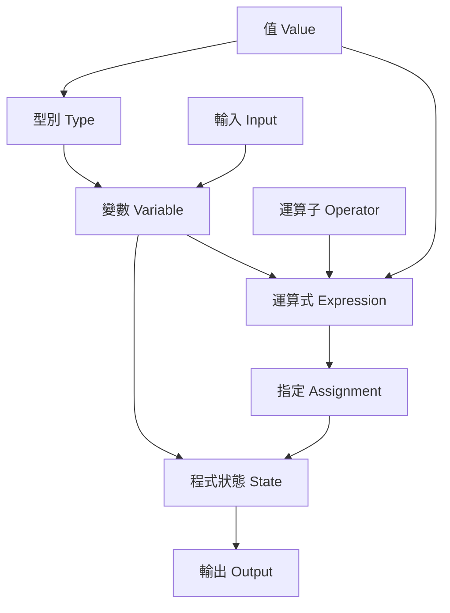
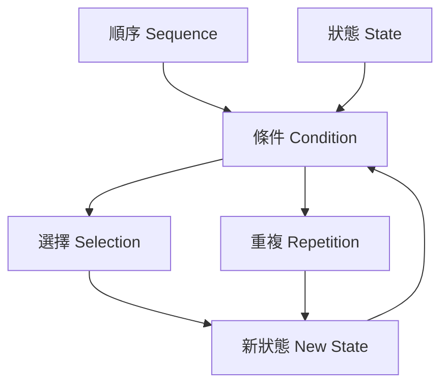
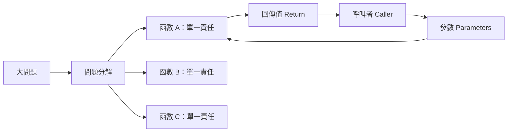
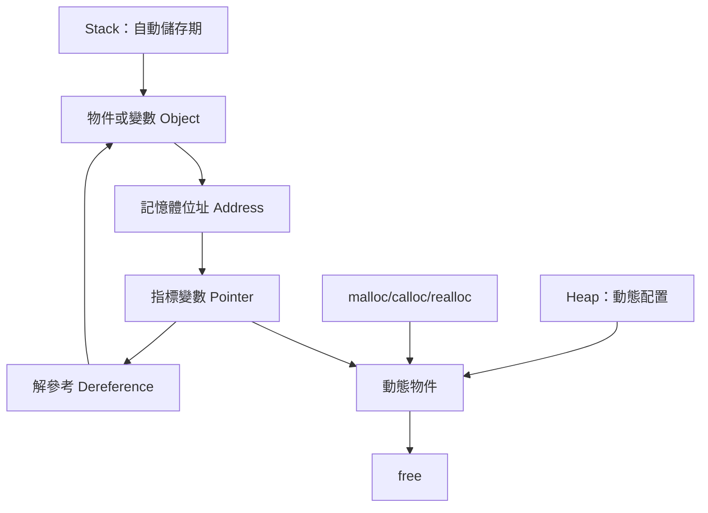
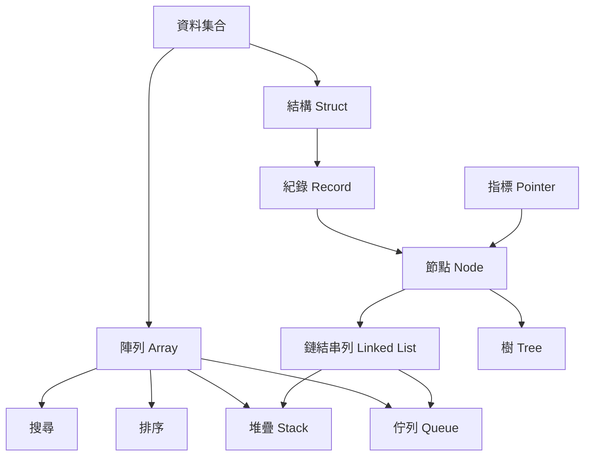
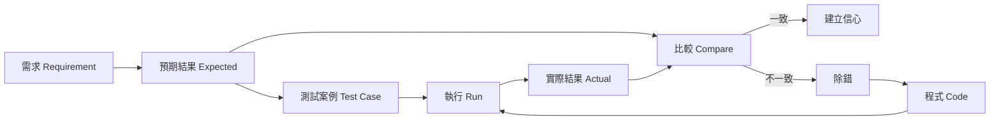
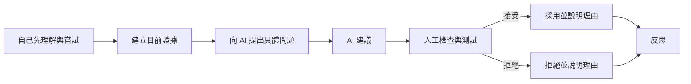
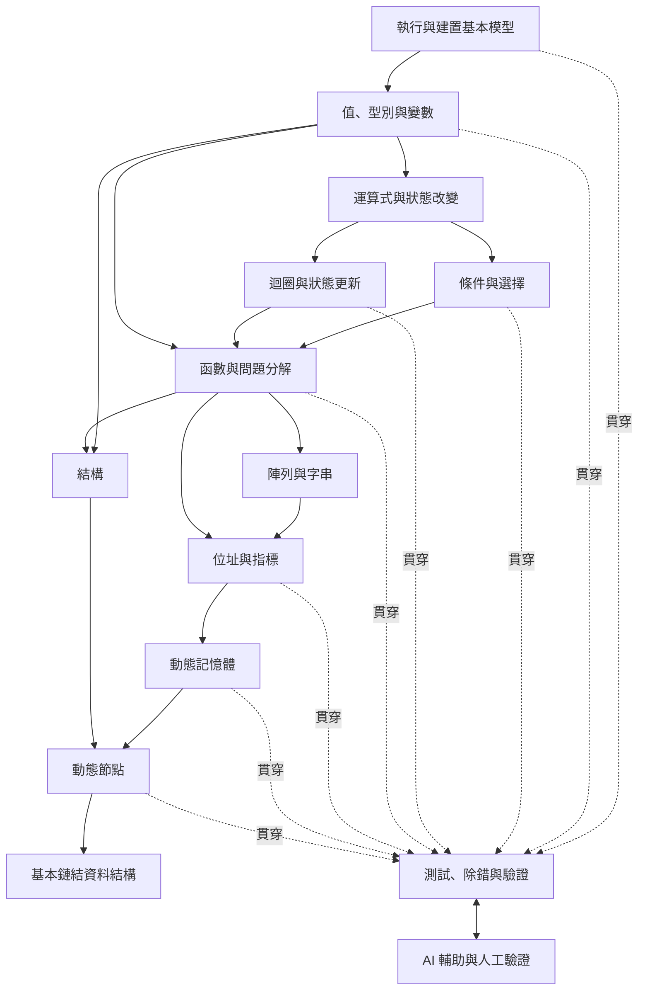

# 程式語言知識圖

版本：0.1.0  
狀態：架構草案  
對應英文版本：[Programming Language Knowledge Graph](03-programming-language-knowledge-graph.en.md)

## 文件目的

本文件定義 C 語言前導課程與 16 週正式課程共同使用的知識空間、概念關係與主要依賴。

這不是週次表，也不是教科書章節目錄。它回答的是：

1. 一套程式語言要解決哪些基本問題？
2. C 語言以什麼邏輯解決這些問題？
3. 每個概念為什麼存在？
4. 哪些概念是其他概念的先備條件？
5. 學生最終應建立哪些可以遷移到其他程式語言的心智模型？

後續的能力地圖、範圍邊界、課程節奏、教材與評量，都必須能追溯到本知識圖。

## 憲法遵循

本文件依據下列原則建立：

- 先說明需求、設計目的與語言邏輯，再介紹語法。
- 以理解、解釋、修改、測試、除錯與驗證作為學習完成證據。
- 可視覺化的關係應以圖形呈現，並搭配必要文字。
- AI 是橫向學習工具，不是核心思考的替代品。
- 中文版與英文版使用相同的節點、關係、識別碼與結構。

## 核心觀點

程式設計不是語法集合，而是使用程式語言建立一個可執行的問題解法。

一套程式語言的知識可由下列問題組織：

- 程式如何從文字變成可執行行為？
- 程式如何表示與保存資料？
- 程式如何決定下一步？
- 程式如何把大問題分解成小問題？
- 程式如何對應記憶體與資料位置？
- 程式如何組織大量或複雜資料？
- 程式如何確認結果可信？
- 學習者如何利用 AI 協助理解但仍保有判斷責任？

## 第一層知識架構

圖中的箭頭不代表唯一授課順序，而表示主要理解或依賴關係。

---

# KG-E：程式轉換與執行

## 核心問題

> 人類撰寫的 C 原始碼，如何成為電腦可以執行的程式？

## 語言邏輯

C 原始碼不是 CPU 可以直接執行的形式。它必須經過多個轉換階段，並在作業系統協助下被載入記憶體與執行。

## 主要節點

| ID | 概念 | 存在原因與核心邏輯 |
|---|---|---|
| KG-E01 | 原始碼 | 讓人類以可閱讀形式描述程式。 |
| KG-E02 | 前置處理 | 在正式編譯前處理 `#include`、巨集與條件編譯。 |
| KG-E03 | 編譯器 | 分析高階語言的語法與語意，轉換為較低階表示。 |
| KG-E04 | 組譯器 | 將組合語言轉成機器碼形式的目的檔。 |
| KG-E05 | 連結器 | 把多個目的檔與函式庫中的符號組合成可執行檔。 |
| KG-E06 | 載入器 | 由作業系統將可執行程式映射至程序記憶體。 |
| KG-E07 | 執行流程 | CPU 依指令與控制流程改變程序狀態。 |
| KG-E08 | 標準函式庫 | 提供已實作的通用功能，例如輸入輸出與記憶體管理。 |
| KG-E09 | 建置錯誤分類 | 區分前置處理、編譯、組譯、連結與執行階段錯誤。 |

## 需要避免的死背

學生不應只記住「按下執行按鈕」，而應能說明目前錯誤發生於哪個階段，以及為何編譯器、組譯器與連結器不是同一個工具。

---

# KG-D：資料與狀態

## 核心問題

> 程式如何表示、保存、讀取與改變資訊？

## 語言邏輯

程式執行可以視為狀態持續改變。變數是具有型別、值、生命週期、範圍與記憶體位置的具名資料實體。

## 主要節點

| ID | 概念 | 存在原因與核心邏輯 |
|---|---|---|
| KG-D01 | 值 | 程式實際處理的資訊內容。 |
| KG-D02 | 型別 | 定義資料的表示方式、可接受值及可執行操作。 |
| KG-D03 | 變數 | 讓程式以名稱指涉可改變的資料狀態。 |
| KG-D04 | 常數 | 表達不應在該語意範圍內改變的值。 |
| KG-D05 | 運算子 | 定義值之間可以進行的基本操作。 |
| KG-D06 | 運算式 | 將值、變數與運算子組合成可求值的表示。 |
| KG-D07 | 指定 | 將運算結果寫入資料位置並改變程式狀態。 |
| KG-D08 | 輸入輸出 | 讓程式與使用者、檔案或外部環境交換資料。 |
| KG-D09 | 轉型與轉換 | 處理不同資料表示方式之間的轉換。 |
| KG-D10 | 範圍與生命週期 | 決定名稱可見位置與資料存在時間。 |

---

# KG-C：流程與控制

## 核心問題

> 程式如何決定下一個要執行的動作？

## 語言邏輯

程式預設依序執行；條件選擇改變路徑；迴圈在條件成立期間重複執行。所有流程控制都建立在可求值的條件與會改變的狀態上。

## 主要節點

| ID | 概念 | 存在原因與核心邏輯 |
|---|---|---|
| KG-C01 | 順序執行 | 建立最基本的時間與因果順序。 |
| KG-C02 | 布林條件 | 將目前狀態判定為成立或不成立。 |
| KG-C03 | 條件選擇 | 根據條件選擇不同執行路徑。 |
| KG-C04 | 多路選擇 | 以多個互斥或有優先序的條件選擇路徑。 |
| KG-C05 | 迴圈狀態 | 描述重複過程中會改變的資料。 |
| KG-C06 | 終止條件 | 定義重複何時停止，避免無窮迴圈。 |
| KG-C07 | 計數與累積 | 以重複結構處理數量、總和與狀態更新。 |
| KG-C08 | 巢狀流程 | 組合多層判斷與重複以處理較複雜問題。 |
| KG-C09 | 提早離開 | 在特定條件下改變既定控制流程。 |

---

# KG-F：函數與抽象

## 核心問題

> 當問題變大時，如何把程式分解成可理解、可測試與可重用的單位？

## 語言邏輯

函數以名稱封裝一項責任，透過參數接收資料，透過回傳值或其他明確介面提供結果。函數不是單純縮短程式碼，而是建立抽象邊界。

## 主要節點

| ID | 概念 | 存在原因與核心邏輯 |
|---|---|---|
| KG-F01 | 函數責任 | 以明確名稱封裝一項可說明的工作。 |
| KG-F02 | 函數宣告與定義 | 分別描述介面與具體實作。 |
| KG-F03 | 呼叫 | 將控制權與輸入資料交給另一個功能單位。 |
| KG-F04 | 參數 | 定義函數需要哪些輸入。 |
| KG-F05 | 回傳值 | 以明確介面把計算結果交還呼叫者。 |
| KG-F06 | 區域變數與範圍 | 隔離函數內部狀態，降低非預期互相影響。 |
| KG-F07 | 呼叫堆疊 | 保存巢狀函數呼叫的返回位置與區域狀態。 |
| KG-F08 | 模組化 | 將多個相關函數與資料組織成可維護單位。 |
| KG-F09 | 遞迴 | 以函數呼叫自身表示可分解為相似子問題的結構。 |

---

# KG-M：記憶體模型

## 核心問題

> 程式中的資料實際存在何處，名稱、值與位址之間有什麼關係？

## 語言邏輯

C 將記憶體位址視為可操作的資料。指標是保存位址的有型別變數；取址與解參考建立名稱、位址與目標物件之間的關係。

## 主要節點

| ID | 概念 | 存在原因與核心邏輯 |
|---|---|---|
| KG-M01 | 位址 | 唯一描述記憶體中資料位置。 |
| KG-M02 | 指標 | 讓位址可被保存、傳遞與運算。 |
| KG-M03 | 取址 | 取得既有物件的記憶體位置。 |
| KG-M04 | 解參考 | 透過位址存取其指向的物件。 |
| KG-M05 | 陣列與連續記憶體 | 以連續配置表示同型別資料序列。 |
| KG-M06 | 指標運算 | 依指向型別的大小在連續物件間移動。 |
| KG-M07 | 呼叫堆疊 | 管理函數呼叫與自動儲存期資料。 |
| KG-M08 | 動態記憶體 | 在執行期間依實際需求取得空間。 |
| KG-M09 | 配置與釋放 | 建立動態資源所有權與生命週期責任。 |
| KG-M10 | 記憶體錯誤 | 包括洩漏、懸空指標、重複釋放與越界存取。 |

---

# KG-O：資料組織

## 核心問題

> 當資料數量增加、具有多個欄位或關係時，如何有效表示與操作？

## 語言邏輯

不同問題需要不同的資料組織方式。陣列強調連續與索引；結構強調將不同欄位組成一個實體；動態節點與指標則可表示執行期間改變的關係。

## 主要節點

| ID | 概念 | 存在原因與核心邏輯 |
|---|---|---|
| KG-O01 | 陣列 | 以索引管理固定數量或可預先界定的同型別資料。 |
| KG-O02 | 字元陣列與字串 | 以字元序列及終止字元表示文字。 |
| KG-O03 | 結構 | 將描述同一實體的不同型別欄位組成一個單位。 |
| KG-O04 | 結構陣列 | 管理多筆具有相同欄位結構的紀錄。 |
| KG-O05 | 搜尋 | 從資料集合定位符合條件的元素。 |
| KG-O06 | 排序 | 依規則重新排列資料以利理解或後續處理。 |
| KG-O07 | 節點 | 結合資料與關係資訊的動態資料單位。 |
| KG-O08 | 鏈結串列 | 以指標關係連結可動態增減的節點。 |
| KG-O09 | 堆疊資料結構 | 以後進先出管理待處理項目。 |
| KG-O10 | 佇列資料結構 | 以先進先出管理待處理項目。 |
| KG-O11 | 樹的基本概念 | 以父子階層表示分支關係。 |

## 範圍提醒

基本資料結構在本 C 語言課程中主要用來整合變數、控制、函數、指標、動態記憶體與結構。其演算法分析與進階操作可留待後續資料結構課程深化。

---

# KG-V：測試、除錯與驗證

## 核心問題

> 如何知道程式真的符合需求，而不只是剛好產生一次正確輸出？

## 語言邏輯

程式正確性必須由需求、預期結果、測試與執行證據支持。錯誤訊息與異常輸出是定位問題的線索，不是單純失敗。

## 主要節點

| ID | 概念 | 存在原因與核心邏輯 |
|---|---|---|
| KG-V01 | 需求與驗收條件 | 定義正確程式應達成的可觀察行為。 |
| KG-V02 | 手動推導 | 在執行前建立可比較的預期結果。 |
| KG-V03 | 正常案例 | 驗證一般使用情況。 |
| KG-V04 | 邊界案例 | 驗證條件臨界值與資料範圍。 |
| KG-V05 | 異常案例 | 驗證無效或非預期輸入下的行為。 |
| KG-V06 | 執行追蹤 | 逐步觀察變數、條件、呼叫與記憶體狀態。 |
| KG-V07 | 錯誤分類 | 區分建置錯誤、執行期錯誤與邏輯錯誤。 |
| KG-V08 | 除錯假設 | 根據證據提出原因並用測試排除。 |
| KG-V09 | 修改後回歸測試 | 確認修正未破壞原本正確功能。 |
| KG-V10 | 解釋與證成 | 說明為何相信目前結果。 |

---

# KG-A：AI 輔助學習

## 核心問題

> 如何利用 AI 提升理解、測試與反思，同時不讓 AI 取代學生的核心思考？

## 語言邏輯

AI 是橫向輔助系統，不是獨立語法主題。它可以幫助學生取得解釋、提示、測試觀點與錯誤假設，但所有建議都必須經過學生的理解與驗證。

## 主要節點

| ID | 概念 | 存在原因與核心邏輯 |
|---|---|---|
| KG-A01 | 問題表述 | 清楚描述目前目標、程式狀態與已嘗試方法。 |
| KG-A02 | 分階段提示 | 要求下一步線索，而非直接索取完整答案。 |
| KG-A03 | 解釋比較 | 要求以不同模型、例子或圖形解釋同一概念。 |
| KG-A04 | 測試協作 | 請 AI 提出可能遺漏的正常與邊界案例。 |
| KG-A05 | 除錯協作 | 以錯誤訊息、最小重現程式與假設進行討論。 |
| KG-A06 | 回答驗證 | 透過文件、編譯、執行與測試檢查 AI 建議。 |
| KG-A07 | 採用決策 | 說明接受、修改或拒絕建議的理由。 |
| KG-A08 | 使用透明性 | 依活動要求保存提示、輸出與個人判斷紀錄。 |
| KG-A09 | 依賴風險 | 辨識無法解釋、無法修改與無法驗證的 AI 產出。 |

---

# 概念依賴主幹

下圖描述目前建議的主要知識依賴，而非固定授課節奏：

## 依賴不是絕對線性

某些概念需要螺旋式重訪：

- 記憶體概念在變數階段先建立簡化模型，到指標與動態配置時再深化。
- 函數在前期可先作為已提供工具使用，之後再深入介面、範圍與呼叫堆疊。
- 測試、除錯與 AI 驗證從第一個程式開始，之後隨概念複雜度持續提升。
- 編譯流程前期建立全貌，中後期再用前置處理、分檔與連結錯誤深化。

---

# 每個知識節點的後續規格

未來建立能力地圖時，每個知識節點至少要補充：

| 欄位 | 說明 |
|---|---|
| ID | 穩定識別碼，例如 `KG-M02`。 |
| Need | 為什麼需要這個概念。 |
| Language Logic | C 如何看待或解決這個問題。 |
| Syntax | C 的具體語法與限制。 |
| Prerequisites | 先備知識與能力。 |
| Visual Model | 應使用的圖形或動態表示。 |
| Misconceptions | 常見錯誤心智模型。 |
| Evidence | 學生能如何證明理解。 |
| AI Role | AI 可以與不可以做什麼。 |
| Course Scope | 前導、正式課程或後續課程的成熟度要求。 |

## 建議的學習證據類型

每個主要節點應從下列證據中選擇多項，而不是只檢查語法輸出：

- 用自己的話說明存在理由。
- 以圖形呈現程式、資料或記憶體狀態。
- 預測執行結果。
- 逐步追蹤狀態變化。
- 完成最小實作。
- 修改既有程式以符合新需求。
- 找出並修正錯誤。
- 設計測試案例。
- 比較兩種做法的取捨。
- 驗證並評論 AI 建議。

---

# 尚待決策

本版先建立完整知識空間，但尚未決定：

1. 各節點在正式 16 週課程應達到的成熟度。
2. 前導課程應涵蓋哪些節點，以及只建立認知或要求實作。
3. 基本資料結構在正式課程中的深度與數量。
4. 遞迴、檔案處理與分檔編譯的正式課程位置。
5. 各節點的標準視覺模型與圖庫規範。
6. 中文班與英文班的實際交付切分。

這些決策將在後續能力地圖、範圍邊界與交付地圖中完成。

## 導覽

- [返回教學內容設計區](README.zh-TW.md)
- [English version](03-programming-language-knowledge-graph.en.md)
- [課程產品願景](01-product-vision.zh-TW.md)
- [教學需求地圖](02-requirements-map.zh-TW.md)
- [課程憲法](../CONSTITUTION.zh-TW.md)
