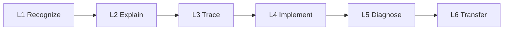
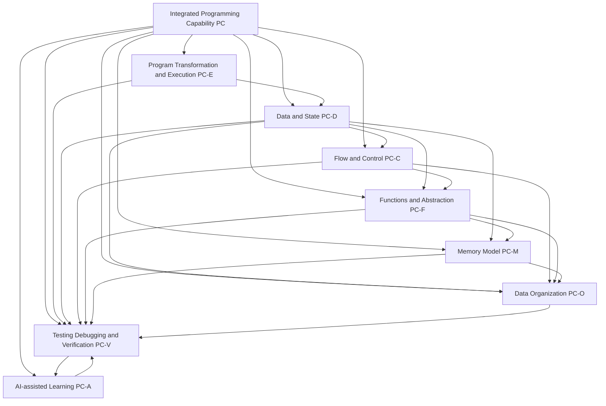
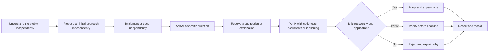
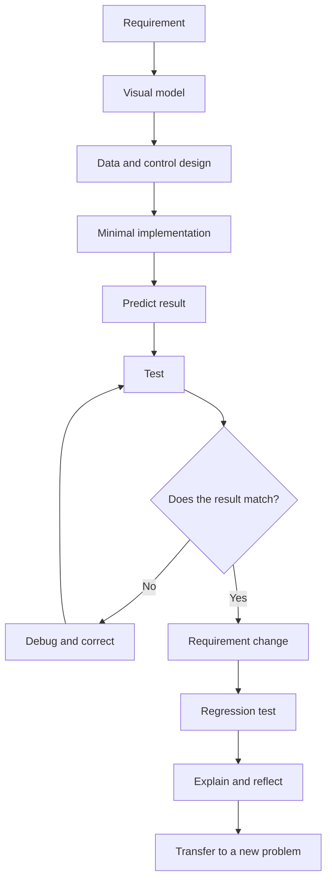

# Programming Competency Map

Version: 0.1.0  
Status: Architecture draft  
Corresponding Chinese version: [程式設計能力地圖](04-competency-map.zh-TW.md)

## Document Purpose

This document converts the knowledge nodes in the [Programming Language Knowledge Graph](03-programming-language-knowledge-graph.en.md) into observable, teachable, and assessable student capabilities.

The knowledge graph answers what concepts exist, why they exist, and how they depend on one another. The competency map answers:

1. What must students actually be able to do?
2. Which prerequisite capabilities does each capability require?
3. What maturity level should be reached in the preparatory course and in the formal course?
4. Which forms of evidence are sufficient to support the claim that students genuinely understand?
5. Where may AI assist, and which core learning behaviors must remain the student's responsibility?

This document is not a weekly schedule or grading rubric. Later scope, acceptance, delivery, material, and assessment documents must reference the competency identifiers defined here.

## Constitutional Compliance

This document follows the Course Constitution, especially these requirements:

- Capability completion may not be judged only by successful execution or passing tests.
- Capability statements must be concrete, observable, and actionable.
- The Chinese and English versions must use identical identifiers, maturity levels, and substantive requirements.
- Capability dependencies that benefit from visualization must be shown visually.
- AI may support explanation, hints, testing, and debugging, but must not replace initial understanding, core design, basic implementation, tracing, diagnosis, or verification responsibility.
- Every official document must be reachable from the repository root README through an explicit navigation path.

---

# 1. Competency Maturity Model

Competency maturity is determined by observable student behavior, not by how many times a topic has been taught.

| Level | Name | Observable behavior |
|---|---|---|
| L0 | Not established | Cannot reliably recognize the concept and can only guess or imitate. |
| L1 | Recognize | Can identify the concept, syntax, data, or execution stage in an example. |
| L2 | Explain | Can explain in their own words why the concept exists, its core logic, and its basic role. |
| L3 | Trace | Can predict execution, data state, control path, or memory change step by step. |
| L4 | Implement | Can independently select and correctly use the capability to complete a small task. |
| L5 | Diagnose | Can design tests, locate faults, explain causes, and make reasonable modifications. |
| L6 | Transfer | Can recognize the same logic in a new context, larger problem, or another language and adapt the approach. |

Maturity principles:

- L4 does not automatically imply L5. Being able to write a program does not mean being able to diagnose it.
- L6 does not require mastery of another language; it requires recognizing transferable concepts and design logic.
- Important capabilities should normally require at least one explanation or tracing artifact and one implementation, modification, or diagnosis artifact.
- The same capability may appear in multiple course stages, but its maturity must increase rather than repeat the same activity.

---

# 2. Overall Competency Architecture

Arrows show major understanding or capability dependencies, not a single mandatory teaching sequence. Testing, debugging, verification, and AI-assisted learning are cross-cutting capabilities that must run through every topic.

---

# 3. Shared Evidence Types

| Evidence code | Type | What the student must demonstrate |
|---|---|---|
| EV-EX | Explanation | Explain the problem, design purpose, language logic, and program behavior in their own words. |
| EV-VI | Visual representation | Draw and interpret flow, state, memory, function-call, or data-structure models. |
| EV-TR | Execution trace | Record variable values, control paths, function calls, or memory changes step by step. |
| EV-IM | Implementation | Complete a small program or fragment that satisfies the current scope. |
| EV-MO | Modification | Modify an existing program for a changed requirement and explain affected parts. |
| EV-TE | Testing | Define expected results and create normal, boundary, and necessary exceptional cases. |
| EV-DE | Debugging | Reproduce a problem, narrow its scope, form and test hypotheses, and explain the correction. |
| EV-CO | Comparison | Compare two forms, solutions, or tool outputs and explain differences and trade-offs. |
| EV-AI | AI judgment | Explain an AI suggestion, how it was verified, and why it was accepted, modified, or rejected. |
| EV-RE | Reflection and transfer | Explain how the capability applies to a new problem, later topic, or another language. |

No official assessment may use only EV-IM or automated-test success as its sole evidence.

---

# 4. Competency Groups

## PC-E: Program Transformation and Execution

Mapped knowledge nodes: `KG-E01` through `KG-E09`.

| Competency ID | The student can... | Main prerequisites | Preparatory target | Formal-course target | Required evidence |
|---|---|---|---|---|---|
| PC-E01 | Explain that C source code is not executed directly by the CPU and describe preprocessing, compilation, assembly, linking, loading, and execution in the correct order. | None | L2 | L3 | EV-EX, EV-VI |
| PC-E02 | Distinguish the inputs, outputs, and responsibilities of the compiler, assembler, linker, and loader. | PC-E01 | L1 | L3 | EV-EX, EV-CO |
| PC-E03 | Use error messages or observed behavior to identify whether a problem mainly occurs during compilation, linking, or execution. | PC-E01, PC-V01 | L2 | L5 | EV-DE, EV-EX |
| PC-E04 | Explain why header files, function declarations, object files, and libraries must work together. | PC-E01, PC-F02 | L1 | L3 | EV-VI, EV-EX |
| PC-E05 | Create, compile, and run a minimal C program in the specified environment and explain the result of each step. | PC-E01 | L4 | L5 | EV-IM, EV-EX, EV-DE |

## PC-D: Data and State

Mapped knowledge nodes: `KG-D01` through `KG-D10`.

| Competency ID | The student can... | Main prerequisites | Preparatory target | Formal-course target | Required evidence |
|---|---|---|---|---|---|
| PC-D01 | Distinguish a value, type, variable name, current value, and memory location rather than treating them as the same concept. | PC-E01 | L2 | L4 | EV-EX, EV-VI |
| PC-D02 | Select an appropriate basic type based on data meaning and explain range, precision, or operation constraints. | PC-D01 | L2 | L5 | EV-EX, EV-CO, EV-IM |
| PC-D03 | Trace program-state changes caused by declaration, initialization, assignment, and expression evaluation. | PC-D01, PC-D02 | L3 | L5 | EV-TR, EV-VI, EV-DE |
| PC-D04 | Build and interpret expressions containing arithmetic, comparison, and logical operators while handling precedence and type conversion. | PC-D02, PC-D03 | L3 | L5 | EV-TR, EV-IM, EV-DE |
| PC-D05 | Design a basic input-process-output flow and verify input assumptions and output reasonableness. | PC-D01 through PC-D04 | L4 | L5 | EV-IM, EV-TE, EV-EX |
| PC-D06 | Explain name scope and data lifetime and identify errors caused by scope misunderstandings. | PC-F01, PC-M01 | L1 | L5 | EV-VI, EV-DE, EV-EX |

## PC-C: Flow and Control

Mapped knowledge nodes: `KG-C01` through `KG-C09`.

| Competency ID | The student can... | Main prerequisites | Preparatory target | Formal-course target | Required evidence |
|---|---|---|---|---|---|
| PC-C01 | Trace statements in execution order and explain causal relationships between earlier and later states. | PC-D03 | L3 | L5 | EV-TR, EV-EX |
| PC-C02 | Convert a requirement into an evaluable condition and predict the actual path through `if` and `else`. | PC-D04, PC-C01 | L3 | L5 | EV-VI, EV-TR, EV-IM |
| PC-C03 | Compare single, two-way, and multi-way selection and choose a structure that fits the requirement. | PC-C02 | L2 | L5 | EV-CO, EV-IM, EV-MO |
| PC-C04 | Define initial state, continuation condition, per-iteration update, and termination condition for a repetition problem. | PC-D03, PC-C02 | L3 | L5 | EV-VI, EV-TR, EV-IM |
| PC-C05 | Use loops for counting, accumulation, searching, or item-by-item processing and explain each iteration. | PC-C04 | L3 | L5 | EV-TR, EV-IM, EV-TE |
| PC-C06 | Diagnose infinite loops, boundary errors, and off-by-one behavior. | PC-C04, PC-V02 | L2 | L5 | EV-DE, EV-TE, EV-EX |
| PC-C07 | Combine conditions, loops, and nested flow for more complex problems while controlling cognitive and code complexity. | PC-C02 through PC-C06, PC-F01 | L1 | L5 | EV-VI, EV-IM, EV-MO |

## PC-F: Functions and Abstraction

Mapped to the function, call-stack, modularity, and recursion nodes beginning with `KG-F01`.

| Competency ID | The student can... | Main prerequisites | Preparatory target | Formal-course target | Required evidence |
|---|---|---|---|---|---|
| PC-F01 | Identify separable responsibilities in a requirement and explain that functions are not merely a way to shorten code. | PC-D05, PC-C03 | L2 | L5 | EV-EX, EV-VI |
| PC-F02 | Distinguish function declaration, definition, call, parameter, and return value. | PC-F01, PC-E04 | L2 | L4 | EV-EX, EV-CO, EV-IM |
| PC-F03 | Design small functions with explicit input, processing, and output and create caller-side tests. | PC-F02, PC-V01 | L3 | L5 | EV-IM, EV-TE, EV-EX |
| PC-F04 | Trace function calls, parameter values, local variables, return points, and the call stack. | PC-F02, PC-D06 | L1 | L5 | EV-VI, EV-TR |
| PC-F05 | Decompose a larger problem into low-coupling, single-responsibility, independently testable functions. | PC-F03, PC-C07 | L1 | L6 | EV-VI, EV-IM, EV-CO, EV-RE |
| PC-F06 | Identify suitable and unsuitable uses of recursion and trace base and recursive cases. | PC-F04, PC-C04 | L0 | L4 | EV-VI, EV-TR, EV-CO |

## PC-M: Memory Model

Mapped to the knowledge-graph nodes for addresses, pointers, contiguous memory, stack, heap, and dynamic allocation.

| Competency ID | The student can... | Main prerequisites | Preparatory target | Formal-course target | Required evidence |
|---|---|---|---|---|---|
| PC-M01 | Explain that a variable has both a value and a location and distinguish a data value from a memory address. | PC-D01 | L1 | L4 | EV-VI, EV-EX |
| PC-M02 | Explain that a pointer is a typed variable that stores an address and correctly use address-of and dereference operations. | PC-M01, PC-D02 | L0 | L5 | EV-VI, EV-TR, EV-IM |
| PC-M03 | Trace shared state caused by pointer aliases and explain which data location is affected by a modification. | PC-M02, PC-D03 | L0 | L5 | EV-VI, EV-TR, EV-DE |
| PC-M04 | Explain contiguous array layout, the relationship between arrays and pointers, and valid bounds. | PC-M02, PC-O01 | L0 | L5 | EV-VI, EV-TR, EV-DE |
| PC-M05 | Compare automatic and dynamic storage duration and explain the instructional roles of stack and heap. | PC-F04, PC-M01 | L0 | L4 | EV-VI, EV-CO, EV-EX |
| PC-M06 | Allocate and release dynamic memory according to runtime needs while handling failure and ownership responsibility. | PC-M02, PC-M05, PC-V02 | L0 | L5 | EV-IM, EV-TE, EV-DE |
| PC-M07 | Diagnose null pointers, dangling pointers, out-of-bounds access, double free, and memory leaks. | PC-M03, PC-M04, PC-M06 | L0 | L5 | EV-DE, EV-VI, EV-TE |

## PC-O: Data Organization and Basic Data Structures

Mapped to knowledge-graph nodes for arrays, strings, structures, searching, sorting, nodes, and basic data structures.

| Competency ID | The student can... | Main prerequisites | Preparatory target | Formal-course target | Required evidence |
|---|---|---|---|---|---|
| PC-O01 | Use indexes to represent and process a collection of same-type data and trace array-element state. | PC-C05, PC-D02 | L1 | L5 | EV-VI, EV-TR, EV-IM |
| PC-O02 | Understand a string as a character sequence with a termination condition and handle length, bounds, and input limitations. | PC-O01, PC-C05 | L0 | L5 | EV-VI, EV-IM, EV-DE |
| PC-O03 | Use a structure to combine fields with shared meaning into one data entity. | PC-D02, PC-F01 | L0 | L5 | EV-VI, EV-IM, EV-EX |
| PC-O04 | Use arrays of structures or pointers to organize records and design search, update, and sort operations. | PC-O01, PC-O03, PC-M02 | L0 | L5 | EV-IM, EV-TE, EV-MO |
| PC-O05 | Compare sequential search and basic sorting methods, trace data changes, and explain suitable use cases. | PC-O01, PC-C05, PC-V01 | L0 | L5 | EV-TR, EV-CO, EV-IM |
| PC-O06 | Explain that a data structure combines data, relationships, and permitted operations rather than being merely syntax. | PC-O01, PC-O03, PC-F01 | L0 | L4 | EV-EX, EV-VI, EV-RE |
| PC-O07 | Use nodes and pointers to create, traverse, and modify a basic linked list. | PC-M03, PC-M06, PC-O03 | L0 | L4 | EV-VI, EV-TR, EV-IM, EV-DE |
| PC-O08 | Explain and implement the abstract operations of a basic stack or queue and distinguish interface from representation. | PC-O01, PC-F05, PC-O06 | L0 | L4 | EV-VI, EV-IM, EV-CO |
| PC-O09 | Recognize tree nodes, edges, roots, parent-child relationships, and traversal concepts and distinguish trees from linear structures. | PC-O06, PC-F06 | L0 | L2 | EV-VI, EV-EX, EV-CO |

## PC-V: Testing, Debugging, and Verification

This group is a cross-cutting foundation for every other competency.

| Competency ID | The student can... | Main prerequisites | Preparatory target | Formal-course target | Required evidence |
|---|---|---|---|---|---|
| PC-V01 | Write expected results for simple cases before execution and compare expected and actual results. | PC-E05, PC-D03 | L3 | L6 | EV-TE, EV-TR, EV-EX |
| PC-V02 | Distinguish syntax, type, linking, runtime, logic, and boundary errors. | PC-E03, PC-V01 | L2 | L5 | EV-DE, EV-CO |
| PC-V03 | Debug through the process reproduce → narrow scope → form hypothesis → design test → correct → regression test. | PC-V01, PC-V02 | L2 | L6 | EV-DE, EV-TE, EV-EX |
| PC-V04 | Create normal, boundary, and appropriate exceptional cases instead of testing only one successful input. | PC-V01, PC-C02 | L2 | L6 | EV-TE, EV-EX |
| PC-V05 | Explain why the current result is trustworthy and identify assumptions and limitations that remain unproven. | PC-V01, PC-V04 | L1 | L6 | EV-EX, EV-RE |
| PC-V06 | Reselect affected tests after a requirement change and verify that prior behavior has not been broken. | PC-V03, PC-F05 | L0 | L5 | EV-MO, EV-TE, EV-DE |

## PC-A: AI-assisted Learning and Judgment

AI capability cannot independently replace any other capability. It must be built on the student's own initial understanding, attempt, and verification responsibility.

| Competency ID | The student can... | Main prerequisites | Preparatory target | Formal-course target | Required evidence |
|---|---|---|---|---|---|
| PC-A01 | Before using AI, state the problem, known information, personal understanding, attempted work, and specific point of difficulty. | PC-D05, PC-V01 | L3 | L6 | EV-AI, EV-EX |
| PC-A02 | Ask AI for explanation, staged hints, testing perspectives, or debugging hypotheses rather than direct completion of the full answer. | PC-A01 | L3 | L6 | EV-AI |
| PC-A03 | Verify AI responses through course mental models, program execution, test data, and reliable documentation. | PC-V03, corresponding topic at L3 | L2 | L6 | EV-AI, EV-TE, EV-DE |
| PC-A04 | Clearly explain why an AI suggestion was adopted, modified, or rejected and identify personal responsibility for the final work. | PC-A03, PC-V05 | L2 | L6 | EV-AI, EV-EX, EV-RE |
| PC-A05 | Recognize fabricated APIs, invalid syntax, undefined behavior, out-of-scope techniques, and unnecessarily complex AI solutions. | PC-A03, PC-E03 | L1 | L5 | EV-AI, EV-DE, EV-CO |
| PC-A06 | Preserve prompts, conversations, or modification records when required and maintain transparency of AI use. | PC-A01, course rules | L3 | L6 | EV-AI |

---

# 5. Integrated Capability

Individual capabilities must ultimately combine into a complete problem-solving process.

## PC-I01: Small-program Development Cycle

The student can:

1. Understand requirements and constraints.
2. Draw a data, control, or execution model.
3. Define input, output, and expected results.
4. Decompose the problem into implementable units.
5. Build a minimal executable version.
6. Test with normal and boundary cases.
7. Diagnose and correct errors.
8. Use AI when needed while retaining verification and explanation responsibility.
9. Modify the program for a small requirement change.
10. Explain the solution, limitations, and possible improvements.

Preparatory target: L3. Formal-course target: L6.

Required evidence: EV-VI, EV-IM, EV-TE, EV-DE, EV-MO, EV-EX, EV-AI.

---

# 6. Boundary Principles for the Preparatory and Formal Courses

This document defines preliminary maturity targets only. Exact scope will be decided in the later Scope Boundary document.

Current principles:

- The preparatory course prioritizes the execution model, basic data state, sequence and selection, basic repetition, function concepts, testing and debugging process, and AI verification habits.
- The preparatory course may introduce recognition of arrays, addresses, or memory models, but must not pretend that pointer, dynamic-memory, or data-structure competencies are complete merely to cover more topics.
- The formal course must raise foundational capabilities from recognition and tracing to independent implementation, diagnosis, and transfer.
- Pointers, dynamic memory, structures, and basic data structures must be built on data, functions, control flow, memory diagrams, and verification capabilities.
- The Chinese-taught and English-taught preparatory classes share the same core capability targets. Different instructional hours may be used only for pacing, reinforcement, diagnosis, or extension and may not create different core standards.

---

# 7. Prohibited Completion Criteria

None of the following alone counts as capability completion:

- Watching an instructor demonstration.
- Copying or retyping an example.
- Producing a program that runs.
- Passing one set of test data.
- Passing an online judge without being able to explain the solution.
- Memorizing syntax patterns.
- Repeating an AI explanation without being able to draw, trace, or verify it.
- Allowing AI to complete the main program and making only superficial edits.

Capability completion requires multiple complementary forms of evidence at the required maturity level.

---

# 8. How Later Documents Use This Competency Map

- Scope Boundary: decides which capabilities and maturity levels belong to the preparatory course and the 16-week formal course.
- Acceptance Model: converts evidence types into concrete assessment activities and pass conditions.
- Delivery Map: assembles capability dependencies into pacing for the Chinese-taught class, English-taught class, and formal course.
- Risk Register: records common misconceptions, capability breakdowns, AI dependence, and instructional risks.
- Traceability Matrix: links educational requirements, knowledge nodes, capabilities, materials, activities, and assessments.

## Navigation

- [Previous: Programming Language Knowledge Graph](03-programming-language-knowledge-graph.en.md)
- [Return to Instructional Design Workspace](README.en.md)
- [繁體中文版](04-competency-map.zh-TW.md)
- [Return to Repository Home](../README.md)
