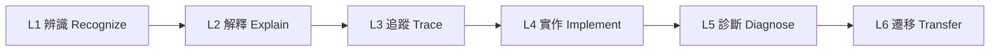
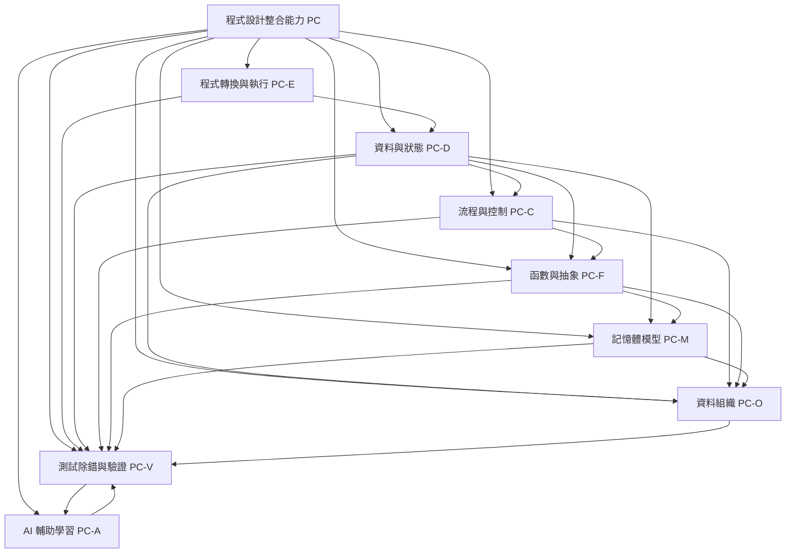
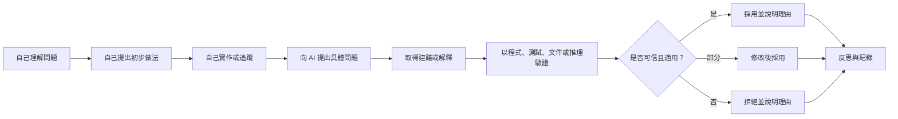
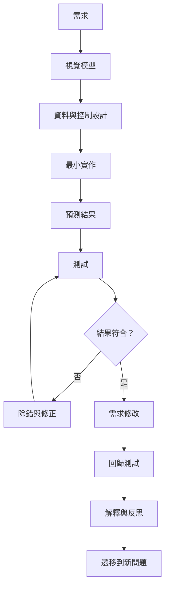

# 程式設計能力地圖

版本：0.1.0  
狀態：架構草案  
對應英文版本：[Programming Competency Map](04-competency-map.en.md)

## 文件目的

本文件將[程式語言知識圖](03-programming-language-knowledge-graph.zh-TW.md)中的知識節點轉換為可觀察、可教學與可驗收的學生能力。

知識圖回答「有哪些概念、概念為何存在，以及彼此如何相依」；能力地圖回答：

1. 學生實際要能做到什麼？
2. 一項能力需要哪些先備能力？
3. 前導課程與正式課程分別應達到何種成熟度？
4. 哪些學習證據足以支持「學生真的理解」？
5. AI 可以在哪些位置協助，又有哪些核心行為不得被取代？

本文件不是週次表，也不是評分規準。後續的範圍邊界、驗收模型、課程節奏、教材與評量均應引用本文件的能力識別碼。

## 憲法遵循

本文件依據課程憲法建立，特別遵守：

- 能力完成不能只以程式成功執行或通過測試判定。
- 能力敘述必須具體、可觀察、可執行。
- 中文版與英文版必須使用相同識別碼、成熟度與實質要求。
- 能視覺化的能力依賴必須提供圖形。
- AI 可以協助解釋、提示、測試與除錯，但不得取代初始理解、核心設計、基本實作、追蹤、診斷與驗證責任。
- 所有正式文件必須由根 README 經明確導覽鏈抵達。

---

# 一、能力成熟度模型

能力成熟度不是依「教過幾次」判定，而是依學生能展現的行為判定。

| 等級 | 名稱 | 可觀察行為 |
|---|---|---|
| L0 | 尚未建立 | 無法可靠辨識概念，或僅能猜測與模仿。 |
| L1 | 辨識 | 能在範例中指出概念、語法、資料或執行階段。 |
| L2 | 解釋 | 能用自己的話說明存在原因、核心邏輯與基本作用。 |
| L3 | 追蹤 | 能逐步預測執行、資料狀態、控制路徑或記憶體變化。 |
| L4 | 實作 | 能依需求自行選擇並正確使用該能力完成小型任務。 |
| L5 | 診斷 | 能設計測試、定位錯誤、說明原因並完成合理修改。 |
| L6 | 遷移 | 能在新情境、較大問題或其他語言中辨識相同邏輯並調整做法。 |

成熟度原則：

- L4 不代表一定具備 L5；能寫出程式不等於能診斷程式。
- L6 不要求精通其他語言，而要求能辨識可遷移的概念與設計邏輯。
- 重要能力原則上至少需要一項解釋或追蹤證據，以及一項實作、修改或診斷證據。
- 同一能力可以在不同課程階段重複出現，但成熟度必須提高，而不是重複相同活動。

---

# 二、整體能力架構

圖中箭頭表示主要理解或能力依賴，不代表唯一授課順序。測試、除錯、驗證與 AI 輔助學習是橫向能力，應貫穿所有主題。

---

# 三、共同學習證據類型

| 證據代碼 | 類型 | 學生必須展現的內容 |
|---|---|---|
| EV-EX | 解釋 | 用自己的話說明問題、設計目的、語言邏輯與程式行為。 |
| EV-VI | 視覺表示 | 畫出流程、狀態、記憶體、函數呼叫或資料結構，並能解讀圖。 |
| EV-TR | 執行追蹤 | 逐步記錄變數值、控制路徑、函數呼叫或記憶體變化。 |
| EV-IM | 實作 | 依需求完成符合目前範圍的小型程式或程式片段。 |
| EV-MO | 修改 | 面對需求變更，修改既有程式並說明受影響部分。 |
| EV-TE | 測試 | 建立預期結果、正常案例、邊界案例及必要的異常案例。 |
| EV-DE | 除錯 | 重現問題、縮小範圍、提出假設、驗證假設並說明修正。 |
| EV-CO | 比較 | 比較兩種寫法、解法或工具輸出，說明差異與取捨。 |
| EV-AI | AI 判斷 | 說明 AI 建議、驗證方法，以及採用、修改或拒絕的理由。 |
| EV-RE | 反思與遷移 | 說明此能力如何應用到新問題、後續主題或其他語言。 |

任何正式評量不得只使用 EV-IM 或自動測試通過作為唯一證據。

---

# 四、能力群組

## PC-E：程式轉換與執行

對應知識節點：`KG-E01` 至 `KG-E09`。

| 能力 ID | 學生能夠…… | 主要先備 | 前導目標 | 正式課程目標 | 必要證據 |
|---|---|---|---|---|---|
| PC-E01 | 說明 C 原始碼不會直接由 CPU 執行，並以正確順序描述前置處理、編譯、組譯、連結、載入與執行。 | 無 | L2 | L3 | EV-EX、EV-VI |
| PC-E02 | 區分編譯器、組譯器、連結器與載入器的輸入、輸出及責任。 | PC-E01 | L1 | L3 | EV-EX、EV-CO |
| PC-E03 | 根據錯誤訊息或現象，判斷問題主要發生於編譯、連結或執行階段。 | PC-E01、PC-V01 | L2 | L5 | EV-DE、EV-EX |
| PC-E04 | 說明標頭檔、函式宣告、目的檔與函式庫為何需要配合。 | PC-E01、PC-F02 | L1 | L3 | EV-VI、EV-EX |
| PC-E05 | 在指定環境中建立、編譯與執行最小 C 程式，並能解釋每一步產生的結果。 | PC-E01 | L4 | L5 | EV-IM、EV-EX、EV-DE |

## PC-D：資料與狀態

對應知識節點：`KG-D01` 至 `KG-D10`。

| 能力 ID | 學生能夠…… | 主要先備 | 前導目標 | 正式課程目標 | 必要證據 |
|---|---|---|---|---|---|
| PC-D01 | 區分值、型別、變數名稱、目前值與記憶體位置，不把它們視為同一概念。 | PC-E01 | L2 | L4 | EV-EX、EV-VI |
| PC-D02 | 根據資料意義選擇適當基本型別，並說明表示範圍、精度或操作限制。 | PC-D01 | L2 | L5 | EV-EX、EV-CO、EV-IM |
| PC-D03 | 追蹤宣告、初始化、指定與運算式求值造成的程式狀態改變。 | PC-D01、PC-D02 | L3 | L5 | EV-TR、EV-VI、EV-DE |
| PC-D04 | 建立及解讀包含算術、比較與邏輯運算子的運算式，並處理優先序與型別轉換。 | PC-D02、PC-D03 | L3 | L5 | EV-TR、EV-IM、EV-DE |
| PC-D05 | 設計基本輸入、處理與輸出流程，並驗證輸入假設及輸出合理性。 | PC-D01 至 PC-D04 | L4 | L5 | EV-IM、EV-TE、EV-EX |
| PC-D06 | 說明名稱範圍與資料生命週期，並辨識因作用域誤解造成的錯誤。 | PC-F01、PC-M01 | L1 | L5 | EV-VI、EV-DE、EV-EX |

## PC-C：流程與控制

對應知識節點：`KG-C01` 至 `KG-C09`。

| 能力 ID | 學生能夠…… | 主要先備 | 前導目標 | 正式課程目標 | 必要證據 |
|---|---|---|---|---|---|
| PC-C01 | 依程式順序追蹤敘述執行，並說明前後狀態的因果關係。 | PC-D03 | L3 | L5 | EV-TR、EV-EX |
| PC-C02 | 將需求轉換為可求值的條件，並預測 `if`／`else` 的實際路徑。 | PC-D04、PC-C01 | L3 | L5 | EV-VI、EV-TR、EV-IM |
| PC-C03 | 比較單一選擇、雙向選擇與多路選擇，選擇符合需求的結構。 | PC-C02 | L2 | L5 | EV-CO、EV-IM、EV-MO |
| PC-C04 | 為重複問題定義初始狀態、持續條件、每次更新與終止條件。 | PC-D03、PC-C02 | L3 | L5 | EV-VI、EV-TR、EV-IM |
| PC-C05 | 使用迴圈完成計數、累積、搜尋或逐項處理，並能解釋每次迭代。 | PC-C04 | L3 | L5 | EV-TR、EV-IM、EV-TE |
| PC-C06 | 診斷無窮迴圈、邊界錯誤、少做或多做一次等控制流程錯誤。 | PC-C04、PC-V02 | L2 | L5 | EV-DE、EV-TE、EV-EX |
| PC-C07 | 組合條件、迴圈與巢狀流程處理較複雜問題，並控制認知與程式複雜度。 | PC-C02 至 PC-C06、PC-F01 | L1 | L5 | EV-VI、EV-IM、EV-MO |

## PC-F：函數與抽象

對應知識節點：`KG-F01` 起的函數、呼叫堆疊、模組化與遞迴節點。

| 能力 ID | 學生能夠…… | 主要先備 | 前導目標 | 正式課程目標 | 必要證據 |
|---|---|---|---|---|---|
| PC-F01 | 從需求中辨識可分離的責任，並說明函數不是只為縮短程式碼。 | PC-D05、PC-C03 | L2 | L5 | EV-EX、EV-VI |
| PC-F02 | 區分函數宣告、定義、呼叫、參數與回傳值。 | PC-F01、PC-E04 | L2 | L4 | EV-EX、EV-CO、EV-IM |
| PC-F03 | 依明確輸入、處理與輸出設計小型函數，並建立呼叫端測試。 | PC-F02、PC-V01 | L3 | L5 | EV-IM、EV-TE、EV-EX |
| PC-F04 | 追蹤函數呼叫、參數值、區域變數、回傳點與呼叫堆疊。 | PC-F02、PC-D06 | L1 | L5 | EV-VI、EV-TR |
| PC-F05 | 把較大問題分解成低耦合、責任明確且可獨立測試的函數。 | PC-F03、PC-C07 | L1 | L6 | EV-VI、EV-IM、EV-CO、EV-RE |
| PC-F06 | 辨識適合與不適合遞迴的問題，追蹤基本案例與遞迴案例。 | PC-F04、PC-C04 | L0 | L4 | EV-VI、EV-TR、EV-CO |

## PC-M：記憶體模型

對應知識圖中的位址、指標、連續記憶體、Stack、Heap 與動態配置節點。

| 能力 ID | 學生能夠…… | 主要先備 | 前導目標 | 正式課程目標 | 必要證據 |
|---|---|---|---|---|---|
| PC-M01 | 說明變數具有值與位置，並區分資料值和記憶體位址。 | PC-D01 | L1 | L4 | EV-VI、EV-EX |
| PC-M02 | 解釋指標是保存位址的具型別變數，並正確使用取址與解參考。 | PC-M01、PC-D02 | L0 | L5 | EV-VI、EV-TR、EV-IM |
| PC-M03 | 追蹤指標別名造成的共享狀態，並解釋修改會影響哪一個資料位置。 | PC-M02、PC-D03 | L0 | L5 | EV-VI、EV-TR、EV-DE |
| PC-M04 | 說明陣列連續配置、陣列到指標的關係，以及合法範圍。 | PC-M02、PC-O01 | L0 | L5 | EV-VI、EV-TR、EV-DE |
| PC-M05 | 比較自動儲存期與動態儲存期，解釋 Stack 與 Heap 在課程模型中的角色。 | PC-F04、PC-M01 | L0 | L4 | EV-VI、EV-CO、EV-EX |
| PC-M06 | 依執行期需求配置與釋放動態記憶體，並處理失敗與所有權責任。 | PC-M02、PC-M05、PC-V02 | L0 | L5 | EV-IM、EV-TE、EV-DE |
| PC-M07 | 診斷空指標、懸空指標、越界、重複釋放與記憶體洩漏等問題。 | PC-M03、PC-M04、PC-M06 | L0 | L5 | EV-DE、EV-VI、EV-TE |

## PC-O：資料組織與基本資料結構

對應知識圖中的陣列、字串、結構、搜尋、排序、節點與基本資料結構節點。

| 能力 ID | 學生能夠…… | 主要先備 | 前導目標 | 正式課程目標 | 必要證據 |
|---|---|---|---|---|---|
| PC-O01 | 使用索引表示與處理一組同型別資料，並追蹤陣列元素狀態。 | PC-C05、PC-D02 | L1 | L5 | EV-VI、EV-TR、EV-IM |
| PC-O02 | 把字串理解為具有終止條件的字元序列，並處理長度、範圍與輸入限制。 | PC-O01、PC-C05 | L0 | L5 | EV-VI、EV-IM、EV-DE |
| PC-O03 | 使用結構把具有共同語意的不同欄位組合成一個資料實體。 | PC-D02、PC-F01 | L0 | L5 | EV-VI、EV-IM、EV-EX |
| PC-O04 | 使用結構陣列或指標組織多筆紀錄，並設計搜尋、更新與排序操作。 | PC-O01、PC-O03、PC-M02 | L0 | L5 | EV-IM、EV-TE、EV-MO |
| PC-O05 | 比較循序搜尋與基本排序方法，追蹤其資料變化並說明適用情境。 | PC-O01、PC-C05、PC-V01 | L0 | L5 | EV-TR、EV-CO、EV-IM |
| PC-O06 | 說明資料結構是資料、關係與允許操作的組合，而不只是特定語法。 | PC-O01、PC-O03、PC-F01 | L0 | L4 | EV-EX、EV-VI、EV-RE |
| PC-O07 | 使用節點與指標建立、走訪及修改基本鏈結串列。 | PC-M03、PC-M06、PC-O03 | L0 | L4 | EV-VI、EV-TR、EV-IM、EV-DE |
| PC-O08 | 說明並實作基本 Stack 或 Queue 的抽象操作，區分介面與底層表示。 | PC-O01、PC-F05、PC-O06 | L0 | L4 | EV-VI、EV-IM、EV-CO |
| PC-O09 | 辨識樹的節點、邊、根、父子與走訪概念，理解其與線性結構的差異。 | PC-O06、PC-F06 | L0 | L2 | EV-VI、EV-EX、EV-CO |

## PC-V：測試、除錯與驗證

此群組是所有其他能力的橫向基礎。

| 能力 ID | 學生能夠…… | 主要先備 | 前導目標 | 正式課程目標 | 必要證據 |
|---|---|---|---|---|---|
| PC-V01 | 在執行前寫出簡單案例的預期結果，並比較預期與實際結果。 | PC-E05、PC-D03 | L3 | L6 | EV-TE、EV-TR、EV-EX |
| PC-V02 | 區分語法、型別、連結、執行期、邏輯與邊界錯誤。 | PC-E03、PC-V01 | L2 | L5 | EV-DE、EV-CO |
| PC-V03 | 使用「重現 → 縮小範圍 → 提出假設 → 設計測試 → 修正 → 回歸測試」流程除錯。 | PC-V01、PC-V02 | L2 | L6 | EV-DE、EV-TE、EV-EX |
| PC-V04 | 為需求建立正常、邊界及適當的異常案例，而不是只測一組成功輸入。 | PC-V01、PC-C02 | L2 | L6 | EV-TE、EV-EX |
| PC-V05 | 說明目前結果為何可信，也能指出尚未被證明的假設與限制。 | PC-V01、PC-V04 | L1 | L6 | EV-EX、EV-RE |
| PC-V06 | 面對需求修改後重新選擇受影響測試，確認舊功能未被破壞。 | PC-V03、PC-F05 | L0 | L5 | EV-MO、EV-TE、EV-DE |

## PC-A：AI 輔助學習與判斷

AI 能力不能獨立取代其他能力；它必須建立在學生已有初始理解、嘗試與驗證責任之上。

| 能力 ID | 學生能夠…… | 主要先備 | 前導目標 | 正式課程目標 | 必要證據 |
|---|---|---|---|---|---|
| PC-A01 | 在使用 AI 前，先陳述問題、已知資訊、自己的理解、嘗試與具體卡點。 | PC-D05、PC-V01 | L3 | L6 | EV-AI、EV-EX |
| PC-A02 | 要求 AI 提供解釋、分階段提示、測試觀點或除錯假設，而不是直接代寫完整答案。 | PC-A01 | L3 | L6 | EV-AI |
| PC-A03 | 使用課程心智模型、程式執行、測試資料及可靠文件驗證 AI 回答。 | PC-V03、對應主題能力 L3 | L2 | L6 | EV-AI、EV-TE、EV-DE |
| PC-A04 | 清楚說明採用、修改或拒絕 AI 建議的理由，以及最後成果中自己的責任。 | PC-A03、PC-V05 | L2 | L6 | EV-AI、EV-EX、EV-RE |
| PC-A05 | 辨識 AI 可能產生的虛構 API、錯誤語法、未定義行為、範圍外技巧與過度複雜解法。 | PC-A03、PC-E03 | L1 | L5 | EV-AI、EV-DE、EV-CO |
| PC-A06 | 在規定範圍內保留提示、對話或修改紀錄，維持 AI 使用透明性。 | PC-A01、課程規則 | L3 | L6 | EV-AI |

---

# 五、整合能力

單項能力最終必須整合成完整問題解決流程。

## PC-I01：小型程式開發循環

學生能夠：

1. 理解需求與限制。
2. 畫出資料、控制或執行模型。
3. 定義輸入、輸出及預期結果。
4. 將問題分解成可實作單位。
5. 建立最小可執行版本。
6. 以正常與邊界案例測試。
7. 診斷並修正錯誤。
8. 在需要時使用 AI，但保留驗證與說明責任。
9. 面對小幅需求變更修改程式。
10. 說明解法、限制與可改進處。

前導課程目標：L3；正式課程目標：L6。

必要證據：EV-VI、EV-IM、EV-TE、EV-DE、EV-MO、EV-EX、EV-AI。

---

# 六、前導課程與正式課程的能力邊界原則

本文件只定義初步目標成熟度，精確範圍將在後續《範圍邊界》文件中決定。

目前原則如下：

- 前導課程優先建立執行模型、基本資料狀態、順序與條件、基本重複、函數概念、測試除錯流程及 AI 驗證習慣。
- 前導課程可以讓學生辨識陣列、位址或記憶體模型，但不得為追求進度而假裝已完成指標、動態記憶體或資料結構能力。
- 正式課程應將基礎能力由辨識與追蹤提升至獨立實作、診斷與遷移。
- 指標、動態記憶體、結構及基本資料結構必須建立在資料、函數、控制流程、記憶體圖與驗證能力之上。
- 中英文前導班的共同能力目標相同；授課時數差異只能用於節奏、補強、診斷或延伸，不得造成核心標準差異。

---

# 七、能力完成的禁止判準

下列情況不得單獨被視為能力完成：

- 看過教師示範。
- 抄寫或重新輸入範例。
- 程式可以執行。
- 通過一組測試資料。
- 通過自動評測但無法解釋。
- 能背出語法格式。
- 能重複 AI 的解釋但無法畫圖、追蹤或驗證。
- AI 完成主要程式後，學生只做表面修改。

能力完成必須以多種互補證據支持，並符合目前要求的成熟度。

---

# 八、後續文件如何使用本能力地圖

- 《範圍邊界》：決定哪些能力與成熟度屬於前導課程及 16 週正式課程。
- 《驗收模型》：把證據類型轉換成具體評量活動與通過條件。
- 《交付地圖》：將能力依賴組成中文班、英文班與正式課程節奏。
- 《風險登錄》：記錄常見迷思、能力斷點、AI 依賴與教學風險。
- 《追蹤矩陣》：連結教育需求、知識節點、能力、教材、活動及評量。

## 導覽

- [上一份：程式語言知識圖](03-programming-language-knowledge-graph.zh-TW.md)
- [返回教學內容設計區](README.zh-TW.md)
- [English version](04-competency-map.en.md)
- [返回倉庫首頁](../README.md)
