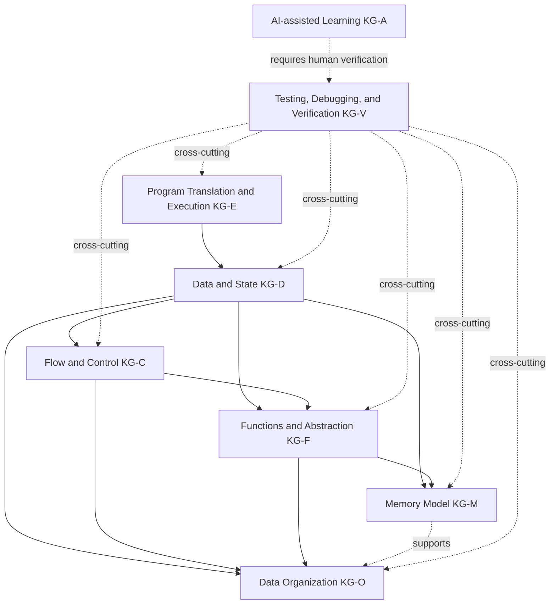
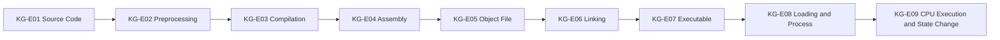
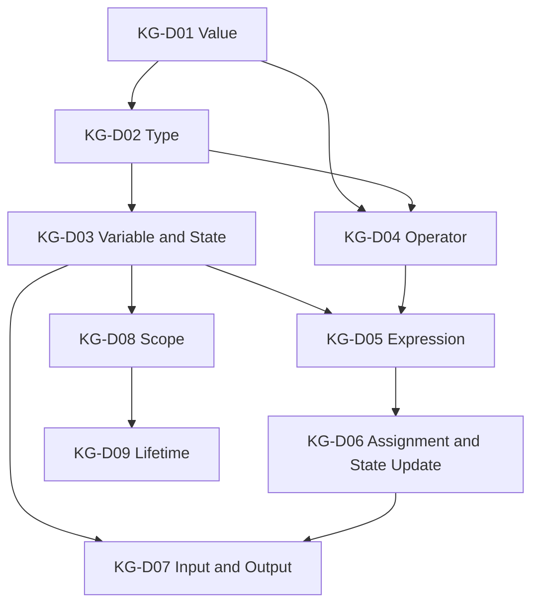
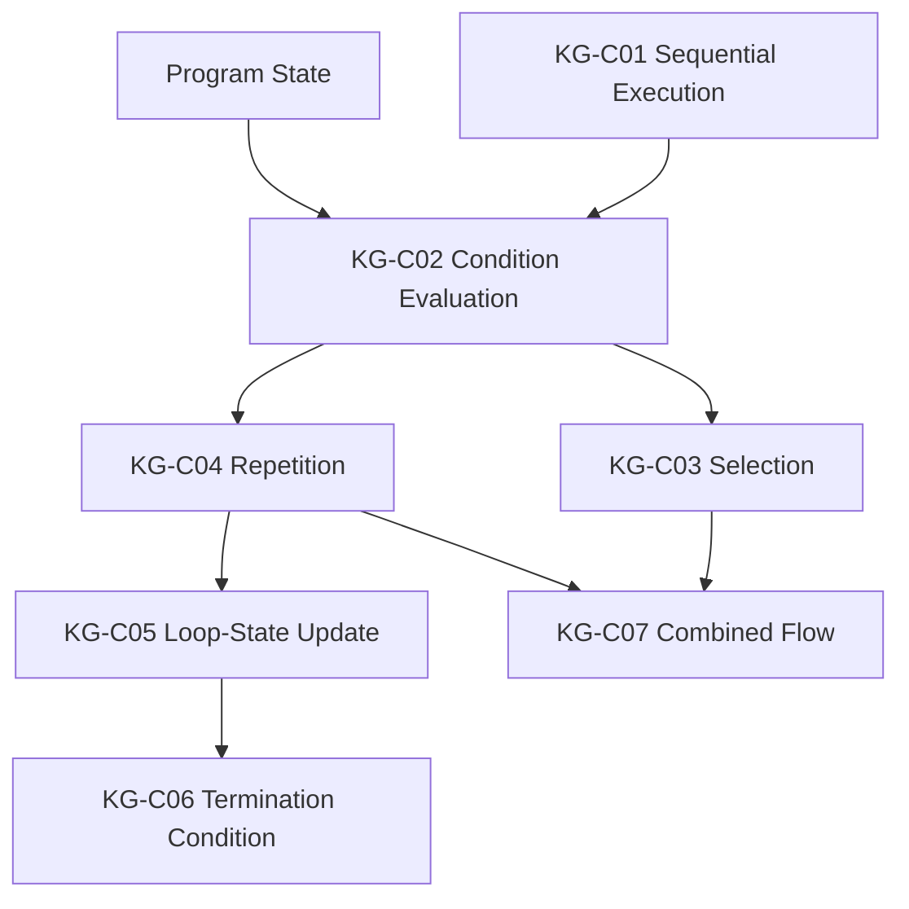
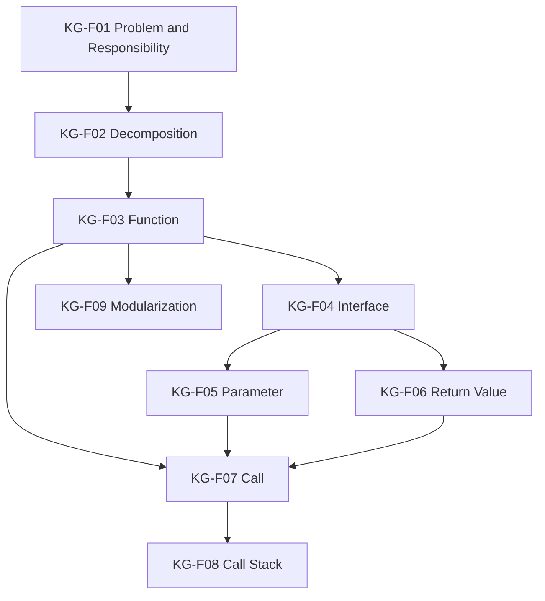
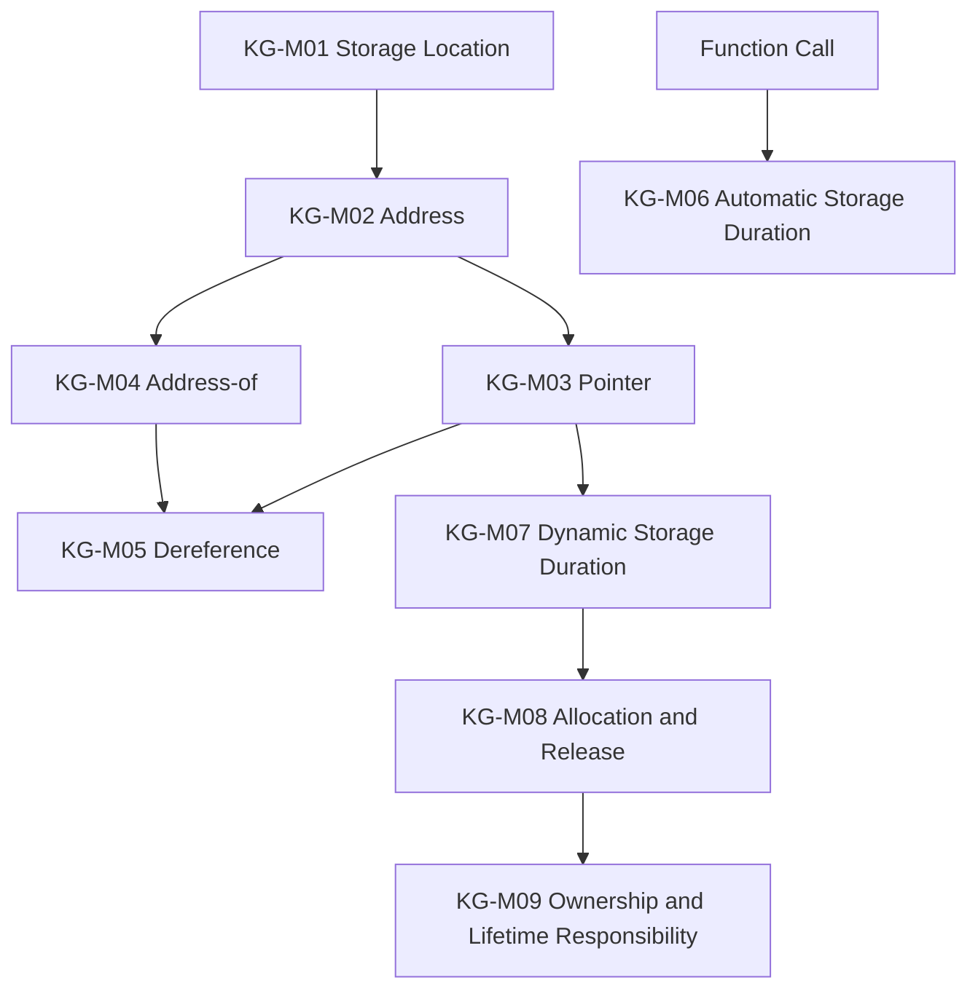
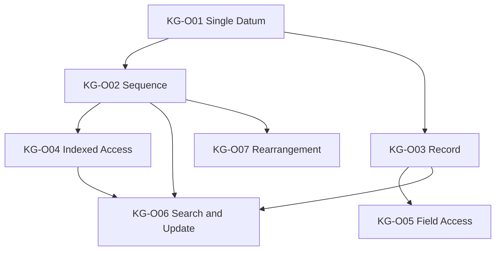
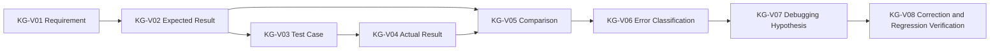
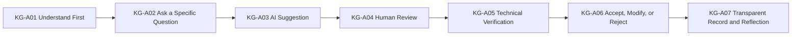

# Programming Language Knowledge Dependency Graph

Version: 0.1.0  
Status: Architecture draft  
Corresponding Chinese version: [程式語言知識依賴圖](04-programming-language-knowledge-graph.zh-TW.md)

## Document Purpose

This document defines the major prerequisite relationships needed to understand the core concepts of C programming.

It does not answer “Which concepts exist in the programming domain?” That question is answered by the [Programming Domain Model](03-programming-domain-model.en.md). This document answers only:

1. What concepts are usually needed before another concept can be understood?
2. Which dependencies are strong, and which are supporting dependencies?
3. Which concepts may develop in parallel?
4. Which mental models must exist before syntax can be understood rather than memorized?

This document is not a weekly schedule, textbook outline, or scope decision. Later competency, scope, delivery, and material documents may use it, but dependency arrows must not be treated as one mandatory teaching sequence.

## Constitutional Compliance

- Establish purpose and language logic before syntax.
- Use identical nodes, identifiers, and dependencies in both language versions.
- Visualize dependency relationships with Mermaid when useful.
- Treat testing, debugging, verification, and AI judgment as cross-cutting dependencies.
- Do not presume that any advanced data structure must belong to the formal course.

## Dependency Types

| Type | Meaning |
|---|---|
| Strong dependency | Without the prerequisite, the later concept is likely to become rote memorization or an incorrect mental model. |
| Supporting dependency | Not always mandatory, but materially reduces difficulty. |
| Cross-cutting dependency | Must develop across many topics, such as testing, debugging, visualization, and AI verification. |

## First-Level Dependency Architecture

---

## KG-E: Program Translation and Execution

| Node | Main dependencies | Rationale |
|---|---|---|
| KG-E01 Source code | None | Human-readable starting point for programming activity. |
| KG-E02 Preprocessing | KG-E01 | Learners must first understand that `#` directives participate in the build process. |
| KG-E03 Compilation | KG-E01, KG-E02 | The compiler receives preprocessed source. |
| KG-E04 Assembly | KG-E03 | Requires understanding that compilation produces a lower-level representation. |
| KG-E05 Object file | KG-E04 | An object file is assembly output, not a complete executable. |
| KG-E06 Linking | KG-E05 | Requires object-file and external-symbol concepts. |
| KG-E07 Executable | KG-E06 | An executable is the result of linking. |
| KG-E08 Loading and process | KG-E07 | Learners must distinguish a file from a running process. |
| KG-E09 CPU execution and state change | KG-E08, KG-D03 | Execution must connect to changes in program state. |

---

## KG-D: Data and State

| Node | Main dependencies | Rationale |
|---|---|---|
| KG-D01 Value | KG-E09 | Program execution processes concrete information. |
| KG-D02 Type | KG-D01 | Types constrain representation, range, and operations. |
| KG-D03 Variable and state | KG-D01, KG-D02 | A variable is named, typed, mutable state. |
| KG-D04 Operator | KG-D01, KG-D02 | Valid operations depend on values and types. |
| KG-D05 Expression | KG-D03, KG-D04 | Expressions combine values, variables, and operators. |
| KG-D06 Assignment and state update | KG-D03, KG-D05 | Learners must distinguish evaluation from writing state. |
| KG-D07 Input and output | KG-D03, KG-D06 | External data enters or leaves program state. |
| KG-D08 Scope | KG-D03, KG-F03 | Name visibility is usually understood through functions and blocks. |
| KG-D09 Lifetime | KG-D03, KG-D08, KG-M01 | Learners must distinguish name visibility from object existence. |

---

## KG-C: Flow and Control

| Node | Main dependencies | Rationale |
|---|---|---|
| KG-C01 Sequential execution | KG-D06 | First understand how statements change state in order. |
| KG-C02 Condition evaluation | KG-D05, KG-C01 | A condition is an evaluable expression. |
| KG-C03 Selection | KG-C02 | Chooses a path from a condition. |
| KG-C04 Repetition | KG-C02, KG-D03 | Repetition requires a condition and mutable state. |
| KG-C05 Loop-state update | KG-C04, KG-D06 | Each iteration must have an explainable state change. |
| KG-C06 Termination condition | KG-C04, KG-C05 | Learners must understand when repetition stops. |
| KG-C07 Combined flow | KG-C03, KG-C04 | Composite control builds on basic selection and repetition. |

---

## KG-F: Functions and Abstraction

| Node | Main dependencies | Rationale |
|---|---|---|
| KG-F01 Problem and responsibility | KG-D07, KG-C03 | First describe input, processing, and output responsibility. |
| KG-F02 Decomposition | KG-F01 | Decomposition divides a larger responsibility into smaller ones. |
| KG-F03 Function | KG-F02 | A function is the language mechanism for responsibility decomposition. |
| KG-F04 Interface | KG-F03 | Once functions exist, use can be separated from implementation. |
| KG-F05 Parameter | KG-F04, KG-D02 | A parameter is typed input in an interface. |
| KG-F06 Return value | KG-F04, KG-D02 | A return value is typed output in an interface. |
| KG-F07 Call | KG-F03, KG-F05, KG-F06 | A call transfers control and data. |
| KG-F08 Call stack | KG-F07, KG-M01 | Requires function-call and storage-location concepts. |
| KG-F09 Modularization | KG-F03, KG-F04 | Modularization depends on clear responsibilities and interfaces. |

---

## KG-M: Memory Model

| Node | Main dependencies | Rationale |
|---|---|---|
| KG-M01 Storage location | KG-D03 | First distinguish a name, value, and data object. |
| KG-M02 Address | KG-M01 | An address identifies a storage location. |
| KG-M03 Pointer | KG-M02, KG-D02 | A pointer is a typed variable that stores an address. |
| KG-M04 Address-of | KG-M01, KG-M02 | Address-of connects an object to its address. |
| KG-M05 Dereference | KG-M03, KG-M04 | Learners must first know that a pointer stores an address. |
| KG-M06 Automatic storage duration | KG-F07, KG-D09 | Relates to function calls and lifetime. |
| KG-M07 Dynamic storage duration | KG-M03, KG-D09 | Requires pointer and lifetime models. |
| KG-M08 Allocation and release | KG-M07, KG-V03 | Requires both operation and failure verification. |
| KG-M09 Ownership and lifetime responsibility | KG-M08, KG-D09 | Requires explaining who releases a resource and when it becomes invalid. |

---

## KG-O: Data Organization

This group remains at the abstraction level needed for general programming. It does not preselect linked lists, trees, heaps, hash structures, or graphs as course core content.

| Node | Main dependencies | Rationale |
|---|---|---|
| KG-O01 Single datum | KG-D03 | Collections are built from individual data objects. |
| KG-O02 Sequence | KG-O01, KG-C04 | Requires item-by-item processing and repetition. |
| KG-O03 Record | KG-D02, KG-F01 | Groups fields describing one entity. |
| KG-O04 Indexed access | KG-O02, KG-D05 | An index is an expression that locates a sequence element. |
| KG-O05 Field access | KG-O03 | Requires the record-field relationship. |
| KG-O06 Search and update | KG-O02 or KG-O03, KG-C04 | Requires item inspection, conditions, and state updates. |
| KG-O07 Rearrangement | KG-O02, KG-C07 | Requires comparison, exchange, and repetition. |

---

## KG-V: Testing, Debugging, and Verification

| Node | Main dependencies | Rationale |
|---|---|---|
| KG-V01 Requirement | None | Verification begins with a definition of correct behavior. |
| KG-V02 Expected result | KG-V01 | Derive a reasonable result before execution. |
| KG-V03 Test case | KG-V02, topic knowledge | Makes input, conditions, and expectations concrete. |
| KG-V04 Actual result | KG-E09 | Requires execution and observation. |
| KG-V05 Comparison | KG-V02, KG-V04 | Uses evidence to judge conformance. |
| KG-V06 Error classification | KG-V05, KG-E03 | Distinguishes build, runtime, and logic problems. |
| KG-V07 Debugging hypothesis | KG-V06 | Forms a testable cause from evidence. |
| KG-V08 Correction and regression verification | KG-V07, KG-V03 | A correction must retest prior and new cases. |

---

## KG-A: AI-assisted Learning

AI suggestions depend on the verification capabilities in `KG-V`. When learners cannot yet trace, test, or explain the relevant concept, AI must not be used to bypass that missing prerequisite knowledge.

## Usage Principles

1. This graph describes major dependencies, not one legal learning path.
2. Materials may split nodes or develop supporting dependencies in parallel to control cognitive load.
3. A new concept must first be defined in the domain model and then connected here through dependencies.
4. Scope decisions determine whether a concept belongs in the preparatory or formal course.
5. This graph does not decide whether specific data structures are taught.

## Navigation

- [Previous stage: Programming Domain Model](03-programming-domain-model.en.md)
- [Next stage: Programming Competency Map](05-competency-map.en.md)
- [Back to Instructional Design Workspace](README.en.md)
- [繁體中文版](04-programming-language-knowledge-graph.zh-TW.md)
