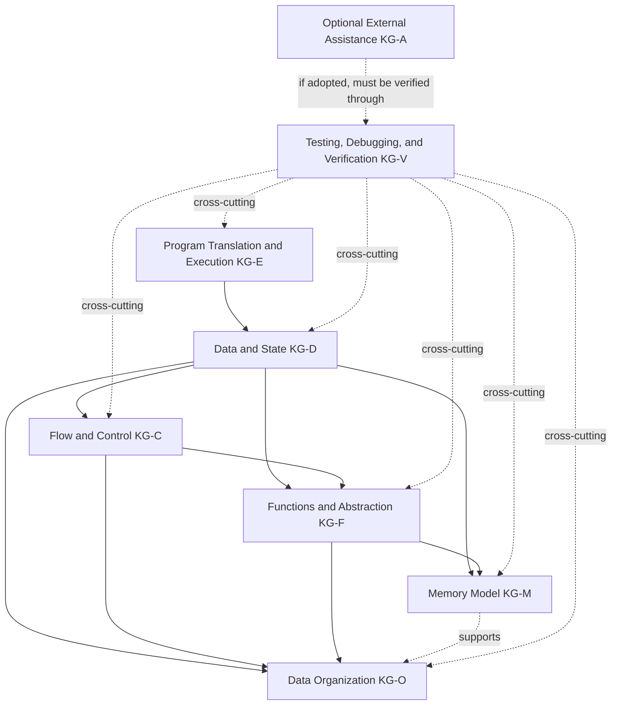
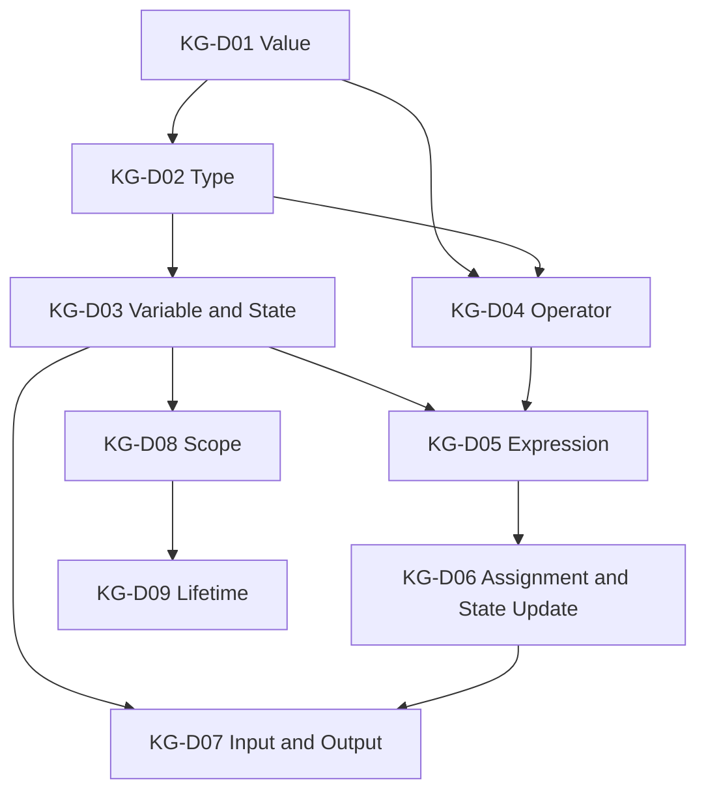
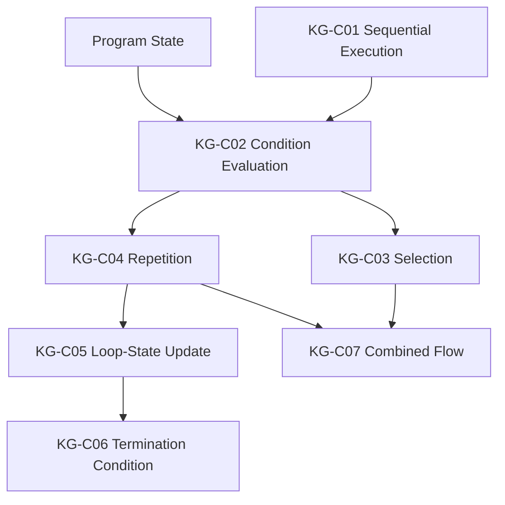
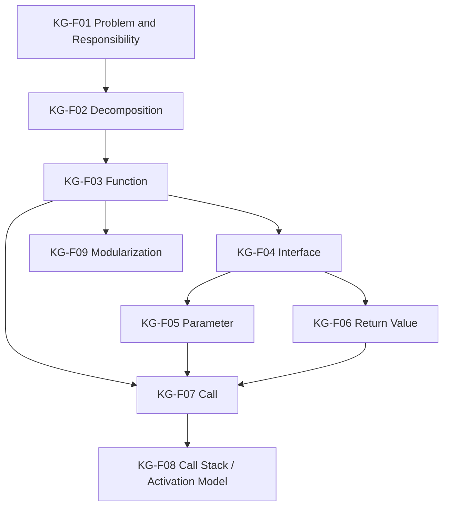
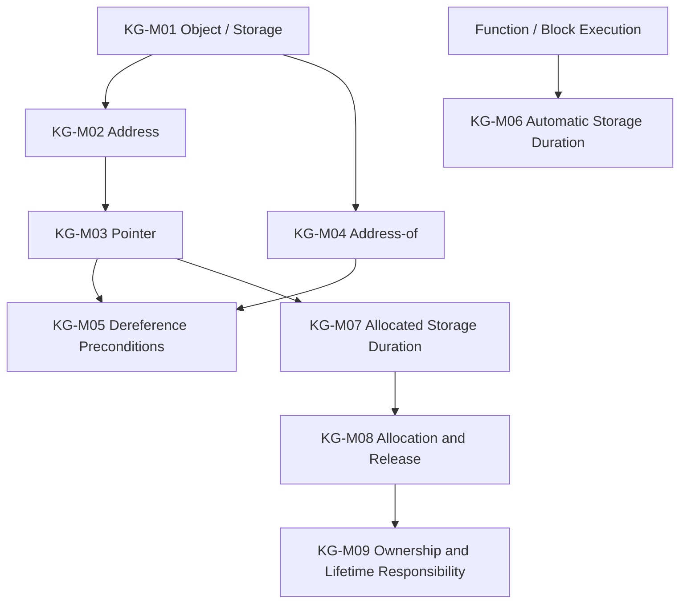
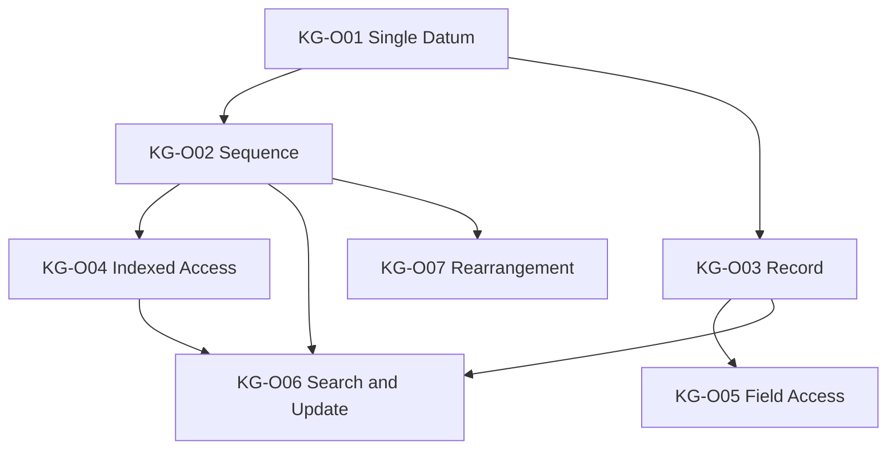
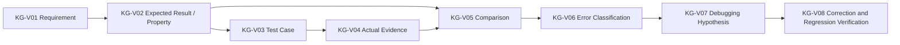
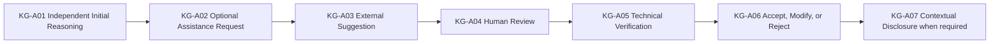

# Programming Language Knowledge Dependency Graph

Version: 0.1.1  
Status: Revisable planning and traceability model  
Authority: The Constitution and official learning/assessment policy take precedence over this document  
Corresponding Chinese version: [程式語言知識依賴圖](04-programming-language-knowledge-graph.zh-TW.md)

## Document Purpose

This document models major prerequisite and supporting relationships for understanding core C programming concepts.

It does not answer “Which concepts exist in the programming domain?” That question is handled by the [Programming Domain Model](03-programming-domain-model.en.md). This file focuses on four questions:

1. What concepts are usually helpful or necessary before another concept?
2. Which dependencies are strong, supporting, or cross-cutting?
3. Which concepts may develop in parallel?
4. Which mental models should exist before syntax is treated as more than memorization?

This document is not a weekly schedule, textbook outline, scope decision, grading rule, or governing source. Later competency, scope, delivery, and material documents may reference it, but its arrows do not define one mandatory teaching sequence.

## Constitution 2.0 Alignment

- Establish purpose and mental models before syntax when doing so improves understanding.
- Use the same nodes, identifiers, dependency meanings, status, and version in both language versions.
- Visualize important dependencies while documenting technical caveats in prose.
- Treat testing, debugging, and verification as cross-cutting programming capabilities.
- AI and other external tools are optional by default. Verification duties apply conditionally when a learner actually adopts external assistance.
- Do not presume that a particular advanced data structure, AI activity, or tool belongs in the required course core merely because it appears in a planning model.

## Dependency Types

| Type | Meaning |
|---|---|
| Strong dependency | Without the prerequisite, the later concept is likely to become rote memorization or an incorrect mental model. |
| Supporting dependency | Not always required, but usually reduces difficulty or improves reasoning. |
| Cross-cutting dependency | A capability that should recur across many topics, such as testing, debugging, and verification. |
| Conditional dependency | Applies only when the corresponding optional activity or tool is actually used. |

## First-Level Dependency Architecture

---

## KG-E: Program Translation and Execution

The graph below is a conceptual teaching model of common translation responsibilities, not a guarantee that every C implementation exposes each stage or intermediate artifact separately.

```mermaid
flowchart LR
    E01[KG-E01 Source Code] --> E02[KG-E02 Preprocessing Behavior]
    E02 --> E03[KG-E03 Compilation / Translation]
    E03 --> E04[KG-E04 Intermediate / Object Generation]
    E04 --> E05[KG-E05 Linkable Representation when applicable]
    E05 --> E06[KG-E06 Linking when applicable]
    E06 --> E07[KG-E07 Loadable Program Image]
    E07 --> E08[KG-E08 Loading / Startup and Running Program]
    E08 --> E09[KG-E09 CPU Execution and State Change]
```

| Node | Main dependencies | Rationale |
|---|---|---|
| KG-E01 Source code | None | Human-readable program text is the visible starting point for most learning activities. |
| KG-E02 Preprocessing behavior | KG-E01 | Learners should understand that directives and macro replacement participate in C translation even when no standalone preprocessor is visible. |
| KG-E03 Compilation / translation | KG-E01, KG-E02 | The implementation translates a preprocessing translation unit toward lower-level or executable form; stages may be fused internally. |
| KG-E04 Intermediate / object generation | KG-E03 | Common native toolchains may emit assembly or object code, but a standalone assembly file or step is not guaranteed. |
| KG-E05 Linkable representation | KG-E04 | A native toolchain often produces separately linkable output, but the specific artifact and format are implementation-dependent. |
| KG-E06 Linking | KG-E05 | Where separate linkage exists, learners need the ideas of external definitions, libraries, and symbol resolution. |
| KG-E07 Loadable program image | KG-E06 or implementation-equivalent translation result | The output must be something the target environment can load or otherwise execute. |
| KG-E08 Loading / startup and running program | KG-E07 | Learners should distinguish program representation from execution state. |
| KG-E09 CPU execution and state change | KG-E08, KG-D03 | Execution must connect to observable state changes. |

Concrete materials must use the actual target toolchain's commands, diagnostics, and artifacts. The C standard does not require a fixed physical pipeline of standalone preprocessor, compiler, assembler, and linker programs.

---

## KG-D: Data and State

| Node | Main dependencies | Rationale |
|---|---|---|
| KG-D01 Value | KG-E09 | Program execution processes concrete information. |
| KG-D02 Type | KG-D01 | Types constrain representation, range, and operations. |
| KG-D03 Variable and state | KG-D01, KG-D02 | A variable is a named object whose value may participate in program state. |
| KG-D04 Operator | KG-D01, KG-D02 | Valid operations depend on values and types. |
| KG-D05 Expression | KG-D03, KG-D04 | Expressions combine values, names, and operators. |
| KG-D06 Assignment and state update | KG-D03, KG-D05 | Learners must distinguish evaluating a value from updating an object. |
| KG-D07 Input and output | KG-D03, KG-D06 | External data can enter or leave program state. |
| KG-D08 Scope | KG-D03, KG-F03 | Name visibility is most useful when related to blocks and functions. |
| KG-D09 Lifetime | KG-D03, KG-D08, KG-M01 | Learners must distinguish name visibility from object existence. |

---

## KG-C: Flow and Control

| Node | Main dependencies | Rationale |
|---|---|---|
| KG-C01 Sequential execution | KG-D06 | First understand how actions change state over time. |
| KG-C02 Condition evaluation | KG-D05, KG-C01 | A condition is an evaluable expression interpreted for control. |
| KG-C03 Selection | KG-C02 | Chooses an execution path from a condition. |
| KG-C04 Repetition | KG-C02, KG-D03 | Repetition requires a continuation decision and evolving state. |
| KG-C05 Loop-state update | KG-C04, KG-D06 | Each iteration should have an explainable state change. |
| KG-C06 Termination condition | KG-C04, KG-C05 | Learners must reason about when repetition stops. |
| KG-C07 Combined flow | KG-C03, KG-C04 | Composite control builds on selection and repetition. |

---

## KG-F: Functions and Abstraction

| Node | Main dependencies | Rationale |
|---|---|---|
| KG-F01 Problem and responsibility | KG-D07, KG-C03 | First describe input, processing, output, and responsibility. |
| KG-F02 Decomposition | KG-F01 | Decomposition divides a larger responsibility into smaller ones. |
| KG-F03 Function | KG-F02 | A function is a language mechanism for organizing responsibility. |
| KG-F04 Interface | KG-F03 | Once functions exist, use can be separated from implementation. |
| KG-F05 Parameter | KG-F04, KG-D02 | A parameter is typed input to a function interface. |
| KG-F06 Return value | KG-F04, KG-D02 | A return value is typed output from a function interface. |
| KG-F07 Call | KG-F03, KG-F05, KG-F06 | A call transfers control and data according to the language and ABI implementation. |
| KG-F08 Call stack / activation model | KG-F07, KG-M01 | A stack is a common implementation model, but materials should distinguish language semantics from a specific runtime implementation. |
| KG-F09 Modularization | KG-F03, KG-F04 | Modularization depends on clear responsibilities and interfaces. |

---

## KG-M: Memory Model

| Node | Main dependencies | Rationale |
|---|---|---|
| KG-M01 Object / storage | KG-D03 | First distinguish a name, value, object, and storage. |
| KG-M02 Address | KG-M01 | An address identifies or represents access to storage. |
| KG-M03 Pointer | KG-M02, KG-D02 | A pointer has a type and can hold an address-compatible or null pointer value. |
| KG-M04 Address-of | KG-M01, KG-M02 | Address-of connects an eligible object or function to a pointer value. |
| KG-M05 Dereference preconditions | KG-M03, KG-M04 | Learners must reason about validity, lifetime, object bounds, and operation preconditions before access. |
| KG-M06 Automatic storage duration | KG-F07, KG-D09 | Relates lifetime to block execution and function calls without assuming one physical stack representation. |
| KG-M07 Allocated storage duration | KG-M03, KG-D09 | Requires pointer and lifetime reasoning. |
| KG-M08 Allocation and release | KG-M07, KG-V03 | Requires success/failure handling, size reasoning, and verification. |
| KG-M09 Ownership and lifetime responsibility | KG-M08, KG-D09 | Requires explaining who may use or release a resource and when it becomes invalid. |

---

## KG-O: Data Organization

This group stays at the abstraction level needed for general programming. It does not preselect linked lists, trees, heaps, hash structures, or graphs as course-core content.

| Node | Main dependencies | Rationale |
|---|---|---|
| KG-O01 Single datum | KG-D03 | Collections are built from individual data objects or values. |
| KG-O02 Sequence | KG-O01, KG-C04 | Requires item-by-item processing and repetition. |
| KG-O03 Record | KG-D02, KG-F01 | Groups fields describing one entity. |
| KG-O04 Indexed access | KG-O02, KG-D05 | An index is an expression used to locate a sequence element under valid bounds. |
| KG-O05 Field access | KG-O03 | Requires the record-field relationship. |
| KG-O06 Search and update | KG-O02 or KG-O03, KG-C04 | Requires item inspection, conditions, and state updates. |
| KG-O07 Rearrangement | KG-O02, KG-C07 | Requires comparison, exchange or movement, and repetition. |

---

## KG-V: Testing, Debugging, and Verification

| Node | Main dependencies | Rationale |
|---|---|---|
| KG-V01 Requirement | None | Verification begins with a definition of intended behavior or constraints. |
| KG-V02 Expected result / property | KG-V01 | Derive a reasonable expectation before observing the implementation. |
| KG-V03 Test case | KG-V02, topic knowledge | Makes inputs, conditions, and expectations concrete. |
| KG-V04 Actual evidence | KG-E03 or KG-E09 as appropriate | Evidence may include diagnostics, execution, output, state traces, or inspection. |
| KG-V05 Comparison | KG-V02, KG-V04 | Uses evidence to judge conformance. |
| KG-V06 Error classification | KG-V05, relevant topic knowledge | Distinguishes translation/build, runtime/precondition, logic, and requirement problems. |
| KG-V07 Debugging hypothesis | KG-V06 | Forms a testable cause from evidence. |
| KG-V08 Correction and regression verification | KG-V07, KG-V03 | A correction must be retested against prior and newly relevant cases. |

---

## KG-A: Optional External Assistance

This branch is conditional. Students who do not use AI or another external tool do not need to traverse it and are not missing programming capability.

| Node | Main dependencies | Rationale |
|---|---|---|
| KG-A01 Independent initial reasoning | Relevant topic knowledge | The learner should form an initial understanding, expectation, or diagnosis rather than treating tool output as authoritative. |
| KG-A02 Optional assistance request | KG-A01 | Tool use is elective unless a specific approved activity explicitly targets tool judgment. |
| KG-A03 External suggestion | KG-A02 | AI or another tool may provide a hint, explanation, code idea, or test perspective, but the result is non-authoritative. |
| KG-A04 Human review | KG-A03, relevant topic knowledge | The learner checks relevance, assumptions, and limitations. |
| KG-A05 Technical verification | KG-A04, KG-V | Adopted technical claims must be supported by reproducible evidence. |
| KG-A06 Accept, modify, or reject | KG-A05 | The learner remains responsible for the adopted result. |
| KG-A07 Contextual disclosure | KG-A06 | Records or explanation are required only when a specific activity, academic-integrity rule, or assessment condition calls for them; non-use requires no declaration. |

## Usage Principles

1. This graph is a revisable planning and traceability model, not a policy source.
2. It describes major dependencies, not one legal learning path.
3. Materials may split nodes or develop supporting dependencies in parallel to control cognitive load.
4. A new concept should first be defined in the domain model and then connected here through dependencies.
5. Scope decisions determine whether a concept belongs in the preparatory or formal course.
6. Optional external-assistance nodes must remain conditional and must not be used to infer mandatory AI use or mandatory AI records.
7. Concrete implementation claims must be checked against the specified C standard, compiler, operating environment, and reproducible evidence when those details matter.

## Related Documents

- [Programming Domain Model](03-programming-domain-model.en.md)
- [Programming Competency Map](05-competency-map.en.md)
- [Scope Boundary](06-scope-boundary.en.md)
- [Official Learning and Assessment Policy](13-learning-assessment-policy.en.md)
- [Instructional Design Workspace](README.en.md)
- [繁體中文版](04-programming-language-knowledge-graph.zh-TW.md)
