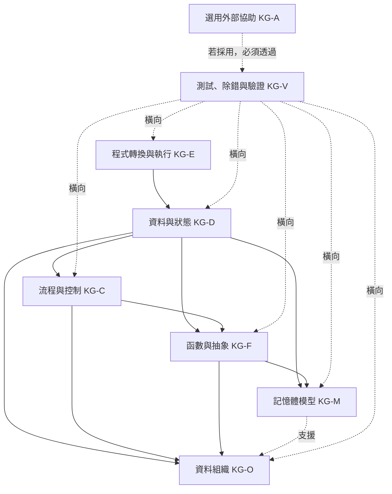
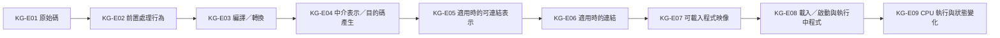
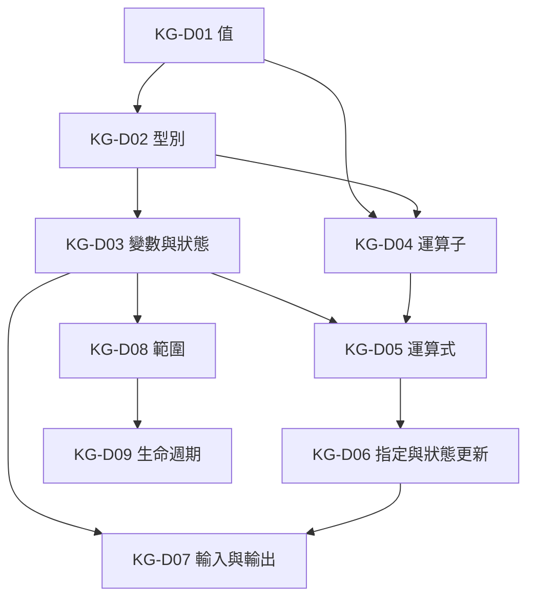
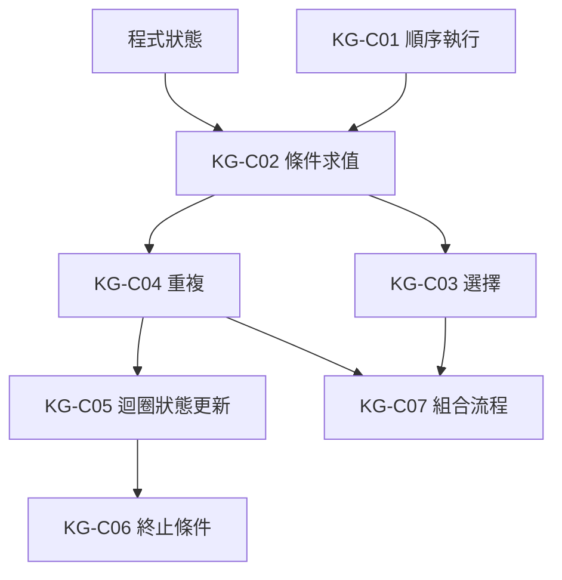
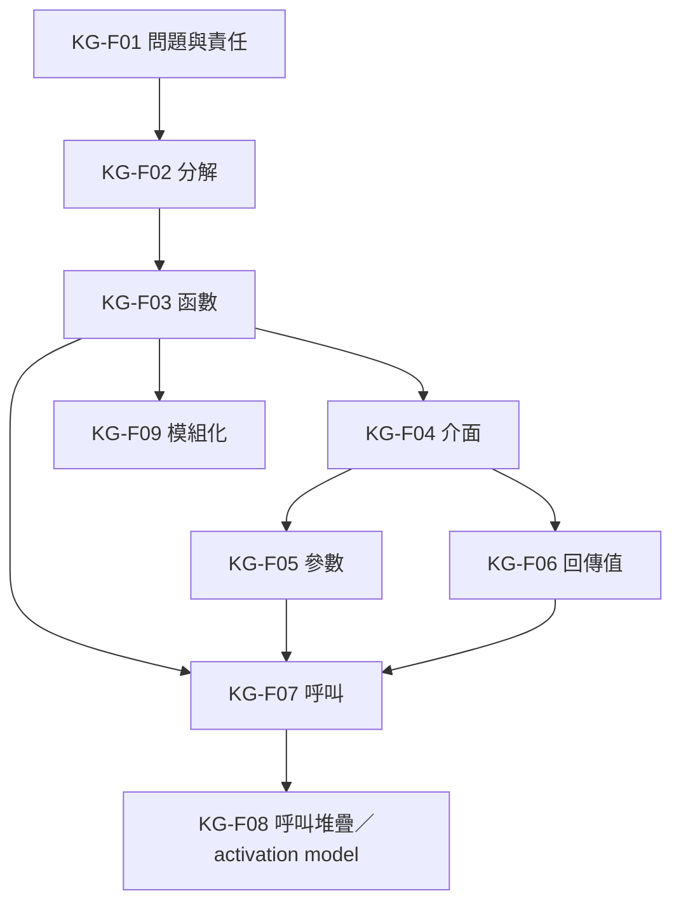
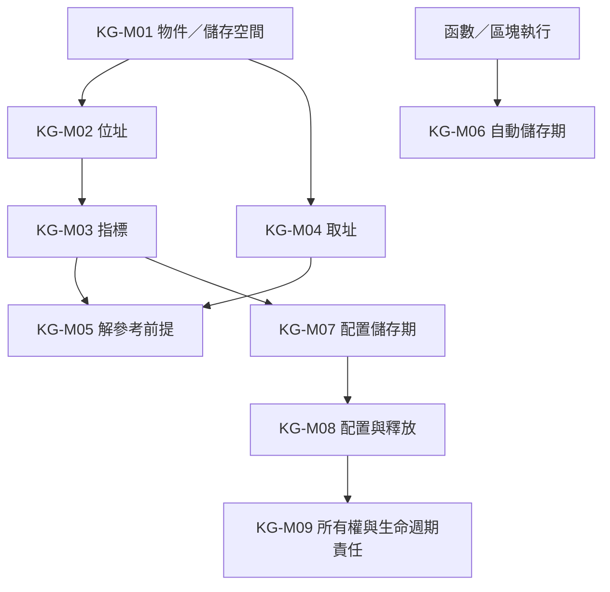
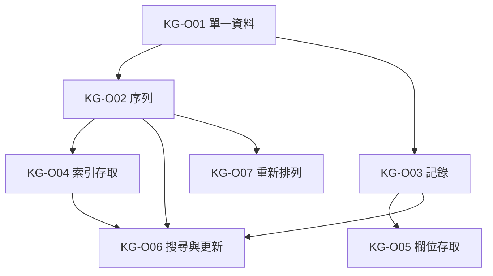
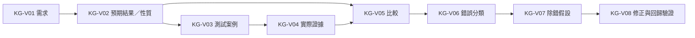
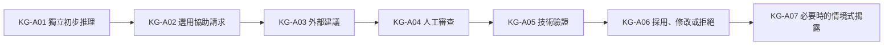

# 程式語言知識依賴圖

版本：0.1.1  
狀態：可修訂的規劃與追蹤模型  
權威關係：若與 Constitution 或正式學習與評量制度衝突，以上位文件為準  
對應英文版本：[Programming Language Knowledge Dependency Graph](04-programming-language-knowledge-graph.en.md)

## 文件目的

本文件建模理解 C 程式設計核心概念時的主要先備與支援依賴。

它不回答「程式設計領域有哪些概念」，該問題由[程式設計領域模型](03-programming-domain-model.zh-TW.md)處理；本文件聚焦四個問題：

1. 要理解某概念，通常哪些概念有幫助或屬必要條件？
2. 哪些依賴是強依賴、支援依賴、橫向依賴或條件式依賴？
3. 哪些概念可以平行發展？
4. 哪些心智模型應在語法被當成死背規則之前先建立？

本文件不是週次表、教材章節、範圍決策、評分規則或治理來源。後續能力、範圍、交付與教材文件可引用本圖，但其中的箭頭不得被視為唯一且強制的授課順序。

## Constitution 2.0 對齊原則

- 當有助於理解時，先建立存在理由與心智模型，再介紹語法。
- 中文版與英文版使用相同節點、識別碼、依賴意義、狀態與版本。
- 重要依賴以圖形呈現，技術例外與實作邊界則以文字說明。
- 測試、除錯與驗證是跨主題的程式設計能力。
- AI 與其他外部工具預設為選用；只有在學生實際採用外部協助時，驗證責任才以條件式方式適用。
- 不因某個進階資料結構、AI 活動或工具出現在規劃模型中，就推定它屬於必修核心。

## 依賴關係類型

| 類型 | 意義 |
|---|---|
| 強依賴 | 若缺少前置概念，後續概念容易變成死背或形成錯誤心智模型。 |
| 支援依賴 | 不一定必要，但通常能降低難度或改善推理品質。 |
| 橫向依賴 | 應在多個主題持續發展的能力，例如測試、除錯與驗證。 |
| 條件式依賴 | 只有在對應的選用活動或工具實際被使用時才適用。 |

## 第一層依賴架構

---

## KG-E：程式轉換與執行

下圖是常見轉換責任的概念教學模型，不保證所有 C 實作都將每個階段或中介產物分開呈現。

| 節點 | 主要依賴 | 理由 |
|---|---|---|
| KG-E01 原始碼 | 無 | 人類可閱讀的程式文字是多數學習活動的可見起點。 |
| KG-E02 前置處理行為 | KG-E01 | 即使沒有獨立可見的 preprocessor，也要理解指令與巨集替換屬於 C 翻譯行為的一部分。 |
| KG-E03 編譯／轉換 | KG-E01、KG-E02 | 實作會把 translation unit 轉向較低階或可執行表示；內部階段可能合併。 |
| KG-E04 中介表示／目的碼產生 | KG-E03 | 常見原生工具鏈可能產生組合語言或目的碼，但不保證有獨立 assembly 檔案或階段。 |
| KG-E05 可連結表示 | KG-E04 | 原生工具鏈常有可分別連結的輸出，但實際產物與格式依實作而異。 |
| KG-E06 連結 | KG-E05 | 若存在獨立連結，學生需要理解外部定義、函式庫與符號解析。 |
| KG-E07 可載入程式映像 | KG-E06 或實作等價的轉換結果 | 輸出最終必須能由目標環境載入或以其他方式執行。 |
| KG-E08 載入／啟動與執行中程式 | KG-E07 | 需要區分程式表示與執行狀態。 |
| KG-E09 CPU 執行與狀態變化 | KG-E08、KG-D03 | 執行必須與可觀察的程式狀態變化連結。 |

具體教材必須使用指定目標工具鏈的實際命令、診斷與產物。C 標準並不要求固定的一套獨立 preprocessor、compiler、assembler 與 linker 程式。

---

## KG-D：資料與狀態

| 節點 | 主要依賴 | 理由 |
|---|---|---|
| KG-D01 值 | KG-E09 | 程式執行處理具體資訊。 |
| KG-D02 型別 | KG-D01 | 型別約束表示、範圍與操作。 |
| KG-D03 變數與狀態 | KG-D01、KG-D02 | 變數是具名稱的物件，其值可參與程式狀態。 |
| KG-D04 運算子 | KG-D01、KG-D02 | 操作是否合法取決於值與型別。 |
| KG-D05 運算式 | KG-D03、KG-D04 | 運算式由值、名稱與運算子組成。 |
| KG-D06 指定與狀態更新 | KG-D03、KG-D05 | 必須區分求值與更新物件。 |
| KG-D07 輸入與輸出 | KG-D03、KG-D06 | 外部資料可以進入或離開程式狀態。 |
| KG-D08 範圍 | KG-D03、KG-F03 | 名稱可見性在與區塊及函數連結時最容易理解。 |
| KG-D09 生命週期 | KG-D03、KG-D08、KG-M01 | 必須區分名稱可見性與物件存在時間。 |

---

## KG-C：流程與控制

| 節點 | 主要依賴 | 理由 |
|---|---|---|
| KG-C01 順序執行 | KG-D06 | 先理解動作如何隨時間改變狀態。 |
| KG-C02 條件求值 | KG-D05、KG-C01 | 條件是被用於控制判斷的可求值運算式。 |
| KG-C03 選擇 | KG-C02 | 根據條件選擇執行路徑。 |
| KG-C04 重複 | KG-C02、KG-D03 | 重複需要持續判斷與可演變狀態。 |
| KG-C05 迴圈狀態更新 | KG-C04、KG-D06 | 每次迭代都應能解釋狀態如何變化。 |
| KG-C06 終止條件 | KG-C04、KG-C05 | 必須能推理重複何時停止。 |
| KG-C07 組合流程 | KG-C03、KG-C04 | 複合控制建立在選擇與重複之上。 |

---

## KG-F：函數與抽象

| 節點 | 主要依賴 | 理由 |
|---|---|---|
| KG-F01 問題與責任 | KG-D07、KG-C03 | 先描述輸入、處理、輸出與責任。 |
| KG-F02 分解 | KG-F01 | 分解把較大責任拆成較小責任。 |
| KG-F03 函數 | KG-F02 | 函數是組織責任的一種語言機制。 |
| KG-F04 介面 | KG-F03 | 函數存在後，才能區分使用方式與內部實作。 |
| KG-F05 參數 | KG-F04、KG-D02 | 參數是函數介面中的具型別輸入。 |
| KG-F06 回傳值 | KG-F04、KG-D02 | 回傳值是函數介面中的具型別輸出。 |
| KG-F07 呼叫 | KG-F03、KG-F05、KG-F06 | 呼叫依語言與 ABI 實作規則移交控制與資料。 |
| KG-F08 呼叫堆疊／activation model | KG-F07、KG-M01 | Stack 是常見實作模型，但教材應區分語言語意與特定 runtime 實作。 |
| KG-F09 模組化 | KG-F03、KG-F04 | 模組化建立在清楚責任與介面之上。 |

---

## KG-M：記憶體模型

| 節點 | 主要依賴 | 理由 |
|---|---|---|
| KG-M01 物件／儲存空間 | KG-D03 | 先區分名稱、值、物件與儲存空間。 |
| KG-M02 位址 | KG-M01 | 位址用來識別或表示對儲存位置的存取。 |
| KG-M03 指標 | KG-M02、KG-D02 | 指標具有型別，並可保存相容位址或 null pointer value。 |
| KG-M04 取址 | KG-M01、KG-M02 | 取址把符合條件的物件或函數連結到指標值。 |
| KG-M05 解參考前提 | KG-M03、KG-M04 | 存取前必須推理有效性、生命週期、物件邊界與操作前提。 |
| KG-M06 自動儲存期 | KG-F07、KG-D09 | 將生命週期與區塊執行及函數呼叫連結，不假設唯一的實體 stack 表示。 |
| KG-M07 配置儲存期 | KG-M03、KG-D09 | 需要指標與生命週期推理。 |
| KG-M08 配置與釋放 | KG-M07、KG-V03 | 需要成功／失敗處理、大小推理與驗證。 |
| KG-M09 所有權與生命週期責任 | KG-M08、KG-D09 | 必須能解釋誰可以使用或釋放資源，以及資源何時失效。 |

---

## KG-O：資料組織

本群組維持在一般程式設計所需的抽象層，不預先指定鏈結串列、樹、Heap、Hash 或圖等進階資料結構為課程核心。

| 節點 | 主要依賴 | 理由 |
|---|---|---|
| KG-O01 單一資料 | KG-D03 | 集合建立在個別資料物件或值之上。 |
| KG-O02 序列 | KG-O01、KG-C04 | 需要逐項處理與重複。 |
| KG-O03 記錄 | KG-D02、KG-F01 | 將描述同一實體的欄位組合。 |
| KG-O04 索引存取 | KG-O02、KG-D05 | 索引是用來在有效邊界內定位序列元素的運算式。 |
| KG-O05 欄位存取 | KG-O03 | 必須先理解記錄與欄位關係。 |
| KG-O06 搜尋與更新 | KG-O02 或 KG-O03、KG-C04 | 需要逐項檢查、條件與狀態更新。 |
| KG-O07 重新排列 | KG-O02、KG-C07 | 需要比較、交換或移動，以及重複。 |

---

## KG-V：測試、除錯與驗證

| 節點 | 主要依賴 | 理由 |
|---|---|---|
| KG-V01 需求 | 無 | 驗證從定義預期行為或限制開始。 |
| KG-V02 預期結果／性質 | KG-V01 | 在觀察實作前先推導合理預期。 |
| KG-V03 測試案例 | KG-V02、相關主題知識 | 將輸入、條件與預期具體化。 |
| KG-V04 實際證據 | 視情況依 KG-E03 或 KG-E09 | 證據可以是診斷、執行、輸出、狀態追蹤或檢查結果。 |
| KG-V05 比較 | KG-V02、KG-V04 | 以證據判斷是否符合需求。 |
| KG-V06 錯誤分類 | KG-V05、相關主題知識 | 區分翻譯／建置、執行期／前提、邏輯與需求問題。 |
| KG-V07 除錯假設 | KG-V06 | 根據證據提出可驗證的可能原因。 |
| KG-V08 修正與回歸驗證 | KG-V07、KG-V03 | 修正後必須重測既有案例與新出現的相關案例。 |

---

## KG-A：選用外部協助

本分支是條件式的。不使用 AI 或其他外部工具的學生不需要經過此分支，也不因此缺少程式能力。

| 節點 | 主要依賴 | 理由 |
|---|---|---|
| KG-A01 獨立初步推理 | 相關主題知識 | 學生應先形成自己的理解、預期或診斷，不把工具輸出當成權威答案。 |
| KG-A02 選用協助請求 | KG-A01 | 工具使用預設為選用，除非某個經核准的活動明確把工具判斷本身設為學習目標。 |
| KG-A03 外部建議 | KG-A02 | AI 或其他工具可能提供提示、解釋、程式想法或測試觀點，但結果不具權威性。 |
| KG-A04 人工審查 | KG-A03、相關主題知識 | 學生檢查建議的相關性、假設與限制。 |
| KG-A05 技術驗證 | KG-A04、KG-V | 被採用的技術主張必須有可重現證據支持。 |
| KG-A06 採用、修改或拒絕 | KG-A05 | 學生對最終採用結果負責。 |
| KG-A07 情境式揭露 | KG-A06 | 只有在特定活動、學術誠信規則或評量條件要求時才需要紀錄或說明；未使用時不需提出未使用聲明。 |

## 使用原則

1. 本圖是可修訂的規劃與追蹤模型，不是政策來源。
2. 本圖描述主要依賴，不宣稱只有一條合法學習路徑。
3. 教材可依認知負荷拆分節點，或平行發展支援依賴。
4. 新增概念時，應先在領域模型中定義，再於本圖連結其依賴。
5. 是否納入前導或正式課程，由範圍文件決定。
6. 選用外部協助節點必須維持條件式，不得據此推定 AI 必用或 AI 紀錄必交。
7. 具體實作敘述在細節重要時，必須依指定 C 標準、編譯器、作業環境與可重現證據檢查。

## 相關文件

- [程式設計領域模型](03-programming-domain-model.zh-TW.md)
- [程式設計能力地圖](05-competency-map.zh-TW.md)
- [範圍邊界](06-scope-boundary.zh-TW.md)
- [正式學習與評量制度](13-learning-assessment-policy.zh-TW.md)
- [教學內容設計區](README.zh-TW.md)
- [English version](04-programming-language-knowledge-graph.en.md)
