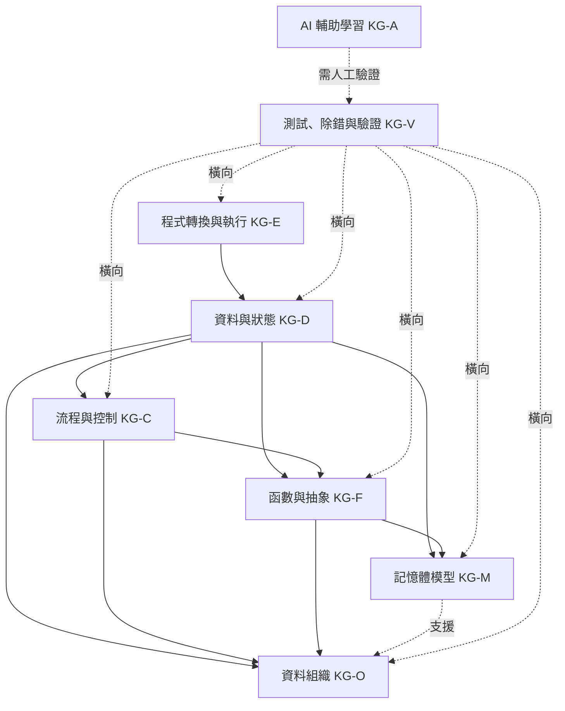
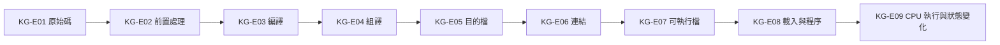
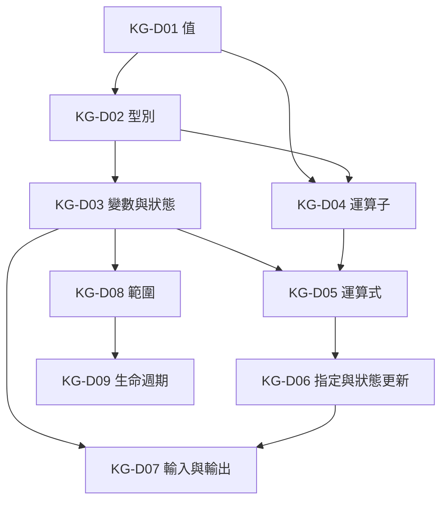
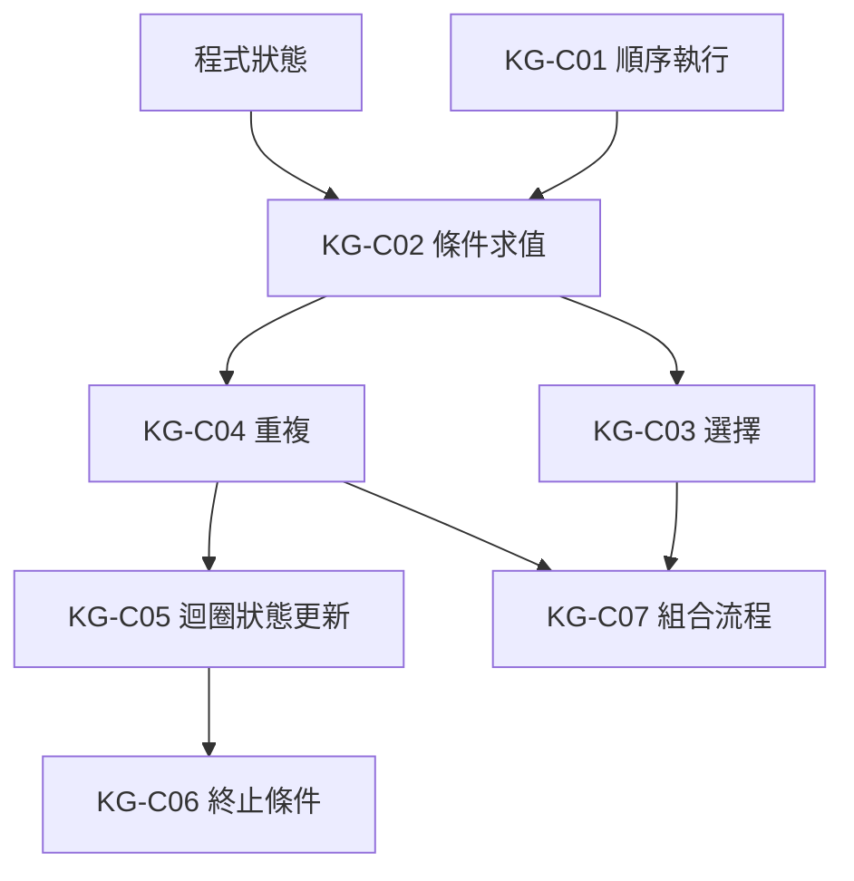
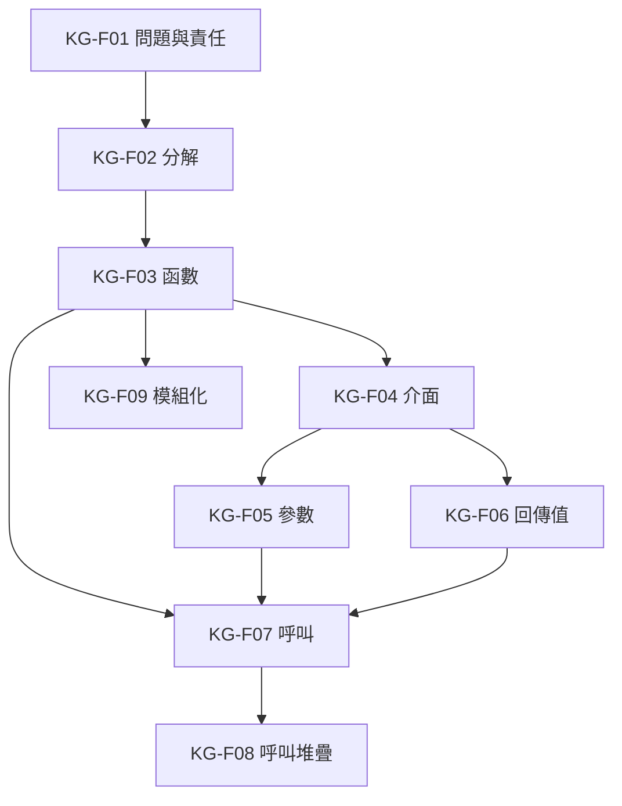
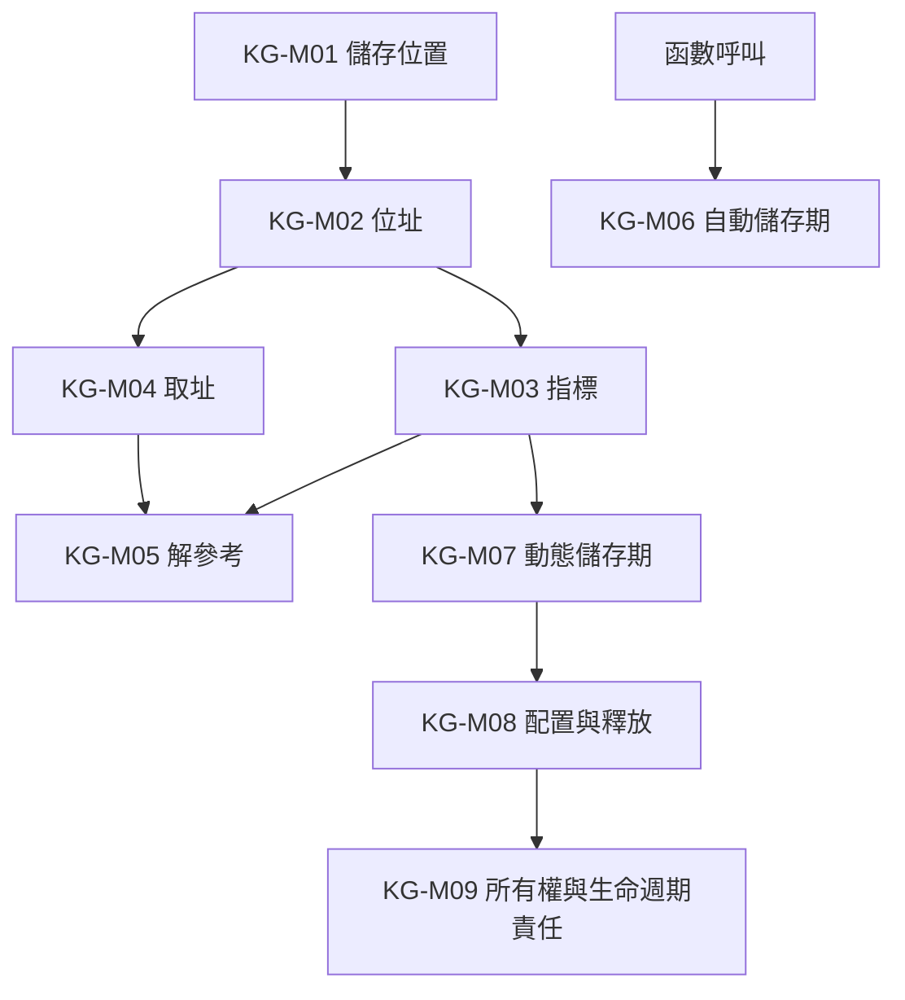
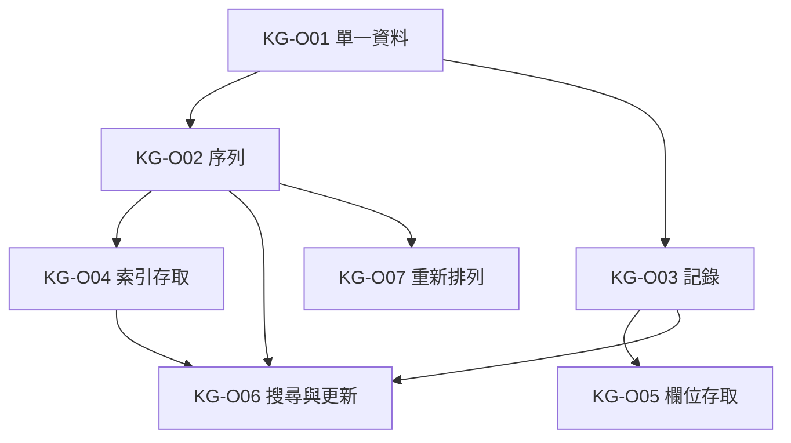
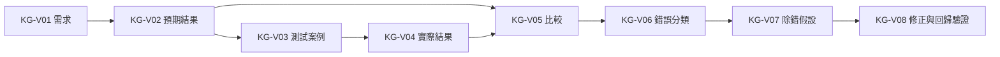
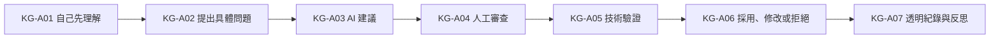

# 程式語言知識依賴圖

版本：0.1.0  
狀態：架構草案  
對應英文版本：[Programming Language Knowledge Dependency Graph](04-programming-language-knowledge-graph.en.md)

## 文件目的

本文件定義理解 C 程式設計核心概念時的主要先備知識與依賴關係。

它不回答「程式設計領域有哪些概念」，該問題由[程式設計領域模型](03-programming-domain-model.zh-TW.md)回答；本文件只回答：

1. 要理解某個概念，通常需要先理解哪些概念？
2. 哪些依賴是強依賴，哪些只是有助理解的支援依賴？
3. 哪些概念可以平行發展？
4. 哪些知識必須先建立心智模型，才能避免語法死背？

本文件不是週次表、教材章節或課程範圍決策。後續能力地圖、範圍邊界、課程節奏與教材可參考本圖，但不得把依賴箭頭直接視為唯一授課順序。

## 憲法遵循

- 先建立存在理由與語言邏輯，再介紹語法。
- 中文版與英文版使用相同節點、識別碼與依賴。
- 可視覺化的依賴關係以 Mermaid 呈現。
- 測試、除錯、驗證與 AI 判斷是橫向依賴，不應被留到課程末端。
- 本文件不預設任何進階資料結構必須納入正式課程。

## 依賴關係類型

| 類型 | 意義 |
|---|---|
| 強依賴 | 若缺少前置概念，後續概念容易形成錯誤心智模型或只能死背。 |
| 支援依賴 | 不一定是必要條件，但能顯著降低理解難度。 |
| 橫向依賴 | 應在多個主題中持續發展，例如測試、除錯、視覺化與 AI 驗證。 |

## 第一層依賴架構

---

## KG-E：程式轉換與執行

| 節點 | 主要依賴 | 理由 |
|---|---|---|
| KG-E01 原始碼 | 無 | 程式設計活動的可閱讀起點。 |
| KG-E02 前置處理 | KG-E01 | 必須先理解原始碼與 `#` 指令屬於建置流程的一部分。 |
| KG-E03 編譯 | KG-E01、KG-E02 | 需要先知道編譯器接收的是前置處理後的程式。 |
| KG-E04 組譯 | KG-E03 | 需要先理解編譯產生較低階表示。 |
| KG-E05 目的檔 | KG-E04 | 目的檔是組譯結果，而非完整可執行程式。 |
| KG-E06 連結 | KG-E05 | 先理解目的檔與外部符號，才能理解連結責任。 |
| KG-E07 可執行檔 | KG-E06 | 可執行檔是連結後的程式映像。 |
| KG-E08 載入與程序 | KG-E07 | 先區分「檔案」與「執行中的程序」。 |
| KG-E09 CPU 執行與狀態變化 | KG-E08、KG-D03 | 執行必須連結到資料與狀態改變。 |

---

## KG-D：資料與狀態

| 節點 | 主要依賴 | 理由 |
|---|---|---|
| KG-D01 值 | KG-E09 | 程式執行處理的是具體資訊。 |
| KG-D02 型別 | KG-D01 | 型別約束值的表示、範圍與操作。 |
| KG-D03 變數與狀態 | KG-D01、KG-D02 | 變數是具型別且可改變的具名狀態。 |
| KG-D04 運算子 | KG-D01、KG-D02 | 操作是否合法取決於值與型別。 |
| KG-D05 運算式 | KG-D03、KG-D04 | 運算式由值、變數與運算子組成。 |
| KG-D06 指定與狀態更新 | KG-D03、KG-D05 | 必須先區分求值與寫回狀態。 |
| KG-D07 輸入與輸出 | KG-D03、KG-D06 | 外部資料進入或離開程式狀態。 |
| KG-D08 範圍 | KG-D03、KG-F03 | 名稱可見性通常在函數與區塊中理解。 |
| KG-D09 生命週期 | KG-D03、KG-D08、KG-M01 | 必須區分名稱可見與物件存在時間。 |

---

## KG-C：流程與控制

| 節點 | 主要依賴 | 理由 |
|---|---|---|
| KG-C01 順序執行 | KG-D06 | 先理解敘述如何依序改變狀態。 |
| KG-C02 條件求值 | KG-D05、KG-C01 | 條件本質上是可求值的運算式。 |
| KG-C03 選擇 | KG-C02 | 根據條件選擇執行路徑。 |
| KG-C04 重複 | KG-C02、KG-D03 | 重複需要條件與可改變狀態。 |
| KG-C05 迴圈狀態更新 | KG-C04、KG-D06 | 每次迭代必須能解釋狀態如何改變。 |
| KG-C06 終止條件 | KG-C04、KG-C05 | 必須理解重複何時停止。 |
| KG-C07 組合流程 | KG-C03、KG-C04 | 複合控制建立在基本選擇與重複之上。 |

---

## KG-F：函數與抽象

| 節點 | 主要依賴 | 理由 |
|---|---|---|
| KG-F01 問題與責任 | KG-D07、KG-C03 | 先能描述輸入、處理與輸出責任。 |
| KG-F02 分解 | KG-F01 | 分解是把較大責任拆成較小責任。 |
| KG-F03 函數 | KG-F02 | 函數是責任分解的語言機制。 |
| KG-F04 介面 | KG-F03 | 函數存在後，才能區分使用方式與內部實作。 |
| KG-F05 參數 | KG-F04、KG-D02 | 參數是介面中具型別的輸入。 |
| KG-F06 回傳值 | KG-F04、KG-D02 | 回傳值是介面中具型別的輸出。 |
| KG-F07 呼叫 | KG-F03、KG-F05、KG-F06 | 呼叫涉及控制與資料移交。 |
| KG-F08 呼叫堆疊 | KG-F07、KG-M01 | 需要先建立函數呼叫與儲存位置概念。 |
| KG-F09 模組化 | KG-F03、KG-F04 | 模組化建立在清楚責任與介面之上。 |

---

## KG-M：記憶體模型

| 節點 | 主要依賴 | 理由 |
|---|---|---|
| KG-M01 儲存位置 | KG-D03 | 先區分變數名稱、值與資料實體。 |
| KG-M02 位址 | KG-M01 | 位址用來識別儲存位置。 |
| KG-M03 指標 | KG-M02、KG-D02 | 指標是保存位址的具型別變數。 |
| KG-M04 取址 | KG-M01、KG-M02 | 取址建立物件與位址之間的關係。 |
| KG-M05 解參考 | KG-M03、KG-M04 | 必須先理解指標保存的是位址。 |
| KG-M06 自動儲存期 | KG-F07、KG-D09 | 與函數呼叫和生命週期相關。 |
| KG-M07 動態儲存期 | KG-M03、KG-D09 | 需要指標與生命週期模型。 |
| KG-M08 配置與釋放 | KG-M07、KG-V03 | 必須同時理解操作與失敗驗證。 |
| KG-M09 所有權與生命週期責任 | KG-M08、KG-D09 | 需要能說明誰負責釋放以及何時失效。 |

---

## KG-O：資料組織

本群組維持在一般程式設計所需的抽象層，不預先指定鏈結串列、樹、Heap、Hash 或圖等進階資料結構為課程核心。

| 節點 | 主要依賴 | 理由 |
|---|---|---|
| KG-O01 單一資料 | KG-D03 | 資料集合建立在單一資料物件之上。 |
| KG-O02 序列 | KG-O01、KG-C04 | 需要逐項處理與重複模型。 |
| KG-O03 記錄 | KG-D02、KG-F01 | 將描述同一實體的欄位組合。 |
| KG-O04 索引存取 | KG-O02、KG-D05 | 索引是用來定位序列元素的運算式。 |
| KG-O05 欄位存取 | KG-O03 | 必須先理解記錄與欄位關係。 |
| KG-O06 搜尋與更新 | KG-O02 或 KG-O03、KG-C04 | 需要逐項檢查、條件與狀態更新。 |
| KG-O07 重新排列 | KG-O02、KG-C07 | 需要組合比較、交換與重複。 |

---

## KG-V：測試、除錯與驗證

| 節點 | 主要依賴 | 理由 |
|---|---|---|
| KG-V01 需求 | 無 | 驗證必須先知道正確行為是什麼。 |
| KG-V02 預期結果 | KG-V01 | 執行前先推導合理結果。 |
| KG-V03 測試案例 | KG-V02、相關主題知識 | 測試需具體化輸入、條件與預期。 |
| KG-V04 實際結果 | KG-E09 | 必須能執行並觀察程式。 |
| KG-V05 比較 | KG-V02、KG-V04 | 以證據判斷是否符合需求。 |
| KG-V06 錯誤分類 | KG-V05、KG-E03 | 區分建置、執行與邏輯問題。 |
| KG-V07 除錯假設 | KG-V06 | 根據證據提出可驗證原因。 |
| KG-V08 修正與回歸驗證 | KG-V07、KG-V03 | 修正後必須重測原有與新增案例。 |

---

## KG-A：AI 輔助學習

AI 建議必須依賴 `KG-V` 的驗證能力。若學生尚無法追蹤、測試或解釋相關概念，AI 不得被用來直接跨越該先備知識。

## 使用原則

1. 本圖描述主要依賴，不宣稱只有一條合法學習路徑。
2. 教材可依認知負荷拆分節點或平行發展支援依賴。
3. 新增概念時，必須先在領域模型中定義，再在本圖中說明其依賴。
4. 是否納入前導或正式課程，由後續範圍邊界決定。
5. 具體資料結構是否教授，不由本圖預先決定。

## 導覽

- [上一階段：程式設計領域模型](03-programming-domain-model.zh-TW.md)
- [下一階段：程式設計能力地圖](05-competency-map.zh-TW.md)
- [返回教學內容設計區](README.zh-TW.md)
- [English version](04-programming-language-knowledge-graph.en.md)
