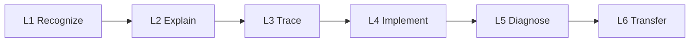

# Programming Competency Map

Version: 0.2.0  
Status: Architecture draft  
Corresponding Chinese version: [程式設計能力地圖](05-competency-map.zh-TW.md)

## Document Purpose

This document converts the [Programming Domain Model](03-programming-domain-model.en.md) and the [Programming Language Knowledge Dependency Graph](04-programming-language-knowledge-graph.en.md) into observable, teachable, and assessable student capabilities.

- The domain model answers which concepts and relationships exist.
- The knowledge dependency graph answers what is usually needed before another concept can be understood.
- The competency map answers what students must actually be able to do.

This document is not a weekly schedule or grading rubric. Later scope, acceptance, delivery, material, and assessment documents must reference the competency identifiers defined here.

## Constitutional Compliance

- Capability completion may not be judged only by successful execution or passing tests.
- Capability statements must be concrete, observable, and actionable.
- Both language versions use identical identifiers, maturity levels, and substantive requirements.
- Capability dependencies and mental models are visualized where appropriate.
- AI may support explanation, hints, testing, and debugging but must not replace understanding, design, tracing, or verification responsibility.
- This document does not preselect advanced data structures as core C-course capabilities.

---

# 1. Competency Maturity Model

| Level | Name | Observable behavior |
|---|---|---|
| L0 | Not established | Cannot reliably recognize the concept and can only guess or imitate. |
| L1 | Recognize | Can identify a concept, syntax element, datum, or execution stage in an example. |
| L2 | Explain | Can explain in their own words why the concept exists, its core logic, and its basic role. |
| L3 | Trace | Can predict execution, data state, control path, or memory change step by step. |
| L4 | Implement | Can select and correctly use the capability to complete a small task. |
| L5 | Diagnose | Can design tests, locate faults, explain causes, and make reasonable modifications. |
| L6 | Transfer | Can recognize the same logic in a new context, larger problem, or another language and adapt the approach. |

Important capabilities should normally require at least one explanation or tracing artifact and one implementation, modification, or diagnosis artifact.

---

# 2. Shared Learning Evidence

| Evidence code | Type | What the student must demonstrate |
|---|---|---|
| EV-EX | Explanation | Explain the requirement, design purpose, language logic, and program behavior in their own words. |
| EV-VI | Visual representation | Draw and interpret flow, state, memory, function-call, or data-organization models. |
| EV-TR | Execution trace | Record variable values, control paths, function calls, or memory changes step by step. |
| EV-IM | Implementation | Complete a small program or fragment that fits the current scope. |
| EV-MO | Modification | Modify an existing program for a changed requirement and explain affected parts. |
| EV-TE | Testing | Define expected results and create normal, boundary, and necessary exceptional cases. |
| EV-DE | Debugging | Reproduce a problem, narrow its scope, form and test hypotheses, and explain the correction. |
| EV-CO | Comparison | Compare two forms, solutions, or tool outputs and explain trade-offs. |
| EV-AI | AI judgment | Explain an AI suggestion, its verification method, and why it was accepted, modified, or rejected. |
| EV-RE | Reflection and transfer | Explain how the capability applies to a new problem, later topic, or another language. |

No official assessment may use only EV-IM or automated-test success as its sole evidence.

---

# 3. Competency Groups

## PC-E: Program Translation and Execution

| Competency ID | The student can... | Main prerequisites | Preparatory target | Formal-course target | Required evidence |
|---|---|---|---|---|---|
| PC-E01 | Explain that C source code is not executed directly by the CPU and describe the responsibilities of preprocessing, compilation, assembly, linking, loading, and execution. | None | L2 | L3 | EV-EX, EV-VI |
| PC-E02 | Distinguish the inputs, outputs, and responsibilities of the compiler, assembler, linker, and loader. | PC-E01 | L1 | L3 | EV-EX, EV-CO |
| PC-E03 | Use error messages or observed behavior to identify whether a problem mainly occurs during compilation, linking, or execution. | PC-E01, PC-V02 | L2 | L5 | EV-DE, EV-EX |
| PC-E04 | Create, compile, and run a minimal C program in the specified environment and explain each step. | PC-E01 | L4 | L5 | EV-IM, EV-EX, EV-DE |

## PC-D: Data and State

| Competency ID | The student can... | Main prerequisites | Preparatory target | Formal-course target | Required evidence |
|---|---|---|---|---|---|
| PC-D01 | Distinguish a value, type, variable name, current value, and storage location. | PC-E01 | L2 | L4 | EV-EX, EV-VI |
| PC-D02 | Select an appropriate basic type from data meaning and explain range, precision, or operation constraints. | PC-D01 | L2 | L5 | EV-EX, EV-CO, EV-IM |
| PC-D03 | Trace state changes caused by declaration, initialization, assignment, and expression evaluation. | PC-D01, PC-D02 | L3 | L5 | EV-TR, EV-VI, EV-DE |
| PC-D04 | Build and interpret arithmetic, comparison, and logical expressions while handling precedence and necessary conversion. | PC-D02, PC-D03 | L3 | L5 | EV-TR, EV-IM, EV-DE |
| PC-D05 | Design a basic input-process-output flow and verify input assumptions and output reasonableness. | PC-D01 through PC-D04 | L4 | L5 | EV-IM, EV-TE, EV-EX |
| PC-D06 | Explain name scope and data lifetime and identify related errors. | PC-F02, PC-M01 | L1 | L5 | EV-VI, EV-DE, EV-EX |

## PC-C: Flow and Control

| Competency ID | The student can... | Main prerequisites | Preparatory target | Formal-course target | Required evidence |
|---|---|---|---|---|---|
| PC-C01 | Trace statements in execution order and explain causal state changes. | PC-D03 | L3 | L5 | EV-TR, EV-EX |
| PC-C02 | Convert a requirement into an evaluable condition and predict a selection path. | PC-D04, PC-C01 | L3 | L5 | EV-VI, EV-TR, EV-IM |
| PC-C03 | Compare single, two-way, and multi-way selection and choose an appropriate structure. | PC-C02 | L2 | L5 | EV-CO, EV-IM, EV-MO |
| PC-C04 | Define initial state, continuation condition, update, and termination for a repetition problem. | PC-D03, PC-C02 | L3 | L5 | EV-VI, EV-TR, EV-IM |
| PC-C05 | Use loops for counting, accumulation, searching, or item-by-item processing and explain each iteration. | PC-C04 | L3 | L5 | EV-TR, EV-IM, EV-TE |
| PC-C06 | Diagnose infinite loops, boundary errors, and off-by-one problems. | PC-C04, PC-V02 | L2 | L5 | EV-DE, EV-TE, EV-EX |
| PC-C07 | Combine conditions, loops, and nested flow for more complex problems. | PC-C02 through PC-C06 | L1 | L5 | EV-VI, EV-IM, EV-MO |

## PC-F: Functions and Abstraction

| Competency ID | The student can... | Main prerequisites | Preparatory target | Formal-course target | Required evidence |
|---|---|---|---|---|---|
| PC-F01 | Identify separable responsibilities in a requirement and explain that functions are not merely a way to shorten code. | PC-D05, PC-C03 | L2 | L5 | EV-EX, EV-VI |
| PC-F02 | Distinguish function declaration, definition, call, parameter, and return value. | PC-F01 | L2 | L4 | EV-EX, EV-CO, EV-IM |
| PC-F03 | Design small functions with explicit input, processing, and output and create caller-side tests. | PC-F02, PC-V01 | L3 | L5 | EV-IM, EV-TE, EV-EX |
| PC-F04 | Trace calls, parameters, local variables, return points, and the call stack. | PC-F02, PC-D06 | L1 | L5 | EV-VI, EV-TR |
| PC-F05 | Decompose a larger problem into low-coupling, single-responsibility, independently testable functions. | PC-F03, PC-C07 | L1 | L6 | EV-VI, EV-IM, EV-CO, EV-RE |
| PC-F06 | Identify suitable and unsuitable uses of recursion and trace base and recursive cases. | PC-F04, PC-C04 | L0 | L4 | EV-VI, EV-TR, EV-CO |

## PC-M: Memory Model

| Competency ID | The student can... | Main prerequisites | Preparatory target | Formal-course target | Required evidence |
|---|---|---|---|---|---|
| PC-M01 | Explain that a variable has both a value and a storage location and distinguish a data value from an address. | PC-D01 | L1 | L4 | EV-VI, EV-EX |
| PC-M02 | Explain that a pointer is a typed variable storing an address and correctly use address-of and dereference. | PC-M01, PC-D02 | L0 | L5 | EV-VI, EV-TR, EV-IM |
| PC-M03 | Trace shared state caused by pointer aliases and explain which location a modification affects. | PC-M02, PC-D03 | L0 | L5 | EV-VI, EV-TR, EV-DE |
| PC-M04 | Explain contiguous sequence layout and the relationships among indexing, addresses, and valid bounds. | PC-M02, PC-O01 | L0 | L5 | EV-VI, EV-TR, EV-DE |
| PC-M05 | Compare automatic and dynamic storage duration and explain the instructional models of stack and heap. | PC-F04, PC-M01 | L0 | L4 | EV-VI, EV-CO, EV-EX |
| PC-M06 | Allocate and release dynamic memory for runtime needs while handling failure and lifetime responsibility. | PC-M02, PC-M05, PC-V02 | L0 | L5 | EV-IM, EV-TE, EV-DE |
| PC-M07 | Diagnose null pointers, dangling pointers, out-of-bounds access, double free, and memory leaks. | PC-M03, PC-M04, PC-M06 | L0 | L5 | EV-DE, EV-VI, EV-TE |

## PC-O: Data Organization

This group focuses on sequences, strings, records, and data operations in general C programming. It does not preselect advanced data structures as formal-course core content.

| Competency ID | The student can... | Main prerequisites | Preparatory target | Formal-course target | Required evidence |
|---|---|---|---|---|---|
| PC-O01 | Use indexes to represent and process a homogeneous data sequence and trace element state. | PC-C05, PC-D02 | L1 | L5 | EV-VI, EV-TR, EV-IM |
| PC-O02 | Understand a string as a character sequence with a termination condition and handle length, bounds, and input limitations. | PC-O01, PC-C05 | L0 | L5 | EV-VI, EV-IM, EV-DE |
| PC-O03 | Use a structure to group fields describing one entity into a record. | PC-D02, PC-F01 | L0 | L5 | EV-VI, EV-IM, EV-EX |
| PC-O04 | Use sequences or records to organize multiple items and design search, update, and basic rearrangement operations. | PC-O01, PC-O03, PC-C05 | L0 | L5 | EV-IM, EV-TE, EV-MO |
| PC-O05 | Compare basic search or rearrangement approaches, trace data changes, and explain suitable contexts. | PC-O01, PC-C05, PC-V01 | L0 | L5 | EV-TR, EV-CO, EV-IM |
| PC-O06 | Explain that data organization is a design choice involving data, relationships, and permitted operations rather than merely syntax. | PC-O01, PC-O03, PC-F01 | L0 | L4 | EV-EX, EV-VI, EV-RE |

## PC-V: Testing, Debugging, and Verification

| Competency ID | The student can... | Main prerequisites | Preparatory target | Formal-course target | Required evidence |
|---|---|---|---|---|---|
| PC-V01 | Write expected results for simple cases before execution and compare actual results. | PC-E04, PC-D03 | L3 | L6 | EV-TE, EV-TR, EV-EX |
| PC-V02 | Distinguish syntax, type, linking, runtime, logic, and boundary errors. | PC-E03, PC-V01 | L2 | L5 | EV-DE, EV-CO |
| PC-V03 | Create normal, boundary, and necessary exceptional cases and explain why each was chosen. | PC-V01, related capability | L2 | L6 | EV-TE, EV-EX |
| PC-V04 | Reproduce a problem, narrow its scope, form a testable hypothesis, and locate the cause. | PC-V02, PC-V03 | L2 | L6 | EV-DE, EV-TR |
| PC-V05 | Run regression tests after a correction and explain why the current result is trustworthy. | PC-V04 | L1 | L6 | EV-DE, EV-TE, EV-EX |

## PC-A: AI-Assisted Learning and Judgment

| Competency ID | The student can... | Main prerequisites | Preparatory target | Formal-course target | Required evidence |
|---|---|---|---|---|---|
| PC-A01 | State their own understanding, current evidence, and point of difficulty before using AI. | PC-V01 | L3 | L6 | EV-AI, EV-EX |
| PC-A02 | Request hints, explanations, comparisons, or testing perspectives rather than a complete answer. | PC-A01 | L3 | L6 | EV-AI, EV-RE |
| PC-A03 | Verify AI answers through documentation, compilation, execution, tracing, and testing. | PC-V03, related capability | L3 | L6 | EV-AI, EV-TE, EV-DE |
| PC-A04 | Explain why an AI suggestion was accepted, modified, or rejected. | PC-A03 | L2 | L6 | EV-AI, EV-EX |
| PC-A05 | Identify invalid syntax, fabricated features, undefined behavior, and unnecessary complexity. | PC-A03, PC-V02 | L1 | L5 | EV-AI, EV-DE, EV-CO |
| PC-A06 | Preserve AI-use records and decision explanations when required by the activity. | PC-A01 through PC-A04 | L2 | L6 | EV-AI, EV-RE |

## PC-I: Integrated Development Cycle

| Competency ID | The student can... | Main prerequisites | Preparatory target | Formal-course target | Required evidence |
|---|---|---|---|---|---|
| PC-I01 | Complete a small development cycle covering requirement understanding, a visual model, data and control design, minimal implementation, testing, debugging, modification, and reflection. | PC-D, PC-C, PC-F, PC-V, PC-A | L3 | L6 | EV-VI, EV-IM, EV-MO, EV-TE, EV-DE, EV-RE |

## Usage Principles

1. The competency map does not directly assign weeks.
2. The next scope document defines maturity boundaries between preparatory and formal courses.
3. A new capability must be traceable to a domain-model concept and knowledge dependency.
4. Topic breadth must not reduce testing, debugging, explanation, or AI-verification requirements.
5. Any future inclusion of advanced data structures requires a separate justification covering requirements, prerequisites, time, and evidence; it must not be assumed.

## Navigation

- [Previous stage: Programming Language Knowledge Dependency Graph](04-programming-language-knowledge-graph.en.md)
- [Next stage: Course Scope Boundary](06-scope-boundary.en.md)
- [Back to Instructional Design Workspace](README.en.md)
- [繁體中文版](05-competency-map.zh-TW.md)
