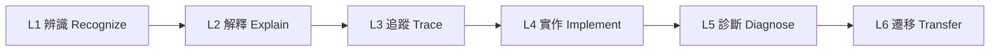

# 程式設計能力地圖

版本：0.2.1  
狀態：現行設計標準  
治理說明：本標準定義能力識別碼與證據期待；治理、評分與工具使用規則仍以 Constitution 與正式學習／評量制度為權威來源  
對應英文版本：[Programming Competency Map](05-competency-map.en.md)

## 文件目的

本文件將[程式設計領域模型](03-programming-domain-model.zh-TW.md)與[程式語言知識依賴圖](04-programming-language-knowledge-graph.zh-TW.md)轉換為可觀察、可教學與可評估的程式設計能力。

- 領域模型描述概念與關係。
- 知識依賴圖描述先備與支援關係。
- 本能力地圖定義學生實際應能做到什麼。

本文件不是週次表，也不是評分 rubric。範圍、驗收、交付、教材與評量實作可引用此處能力識別碼，但評分與 AI／工具政策仍由正式學習與評量制度治理。

## Constitution 2.0 對齊原則

- 能力不能只以成功執行或測試通過判定。
- 能力敘述必須具體、可觀察且技術上可驗證。
- 中文版與英文版使用相同識別碼、成熟度意義、實質目標、狀態與版本。
- 測試、除錯、解釋、修改與驗證維持核心證據來源。
- AI 與其他外部工具預設為選用；任何核心能力都不要求使用 AI 或提交 AI 使用紀錄。
- 只有在學生實際採用外部協助時，才可條件式檢查其是否理解並技術驗證所採用結果。
- 本標準不預先把進階資料結構列為 C 課程核心能力。

---

# 一、能力成熟度模型

| 等級 | 名稱 | 可觀察行為 |
|---|---|---|
| L0 | 尚未建立 | 尚無法在不猜測或模仿的情況下可靠辨識或使用此能力。 |
| L1 | 辨識 | 能在範例中辨識概念、語法元素、資料、狀態或相關執行／轉換責任。 |
| L2 | 解釋 | 能用自己的話說明存在原因、核心邏輯、邊界與作用。 |
| L3 | 追蹤 | 能逐步預測相關執行、資料狀態、控制流程、記憶體／生命週期狀態或建置證據。 |
| L4 | 實作 | 能依需求選擇並正確運用能力完成限定範圍任務。 |
| L5 | 診斷 | 能設計測試、定位錯誤、說明原因、處理相關失敗條件並完成有理由的修改。 |
| L6 | 遷移 | 能在新情境、較大問題或其他語言／工具鏈中辨識相同推理並調整做法。 |

重要能力原則上應使用不只一種證據，並視情況同時包含解釋或追蹤，以及實作、修改、測試或診斷。

---

# 二、共同學習證據

| 證據代碼 | 類型 | 學生展現的內容 |
|---|---|---|
| EV-EX | 解釋 | 用自己的話說明需求、設計目的、語言邏輯、假設與程式行為。 |
| EV-VI | 視覺表示 | 畫出並解讀流程、狀態、記憶體／生命週期、函數呼叫、資料組織或建置責任模型。 |
| EV-TR | 追蹤 | 逐步記錄相關值、控制路徑、呼叫、物件／生命週期變化或其他狀態轉移。 |
| EV-IM | 實作 | 完成符合目前範圍與已述技術契約的程式或片段。 |
| EV-MO | 修改 | 面對需求變更修改既有程式，並說明受影響行為與測試。 |
| EV-TE | 測試 | 定義預期行為，並在適用時建立正常、邊界、無效與失敗案例。 |
| EV-DE | 除錯 | 重現問題、縮小範圍、提出並驗證假設、說明修正並進行回歸驗證。 |
| EV-CO | 比較 | 比較寫法、解法、診斷、可靠來源或工具輸出並說明取捨。 |
| EV-AI | 條件式外部協助判斷 | 只有在實際使用 AI 或其他外部協助時，說明採用建議、驗證證據、限制及採用／修改／拒絕決策。 |
| EV-RE | 反思與遷移 | 說明能力如何應用到新問題、後續主題、環境或其他語言。 |

任何正式評量不得只使用 EV-IM、自動測試通過、工具肯定或單一正確輸出作為唯一證據。EV-AI 也不得僅為證明學生「有使用」或「未使用」AI 而成為必繳證據。

---

# 三、能力群組

## PC-E：程式轉換與執行

| 能力 ID | 學生能夠…… | 主要先備 | 前導目標 | 正式課程目標 | 證據 |
|---|---|---|---|---|---|
| PC-E01 | 說明 C 原始碼在 CPU 層級執行前會經由實作進行翻譯，並區分前置處理行為、翻譯／編譯、可能的目的碼產生／連結、載入／啟動與執行等概念責任，同時不宣稱所有實作都有相同實體 pipeline。 | 無 | L2 | L3 | EV-EX、EV-VI |
| PC-E02 | 將指定工具鏈實際命令、輸入、輸出與診斷，和概念建置責任模型進行比較。 | PC-E01 | L1 | L3 | EV-EX、EV-CO |
| PC-E03 | 根據診斷或觀察現象，把問題合理分類為原始碼／翻譯、適用時的連結、啟動／執行期或程式邏輯等層級。 | PC-E01、PC-V02 | L2 | L5 | EV-DE、EV-EX |
| PC-E04 | 在指定環境建立、建置並執行最小 C 程式，解釋實際觀察到的命令、產物與證據。 | PC-E01 | L4 | L5 | EV-IM、EV-EX、EV-DE |

## PC-D：資料與狀態

| 能力 ID | 學生能夠…… | 主要先備 | 前導目標 | 正式課程目標 | 證據 |
|---|---|---|---|---|---|
| PC-D01 | 區分值、型別、物件／變數名稱、目前值，以及儲存／生命週期概念。 | PC-E01 | L2 | L4 | EV-EX、EV-VI |
| PC-D02 | 根據資料意義選擇適當基本型別，並說明相關範圍、精度、轉換或操作限制。 | PC-D01 | L2 | L5 | EV-EX、EV-CO、EV-IM |
| PC-D03 | 追蹤宣告、初始化、指定與運算式求值造成的狀態改變。 | PC-D01、PC-D02 | L3 | L5 | EV-TR、EV-VI、EV-DE |
| PC-D04 | 建立與解讀算術、比較及邏輯運算式，處理優先序、轉換，以及相關未定義或實作相依邊界。 | PC-D02、PC-D03 | L3 | L5 | EV-TR、EV-IM、EV-DE |
| PC-D05 | 設計輸入、處理與輸出流程，並驗證輸入假設、錯誤狀態與輸出合理性。 | PC-D01 至 PC-D04 | L4 | L5 | EV-IM、EV-TE、EV-EX |
| PC-D06 | 說明範圍與生命週期，診斷把名稱可見性誤認為物件仍有效所造成的錯誤。 | PC-F02、PC-M01 | L1 | L5 | EV-VI、EV-DE、EV-EX |

## PC-C：流程與控制

| 能力 ID | 學生能夠…… | 主要先備 | 前導目標 | 正式課程目標 | 證據 |
|---|---|---|---|---|---|
| PC-C01 | 依執行順序追蹤動作並說明狀態變化的因果關係。 | PC-D03 | L3 | L5 | EV-TR、EV-EX |
| PC-C02 | 將需求轉換成可求值條件並預測選擇路徑。 | PC-D04、PC-C01 | L3 | L5 | EV-VI、EV-TR、EV-IM |
| PC-C03 | 比較單向、雙向與多路選擇並選擇合適形式。 | PC-C02 | L2 | L5 | EV-CO、EV-IM、EV-MO |
| PC-C04 | 為重複問題定義初始狀態、持續條件、更新與終止條件。 | PC-D03、PC-C02 | L3 | L5 | EV-VI、EV-TR、EV-IM |
| PC-C05 | 使用迴圈完成計數、累積、搜尋或逐項處理，並解釋每次迭代。 | PC-C04 | L3 | L5 | EV-TR、EV-IM、EV-TE |
| PC-C06 | 診斷不終止、邊界錯誤與 off-by-one 缺陷。 | PC-C04、PC-V02 | L2 | L5 | EV-DE、EV-TE、EV-EX |
| PC-C07 | 組合條件、迴圈與巢狀控制處理較複雜問題，同時維持可讀的狀態推理。 | PC-C02 至 PC-C06 | L1 | L5 | EV-VI、EV-IM、EV-MO |

## PC-F：函數與抽象

| 能力 ID | 學生能夠…… | 主要先備 | 前導目標 | 正式課程目標 | 證據 |
|---|---|---|---|---|---|
| PC-F01 | 從需求辨識可分離責任，說明函數不是只為縮短程式碼。 | PC-D05、PC-C03 | L2 | L5 | EV-EX、EV-VI |
| PC-F02 | 區分函數宣告、定義、呼叫、參數、回傳值與介面契約。 | PC-F01 | L2 | L4 | EV-EX、EV-CO、EV-IM |
| PC-F03 | 設計具有明確輸入、輸出、前提與呼叫端測試的小型函數。 | PC-F02、PC-V01 | L3 | L5 | EV-IM、EV-TE、EV-EX |
| PC-F04 | 以不綁定實作的 activation model 追蹤巢狀呼叫、argument／parameter、區域物件、返回點與生命週期；只有在目標環境確實採用時才連結到 call stack 模型。 | PC-F02、PC-D06 | L1 | L5 | EV-VI、EV-TR |
| PC-F05 | 將較大問題分解成低耦合、單一責任、可獨立測試的函數／模組。 | PC-F03、PC-C07 | L1 | L6 | EV-VI、EV-IM、EV-CO、EV-RE |
| PC-F06 | 辨識適合與不適合使用遞迴的情境，追蹤基本與遞迴案例，並說明終止與資源影響。 | PC-F04、PC-C04 | L0 | L4 | EV-VI、EV-TR、EV-CO |

## PC-M：記憶體模型

| 能力 ID | 學生能夠…… | 主要先備 | 前導目標 | 正式課程目標 | 證據 |
|---|---|---|---|---|---|
| PC-M01 | 區分名稱、值、物件、儲存空間、位址與生命週期。 | PC-D01 | L1 | L4 | EV-VI、EV-EX |
| PC-M02 | 說明指標型別與指標值，並只在有效性與操作前提成立時正確使用取址與解參考。 | PC-M01、PC-D02 | L0 | L5 | EV-VI、EV-TR、EV-IM |
| PC-M03 | 追蹤別名關係，說明修改會影響哪個物件或儲存區域。 | PC-M02、PC-D03 | L0 | L5 | EV-VI、EV-TR、EV-DE |
| PC-M04 | 說明陣列連續配置、索引、指標關係、有效邊界，以及適用時的 one-past 限制。 | PC-M02、PC-O01 | L0 | L5 | EV-VI、EV-TR、EV-DE |
| PC-M05 | 比較自動與配置儲存期，說明 Stack／Heap 圖是教學與實作模型，而不是 C 語言保證。 | PC-F04、PC-M01 | L0 | L4 | EV-VI、EV-CO、EV-EX |
| PC-M06 | 依需求配置、必要時調整大小並釋放動態儲存空間，同時處理大小運算、配置失敗、所有權與生命週期責任。 | PC-M02、PC-M05、PC-V02 | L0 | L5 | EV-IM、EV-TE、EV-DE |
| PC-M07 | 使用目標環境適當證據診斷 null／無效指標、懸空指標、越界存取、重複釋放、釋放後使用與記憶體洩漏。 | PC-M03、PC-M04、PC-M06 | L0 | L5 | EV-DE、EV-VI、EV-TE |

## PC-O：資料組織

本群組聚焦序列、字串、記錄與一般資料操作，不預先把進階資料結構列為正式課程核心。

| 能力 ID | 學生能夠…… | 主要先備 | 前導目標 | 正式課程目標 | 證據 |
|---|---|---|---|---|---|
| PC-O01 | 使用索引表示與處理同質序列，遵守有效邊界並追蹤元素狀態。 | PC-C05、PC-D02 | L1 | L5 | EV-VI、EV-TR、EV-IM |
| PC-O02 | 把 C 字串理解為字元陣列，其有效字串表示依賴終止 null 字元，並處理容量、長度、邊界與輸入限制。 | PC-O01、PC-C05 | L0 | L5 | EV-VI、EV-IM、EV-DE |
| PC-O03 | 使用 structure 將描述同一實體的欄位組合成記錄。 | PC-D02、PC-F01 | L0 | L5 | EV-VI、EV-IM、EV-EX |
| PC-O04 | 使用序列或記錄組織多筆資料，設計搜尋、更新與基本重新排列操作。 | PC-O01、PC-O03、PC-C05 | L0 | L5 | EV-IM、EV-TE、EV-MO |
| PC-O05 | 比較基本搜尋或重新排列方式，追蹤資料變化並說明適用情境。 | PC-O01、PC-C05、PC-V01 | L0 | L5 | EV-TR、EV-CO、EV-IM |
| PC-O06 | 說明資料組織是關於資料、關係與允許操作的設計選擇，而不只是語法。 | PC-O01、PC-O03、PC-F01 | L0 | L4 | EV-EX、EV-VI、EV-RE |

## PC-V：測試、除錯與驗證

| 能力 ID | 學生能夠…… | 主要先備 | 前導目標 | 正式課程目標 | 證據 |
|---|---|---|---|---|---|
| PC-V01 | 在執行前先陳述預期結果或性質，並與觀察到的證據比較。 | PC-E04、PC-D03 | L3 | L6 | EV-TE、EV-TR、EV-EX |
| PC-V02 | 使用合適證據區分翻譯／建置、適用時的連結、執行期／前提、邏輯、邊界與需求錯誤。 | PC-E03、PC-V01 | L2 | L5 | EV-DE、EV-CO |
| PC-V03 | 在適用時建立正常、邊界、無效與失敗案例，並說明每個案例的重要性。 | PC-V01、相關能力 | L2 | L6 | EV-TE、EV-EX |
| PC-V04 | 重現問題、縮小範圍、提出可驗證假設並定位原因。 | PC-V02、PC-V03 | L2 | L6 | EV-DE、EV-TR |
| PC-V05 | 修正後執行回歸檢查，並說明目前證據所能支持的信心水準與限制。 | PC-V04 | L1 | L6 | EV-DE、EV-TE、EV-EX |

## PC-A：條件式外部協助判斷

本群組是選用且條件式的，不定義全體前導或正式課程學生的普遍成熟度目標。只有在學生實際使用 AI 或其他外部協助，或經核准活動明確把工具判斷本身設為學習目標時才適用。

| 能力 ID | 學生能夠…… | 主要先備 | 普遍目標 | 條件式證據 |
|---|---|---|---|---|
| PC-A01 | 在依賴外部建議前，先陳述自己的理解、現有證據與卡點。 | 相關主題能力 | 無 | EV-AI、EV-EX |
| PC-A02 | 尋求有邊界的解釋、提示、比較或測試觀點，而不把結果視為權威答案。 | PC-A01 | 無 | EV-AI、EV-RE |
| PC-A03 | 使用程式、測試、編譯器診斷、可靠來源、追蹤或其他可重現證據驗證被採用的外部建議。 | PC-V03、相關能力 | 無 | EV-AI、EV-TE、EV-DE |
| PC-A04 | 說明為何採用、修改或拒絕某個外部建議。 | PC-A03 | 無 | EV-AI、EV-EX |
| PC-A05 | 辨識外部建議中的不受支持語法／功能、錯誤假設、未定義行為、不安全邊界或不必要複雜度。 | PC-A03、PC-V02 | 無 | EV-AI、EV-DE、EV-CO |
| PC-A06 | 只提供特定活動、學術誠信規則或評量條件所要求的工具使用紀錄／標註；未使用時不需提出聲明。 | PC-A01 至 PC-A04 | 無 | 只有適用時才使用 EV-AI |

## PC-I：整合開發循環

| 能力 ID | 學生能夠…… | 主要先備 | 前導目標 | 正式課程目標 | 證據 |
|---|---|---|---|---|---|
| PC-I01 | 完成一個小型開發循環，包含需求理解、合適模型、資料／控制設計、最小實作、測試、除錯、修改與反思。可選擇使用外部協助，但它不是先備條件。 | PC-D、PC-C、PC-F、PC-V | L3 | L6 | EV-VI、EV-IM、EV-MO、EV-TE、EV-DE、EV-RE；只有適用時才加入 EV-AI |

## 使用原則

1. 本能力地圖是能力識別碼與證據期待的現行設計標準，不直接分配週次或定義評分比例。
2. 範圍文件定義前導與正式課程的成熟度邊界。
3. 新增核心能力必須能追溯到程式設計概念與依賴，而不能只因目前工具趨勢而加入。
4. 主題廣度不得削弱測試、除錯、解釋、修改與驗證要求。
5. 選用 AI／外部協助能力不得被列為普遍先備、完成門檻、成熟度目標或必繳證據。
6. 未來若納入進階資料結構，需另行說明需求、先備、時間與證據，不得預設為必然範圍。
7. 實作相依敘述在細節重要時，必須指出並驗證相關編譯器、標準模式、作業環境或 runtime 模型。

## 相關文件

- [程式語言知識依賴圖](04-programming-language-knowledge-graph.zh-TW.md)
- [課程範圍邊界](06-scope-boundary.zh-TW.md)
- [驗收模型](07-acceptance-model.zh-TW.md)
- [正式學習與評量制度](13-learning-assessment-policy.zh-TW.md)
- [教學內容設計區](README.zh-TW.md)
- [English version](05-competency-map.en.md)
