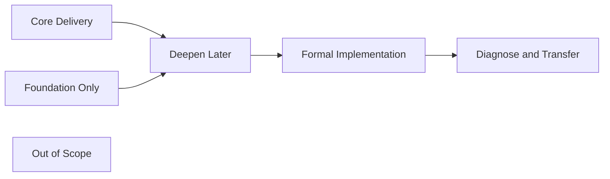
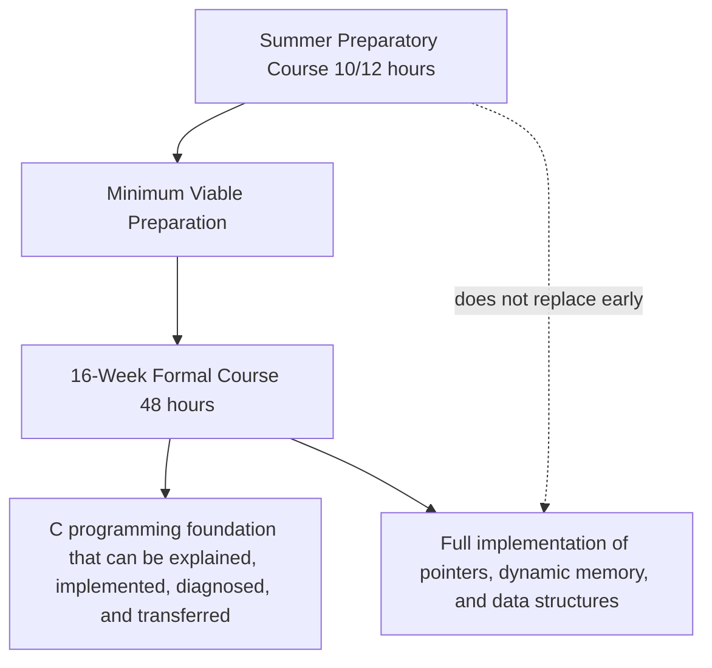

# Course Scope Boundary

Version: 0.1.0  
Status: Architecture draft  
Corresponding Chinese version: [課程範圍邊界](05-scope-boundary.zh-TW.md)

## Document Purpose

This document defines the capability scope, maturity boundaries, deferral rationale, and exclusions for the 2026 summer preparatory course and the subsequent 16-week formal C programming course.

It answers:

1. Which capabilities are required deliverables of the preparatory course?
2. Which capabilities establish only a mental model rather than independent implementation?
3. Which capabilities must be deepened in the formal course?
4. Which content lies outside this course system?
5. Why are some concepts deferred or taught only to a particular maturity level?

This document does not assign weeks. The later acceptance model, delivery map, teaching materials, and assessments must cite its scope states and competency identifiers.

## Constitutional Compliance

This document follows the Course Constitution, especially these requirements:

- Understanding takes priority over completion; time pressure must not turn “introduced” into “mastered.”
- The Chinese-taught and English-taught classes must share the same core capabilities, maturity targets, and acceptance standards.
- The preparatory and formal courses must form a continuous capability progression rather than repeat activities at the same maturity level.
- Scope decisions must control cognitive load and record the educational reasons for deferral.
- Scope and dependency relationships that benefit from visualization must be shown visually.
- AI must not be used to bypass missing prerequisite capabilities.
- This document must be reachable through the design index and the root README navigation chain.

---

# 1. Scope State Model

| State code | Name | Definition |
|---|---|---|
| SB-C | Core Delivery | The learner must reach the stated maturity level and produce formal evidence by the end of the course stage. |
| SB-F | Foundation Only | Establishes terminology, visual models, and purpose without claiming independent implementation capability. |
| SB-D | Deepen Later | An initial capability exists, but higher maturity is reserved for a later stage. |
| SB-I | Implement Later | The learner may understand or trace the concept, while full implementation and debugging are intentionally deferred. |
| SB-O | Out of Scope | Not a core deliverable of this course system; direction or resources may be provided when useful. |

Scope rules:

- Being introduced does not imply SB-C.
- SB-F must explicitly identify what students are not expected to implement independently.
- SB-D and SB-I must state both the deferral rationale and required prerequisites.
- A capability without learning evidence cannot be labeled a core deliverable.

---

# 2. Course-Stage Positioning

## Preparatory Course

The preparatory course reduces differences in tools, execution models, and basic programming thinking before the formal course begins. It is not a compressed version of the formal course.

Core preparatory outcomes:

- Build, compile, run, and perform initial interpretation of errors.
- Distinguish values, types, variables, expressions, and program state.
- Trace basic sequence, condition, and loop behavior.
- Understand that functions decompose responsibilities and read basic function calls.
- Establish expected results, test simple cases, and perform initial debugging.
- State one’s own understanding and point of difficulty before using AI, then verify AI suggestions.
- Recognize why arrays, addresses, the stack, and the heap exist without pretending to possess full pointer or dynamic-memory capability.

## Formal Course

The formal course raises the preparatory models to implementation, diagnosis, and transfer, adding:

- Arrays, strings, and compound-data processing.
- Function interfaces, modularity, scope, and recursion.
- Addresses, pointers, and the relationship between arrays and pointers.
- Stack, heap, dynamic allocation, deallocation, and lifetime.
- Structures, nodes, linked lists, stacks, queues, and basic tree concepts.
- Systematic testing, debugging, requirement modification, and regression verification.
- Technical verification of AI answers and management of dependency risks.

---

# 3. Preparatory-Course Scope Matrix

| Competency group | Preparatory state | Target maturity | Must include | Intentionally incomplete |
|---|---|---:|---|---|
| PC-E Program Translation and Execution | SB-C | L2–L4 | Source-to-execution flow, distinction between compile and link errors, minimal-program build process | Object formats, ABI, and loader relocation details |
| PC-D Data and State | SB-C | L2–L4 | Values, types, variables, initialization, assignment, expressions, and basic I/O | Full numeric representation, complex casts, and undefined-behavior taxonomy |
| PC-C Flow and Control | SB-C | L2–L3 | Sequence, conditions, basic loops, state tracing, and termination conditions | Complex nesting and large-scale control-flow design |
| PC-F Functions and Abstraction | SB-C / SB-F | L1–L3 | Purpose of functions, calls, parameter and return concepts, responsibility decomposition | Full modular design, recursion, and function pointers |
| PC-M Memory Model | SB-F | L1–L2 | Address concepts, variables and memory locations, introductory stack/heap visuals | Pointer arithmetic, malloc/free, and memory-error implementation |
| PC-O Data Organization | SB-F / SB-I | L1–L2 | Arrays as homogeneous collections; purpose of strings and structures | Pointer-based array operations, structure design, and linked-list implementation |
| PC-V Testing, Debugging, and Verification | SB-C | L2–L4 | Expected results, normal and boundary cases, error messages, and initial debugging workflow | Large regression suites and cross-module diagnosis |
| PC-A AI-Assisted Learning | SB-C | L2–L4 | Think first, ask specific questions, test AI suggestions, and explain adoption decisions | Letting AI replace decomposition, core implementation, or verification |
| PC-I Integrated Development Cycle | SB-C | L3 | Understanding, tracing, modifying, testing, and reflecting on small problems | Independently completing large or multi-module projects |

## Minimum Preparatory Delivery Line

Without relying on full-answer generation, students must be able to:

1. Explain the input, data, control, and output of a small C program.
2. Trace at least one condition or loop case step by step.
3. Modify one simple requirement and retest the result.
4. Use error information to distinguish a compilation problem from an incorrect execution result.
5. Explain how one AI suggestion was verified, modified, or rejected.

Copying a program and producing correct output alone does not satisfy the preparatory core deliverable.

---

# 4. Formal-Course Scope Matrix

| Competency group | Formal-course state | Target maturity | Core delivery |
|---|---|---:|---|
| PC-E Program Translation and Execution | SB-C | L3–L5 | Diagnose compile, link, and runtime-stage problems and explain relationships among headers, declarations, object files, and libraries. |
| PC-D Data and State | SB-C | L4–L5 | Select types based on meaning and handle operations, conversion, scope, and lifetime problems. |
| PC-C Flow and Control | SB-C | L4–L5 | Design, test, and diagnose conditions, loops, and combined control structures. |
| PC-F Functions and Abstraction | SB-C | L4–L6 | Decompose problems with functions, design interfaces, manage scope, and handle basic recursion. |
| PC-M Memory Model | SB-C | L3–L5 | Trace addresses and pointers, compare stack and heap, allocate and release memory correctly, and diagnose common faults. |
| PC-O Data Organization | SB-C | L4–L5 | Use arrays, strings, and structures and implement basic node-based data structures. |
| PC-V Testing, Debugging, and Verification | SB-C | L4–L6 | Design tests, locate faults, perform regression verification, and explain why results are trustworthy. |
| PC-A AI-Assisted Learning | SB-C | L4–L6 | Verify AI-generated code and explanations and identify false assumptions, fabricated APIs, undefined behavior, and unnecessary complexity. |
| PC-I Integrated Development Cycle | SB-C | L5–L6 | Complete the full cycle of requirements, design, implementation, testing, modification, debugging, explanation, and transfer. |

---

# 5. Important Deferral Decisions and Rationale

| Topic / capability | Preparatory treatment | Formal-course treatment | Why it is not taught fully now |
|---|---|---|---|
| Preprocessing, compilation, assembly, and linking | Understand responsibilities and error stages through a process diagram | Deepen with tool output and error cases | Beginners need a correct model, but early machine-code and toolchain detail would overwhelm programming reasoning. |
| Scope and lifetime | Recognize local variables and simple scope | Diagnose shadowing, lifetime, and interface problems | Requires functions and the memory model first. |
| Arrays | Recognize contiguous homogeneous data and basic indexing | Full implementation, boundary testing, and comparison with pointers | Introducing pointer semantics too early turns indexing into rote memorization. |
| Pointers | Build the visual model that addresses are also data | Declarations, address-of, dereference, aliasing, pointer arithmetic, and debugging | Without variables, functions, arrays, and a memory model, `*` and `&` become memorized symbols. |
| Dynamic memory | Explain why uncertain size or lifetime requires the heap | malloc, calloc, realloc, free, and error diagnosis | Requires pointers, lifetime, stack/heap understanding, testing, and debugging. |
| Structures | Recognize the need to group related fields into a data model | Definition, initialization, passing, arrays of structures, and pointers | Requires types, function interfaces, and arrays. |
| Linked lists | Understand the purpose through nodes and arrows | Allocation, insertion, deletion, traversal, and release | Depends simultaneously on pointers, structures, dynamic allocation, and flow tracing. |
| Recursion | Establish the concept through function calls and smaller subproblems | Implementation, call-stack tracing, and termination diagnosis | Requires stable function, condition, call-stack, and testing capabilities. |
| AI-generated complete answers | Not a learning activity | Still may not replace core design and verification | It bypasses task understanding, decomposition, tracing, and diagnosis, violating the Constitution. |

---

# 6. Basic Data-Structure Boundary Within the Formal Course

## Core Inclusion

- Arrays and strings.
- Structures and arrays of structures.
- Node concepts.
- Building, traversing, inserting, deleting, and releasing a singly linked list.
- Core stack and queue behavior using array-based or linked representations.
- Basic tree concepts: node, root, parent-child relationship, depth, and traversal.

## Foundation or Extension Only

- Intuitive comparisons of performance and complexity.
- Dynamic-array concepts.
- Doubly linked lists.
- Basic binary-search-tree concepts.

## Out of Scope or Reserved for the Data Structures Course

- Balanced trees and rotations.
- Full implementations of heaps, hash tables, and graph algorithms.
- Advanced sorting analysis.
- Formal proofs of algorithmic complexity.
- Systematic teaching of generic containers and standard-library containers.

Out of scope does not mean unimportant. It means these topics must not be forced into the course at the expense of C-language foundations, the memory model, testing, and debugging.

---

# 7. Explicit Exclusions and Tool Boundaries

The following are not core course deliverables:

- GUI, game-engine, or large-framework development.
- Network programming, concurrency, and multithreading.
- Operating-system kernels, device drivers, or embedded-hardware details.
- Full assembly-language programming.
- Compiler implementation.
- C++ object orientation, templates, and standard containers.
- Treating proficiency with one IDE as a substitute for language capability.
- Having AI, instructors, or frameworks complete core functionality students do not understand.

Tools may reduce unnecessary barriers but must not hide behavior necessary for the current learning objective.

---

# 8. Scope-Change Rules

Before adding or raising any core deliverable, confirm:

1. Which requirement, knowledge node, and competency ID does it support?
2. Do students possess reasonable prerequisites?
3. Will it introduce too many new concepts at once?
4. Is there enough time for a visual model, prose explanation, implementation, testing, and verification?
5. Are there at least two evidence types, not limited to correct output?
6. Will it reduce practice and diagnosis time for existing core capabilities?
7. Will the Chinese-taught and English-taught classes still have the same core standard?
8. Will the README, competency map, acceptance model, and later traceability documents be updated together?

When new content can only be rushed through as lecture or demonstration, it should be classified as SB-F or deferred rather than labeled a core deliverable.

---

# 9. Completion Criteria

After this document is established, later design work must be able to:

- Identify the preparatory- and formal-course scope state of each capability.
- Explain the educational reason for deferral rather than merely saying a topic is “too difficult” or “there is not enough time.”
- Prevent the preparatory course from replacing the formal course or the formal course from repeating preparatory activities.
- Prevent broad topic coverage from sacrificing understanding, testing, debugging, and verification.
- Provide explicit boundaries for the next document, the [Acceptance Model](06-acceptance-model.en.md).

## Navigation

- [Previous: Programming Competency Map](04-competency-map.en.md)
- [Back to Instructional Design Workspace](README.en.md)
- [繁體中文版](05-scope-boundary.zh-TW.md)
