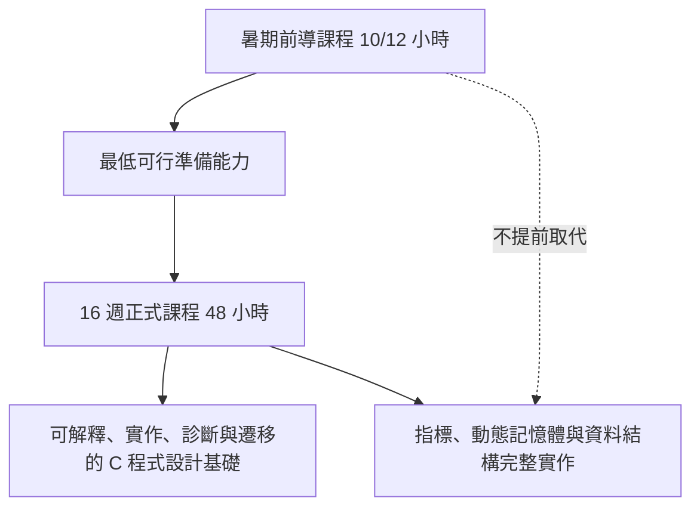

# 課程範圍邊界

版本：0.1.0  
狀態：架構草案  
對應英文版本：[Course Scope Boundary](05-scope-boundary.en.md)

## 文件目的

本文件定義 2026 暑期前導課程與後續 16 週正式 C 語言課程的能力範圍、成熟度邊界、延後理由與排除項目。

本文件回答：

1. 哪些能力是前導課程的必要交付？
2. 哪些能力只建立心智模型，不要求獨立實作？
3. 哪些能力應留到正式課程深化？
4. 哪些內容不屬於本課程體系？
5. 為什麼某些概念現在不教或只教到特定成熟度？

本文件不直接安排週次。後續的驗收模型、交付地圖、教材與評量，均須引用本文件的範圍狀態與能力識別碼。

## 憲法遵循

本文件依據課程憲法建立，特別遵守：

- 理解優先於完成，不因時間壓力把「看過」宣稱為「學會」。
- 中文班與英文班具有相同核心能力、成熟度與驗收標準。
- 前導課程與正式課程必須形成連續能力發展，不得重複同一成熟度活動。
- 範圍決策必須控制認知負荷，並記錄延後內容的教育理由。
- 能視覺化的範圍與依賴關係必須提供圖形。
- AI 不得被用來跨越尚未建立的先備能力。
- 本文件必須由設計索引與根 README 的導覽鏈抵達。

---

# 一、範圍狀態模型

```mermaid
flowchart LR
    S1[核心交付 Core Delivery] --> S2[後續深化 Deepen Later]
    S0[基礎鋪墊 Foundation Only] --> S2
    S2 --> S3[正式實作 Formal Implementation]
    S3 --> S4[診斷與遷移 Diagnose and Transfer]
    OUT[課程外 Out of Scope]
```

| 狀態代碼 | 名稱 | 定義 |
|---|---|---|
| SB-C | 核心交付 | 該課程階段結束時必須達到指定成熟度，並具備正式學習證據。 |
| SB-F | 基礎鋪墊 | 建立名詞、視覺模型與存在理由，但不宣稱具備獨立實作能力。 |
| SB-D | 延後深化 | 已具備初步能力，但更高成熟度留待後續課程。 |
| SB-I | 延後實作 | 本階段可理解或追蹤，但完整實作與除錯刻意延後。 |
| SB-O | 課程外 | 不屬於本課程體系的核心交付，必要時只提供方向或資源。 |

範圍判定原則：

- 「介紹過」不等於 SB-C。
- SB-F 必須明確標示不要求學生獨立實作的部分。
- SB-D 與 SB-I 必須寫出延後理由與所需先備能力。
- 任何能力若沒有學習證據，不得列為核心交付。

---

# 二、課程階段定位

## 前導課程

前導課程的任務是降低正式課程開始時的工具、執行模型與基本程式思考落差。它不是正式課程的壓縮版。

前導課程核心成果：

- 能建立、編譯、執行並初步判讀錯誤。
- 能區分值、型別、變數、運算式與程式狀態。
- 能追蹤基本順序、條件與迴圈。
- 能理解函數用來分解責任，並閱讀基本函數呼叫。
- 能建立預期結果、測試簡單案例並進行初步除錯。
- 能在使用 AI 前先表達自己的理解與卡點，並驗證 AI 建議。
- 能辨識陣列、位址、Stack、Heap 等後續模型的存在理由，但不假裝已具備完整指標或動態記憶體能力。

## 正式課程

正式課程負責把前導課程建立的模型提升為完整實作、診斷與遷移能力，並加入：

- 陣列、字串與複合資料處理。
- 函數介面、模組化、作用域與遞迴。
- 位址、指標、陣列與指標關係。
- Stack、Heap、動態配置、釋放與生命週期。
- 結構、節點、鏈結串列、堆疊、佇列與樹的基本概念。
- 系統化測試、除錯、需求修改與回歸驗證。
- AI 回答的技術驗證與依賴風險管理。

---

# 三、前導課程範圍矩陣

| 能力群組 | 前導狀態 | 目標成熟度 | 必須涵蓋 | 刻意不完成 |
|---|---|---:|---|---|
| PC-E 程式轉換與執行 | SB-C | L2–L4 | 原始碼到執行的流程、編譯與連結錯誤區分、最小程式建置 | 目的檔格式、ABI、載入重定位細節 |
| PC-D 資料與狀態 | SB-C | L2–L4 | 值、型別、變數、初始化、指定、運算式、基本 I/O | 完整數值表示、複雜轉型與未定義行為分類 |
| PC-C 流程與控制 | SB-C | L2–L3 | 順序、條件、基本迴圈、狀態追蹤、終止條件 | 複雜巢狀控制與大型流程設計 |
| PC-F 函數與抽象 | SB-C／SB-F | L1–L3 | 函數存在理由、呼叫、參數與回傳概念、責任分解 | 完整模組化、遞迴、函數指標 |
| PC-M 記憶體模型 | SB-F | L1–L2 | 位址概念、變數與記憶體位置、Stack／Heap 初步圖像 | 指標運算、malloc/free、記憶體錯誤實作 |
| PC-O 資料組織 | SB-F／SB-I | L1–L2 | 陣列作為同型資料集合、字串與結構的存在理由 | 指標式陣列操作、結構設計、鏈結串列實作 |
| PC-V 測試除錯與驗證 | SB-C | L2–L4 | 預期結果、正常與邊界案例、錯誤訊息、初步除錯流程 | 大型回歸測試與跨模組診斷 |
| PC-A AI 輔助學習 | SB-C | L2–L4 | 先自行理解、具體提問、測試 AI 建議、說明採用理由 | 用 AI 代替問題拆解、核心實作與驗證 |
| PC-I 整合開發循環 | SB-C | L3 | 小型題目的理解、追蹤、修改、測試與反思 | 獨立完成大型或多模組專案 |

## 前導課程的最低交付線

學生必須能在不依賴完整答案生成的情況下：

1. 解釋一個小型 C 程式的輸入、資料、控制與輸出。
2. 逐步追蹤至少一個條件或迴圈案例。
3. 修改一項簡單需求並重新測試。
4. 根據錯誤訊息區分編譯問題與執行結果問題。
5. 說明一次 AI 建議如何被驗證、修改或拒絕。

若學生只能複製程式並取得正確輸出，不視為達成前導課程核心交付。

---

# 四、正式課程範圍矩陣

| 能力群組 | 正式課程狀態 | 目標成熟度 | 核心交付 |
|---|---|---:|---|
| PC-E 程式轉換與執行 | SB-C | L3–L5 | 能判斷編譯、連結與執行階段問題，解釋標頭、宣告、目的檔與函式庫關係。 |
| PC-D 資料與狀態 | SB-C | L4–L5 | 能依資料意義選型別，處理運算、轉換、範圍與生命週期問題。 |
| PC-C 流程與控制 | SB-C | L4–L5 | 能設計、測試與診斷條件、迴圈與組合流程。 |
| PC-F 函數與抽象 | SB-C | L4–L6 | 能以函數分解問題、設計介面、控制作用域並處理基本遞迴。 |
| PC-M 記憶體模型 | SB-C | L3–L5 | 能追蹤位址與指標、比較 Stack／Heap、正確配置與釋放動態記憶體並診斷常見錯誤。 |
| PC-O 資料組織 | SB-C | L4–L5 | 能使用陣列、字串與結構，並實作基本節點式資料結構。 |
| PC-V 測試除錯與驗證 | SB-C | L4–L6 | 能設計測試、定位錯誤、回歸驗證並說明結果可信度。 |
| PC-A AI 輔助學習 | SB-C | L4–L6 | 能驗證 AI 程式與解釋，辨識錯誤假設、虛構 API、未定義行為與不必要複雜度。 |
| PC-I 整合開發循環 | SB-C | L5–L6 | 能完成需求、設計、實作、測試、修改、除錯、說明與遷移的完整循環。 |

---

# 五、重要延後決策與理由

| 主題／能力 | 前導課程處理 | 正式課程處理 | 為什麼現在不完整教授 |
|---|---|---|---|
| 前置處理、編譯、組譯與連結 | 以流程圖理解責任與錯誤階段 | 使用工具輸出與錯誤案例深化 | 初學者需要正確模型，但過早深入機器碼與工具鏈細節會壓過程式思考。 |
| 作用域與生命週期 | 辨識區域變數與簡單範圍 | 診斷遮蔽、生命週期與介面問題 | 必須先理解函數與記憶體模型。 |
| 陣列 | 認識連續同型資料與基本索引 | 完整實作、邊界測試及與指標比較 | 過早混入指標語意容易把索引變成機械背誦。 |
| 指標 | 建立「位址也是資料」的視覺模型 | 宣告、取址、解參考、別名、指標運算與除錯 | 沒有變數、函數、陣列與記憶體模型時，`*` 與 `&` 只會變成符號記憶。 |
| 動態記憶體 | 說明大小或生命週期不確定時為何需要 Heap | malloc、calloc、realloc、free 與錯誤診斷 | 必須先掌握指標、生命週期、Stack／Heap 與測試除錯。 |
| 結構 | 認識將相關欄位組成一個資料模型的理由 | 定義、初始化、傳遞、結構陣列與指標 | 必須先具備型別、函數介面與陣列能力。 |
| 鏈結串列 | 以節點與箭頭理解存在理由 | 節點配置、插入、刪除、走訪與釋放 | 同時依賴指標、結構、動態配置與流程追蹤，不宜提前壓縮教授。 |
| 遞迴 | 以函數呼叫與問題縮小建立概念 | 實作、呼叫堆疊追蹤與終止條件診斷 | 必須先穩固函數、條件、呼叫堆疊與測試能力。 |
| AI 產生完整解答 | 不列為學習活動 | 仍不得取代核心設計與驗證 | 會讓學生跳過需求理解、分解、追蹤與診斷，直接違反課程憲法。 |

---

# 六、正式課程內的基本資料結構邊界

## 核心納入

- 陣列與字串。
- 結構與結構陣列。
- 節點概念。
- 單向鏈結串列的建立、走訪、插入、刪除與釋放。
- 以陣列或鏈結方式說明堆疊與佇列的核心行為。
- 樹的節點、根、父子關係、深度與基本走訪概念。

## 僅基礎鋪墊或延伸

- 效能與複雜度的直觀比較。
- 動態陣列的概念。
- 雙向鏈結串列。
- 二元搜尋樹的基本概念。

## 課程外或留待資料結構課程

- 平衡樹與旋轉。
- 堆、雜湊表、圖論完整實作。
- 進階排序分析。
- 演算法複雜度的正式證明。
- 泛型容器與標準函式庫容器的系統性教學。

課程外不代表不重要，而表示本課程不應以犧牲 C 語言、記憶體模型、測試與除錯基礎為代價強行納入。

---

# 七、明確排除與工具邊界

以下內容不列為本課程核心交付：

- GUI、遊戲引擎或大型框架開發。
- 網路程式設計、並行與多執行緒。
- 作業系統核心、驅動程式與嵌入式硬體細節。
- 完整組合語言程式設計。
- 編譯器實作。
- C++ 物件導向、模板與標準容器。
- 以特定 IDE 操作熟練度取代語言能力。
- 由 AI、教師或框架完成學生尚未理解的核心功能。

工具可用來降低非必要門檻，但不得隱藏當前學習目標所需理解的行為。

---

# 八、範圍變更規則

新增或提高任何核心交付前，必須確認：

1. 對應哪個需求、知識節點與能力 ID？
2. 學生是否具備合理先備能力？
3. 是否會造成一次引入過多新概念？
4. 是否有足夠時間安排視覺模型、文字說明、實作、測試與驗證？
5. 是否有至少兩種學習證據，其中不能只有正確輸出？
6. 是否會壓縮既有核心能力的練習與診斷時間？
7. 中文班與英文班是否仍維持相同核心標準？
8. README、能力地圖、驗收模型與後續追蹤文件是否同步更新？

若新增內容只能以講授或展示方式匆促帶過，應列為 SB-F 或延後，而不是列為核心交付。

---

# 九、完成標準

本文件完成後，後續設計應能：

- 對每項能力指出其前導與正式課程範圍狀態。
- 說明延後內容的教育理由，而不是只以「太難」或「時間不足」帶過。
- 防止前導課程取代正式課程，或正式課程重複前導活動。
- 防止以大量主題覆蓋犧牲理解、測試、除錯與驗證。
- 為下一份[驗收模型](06-acceptance-model.zh-TW.md)提供明確邊界。

## 導覽

- [上一份：程式設計能力地圖](04-competency-map.zh-TW.md)
- [返回教學內容設計區](README.zh-TW.md)
- [English version](05-scope-boundary.en.md)
