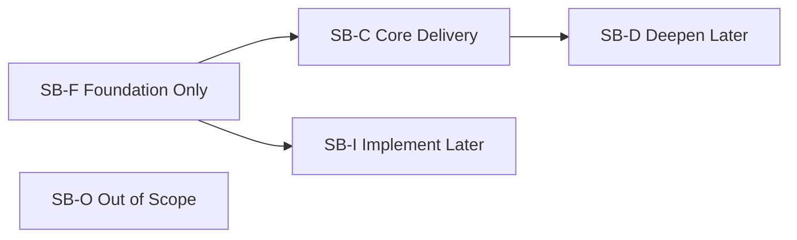
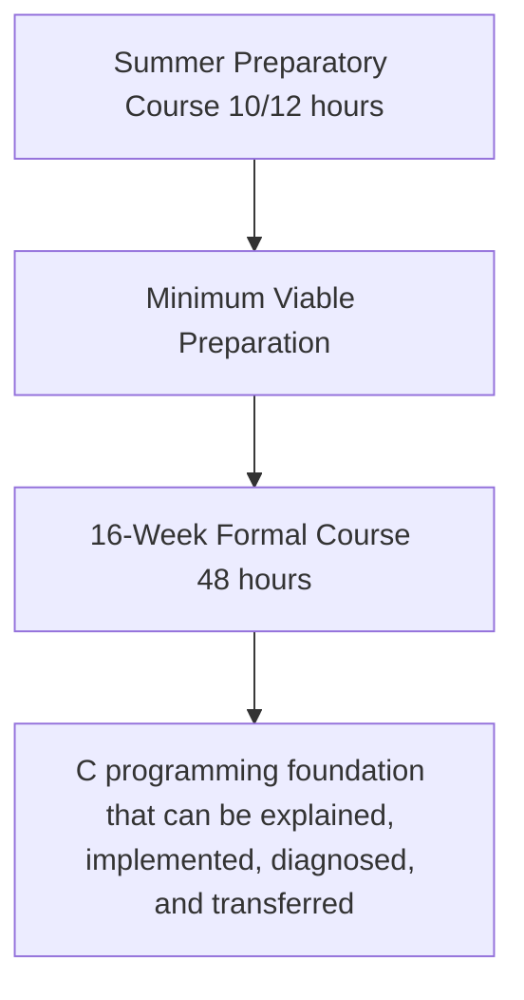

# Course Scope Boundary

Version: 0.2.0  
Status: Architecture draft  
Corresponding Chinese version: [課程範圍邊界](06-scope-boundary.zh-TW.md)

## Document Purpose

This document defines capability scope, maturity boundaries, deferral rationale, and exclusions for the 2026 summer preparatory course and the subsequent 16-week formal C programming course.

It answers:

1. Which capabilities are required deliverables of the preparatory course?
2. Which capabilities establish only a mental model rather than independent implementation?
3. Which capabilities must be deepened in the formal course?
4. Which content lies outside this course system?
5. Why are some concepts deferred or taught only to a particular maturity level?

This document does not assign weeks and does not preselect advanced data structures as formal-course core content. Later acceptance, delivery, material, and assessment documents must cite its scope states and competency identifiers.

## Constitutional Compliance

- Understanding takes priority over completion; “introduced” must not be treated as “mastered.”
- The Chinese-taught and English-taught classes share the same core capabilities, maturity targets, and acceptance standards.
- Preparatory and formal courses form a continuous capability progression rather than repeat the same maturity activities.
- Scope decisions control cognitive load and record reasons for deferral.
- AI must not be used to bypass missing prerequisites.
- This document must be reachable from the root README through an explicit navigation path.

---

# 1. Scope State Model

| State code | Name | Definition |
|---|---|---|
| SB-C | Core Delivery | The learner must reach the stated maturity level and produce formal evidence by the end of the stage. |
| SB-F | Foundation Only | Establishes terminology, visual models, and purpose without claiming independent implementation. |
| SB-D | Deepen Later | An initial capability exists, while higher maturity is reserved for a later stage. |
| SB-I | Implement Later | The learner may understand or trace the concept while full implementation and diagnosis are intentionally deferred. |
| SB-O | Out of Scope | Not a core deliverable of this course system; direction may be provided when useful. |

Being introduced does not imply SB-C. A core deliverable without learning evidence may not be listed.

---

# 2. Course-Stage Positioning

## Preparatory Course

The preparatory course reduces differences in tools, execution models, and basic programming thinking before the formal course begins. It is not a compressed version of the formal course.

Core outcomes:

- Create, compile, and run a minimal C program and perform initial error interpretation.
- Distinguish values, types, variables, expressions, and program state.
- Trace sequence, conditions, and basic loops.
- Understand that functions decompose responsibilities and read basic calls.
- Establish expected results, simple tests, and an initial debugging process.
- State one’s own understanding and difficulty before using AI, then verify AI suggestions.
- Build initial models of addresses, storage locations, sequences, and records for later learning.

## Formal Course

The formal course raises the preparatory models to implementation, diagnosis, and transfer, focusing on:

- Data, types, expressions, input/output, scope, and lifetime.
- Conditions, loops, and combined control flow.
- Function interfaces, problem decomposition, modularization, and basic recursion.
- Addresses, pointers, automatic and dynamic storage duration, allocation, release, and memory errors.
- Sequences, strings, records, and basic data operations.
- Systematic testing, debugging, requirement modification, and regression verification.
- Technical verification of AI answers and management of dependency risks.

This document does not presume linked lists, trees, heaps, hash structures, or graphs to be core deliverables. Inclusion of any specific data structure must later be justified through requirements, prerequisites, time, and acceptance evidence during weekly-course design.

---

# 3. Preparatory-Course Scope Matrix

| Competency group | Preparatory state | Target maturity | Must include | Intentionally incomplete |
|---|---|---:|---|---|
| PC-E Program Translation and Execution | SB-C | L2–L4 | Source-to-execution flow, distinction among compile/link/runtime problems, minimal-program build process | Object formats, ABI, and loader relocation details |
| PC-D Data and State | SB-C | L2–L4 | Values, types, variables, initialization, assignment, expressions, and basic I/O | Full numeric representation, complex casts, and complete undefined-behavior taxonomy |
| PC-C Flow and Control | SB-C | L2–L3 | Sequence, conditions, basic loops, state tracing, and termination | Complex nesting and large-scale control-flow design |
| PC-F Functions and Abstraction | SB-C / SB-F | L1–L3 | Purpose of functions, calls, parameters, returns, and responsibility decomposition | Full modularization, recursion implementation, and function pointers |
| PC-M Memory Model | SB-F | L1–L2 | Values and locations, addresses, and introductory automatic/dynamic storage models | Pointer implementation, allocation/release, and memory-error diagnosis |
| PC-O Data Organization | SB-F / SB-I | L1–L2 | Purpose of sequences, indexing, strings, and records | Full array/string/structure design and larger data operations |
| PC-V Testing, Debugging, and Verification | SB-C | L2–L4 | Expected results, normal and boundary cases, error messages, and initial debugging | Large regression suites and cross-module diagnosis |
| PC-A AI-Assisted Learning | SB-C | L2–L4 | Think first, ask specific questions, test AI suggestions, and explain decisions | Letting AI replace decomposition, core implementation, or verification |
| PC-I Integrated Development Cycle | SB-C | L3 | Understanding, tracing, modifying, testing, and reflecting on small problems | Independently completing large or multi-module projects |

## Minimum Preparatory Delivery Line

Without relying on full-answer generation, students must be able to:

1. Explain the input, data, control, and output of a small C program.
2. Trace at least one condition or loop case step by step.
3. Modify one simple requirement and retest the result.
4. Use error information to distinguish a compilation problem from an incorrect execution result.
5. Explain how one AI suggestion was verified, modified, or rejected.

Copying a program and producing correct output alone does not satisfy the core deliverable.

---

# 4. Formal-Course Scope Matrix

| Competency group | Formal-course state | Target maturity | Core delivery |
|---|---|---:|---|
| PC-E Program Translation and Execution | SB-C | L3–L5 | Diagnose compile, link, and runtime problems and explain toolchain responsibilities. |
| PC-D Data and State | SB-C | L4–L5 | Select types by meaning and handle operations, conversion, scope, and lifetime. |
| PC-C Flow and Control | SB-C | L4–L5 | Design, test, and diagnose conditions, loops, and combined flow. |
| PC-F Functions and Abstraction | SB-C | L4–L6 | Decompose problems with functions, design interfaces, control scope, and handle basic recursion. |
| PC-M Memory Model | SB-C | L3–L5 | Trace addresses and pointers, compare storage durations, allocate and release dynamic memory, and diagnose common faults. |
| PC-O Data Organization | SB-C | L4–L5 | Use sequences, strings, and records and perform search, update, and basic rearrangement. |
| PC-V Testing, Debugging, and Verification | SB-C | L4–L6 | Design tests, locate faults, perform regression verification, and explain trustworthiness. |
| PC-A AI-Assisted Learning | SB-C | L4–L6 | Verify AI-generated code and explanations and identify false assumptions, fabricated features, undefined behavior, and unnecessary complexity. |
| PC-I Integrated Development Cycle | SB-C | L5–L6 | Complete the full cycle of requirements, design, implementation, testing, modification, debugging, explanation, and transfer. |

---

# 5. Important Deferral Decisions and Rationale

| Topic / capability | Preparatory treatment | Formal-course treatment | Why it is not taught fully earlier |
|---|---|---|---|
| Toolchain details | Understand responsibilities and error stages through diagrams | Deepen with tool output and error cases | Early machine-code and format detail would overwhelm programming reasoning. |
| Scope and lifetime | Recognize local variables and simple scope | Diagnose shadowing, lifetime, and interface problems | Requires functions and the memory model first. |
| Sequences and indexing | Establish homogeneous collections and item-by-item processing | Full implementation, boundary testing, and memory relationships | Early pointer semantics would increase cognitive load. |
| Pointers | Build the visual model that addresses are also data | Address-of, dereference, aliasing, sequence relationships, and debugging | Without variables, functions, and memory models, `*` and `&` become memorized symbols. |
| Dynamic memory | Explain runtime size or lifetime needs | Allocation, reallocation, release, failure handling, and diagnosis | Depends on pointers, lifetime, testing, and debugging. |
| Records | Recognize the need to group related fields | Definition, initialization, passing, and sequence-based processing | Requires types, function interfaces, and sequence capabilities. |
| Recursion | Establish the concept of smaller similar subproblems | Implementation, call-stack tracing, and termination diagnosis | Depends on stable function, condition, stack, and testing capabilities. |
| AI-generated complete answers | Not a learning activity | Still may not replace core design and verification | It bypasses understanding, decomposition, tracing, and diagnosis. |

---

# 6. Explicit Exclusions and Tool Boundaries

The following are not core course deliverables:

- GUI, game-engine, and large-framework development.
- Network programming, concurrency, and multithreading.
- Operating-system kernels, device drivers, and complete embedded-hardware detail.
- Full assembly-language programming and compiler implementation.
- C++ object orientation, templates, and systematic standard-container instruction.
- Treating proficiency with one IDE as a substitute for language capability.
- Having AI, instructors, or frameworks complete core functionality students do not understand.

Specific data structures are neither included nor excluded at this stage; they are later course-content decisions and must not be presumed by the current scope model.

---

# 7. Scope-Change Rules

Before adding or raising any core deliverable, confirm:

1. Which requirement, domain concept, knowledge node, and competency ID does it support?
2. Do students possess reasonable prerequisites?
3. Will it introduce too many new concepts at once?
4. Is there enough time for a visual model, prose explanation, implementation, testing, and verification?
5. Are there at least two evidence types, not limited to correct output?
6. Will it reduce practice and diagnosis time for existing core capabilities?
7. Will both language tracks retain the same core standard?
8. Will README, competency, acceptance, and traceability documents be updated together?

Content that can only be rushed through as lecture or demonstration should be classified SB-F or deferred rather than labeled a core deliverable.

## Navigation

- [Previous stage: Programming Competency Map](05-competency-map.en.md)
- [Next stage: Competency Acceptance Model](07-acceptance-model.en.md)
- [Back to Instructional Design Workspace](README.en.md)
- [繁體中文版](06-scope-boundary.zh-TW.md)
