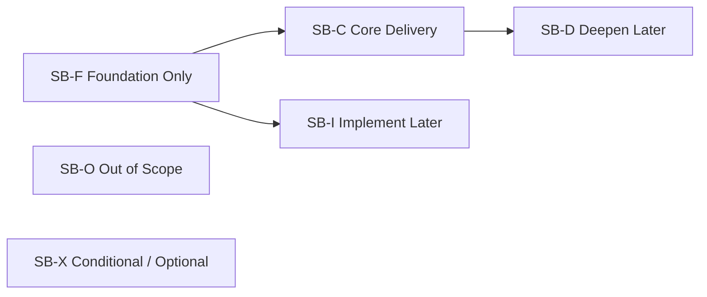
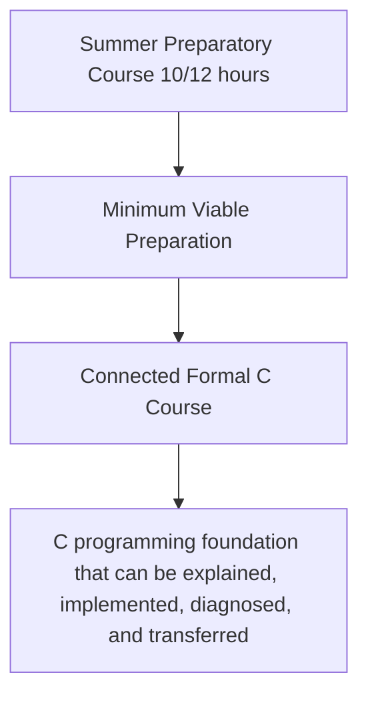

# Course Scope Boundary

Version: 0.2.1  
Status: Active design standard  
Governance note: This standard defines capability scope and maturity boundaries; the Constitution and official learning/assessment policy remain authoritative for governance, grading, and tool-use rules  
Corresponding Chinese version: [課程範圍邊界](06-scope-boundary.zh-TW.md)

## Document Purpose

This document defines capability scope, maturity boundaries, deferral rationale, and exclusions for the 2026 summer preparatory course and the connected formal C programming course.

It answers:

1. Which capabilities are required deliverables of the preparatory course?
2. Which capabilities establish only a mental model rather than independent implementation?
3. Which capabilities are deepened in the formal course?
4. Which content lies outside this course system?
5. Why are some concepts deferred or taught only to a particular maturity level?

This document does not assign weeks and does not preselect advanced data structures as formal-course core content. Acceptance, delivery, material, and assessment documents may cite its scope states and competency identifiers, but they must not use it to redefine assessment or AI/tool policy.

## Constitution 2.0 Alignment

- Understanding takes priority over completion; “introduced” must not be treated as “mastered.”
- The Chinese-taught and English-taught classes share the same core capabilities, maturity targets, and acceptance standards.
- Preparatory and formal courses form a continuous capability progression rather than repeat the same maturity activities.
- Scope decisions control cognitive load and record reasons for deferral.
- AI and other external tools are optional by default and must not be used to bypass missing prerequisite understanding.
- No core scope state, maturity target, or minimum-delivery line requires AI use or an AI-use record.
- This document must be reachable through the design governance index and repository navigation.

---

# 1. Scope State Model

| State code | Name | Definition |
|---|---|---|
| SB-C | Core Delivery | The learner must reach the stated maturity level and produce appropriate learning evidence by the end of the stage. |
| SB-F | Foundation Only | Establishes terminology, visual models, and purpose without claiming independent implementation. |
| SB-D | Deepen Later | An initial capability exists, while higher maturity is reserved for a later stage. |
| SB-I | Implement Later | The learner may understand or trace the concept while full implementation and diagnosis are intentionally deferred. |
| SB-O | Out of Scope | Not a core deliverable of this course system; direction may be provided when useful. |
| SB-X | Conditional / Optional | Applies only when an optional activity or tool is actually used, or when a specifically approved activity makes it an explicit objective. It is not a universal completion gate. |

Being introduced does not imply SB-C. A core deliverable without appropriate evidence may not be listed.

---

# 2. Course-Stage Positioning

## Preparatory Course

The preparatory course reduces differences in tools, execution models, and basic programming thinking before the formal course begins. It is not a compressed version of the formal course.

Core outcomes:

- Create, build, and run a minimal C program in the specified environment and perform initial diagnostic interpretation.
- Distinguish values, types, variables/objects, expressions, and program state.
- Trace sequence, conditions, and basic loops.
- Understand that functions decompose responsibilities and read basic calls.
- Establish expected results, simple tests, and an initial debugging process.
- Build introductory models of addresses, storage/lifetime, sequences, and records for later learning.

Optional external assistance, including AI, may be used when permitted by the activity. Its use is not a preparatory-course outcome. If a learner adopts an external suggestion, the learner remains responsible for explaining and technically verifying the adopted result.

## Formal Course

The formal course raises the preparatory models to implementation, diagnosis, and transfer, focusing on:

- Data, types, expressions, input/output, scope, and lifetime.
- Conditions, loops, and combined control flow.
- Function interfaces, problem decomposition, modularization, and basic recursion.
- Addresses, pointers, automatic and allocated storage duration, allocation/release, and memory errors.
- Sequences, strings, records, and basic data operations.
- Systematic testing, debugging, requirement modification, and regression verification.
- Technical claims that can be verified against the specified C standard and target toolchain/environment.

This document does not presume linked lists, trees, heaps, hash structures, or graphs to be core deliverables. Inclusion of any specific data structure must be justified through requirements, prerequisites, time, and acceptance evidence.

---

# 3. Preparatory-Course Scope Matrix

| Competency group | Preparatory state | Target maturity | Must include | Intentionally incomplete |
|---|---|---:|---|---|
| PC-E Program Translation and Execution | SB-C | L2–L4 | Conceptual source-to-execution responsibilities, distinction among translation/build, linkage when applicable, and execution problems, plus the specified environment's minimal build process | Object formats, ABI detail, loader relocation, and assumptions that every implementation exposes the same physical pipeline |
| PC-D Data and State | SB-C | L2–L4 | Values, types, variables/objects, initialization, assignment, expressions, and basic I/O | Full numeric representation, complex conversions, and complete undefined-behavior taxonomy |
| PC-C Flow and Control | SB-C | L2–L3 | Sequence, conditions, basic loops, state tracing, and termination | Complex nesting and large-scale control-flow design |
| PC-F Functions and Abstraction | SB-C / SB-F | L1–L3 | Purpose of functions, calls, parameters, returns, and responsibility decomposition | Full modularization, recursion implementation, and function pointers |
| PC-M Memory Model | SB-F | L1–L2 | Values/objects and storage, address concepts, and introductory storage-duration/lifetime models | Pointer implementation, allocation/release, and memory-error diagnosis |
| PC-O Data Organization | SB-F / SB-I | L1–L2 | Purpose of sequences, indexing, strings, and records | Full array/string/structure design and larger data operations |
| PC-V Testing, Debugging, and Verification | SB-C | L2–L4 | Expected results, normal/boundary cases, diagnostics, reproducible defects, and initial debugging | Large regression suites and cross-module diagnosis |
| PC-A Conditional External-Assistance Judgment | SB-X | No universal target | Only when assistance is actually used: independent initial reasoning, human review, reproducible verification, and any specifically required attribution | Universal AI use, fixed prompts, mandatory logs, non-use declarations, or AI as a prerequisite for completion |
| PC-I Integrated Development Cycle | SB-C | L3 | Understanding, tracing, modifying, testing, debugging, and reflecting on small problems | Independently completing large or multi-module projects |

## Minimum Preparatory Delivery Line

Without relying on a complete answer produced by another person or tool, students must be able to:

1. Explain the input, data/state, control, and output of a small C program.
2. Trace at least one condition or loop case step by step.
3. Modify one simple requirement and retest the result.
4. Use diagnostics and observed behavior to distinguish a translation/build problem from an incorrect execution result.
5. State an expected result, test it, and explain what the evidence does and does not establish.

Copying a program and producing correct output alone does not satisfy the core deliverable. AI use is not part of this minimum delivery line.

---

# 4. Formal-Course Scope Matrix

| Competency group | Formal-course state | Target maturity | Core delivery |
|---|---|---:|---|
| PC-E Program Translation and Execution | SB-C | L3–L5 | Diagnose translation/build, linkage when applicable, startup/runtime, and logic problems; explain the target toolchain's observed responsibilities without treating a conceptual pipeline as a language guarantee. |
| PC-D Data and State | SB-C | L4–L5 | Select types by meaning and handle operations, conversions, scope, lifetime, and relevant boundaries. |
| PC-C Flow and Control | SB-C | L4–L5 | Design, test, and diagnose conditions, loops, and combined flow. |
| PC-F Functions and Abstraction | SB-C | L4–L6 | Decompose problems with functions/modules, design interfaces, reason about scope/lifetime, and handle basic recursion. |
| PC-M Memory Model | SB-C | L3–L5 | Trace addresses and pointers, compare storage durations, allocate/release dynamic storage, and diagnose common faults with valid preconditions. |
| PC-O Data Organization | SB-C | L4–L5 | Use sequences, strings, and records and perform search, update, and basic rearrangement. |
| PC-V Testing, Debugging, and Verification | SB-C | L4–L6 | Design tests, locate faults, perform regression verification, and explain the limits of confidence. |
| PC-A Conditional External-Assistance Judgment | SB-X | No universal target | If assistance is used, verify adopted technical claims and explain relevant limitations/decisions. No AI-use evidence is required from students who do not use AI. |
| PC-I Integrated Development Cycle | SB-C | L5–L6 | Complete a cycle of requirements, design, implementation, testing, modification, debugging, explanation, and transfer. |

---

# 5. Important Deferral Decisions and Rationale

| Topic / capability | Preparatory treatment | Formal-course treatment | Why it is not taught fully earlier |
|---|---|---|---|
| Toolchain details | Understand conceptual responsibilities and the specified environment's visible diagnostics/artifacts | Deepen with target-toolchain output and failure cases | Early ABI, object-format, and implementation internals would overwhelm programming reasoning. |
| Scope and lifetime | Recognize local objects and simple scope | Diagnose shadowing, lifetime, aliasing, and interface problems | Requires functions and a stronger memory model first. |
| Sequences and indexing | Establish homogeneous collections and item-by-item processing | Full implementation, boundary testing, and memory relationships | Early pointer semantics would increase cognitive load. |
| Pointers | Build a visual model that addresses are values used under strict validity rules | Address-of, dereference, aliasing, sequence relationships, and debugging | Without objects, functions, lifetime, and memory models, `*` and `&` become memorized symbols. |
| Dynamic memory | Explain runtime size/lifetime needs | Allocation, resizing, release, failure handling, ownership, and diagnosis | Depends on pointers, lifetime, testing, size reasoning, and debugging. |
| Records | Recognize the need to group related fields | Definition, initialization, passing, and sequence-based processing | Requires types, function interfaces, and sequence capabilities. |
| Recursion | Establish the concept of smaller similar subproblems and termination | Implementation, activation tracing, and termination/resource diagnosis | Depends on stable function, condition, lifetime, and testing capabilities. |
| Optional external assistance | May be used only as permitted; not part of core delivery | May support learning but never replaces core reasoning, testing, modification, or verification | Tool use is not a universal programming capability and must not displace prerequisite learning. |

---

# 6. Explicit Exclusions and Tool Boundaries

The following are not core course deliverables:

- GUI, game-engine, and large-framework development.
- Network programming, concurrency, and multithreading.
- Operating-system kernels, device drivers, and complete embedded-hardware detail.
- Full assembly-language programming and compiler implementation.
- C++ object orientation, templates, and systematic standard-container instruction.
- Treating proficiency with one IDE as a substitute for language capability.
- Having AI, instructors, peers, or frameworks complete core functionality that the student cannot explain, test, modify, and verify.

Specific advanced data structures are neither included nor excluded merely by this sentence; they are later content decisions and must be justified rather than presumed.

---

# 7. Scope-Change Rules

Before adding or raising any core deliverable, confirm:

1. Which requirement, domain concept, knowledge node, and competency ID does it support?
2. Do students possess reasonable prerequisites?
3. Will it introduce too many new concepts at once?
4. Is there enough time for explanation/modeling, implementation or reasoning, testing, diagnosis, and verification?
5. Are there multiple evidence types rather than correct output alone?
6. Will it reduce practice and diagnosis time for existing core capabilities?
7. Will both language tracks retain the same core standard?
8. Will competency, acceptance, traceability, materials, and relevant navigation be updated together?
9. If an optional tool is involved, is the activity clearly marked conditional rather than promoted into a universal capability requirement?

Content that can only be rushed through as lecture or demonstration should be classified SB-F or deferred rather than labeled a core deliverable.

## Related Documents

- [Programming Competency Map](05-competency-map.en.md)
- [Competency Acceptance Model](07-acceptance-model.en.md)
- [Official Learning and Assessment Policy](13-learning-assessment-policy.en.md)
- [Instructional Design Workspace](README.en.md)
- [繁體中文版](06-scope-boundary.zh-TW.md)
