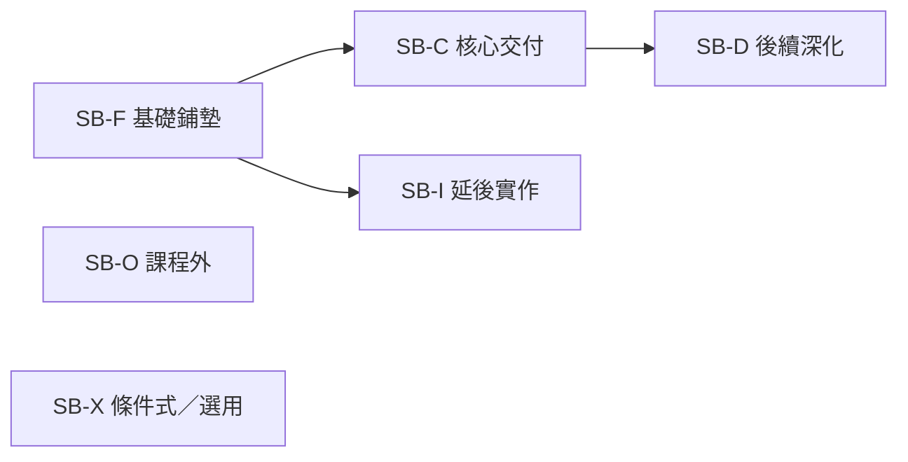
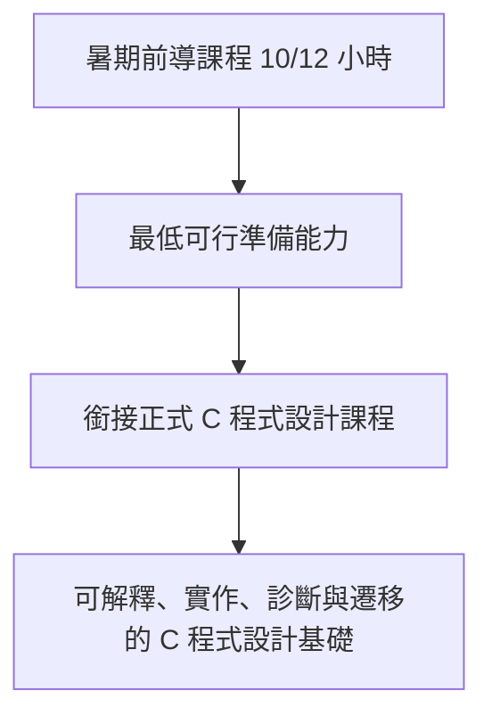

# 課程範圍邊界

版本：0.2.1  
狀態：現行設計標準  
治理說明：本標準定義能力範圍與成熟度邊界；治理、評分與工具使用規則仍以 Constitution 與正式學習／評量制度為權威來源  
對應英文版本：[Course Scope Boundary](06-scope-boundary.en.md)

## 文件目的

本文件定義 2026 暑期前導課程與銜接正式 C 程式設計課程的能力範圍、成熟度邊界、延後理由與排除項目。

本文件回答：

1. 哪些能力是前導課程的必要交付？
2. 哪些能力只建立心智模型，不要求獨立實作？
3. 哪些能力在正式課程深化？
4. 哪些內容不屬於本課程體系？
5. 為什麼某些概念延後，或只教到特定成熟度？

本文件不直接安排週次，也不預設進階資料結構屬於正式課程核心。驗收、交付、教材與評量文件可引用本文件的範圍狀態與能力識別碼，但不得用本文件重新定義評量或 AI／工具政策。

## Constitution 2.0 對齊原則

- 理解優先於完成，不因時間壓力把「介紹過」宣稱為「已掌握」。
- 中文班與英文班具有相同核心能力、成熟度目標與驗收標準。
- 前導與正式課程形成連續能力發展，不重複同一成熟度活動。
- 範圍決策控制認知負荷並記錄延後理由。
- AI 與其他外部工具預設為選用，且不得用來跨越尚未建立的先備理解。
- 任何核心範圍狀態、成熟度目標或最低交付線都不得要求使用 AI 或提交 AI 使用紀錄。
- 本文件必須可由設計治理索引與 repository 導覽抵達。

---

# 一、範圍狀態模型

| 狀態代碼 | 名稱 | 定義 |
|---|---|---|
| SB-C | 核心交付 | 階段結束時必須達到指定成熟度並具備合適學習證據。 |
| SB-F | 基礎鋪墊 | 建立名詞、視覺模型與存在理由，但不宣稱能獨立實作。 |
| SB-D | 後續深化 | 已建立初步能力，更高成熟度保留到後續階段。 |
| SB-I | 延後實作 | 可以理解或追蹤，但完整實作與診斷刻意延後。 |
| SB-O | 課程外 | 不屬於本課程核心交付，必要時只提供方向。 |
| SB-X | 條件式／選用 | 只有在選用活動或工具實際被使用，或經明確核准的活動把它列為目標時才適用；不是全體學生的完成門檻。 |

「介紹過」不等於 SB-C。任何核心交付若缺乏合適證據，不得列入。

---

# 二、課程階段定位

## 前導課程

前導課程的任務是降低正式課程開始時的工具、執行模型與基本程式思考落差。它不是正式課程的壓縮版。

核心成果：

- 在指定環境建立、建置並執行最小 C 程式，進行初步診斷判讀。
- 區分值、型別、變數／物件、運算式與程式狀態。
- 追蹤順序、條件與基本迴圈。
- 理解函數用來分解責任並閱讀基本呼叫。
- 建立預期結果、簡單測試與初步除錯流程。
- 對位址、儲存／生命週期、序列與記錄建立後續學習所需的初步模型。

在活動允許時，可選擇使用 AI 等外部協助，但「使用工具」本身不是前導課程成果。學生若採用外部建議，仍須自己負責解釋並以技術證據驗證所採用結果。

## 正式課程

正式課程將前導模型提升為實作、診斷與遷移能力，核心聚焦：

- 資料、型別、運算式、輸入輸出、範圍與生命週期。
- 條件、迴圈與組合控制流程。
- 函數介面、問題分解、模組化與基本遞迴。
- 位址、指標、自動與配置儲存期、配置／釋放及記憶體錯誤。
- 序列、字串、記錄與基本資料操作。
- 系統化測試、除錯、需求修改與回歸驗證。
- 能依指定 C 標準與目標工具鏈／環境驗證具體技術主張。

本文件不把鏈結串列、樹、Heap、Hash 或圖等進階資料結構預設為核心交付。是否納入任何具體資料結構，必須另行提出需求、先備、時數與驗收證據。

---

# 三、前導課程範圍矩陣

| 能力群組 | 前導狀態 | 目標成熟度 | 必須涵蓋 | 刻意不完成 |
|---|---|---:|---|---|
| PC-E 程式轉換與執行 | SB-C | L2–L4 | 原始碼到執行的概念責任、翻譯／建置、適用時的連結與執行問題區分，以及指定環境的最小建置流程 | 目的檔格式、ABI、載入重定位，以及所有實作都暴露相同實體 pipeline 的假設 |
| PC-D 資料與狀態 | SB-C | L2–L4 | 值、型別、變數／物件、初始化、指定、運算式與基本 I/O | 完整数值表示、複雜轉換與完整未定義行為分類 |
| PC-C 流程與控制 | SB-C | L2–L3 | 順序、條件、基本迴圈、狀態追蹤與終止條件 | 複雜巢狀與大型流程設計 |
| PC-F 函數與抽象 | SB-C／SB-F | L1–L3 | 函數存在理由、呼叫、參數、回傳與責任分解 | 完整模組化、遞迴實作與函數指標 |
| PC-M 記憶體模型 | SB-F | L1–L2 | 值／物件與儲存空間、位址概念、儲存期與生命週期初步模型 | 指標實作、配置／釋放與記憶體錯誤診斷 |
| PC-O 資料組織 | SB-F／SB-I | L1–L2 | 序列、索引、字串與記錄的存在理由 | 完整陣列／字串／結構設計與較大型資料操作 |
| PC-V 測試除錯與驗證 | SB-C | L2–L4 | 預期結果、正常／邊界案例、診斷資訊、可重現缺陷與初步除錯 | 大型回歸與跨模組診斷 |
| PC-A 條件式外部協助判斷 | SB-X | 無普遍目標 | 只有實際使用外部協助時：獨立初步推理、人工審查、可重現驗證，以及特定規則要求的必要標註 | AI 普遍必用、固定 prompt、強制 log、未使用聲明，或把 AI 當成完成先備 |
| PC-I 整合開發循環 | SB-C | L3 | 小型問題的理解、追蹤、修改、測試、除錯與反思 | 獨立完成大型或多模組專案 |

## 前導課程最低交付線

學生必須能在不依賴他人或工具產生完整答案的情況下：

1. 解釋小型 C 程式的輸入、資料／狀態、控制與輸出。
2. 逐步追蹤至少一個條件或迴圈案例。
3. 修改一項簡單需求並重新測試。
4. 根據診斷與觀察現象，區分翻譯／建置問題與錯誤執行結果。
5. 先提出一項預期結果，再進行測試並說明證據可以與不能證明什麼。

只複製程式並得到正確輸出，不算達成核心交付。使用 AI 不屬於此最低交付線。

---

# 四、正式課程範圍矩陣

| 能力群組 | 正式課程狀態 | 目標成熟度 | 核心交付 |
|---|---|---:|---|
| PC-E 程式轉換與執行 | SB-C | L3–L5 | 診斷翻譯／建置、適用時的連結、啟動／執行期與邏輯問題；解釋目標工具鏈實際責任，而不把概念 pipeline 誤當語言保證。 |
| PC-D 資料與狀態 | SB-C | L4–L5 | 依資料意義選型別，處理運算、轉換、範圍、生命週期與相關邊界。 |
| PC-C 流程與控制 | SB-C | L4–L5 | 設計、測試與診斷條件、迴圈及組合流程。 |
| PC-F 函數與抽象 | SB-C | L4–L6 | 以函數／模組分解問題、設計介面、推理範圍／生命週期並處理基本遞迴。 |
| PC-M 記憶體模型 | SB-C | L3–L5 | 追蹤位址與指標、比較儲存期、配置／釋放動態儲存空間，並在有效前提下診斷常見錯誤。 |
| PC-O 資料組織 | SB-C | L4–L5 | 使用序列、字串與記錄，完成搜尋、更新與基本重新排列。 |
| PC-V 測試除錯與驗證 | SB-C | L4–L6 | 設計測試、定位錯誤、執行回歸驗證並說明信心水準限制。 |
| PC-A 條件式外部協助判斷 | SB-X | 無普遍目標 | 若使用外部協助，能驗證被採用的技術主張並說明相關限制與決策；未使用 AI 的學生不需提供 AI 使用證據。 |
| PC-I 整合開發循環 | SB-C | L5–L6 | 完成需求、設計、實作、測試、修改、除錯、說明與遷移的完整循環。 |

---

# 五、重要延後決策與理由

| 主題／能力 | 前導處理 | 正式課程處理 | 為什麼不提前完整教授 |
|---|---|---|---|
| 工具鏈細節 | 理解概念責任與指定環境可見的診斷／產物 | 使用目標工具鏈輸出與失敗案例深化 | 過早深入 ABI、目的檔格式與實作內部細節會壓過程式思考。 |
| 範圍與生命週期 | 辨識區域物件與簡單範圍 | 診斷遮蔽、生命週期、別名與介面問題 | 需先建立函數與更穩定的記憶體模型。 |
| 序列與索引 | 建立同型集合與逐項處理概念 | 完整實作、邊界測試及與記憶體關係 | 過早混入指標語意會增加認知負荷。 |
| 指標 | 建立「位址是具有嚴格有效性規則的值」視覺模型 | 取址、解參考、別名、與序列關係及除錯 | 缺少物件、函數、生命週期與記憶體模型時，`*` 與 `&` 容易變成死背符號。 |
| 動態記憶體 | 說明執行期大小／生命週期需求 | 配置、調整大小、釋放、失敗處理、所有權與診斷 | 依賴指標、生命週期、測試、大小推理與除錯。 |
| 記錄 | 辨識需要把相關欄位群組化 | 定義、初始化、傳遞與序列化處理 | 依賴型別、函數介面與序列能力。 |
| 遞迴 | 建立較小相似子問題與終止概念 | 實作、activation 追蹤與終止／資源診斷 | 依賴穩定的函數、條件、生命週期與測試能力。 |
| 選用外部協助 | 依活動允許程度使用，但不屬核心交付 | 可支援學習，但不得取代核心推理、測試、修改與驗證 | 工具使用不是普遍程式能力，也不得擠壓先備學習。 |

---

# 六、明確排除與工具邊界

以下不屬於本課程核心交付：

- GUI、遊戲引擎與大型框架開發。
- 網路程式設計、concurrency 與 multithreading。
- 作業系統核心、device driver 與完整嵌入式硬體細節。
- 完整組合語言程式設計與 compiler implementation。
- C++ 物件導向、templates 與系統性標準容器教學。
- 把熟悉某一套 IDE 當成語言能力替代品。
- 由 AI、教師、同儕或框架完成學生自己無法解釋、測試、修改與驗證的核心功能。

具體進階資料結構不會僅因本段文字而自動納入或排除；它們屬後續內容決策，必須提出理由而不能預設。

---

# 七、範圍變更規則

新增或提高任何核心交付前，確認：

1. 它支援哪個需求、領域概念、知識節點與能力 ID？
2. 學生是否已具備合理先備能力？
3. 是否一次引入過多新概念？
4. 是否有足夠時間進行解釋／建模、實作或推理、測試、診斷與驗證？
5. 是否有多種證據，而非只看正確輸出？
6. 是否會壓縮既有核心能力的練習與診斷時間？
7. 兩個語言班是否仍保有相同核心標準？
8. 能力、驗收、追蹤、教材與相關導覽是否會同步更新？
9. 若涉及選用工具，活動是否明確標示為條件式，而不是被提升為全體學生的普遍能力要求？

若某內容只能匆忙以講述或示範帶過，應列為 SB-F 或延後，而不是標記成核心交付。

## 相關文件

- [程式設計能力地圖](05-competency-map.zh-TW.md)
- [能力驗收模型](07-acceptance-model.zh-TW.md)
- [正式學習與評量制度](13-learning-assessment-policy.zh-TW.md)
- [教學內容設計區](README.zh-TW.md)
- [English version](06-scope-boundary.en.md)
