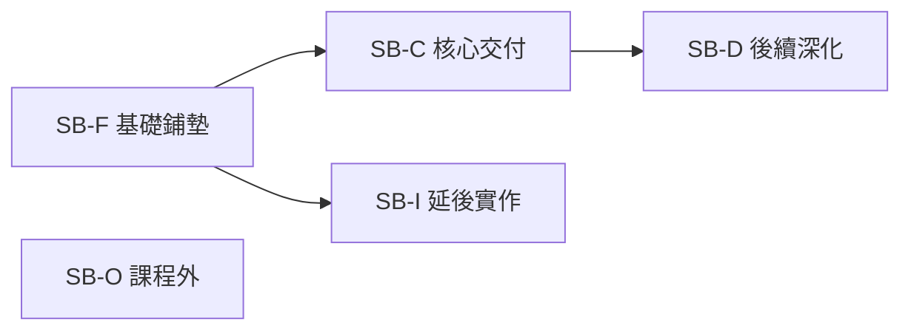
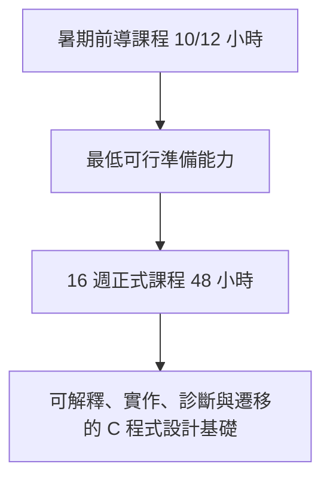

# 課程範圍邊界

版本：0.2.0  
狀態：架構草案  
對應英文版本：[Course Scope Boundary](06-scope-boundary.en.md)

## 文件目的

本文件定義 2026 暑期前導課程與後續 16 週正式 C 語言課程的能力範圍、成熟度邊界、延後理由與排除項目。

本文件回答：

1. 哪些能力是前導課程的必要交付？
2. 哪些能力只建立心智模型，不要求獨立實作？
3. 哪些能力應留到正式課程深化？
4. 哪些內容不屬於本課程體系？
5. 為什麼某些概念現在不教或只教到特定成熟度？

本文件不直接安排週次，也不預設進階資料結構屬於正式課程核心。後續驗收模型、交付地圖、教材與評量均須引用本文件的範圍狀態與能力識別碼。

## 憲法遵循

- 理解優先於完成，不因時間壓力把「看過」宣稱為「學會」。
- 中文班與英文班具有相同核心能力、成熟度與驗收標準。
- 前導與正式課程形成連續能力發展，不重複同一成熟度活動。
- 範圍決策控制認知負荷並記錄延後理由。
- AI 不得被用來跨越尚未建立的先備能力。
- 本文件必須由根 README 經明確導覽鏈抵達。

---

# 一、範圍狀態模型

| 狀態代碼 | 名稱 | 定義 |
|---|---|---|
| SB-C | 核心交付 | 階段結束時必須達到指定成熟度並具備正式學習證據。 |
| SB-F | 基礎鋪墊 | 建立名詞、視覺模型與存在理由，但不宣稱能獨立實作。 |
| SB-D | 延後深化 | 已建立初步能力，更高成熟度留待後續。 |
| SB-I | 延後實作 | 可以理解或追蹤，但完整實作與診斷刻意延後。 |
| SB-O | 課程外 | 不屬於本課程核心交付，必要時只提供方向。 |

「介紹過」不等於 SB-C。任何核心交付若沒有學習證據，不得列入。

---

# 二、課程階段定位

## 前導課程

前導課程的任務是降低正式課程開始時的工具、執行模型與基本程式思考落差。它不是正式課程的壓縮版。

核心成果：

- 建立、編譯、執行最小 C 程式並初步判讀錯誤。
- 區分值、型別、變數、運算式與程式狀態。
- 追蹤順序、條件與基本迴圈。
- 理解函數用來分解責任並閱讀基本呼叫。
- 建立預期結果、簡單測試與初步除錯流程。
- 使用 AI 前先表達自己的理解與卡點，並驗證 AI 建議。
- 對位址、儲存位置、序列與記錄建立後續學習所需的初步模型。

## 正式課程

正式課程將前導模型提升為實作、診斷與遷移能力，核心聚焦：

- 資料、型別、運算式、輸入輸出、範圍與生命週期。
- 條件、迴圈與組合控制流程。
- 函數介面、問題分解、模組化與基本遞迴。
- 位址、指標、自動與動態儲存期、配置、釋放及記憶體錯誤。
- 序列、字串、記錄與基本資料操作。
- 系統化測試、除錯、需求修改與回歸驗證。
- AI 回答的技術驗證與依賴風險管理。

本文件不把鏈結串列、樹、Heap、Hash 或圖等進階資料結構預設為核心交付。是否納入任何具體資料結構，必須在後續週次設計時另行提出需求、先備、時數與驗收證據。

---

# 三、前導課程範圍矩陣

| 能力群組 | 前導狀態 | 目標成熟度 | 必須涵蓋 | 刻意不完成 |
|---|---|---:|---|---|
| PC-E 程式轉換與執行 | SB-C | L2–L4 | 原始碼到執行流程、編譯／連結／執行問題區分、最小程式建置 | 目的檔格式、ABI、載入重定位細節 |
| PC-D 資料與狀態 | SB-C | L2–L4 | 值、型別、變數、初始化、指定、運算式、基本 I/O | 完整数值表示、複雜轉型、完整未定義行為分類 |
| PC-C 流程與控制 | SB-C | L2–L3 | 順序、條件、基本迴圈、狀態追蹤、終止條件 | 複雜巢狀與大型流程設計 |
| PC-F 函數與抽象 | SB-C／SB-F | L1–L3 | 函數存在理由、呼叫、參數、回傳與責任分解 | 完整模組化、遞迴實作、函數指標 |
| PC-M 記憶體模型 | SB-F | L1–L2 | 值與位置、位址概念、自動／動態儲存期初步圖像 | 指標實作、配置釋放、記憶體錯誤診斷 |
| PC-O 資料組織 | SB-F／SB-I | L1–L2 | 序列、索引、字串與記錄的存在理由 | 完整陣列／字串／結構設計與較大型資料操作 |
| PC-V 測試除錯與驗證 | SB-C | L2–L4 | 預期結果、正常與邊界案例、錯誤訊息、初步除錯 | 大型回歸與跨模組診斷 |
| PC-A AI 輔助學習 | SB-C | L2–L4 | 先自行理解、具體提問、測試 AI 建議、說明決策 | 用 AI 取代問題拆解、核心實作與驗證 |
| PC-I 整合開發循環 | SB-C | L3 | 小型題目的理解、追蹤、修改、測試與反思 | 獨立完成大型或多模組專案 |

## 前導課程最低交付線

學生必須能在不依賴完整答案生成的情況下：

1. 解釋小型 C 程式的輸入、資料、控制與輸出。
2. 逐步追蹤至少一個條件或迴圈案例。
3. 修改一項簡單需求並重新測試。
4. 根據錯誤資訊區分編譯問題與錯誤執行結果。
5. 說明一次 AI 建議如何被驗證、修改或拒絕。

只複製程式並得到正確輸出，不算達成核心交付。

---

# 四、正式課程範圍矩陣

| 能力群組 | 正式課程狀態 | 目標成熟度 | 核心交付 |
|---|---|---:|---|
| PC-E 程式轉換與執行 | SB-C | L3–L5 | 判斷編譯、連結與執行問題，解釋工具鏈責任。 |
| PC-D 資料與狀態 | SB-C | L4–L5 | 依資料意義選型別，處理運算、轉換、範圍與生命週期。 |
| PC-C 流程與控制 | SB-C | L4–L5 | 設計、測試與診斷條件、迴圈及組合流程。 |
| PC-F 函數與抽象 | SB-C | L4–L6 | 以函數分解問題、設計介面、控制作用域並處理基本遞迴。 |
| PC-M 記憶體模型 | SB-C | L3–L5 | 追蹤位址與指標、比較儲存期、配置與釋放動態記憶體並診斷常見錯誤。 |
| PC-O 資料組織 | SB-C | L4–L5 | 使用序列、字串與記錄，完成搜尋、更新與基本重新排列。 |
| PC-V 測試除錯與驗證 | SB-C | L4–L6 | 設計測試、定位錯誤、回歸驗證並說明可信度。 |
| PC-A AI 輔助學習 | SB-C | L4–L6 | 驗證 AI 程式與解釋，辨識錯誤假設、虛構功能、未定義行為與不必要複雜度。 |
| PC-I 整合開發循環 | SB-C | L5–L6 | 完成需求、設計、實作、測試、修改、除錯、說明與遷移的完整循環。 |

---

# 五、重要延後決策與理由

| 主題／能力 | 前導處理 | 正式課程處理 | 為什麼不提前完整教授 |
|---|---|---|---|
| 工具鏈細節 | 以流程圖理解責任與錯誤階段 | 使用工具輸出與錯誤案例深化 | 過早深入機器碼與格式會壓過程式思考。 |
| 作用域與生命週期 | 辨識區域變數與簡單範圍 | 診斷遮蔽、生命週期與介面問題 | 需先建立函數與記憶體模型。 |
| 序列與索引 | 建立同型資料集合與逐項處理概念 | 完整實作、邊界測試及與記憶體關係 | 過早混入指標語意會增加認知負荷。 |
| 指標 | 建立「位址也是資料」的視覺模型 | 取址、解參考、別名、與序列關係及除錯 | 缺少變數、函數與記憶體模型時只會背 `*` 與 `&`。 |
| 動態記憶體 | 說明執行期大小或生命週期需求 | 配置、重新配置、釋放、失敗處理與診斷 | 依賴指標、生命週期、測試與除錯。 |
| 記錄 | 辨識將相關欄位組合的需求 | 定義、初始化、傳遞、序列化處理 | 需先建立型別、函數介面與序列能力。 |
| 遞迴 | 建立問題可分成較小相似問題的概念 | 實作、呼叫堆疊追蹤與終止診斷 | 依賴穩定函數、條件、堆疊與測試能力。 |
| AI 完整答案 | 不視為學習活動 | 仍不得取代核心設計與驗證 | 會跨越理解、分解、追蹤與診斷。 |

---

# 六、明確排除與工具邊界

下列不屬於本課程核心交付：

- GUI、遊戲引擎與大型框架開發。
- 網路程式設計、並行與多執行緒。
- 作業系統核心、驅動程式與完整嵌入式硬體細節。
- 完整組合語言程式設計與編譯器實作。
- C++ 物件導向、模板與標準容器系統教學。
- 以特定 IDE 熟練度取代語言能力。
- 由 AI、教師或框架完成學生不理解的核心功能。

具體資料結構不在此階段被列為核心或排除；它們是後續課程內容決策，不應在目前範圍模型中被預設。

---

# 七、範圍變更規則

新增或提高任何核心交付前，必須確認：

1. 支援哪項需求、領域概念、知識節點與能力 ID？
2. 學生是否具備合理先備能力？
3. 是否一次引入過多新概念？
4. 是否有時間完成視覺模型、文字說明、實作、測試與驗證？
5. 是否至少有兩種證據，而非只看輸出？
6. 是否會壓縮既有核心能力的練習與診斷時間？
7. 中英文班是否仍維持相同核心標準？
8. README、能力地圖、驗收模型與追蹤文件是否同步更新？

只能匆促講授或展示的內容，應列為 SB-F 或延後，不得宣稱為核心交付。

## 導覽

- [上一階段：程式設計能力地圖](05-competency-map.zh-TW.md)
- [下一階段：能力驗收模型](07-acceptance-model.zh-TW.md)
- [返回教學內容設計區](README.zh-TW.md)
- [English version](06-scope-boundary.en.md)
