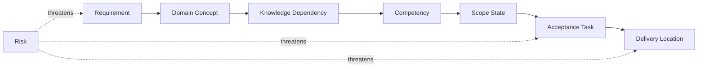

# Course Design Traceability Matrix

Version: 0.1.0  
Status: Architecture draft  
Corresponding Chinese version: [課程設計追蹤矩陣](10-traceability-matrix.zh-TW.md)

## Document Purpose

This document establishes an end-to-end traceability chain from educational requirements to actual course delivery and risk control. It ensures that every official requirement has corresponding concepts, competencies, scope, acceptance, and delivery locations, and that every core competency can be traced back to an explicit requirement.

It answers:

1. Which domain concepts and knowledge dependencies support each requirement?
2. Which competencies realize the requirement?
3. At what stage and maturity is the requirement delivered?
4. Which acceptance tasks and evidence establish the capability?
5. Which risks may break the traceability chain?
6. When a document, material, or assessment changes, what else must be reviewed?

This document is not a material inventory or item-level grading rubric. Future materials, activities, assignments, and assessments must cite the requirement and competency identifiers in this matrix.

## Constitutional Compliance

- Every core deliverable must have a requirement source and acceptance evidence.
- No core topic may be created without a requirement basis.
- Chinese and English versions use identical identifiers and trace relationships.
- Correct output may not be the only acceptance evidence.
- AI use must trace to human verification and student responsibility.
- The matrix must not smuggle advanced data structures into the C-course core.

---

# 1. Traceability-Chain Model



A complete traceability chain means:

```text
Requirement
→ Domain concept
→ Knowledge dependency
→ Competency
→ Scope and maturity
→ Acceptance task and evidence
→ Course delivery location
→ Risk control
```

If any segment is missing, the design is incomplete.

---

# 2. Identifier Reference

| Type | Prefix | Source document |
|---|---|---|
| Educational requirement | EDU | `02-requirements-map` |
| Core capability requirement | CAP | `02-requirements-map` |
| Cross-cutting requirement | X | `02-requirements-map` |
| Delivery requirement | DEL | `02-requirements-map` |
| Quality requirement | NFR | `02-requirements-map` |
| Domain concept | DM | `03-programming-domain-model` |
| Knowledge node | KG | `04-programming-language-knowledge-graph` |
| Student competency | PC | `05-competency-map` |
| Scope state | SB | `06-scope-boundary` |
| Acceptance task | AT | `07-acceptance-model` |
| Risk | R | `09-risk-register` |

---

# 3. Highest-Level Educational Requirement Traceability

| Requirement | Main domain / knowledge | Core competencies | Scope and maturity | Main acceptance | Main delivery location | Main risks |
|---|---|---|---|---|---|---|
| EDU-01 Transferable mental model | DM-D, DM-C, DM-F, DM-M; KG-D, KG-C, KG-F, KG-M | PC-D, PC-C, PC-F, PC-M, PC-I | Preparatory L1–L4; formal L4–L6 | AT-02, 03, 04, 10, 12 | Preparatory throughout; formal Weeks 1–10 and 14–16 | R-02, R-04, R-06 |
| EDU-02 Genuine problem solving | DM-F, DM-V; KG-F, KG-V | PC-F, PC-V, PC-I | Preparatory L2–L4; formal L4–L6 | AT-05, 06, 08, 09, 10 | Chinese Sessions 2–4; English Sessions 2–5; formal Weeks 3–6 and 11–16 | R-02, R-05, R-09 |
| EDU-03 Complete development cycle | DM-V, DM-A; KG-V, KG-A | PC-V, PC-A, PC-I | Preparatory L3–L4; formal L4–L6 | AT-06, 07, 08, 11, 12 | Chinese Session 4; English Session 5; formal throughout | R-01, R-05, R-12 |
| EDU-04 Responsible AI collaboration | DM-A, DM-V; KG-A, KG-V | PC-A, PC-V, PC-I | Preparatory L2–L4; formal L4–L6 | AT-11, AT-12, EV-AI, EV-TE | Preparatory integration unit; at least once in every formal phase | R-01, R-05, R-12 |

---

# 4. Core Capability Requirement Traceability

## 4.1 Data and State

| Requirement | Domain / knowledge | Competencies | Preparatory scope | Formal scope | Minimum acceptance | Delivery location | Risks |
|---|---|---|---|---|---|---|---|
| CAP-D01 Values, variables, and state | DM-D01–D03, D07; KG-D01–D03 | PC-D01, PC-D03 | SB-C, L2–L3 | SB-C, L4–L5 | AT-03, 04, 12 | Chinese 1–2; English 2; formal 1–2 | R-02, R-09 |
| CAP-D02 Basic data types | DM-D01–D02; KG-D01–D02 | PC-D02 | SB-C, L2 | SB-C, L4–L5 | AT-01, 02, 05, 09 | Chinese 2; English 2; formal 2 | R-02, R-09 |
| CAP-D03 Expressions | DM-D05–D07; KG-D03–D04 | PC-D03, PC-D04 | SB-C, L3 | SB-C, L4–L5 | AT-03, 05, 07 | Chinese 2; English 2; formal 2–3 | R-05 |
| CAP-D04 Input and output | DM-D08; KG-D05 | PC-D05 | SB-C, L4 | SB-C, L5 | AT-05, 06, 08 | Chinese 1–2; English 1–2; formal 2 | R-08 |

## 4.2 Control Flow

| Requirement | Domain / knowledge | Competencies | Preparatory scope | Formal scope | Minimum acceptance | Delivery location | Risks |
|---|---|---|---|---|---|---|---|
| CAP-C01 Sequential execution | DM-C01–C02; KG-C01 | PC-C01 | SB-C, L3 | SB-C, L5 | AT-03, 12 | Chinese 1–2; English 2–3; formal 1–3 | R-02, R-05 |
| CAP-C02 Conditional selection | DM-C03–C04; KG-C02–C03 | PC-C02, PC-C03 | SB-C, L2–L3 | SB-C, L4–L5 | AT-03, 05, 06, 08 | Chinese 2; English 3; formal 3 | R-05, R-09 |
| CAP-C03 Repetition | DM-C05–C06; KG-C04–C05 | PC-C04–PC-C06 | SB-C, L3 | SB-C, L4–L5 | AT-03, 07, 08 | Chinese 3; English 3; formal 3 | R-02, R-05 |
| CAP-C04 Combined control | DM-C01–C06; KG-C01–C05 | PC-C07, PC-I01 | SB-F / SB-I, L1–L3 | SB-C, L5 | AT-05, 06, 07, 09 | Chinese 4; English 5; formal 3 and 14–16 | R-02, R-04 |

## 4.3 Functions and Problem Decomposition

| Requirement | Domain / knowledge | Competencies | Preparatory scope | Formal scope | Minimum acceptance | Delivery location | Risks |
|---|---|---|---|---|---|---|---|
| CAP-F01 Function responsibility | DM-F01–F04; KG-F01 | PC-F01 | SB-C, L2 | SB-C, L5 | AT-02, 04, 12 | Chinese 3; English 4; formal 4–6 | R-02 |
| CAP-F02 Definition and call | DM-F03–F07; KG-F02–F04 | PC-F02, PC-F03 | SB-C / SB-F, L2–L3 | SB-C, L4–L5 | AT-03, 05, 08 | Chinese 3; English 4; formal 4 | R-05, R-09 |
| CAP-F03 Problem decomposition | DM-F01–F08; KG-F01–F06 | PC-F01, PC-F05, PC-I01 | SB-F, L1–L2 | SB-C, L5–L6 | AT-04, 06, 09, 10 | Preparatory integration unit; formal 5–6 and 14–16 | R-02, R-04 |
| CAP-F04 Scope and data transfer | DM-D09–D10, DM-F05–F07; KG-F03–F05, KG-M01 | PC-D06, PC-F04 | SB-F, L1 | SB-C, L4–L5 | AT-03, 04, 07 | Preparatory function unit; formal 4–6 | R-06, R-09 |

---

# 5. Cross-Cutting Requirement Traceability

| Requirement | Competencies | Acceptance evidence | Required delivery locations | Main risk controls |
|---|---|---|---|---|
| X-01 Execution model | PC-E01–E04 | EV-EX, EV-VI, EV-DE | First preparatory unit; formal Week 1 and later diagnosis | R-08, R-11 |
| X-02 Reading and explanation | All PC groups | EV-EX, EV-TR, EV-VI | Every major unit | R-01, R-05 |
| X-03 Testing and verification | PC-V01, V03, V05 | EV-TE, EV-EX | At least one formal artifact in every major phase | R-05, R-12 |
| X-04 Debugging and modification | PC-E03, PC-V02–V04, PC-I01 | EV-DE, EV-MO, EV-TE | At least once in preparatory; at least once in every formal phase | R-05, R-08 |
| X-05 Communication and reflection | PC-F01, PC-A05, PC-I01 | EV-EX, EV-RE, AT-12 | Preparatory graduation evidence package; formal integrated acceptance | R-01, R-05 |
| X-06 AI literacy | PC-A01–A05 | EV-AI, EV-TE, AT-11 | Preparatory integration unit; every formal phase | R-01, R-12 |

---

# 6. Delivery and Quality Requirement Traceability

| Requirement | Design implementation | Verification method | Related risks |
|---|---|---|---|
| DEL-01 Shared core capabilities | `05`, `06`, and `07` use shared competencies and standards | Compare bilingual delivery tables and minimum evidence packages | R-03, R-10 |
| DEL-02 Different pacing, one baseline | `08` defines Chinese 4×3 and English 5×2 mappings | Verify identical competency IDs, maturity, and minimum evidence | R-03, R-09 |
| DEL-03 Preparatory-formal continuity | `08` raises maturity instead of repeating topics | Check whether formal weeks repeat tasks at the same maturity | R-04 |
| DEL-04 Capabilities before weeks | `04`, `05`, and `08` form dependency-to-delivery chains | Every week must cite competencies and acceptance tasks | R-02, R-07 |
| DEL-05 Formative evidence first | `07` defines reassessment and multiple evidence | Verify that preparatory delivery does not depend on one high-stakes assessment | R-05 |
| NFR-01 Bilingual equivalence | Official documents are bilingual pairs | Compare filenames, versions, IDs, and matrices item by item | R-03, R-10 |
| NFR-02 Traceability | This document creates the end-to-end matrix | Sample requirements and trace them to delivery and evidence | R-10 |
| NFR-03 Cognitive-load control | `06` scope states and `08` pacing | Review new-concept count and activity load per unit | R-02, R-06, R-09 |
| NFR-04 Fairness | Same core standards with different pacing and remediation | Compare tasks, pass rates, and reassessment patterns | R-03, R-09 |
| NFR-05 Maintainability | Stable IDs, versions, navigation, and change rules | Check broken links, obsolete IDs, and single-language documents | R-10 |
| NFR-06 Technical accuracy | Human review of code, terminology, and AI content | Execute code, verify documentation, and conduct peer review | R-11, R-12 |
| NFR-07 Adaptability | Preserve core and evidence while adjusting quantity and context | Change records must show that standards were not lowered | R-02, R-04 |

---

# 7. Competency Group to Delivery-Phase Overview

| Competency group | Preparatory delivery | Main formal-course phase | Core acceptance |
|---|---|---|---|
| PC-E Translation and execution | First unit | Week 1 and diagnosis throughout | AT-04, 05, 07, 12 |
| PC-D Data and state | First two units | Weeks 1–3 | AT-03, 05, 06, 08 |
| PC-C Flow and control | Middle units | Weeks 2–3 and 14–16 | AT-03, 06, 07, 08 |
| PC-F Functions and abstraction | Later function unit | Weeks 4–6 and 14–16 | AT-04, 05, 06, 09 |
| PC-M Memory model | Foundation only | Weeks 7–10 | AT-03, 04, 07, 12 |
| PC-O Data organization | Foundation only | Weeks 9–13 | AT-05, 06, 08, 09 |
| PC-V Testing, debugging, verification | Throughout | Throughout | AT-07, 08, 12 |
| PC-A AI-assisted learning | Integration unit | At least once per phase | AT-11, 12 |
| PC-I Integrated cycle | Final preparatory unit | Weeks 14–16 | AT-06, 07, 08, 10, 12 |

---

# 8. Gap and Orphan Checks

Before every official release, verify:

1. Does any requirement lack a competency?
2. Does any competency lack a requirement source?
3. Does any `SB-C` competency lack a minimum acceptance task?
4. Does any acceptance task lack a delivery location?
5. Does any official week lack a competency ID or acceptance purpose?
6. Does any material or assessment cite an obsolete ID?
7. Do Chinese and English versions differ in maturity, scope, or evidence?
8. Has an advanced data structure been added without requirement and scope review?
9. Does any high-risk item lack preventive and contingency actions?

A gap may not be closed by adding a vague link. The substantive design must be corrected.

---

# 9. Change-Impact Rules

| Change type | At minimum, recheck |
|---|---|
| Requirement change | Domain model, knowledge dependencies, competencies, scope, acceptance, delivery, and risks |
| New or modified competency | Requirement source, prerequisites, maturity, evidence, delivery location, and risks |
| Scope-state change | Acceptance, pacing, reassessment, and materials |
| Acceptance-method change | Competency maturity, fairness, AI boundaries, and instructor workload |
| Week or session change | Prerequisite dependencies, core evidence, bilingual equivalence, and cognitive load |
| New tool or AI workflow | Technical accuracy, accessibility, privacy, verification, and fallback plan |

---

# 10. Completion Criteria

After this matrix is established, the course design must be able to:

- Trace any core requirement to actual delivery and acceptance evidence.
- Trace any core competency back to educational requirements and knowledge prerequisites.
- Find orphan items with no requirement source, acceptance, or delivery location.
- Determine which items must be synchronized when a document changes.
- Demonstrate that the Chinese and English tracks share the same core standard.
- Demonstrate that the formal course has not drifted away from C-programming foundations because of advanced data structures.

## Navigation

- [Previous stage: Course Risk Register](09-risk-register.en.md)
- [Back to Instructional Design Workspace](README.en.md)
- [繁體中文版](10-traceability-matrix.zh-TW.md)
