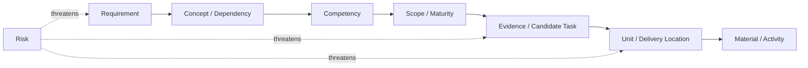

# Course Design Traceability Matrix

Version: 0.1.1  
Status: Revisable planning and traceability model  
Governance note: This matrix records relationships among existing requirements, standards, planning models, materials, and risks. It does not create new policy.  
Corresponding Chinese version: [課程設計追蹤矩陣](10-traceability-matrix.zh-TW.md)

## Document Purpose

This document maintains an end-to-end traceability chain from educational requirements to concepts, competencies, scope, evidence patterns, delivery locations, materials, and risk controls.

A traceability link is descriptive, not an authority claim. When this matrix conflicts with the Constitution, official learning/assessment policy, or an approved design standard, the higher-authority source prevails and the matrix must be corrected.

## Constitution 2.0 Alignment

- Every core deliverable has a requirement basis and suitable learning evidence.
- No core topic is added solely because it is fashionable, tool-specific, or convenient to schedule.
- Chinese and English versions use the same identifiers and substantive relationships.
- Correct output, successful build, OJ success, attendance, or tool approval alone is not sufficient evidence of capability.
- AI and other external tools are optional. External-assistance traceability is conditional on actual use and must never become a universal completion or assessment path.
- Technical mappings distinguish conceptual models from target-implementation facts.

---

# 1. Traceability Chain



A complete core chain should normally answer:

```text
Why is this required?
→ What concept/dependency supports it?
→ What can the learner do?
→ At what scope/maturity?
→ What evidence can show it?
→ Where is it taught/practiced?
→ Which material implements it?
→ Which risks can invalidate it?
```

A gap is fixed by correcting the substantive design, not by adding a decorative cross-link.

---

# 2. Identifier Reference

| Type | Prefix | Source |
|---|---|---|
| Stakeholder need | ST | `02-requirements-map.*` |
| Educational requirement | EDU | `02-requirements-map.*` |
| Core capability requirement | CAP | `02-requirements-map.*` |
| Cross-cutting requirement | X | `02-requirements-map.*` |
| Delivery requirement | DEL | `02-requirements-map.*` |
| Quality/governance requirement | NFR | `02-requirements-map.*` |
| Domain concept | DM | `03-programming-domain-model.*` |
| Knowledge node | KG | `04-programming-language-knowledge-graph.*` |
| Competency | PC | `05-competency-map.*` |
| Scope state | SB | `06-scope-boundary.*` |
| Candidate acceptance/evidence task | AT | `07-acceptance-model.*` |
| Concept Registry item | CT | `15-programming-concept-registry.*` |
| Preparatory / formal Unit | P-U / F-U | `16-unit-map.*` |
| Risk | R | `09-risk-register.*` |

---

# 3. Highest-Level Educational Requirements

| Requirement | Concept / knowledge basis | Main competencies | Scope / maturity direction | Candidate evidence | Main delivery/material locations | Main risks |
|---|---|---|---|---|---|---|
| EDU-01 Transferable programming mental model | DM-D/C/F/M; KG-D/C/F/M | PC-D, PC-C, PC-F, PC-M, PC-I | Preparatory foundations through L1–L4; formal core toward L4–L6 | EV-EX, EV-VI, EV-TR, EV-MO; AT-02/03/04/10/12 | P-U01–P-U04; F-U01–F-U12 as relevant | R-02, R-04, R-06, R-19 |
| EDU-02 Genuine problem solving | DM-F, DM-V; KG-F, KG-V | PC-F, PC-V, PC-I | Preparatory L2–L4; formal L4–L6 | EV-EX, EV-MO, EV-TE, EV-DE; AT-05/06/08/09/10 | P-U02–P-U04; formal integrated work, especially F-U10–F-U12 | R-02, R-05, R-09 |
| EDU-03 Complete development cycle | DM-V; KG-V | PC-V, PC-I | Preparatory L3–L4; formal L4–L6 | EV-TE, EV-DE, EV-MO, EV-RE; AT-06/07/08/12 | All Units include verification; strongest integration in P-U04 and F-U11–F-U12 | R-05, R-15, R-16 |
| EDU-04 Responsibility for adopted external assistance | Conditional DM-A / KG-A plus DM-V / KG-V | Conditional PC-A plus relevant core competency | SB-X; no universal maturity target | EV-AI only when applicable; AT-11 when applicable | Optional extensions in materials or assessment discussion only when assistance was actually used | R-01, R-13, R-14 |

EDU-04 does not create a requirement to use AI. The core development cycle remains complete without traversing DM-A, KG-A, PC-A, EV-AI, or AT-11.

---

# 4. Core Capability Requirement Traceability

## 4.1 Data and State

| Requirement | Concepts / knowledge | Competencies | Preparatory scope | Formal direction | Candidate evidence | Main Units | Risks |
|---|---|---|---|---|---|---|---|
| CAP-D01 Values, variables/objects, state | DM-D01–D03; KG-D01–D03 | PC-D01, PC-D03 | SB-C L2–L3 | L4–L5 | EV-TR, EV-EX, EV-VI | P-U02; F-U01 and later state-heavy Units | R-02, R-09 |
| CAP-D02 Basic data types | DM-D01–D02; KG-D01–D02 | PC-D02 | SB-C L2 | L4–L5 | EV-EX, EV-CO, EV-IM | P-U02; F-U01 | R-02, R-09 |
| CAP-D03 Expressions | DM-D05–D07; KG-D04–D06 | PC-D03, PC-D04 | SB-C L3 | L4–L5 | EV-TR, EV-IM, EV-DE | P-U02–P-U03; F-U01–F-U02 | R-05 |
| CAP-D04 Input/output | DM-D08; KG-D07 | PC-D05 | SB-C L4 | L5 | EV-IM, EV-TE, EV-EX | P-U01–P-U02; F-U04/F-U09 as deeper interaction contexts | R-08, R-18 |

## 4.2 Control Flow

| Requirement | Concepts / knowledge | Competencies | Preparatory scope | Formal direction | Candidate evidence | Main Units | Risks |
|---|---|---|---|---|---|---|---|
| CAP-C01 Sequential execution | DM-C01–C02; KG-C01 | PC-C01 | SB-C L3 | L5 | EV-TR, EV-EX | P-U01–P-U02; reused throughout | R-02, R-05 |
| CAP-C02 Conditional selection | DM-C03–C04; KG-C02–C03 | PC-C02, PC-C03 | SB-C L2–L3 | L4–L5 | EV-TR, EV-IM, EV-TE | P-U03; F-U02 | R-05, R-09 |
| CAP-C03 Repetition | DM-C05–C06; KG-C04–C06 | PC-C04–PC-C06 | SB-C L3 | L4–L5 | EV-TR, EV-DE, EV-TE | P-U03; F-U02–F-U04 | R-02, R-05 |
| CAP-C04 Combined control | DM-C; KG-C | PC-C07, PC-I01 | Foundation / early integration | L5 | EV-VI, EV-IM, EV-MO, EV-DE | P-U04; F-U02 and integrated F-U12 | R-02, R-04 |

## 4.3 Functions and Problem Decomposition

| Requirement | Concepts / knowledge | Competencies | Preparatory scope | Formal direction | Candidate evidence | Main Units | Risks |
|---|---|---|---|---|---|---|---|
| CAP-F01 Function responsibility | DM-F01–F04; KG-F01–F04 | PC-F01 | SB-C L2 | L5 | EV-EX, EV-VI | P-U04; F-U05/F-U10/F-U12 | R-02 |
| CAP-F02 Define/call basic functions | DM-F03–F07; KG-F03–F08 | PC-F02, PC-F03 | SB-C / foundation L2–L3 | L4–L5 | EV-IM, EV-TR, EV-TE | P-U04; F-U05/F-U10 | R-05, R-09 |
| CAP-F03 Decomposition | DM-F01–F08; KG-F | PC-F01, PC-F05, PC-I01 | Foundation | L5–L6 | EV-VI, EV-MO, EV-CO, EV-RE | P-U04; F-U10–F-U12 | R-02, R-04, R-16 |
| CAP-F04 Scope/data transfer | DM-D09–D10, DM-F05–F07; KG-D08–D09, KG-F | PC-D06, PC-F04 | Foundation | L4–L5 | EV-VI, EV-TR, EV-DE | P-U04 foundation; F-U05/F-U06/F-U10 | R-06, R-09 |

---

# 5. Cross-Cutting Requirements

| Requirement | Competencies | Core evidence direction | Delivery coverage | Risk controls |
|---|---|---|---|---|
| X-01 Execution model | PC-E01–E04 | EV-EX, EV-VI, EV-DE | P-U01; reused in build/diagnosis activities including F-U10–F-U11 | R-08, R-18, R-19 |
| X-02 Reading and explanation | All core PC groups | EV-EX, EV-TR, EV-VI | Every major Unit | R-01, R-05 |
| X-03 Testing and verification | PC-V01, V03, V05 | EV-TE, EV-EX, EV-DE | Every Unit includes verification; F-U11 deepens it | R-05, R-15 |
| X-04 Debugging and modification | PC-E03, PC-V02–V04, PC-I01 | EV-DE, EV-MO, EV-TE | Recurrent from preparatory work through F-U12 | R-05, R-08 |
| X-05 Communication and reflection | PC-F01, PC-I01 and other relevant PC groups | EV-EX, EV-RE | Recurrent student explanations, modifications, and final oral evidence | R-01, R-05, R-12 |
| X-06 Verify adopted external assistance | Conditional PC-A plus relevant core PC | EV-AI only if applicable, backed by EV-TE/EV-DE/EV-EX | Optional/conditional only; never required merely to complete a Unit | R-01, R-13, R-14 |

---

# 6. Delivery and Quality Requirements

| Requirement | Design implementation | Verification direction | Related risks |
|---|---|---|---|
| DEL-01 Shared core capabilities | `05`, `06`, `08`, `16`, and paired materials preserve common core | Compare IDs, core questions, technical depth, and completion evidence across tracks/languages | R-03, R-10 |
| DEL-02 Different pacing, one baseline | `08` defines different preparatory pacing without changing core capability | Compare track mappings and ensure differences are pacing/scaffolding only | R-03, R-09 |
| DEL-03 Preparatory-formal continuity | `06`, `08`, `16` raise maturity instead of resetting | Check repeated concepts for deeper evidence rather than identical tasks | R-04 |
| DEL-04 Capabilities before weeks | `04`–`06` and `16` derive Units from concepts/dependencies/capability | Each Unit should trace to capabilities and evidence rather than a week label alone | R-02, R-07 |
| DEL-05 Formative evidence first | Implemented through official policy, acceptance planning, and materials | Confirm practice supports feedback and does not invent a third grade source | R-05 |
| NFR-01 Bilingual equivalence | Bilingual paired documents/materials | Compare path pairs, version/status, IDs, tables, code, links, and substantive rules | R-03, R-10 |
| NFR-02 Traceability | This matrix plus stable IDs | Sample requirements and trace them to Units/material/evidence and back | R-10, R-17 |
| NFR-03 Cognitive-load control | `06`, `08`, `16` | Review new-concept load, scaffolding, and practice density | R-02, R-06, R-09 |
| NFR-04 Fairness | Same core with varied pacing/support | Review evidence expectations and accessibility rather than only raw completion rates | R-03, R-12 |
| NFR-05 Maintainability | Governance index, stable IDs, bilingual paths, active audit | Check stale links, obsolete IDs/status, orphan files, and duplicated policy | R-10, R-17 |
| NFR-06 Technical accuracy | Technical contracts, examples, compiler/reference verification | Build/run appropriate examples and verify standard/toolchain claims | R-08, R-18, R-19 |
| NFR-07 Adaptability | Core standards stay stable while examples/pacing may vary | Change records show which dependencies were checked | R-02, R-04, R-17 |

---

# 7. Competency-to-Unit Overview

| Competency group | Preparatory coverage | Formal coverage | Evidence emphasis |
|---|---|---|---|
| PC-E Translation/execution | P-U01 | F-U10 plus diagnosis throughout | explanation, build evidence, diagnostics |
| PC-D Data/state | P-U02 | F-U01 and reused throughout | trace, implementation, boundaries |
| PC-C Flow/control | P-U03 | F-U02 and reused throughout | trace, tests, diagnosis |
| PC-F Functions/abstraction | P-U04 | F-U05, F-U10, F-U12 | decomposition, interface, modification |
| PC-M Memory/lifetime | preparatory foundation | F-U03–F-U08 as relevant | diagrams, validity, lifetime, failure cases |
| PC-O Data organization | preparatory foundation | F-U03, F-U04, F-U07, F-U09 | bounds, layout, transformations |
| PC-V Testing/debugging/verification | every preparatory Unit | every formal Unit; deepened in F-U11 | expected results, tests, diagnosis, regression |
| PC-A Conditional external assistance | optional extension only | optional extension only | EV-AI only if assistance was actually used |
| PC-I Integrated cycle | P-U04 | F-U12 and integrated work throughout | requirements→design→test→modify→explain |

---

# 8. Gap and Orphan Checks

Before declaring a repository audit or release complete, check:

1. Does every core requirement have one or more competencies?
2. Does every core competency have a requirement or approved design basis?
3. Does every SB-C capability have suitable evidence patterns?
4. Does every core Unit have capability/evidence traceability?
5. Does each current student material correspond to an approved Unit or documented exception?
6. Do any materials cite obsolete IDs, old Constitution versions, or superseded policy?
7. Are Chinese and English pairs substantively equivalent?
8. Has an optional tool or AI branch accidentally become a universal prerequisite, required activity, evidence field, or submission artifact?
9. Has an advanced topic been added without scope review?
10. Does every high-priority risk have mitigation and contingency?
11. Are concrete technical claims verified against the stated standard/toolchain/environment when required?
12. Are there broken links or orphaned repository files?

---

# 9. Change-Impact Rules

| Change | At minimum, recheck |
|---|---|
| Constitution or official policy | Governance index, affected standards/models, materials, rubrics, instructor guides, audit |
| Requirement | Concepts/dependencies, competencies, scope, evidence, delivery, materials, risks |
| Competency | Requirement source, prerequisites, maturity, evidence, Unit/material coverage, risks |
| Scope | Competency targets, delivery, acceptance planning, materials, cognitive load |
| Acceptance/evidence model | Competency maturity, fairness, official-policy boundary, instructor workload |
| Unit/delivery change | dependencies, core evidence, bilingual equivalence, cognitive load, material paths |
| New external tool/AI activity | optionality, accessibility, integrity/privacy, verification, fallback, non-use neutrality |
| Technical toolchain claim | target compiler/standard mode/platform, reproducible command/evidence, bilingual examples |

---

# 10. Maintenance Criteria

This matrix is maintained when:

- any sampled core requirement can be traced to teaching and evidence;
- any sampled core competency can be traced back to requirement/design basis;
- optional external-assistance branches remain conditional;
- outdated stage/week assumptions are not used as authority;
- bilingual versions remain substantively equivalent;
- stale or orphan links are identified and corrected during repository validation.

## Related Documents

- [Instructional Requirements Map](02-requirements-map.en.md)
- [Programming Competency Map](05-competency-map.en.md)
- [Course Scope Boundary](06-scope-boundary.en.md)
- [Competency Acceptance Model](07-acceptance-model.en.md)
- [Course Delivery Map](08-delivery-map.en.md)
- [Course Risk Register](09-risk-register.en.md)
- [Concept-Driven Unit Map](16-unit-map.en.md)
- [Instructional Design Workspace](README.en.md)
- [繁體中文版](10-traceability-matrix.zh-TW.md)
