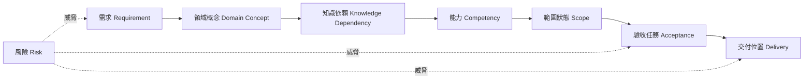

# 課程設計追蹤矩陣

版本：0.1.0  
狀態：架構草案  
對應英文版本：[Course Design Traceability Matrix](10-traceability-matrix.en.md)

## 文件目的

本文件建立從教育需求到實際課程交付與風險控制的端到端追蹤鏈，確保每項正式需求都有對應的概念、能力、範圍、驗收與交付位置，也確保每項核心能力都能回溯至明確需求。

本文件回答：

1. 每項需求由哪些領域概念與知識依賴支持？
2. 哪些能力負責實現該需求？
3. 需求在哪個課程階段交付到何種成熟度？
4. 以哪些驗收任務與證據確認能力成立？
5. 哪些風險可能破壞這條追蹤鏈？
6. 文件、教材或評量變更時，哪些項目必須一起檢查？

本文件不是教材清單，也不是逐題評分表。後續教材、活動、作業與評量必須引用本矩陣中的需求與能力識別碼。

## 憲法遵循

- 每項核心交付都必須有需求來源與驗收證據。
- 不得建立沒有需求依據的核心主題。
- 中英文版本使用相同識別碼與追蹤關係。
- 正確輸出不能作為唯一驗收證據。
- AI 使用必須追蹤到人工驗證與學生責任。
- 追蹤矩陣不得把進階資料結構偷渡為 C 課程核心。

---

# 一、追蹤鏈模型



完整追蹤鏈表示：

```text
需求
→ 領域概念
→ 知識依賴
→ 能力
→ 範圍與成熟度
→ 驗收任務與證據
→ 課程交付位置
→ 風險控制
```

任何一段缺失，都代表設計尚未完成。

---

# 二、識別碼對照

| 類型 | 前綴 | 來源文件 |
|---|---|---|
| 教育需求 | EDU | `02-requirements-map` |
| 核心能力需求 | CAP | `02-requirements-map` |
| 橫向能力需求 | X | `02-requirements-map` |
| 教學交付需求 | DEL | `02-requirements-map` |
| 品質需求 | NFR | `02-requirements-map` |
| 領域概念 | DM | `03-programming-domain-model` |
| 知識節點 | KG | `04-programming-language-knowledge-graph` |
| 學生能力 | PC | `05-competency-map` |
| 範圍狀態 | SB | `06-scope-boundary` |
| 驗收任務 | AT | `07-acceptance-model` |
| 風險 | R | `09-risk-register` |

---

# 三、最高層教育需求追蹤

| 需求 | 主要領域／知識 | 核心能力 | 範圍與成熟度 | 主要驗收 | 主要交付位置 | 主要風險 |
|---|---|---|---|---|---|---|
| EDU-01 可遷移心智模型 | DM-D、DM-C、DM-F、DM-M；KG-D、KG-C、KG-F、KG-M | PC-D、PC-C、PC-F、PC-M、PC-I | 前導 L1–L4；正式 L4–L6 | AT-02、03、04、10、12 | 前導全程；正式第 1–10、14–16 週 | R-02、R-04、R-06 |
| EDU-02 真實問題解決 | DM-F、DM-V；KG-F、KG-V | PC-F、PC-V、PC-I | 前導 L2–L4；正式 L4–L6 | AT-05、06、08、09、10 | 中文第 2–4 堂；英文 Session 2–5；正式第 3–6、11–16 週 | R-02、R-05、R-09 |
| EDU-03 完整開發循環 | DM-V、DM-A；KG-V、KG-A | PC-V、PC-A、PC-I | 前導 L3–L4；正式 L4–L6 | AT-06、07、08、11、12 | 中文第 4 堂；英文 Session 5；正式全程 | R-01、R-05、R-12 |
| EDU-04 負責任 AI 協作 | DM-A、DM-V；KG-A、KG-V | PC-A、PC-V、PC-I | 前導 L2–L4；正式 L4–L6 | AT-11、AT-12、EV-AI、EV-TE | 前導整合單元；正式各階段至少一次 | R-01、R-05、R-12 |

---

# 四、核心能力需求追蹤

## 4.1 資料與狀態

| 需求 | 領域／知識 | 對應能力 | 前導範圍 | 正式範圍 | 最低驗收 | 交付位置 | 風險 |
|---|---|---|---|---|---|---|---|
| CAP-D01 值、變數與狀態 | DM-D01–D03、D07；KG-D01–D03 | PC-D01、PC-D03 | SB-C，L2–L3 | SB-C，L4–L5 | AT-03、04、12 | 中文 1–2；英文 2；正式 1–2 | R-02、R-09 |
| CAP-D02 基本資料型別 | DM-D01–D02；KG-D01–D02 | PC-D02 | SB-C，L2 | SB-C，L4–L5 | AT-01、02、05、09 | 中文 2；英文 2；正式 2 | R-02、R-09 |
| CAP-D03 運算式 | DM-D05–D07；KG-D03–D04 | PC-D03、PC-D04 | SB-C，L3 | SB-C，L4–L5 | AT-03、05、07 | 中文 2；英文 2；正式 2–3 | R-05 |
| CAP-D04 輸入與輸出 | DM-D08；KG-D05 | PC-D05 | SB-C，L4 | SB-C，L5 | AT-05、06、08 | 中文 1–2；英文 1–2；正式 2 | R-08 |

## 4.2 流程控制

| 需求 | 領域／知識 | 對應能力 | 前導範圍 | 正式範圍 | 最低驗收 | 交付位置 | 風險 |
|---|---|---|---|---|---|---|---|
| CAP-C01 順序執行 | DM-C01–C02；KG-C01 | PC-C01 | SB-C，L3 | SB-C，L5 | AT-03、12 | 中文 1–2；英文 2–3；正式 1–3 | R-02、R-05 |
| CAP-C02 條件選擇 | DM-C03–C04；KG-C02–C03 | PC-C02、PC-C03 | SB-C，L2–L3 | SB-C，L4–L5 | AT-03、05、06、08 | 中文 2；英文 3；正式 3 | R-05、R-09 |
| CAP-C03 重複結構 | DM-C05–C06；KG-C04–C05 | PC-C04–PC-C06 | SB-C，L3 | SB-C，L4–L5 | AT-03、07、08 | 中文 3；英文 3；正式 3 | R-02、R-05 |
| CAP-C04 組合流程 | DM-C01–C06；KG-C01–C05 | PC-C07、PC-I01 | SB-F／SB-I，L1–L3 | SB-C，L5 | AT-05、06、07、09 | 中文 4；英文 5；正式 3、14–16 | R-02、R-04 |

## 4.3 函數與問題分解

| 需求 | 領域／知識 | 對應能力 | 前導範圍 | 正式範圍 | 最低驗收 | 交付位置 | 風險 |
|---|---|---|---|---|---|---|---|
| CAP-F01 函數責任 | DM-F01–F04；KG-F01 | PC-F01 | SB-C，L2 | SB-C，L5 | AT-02、04、12 | 中文 3；英文 4；正式 4–6 | R-02 |
| CAP-F02 定義與呼叫 | DM-F03–F07；KG-F02–F04 | PC-F02、PC-F03 | SB-C／SB-F，L2–L3 | SB-C，L4–L5 | AT-03、05、08 | 中文 3；英文 4；正式 4 | R-05、R-09 |
| CAP-F03 問題分解 | DM-F01–F08；KG-F01–F06 | PC-F01、PC-F05、PC-I01 | SB-F，L1–L2 | SB-C，L5–L6 | AT-04、06、09、10 | 前導整合單元；正式 5–6、14–16 | R-02、R-04 |
| CAP-F04 範圍與資料傳遞 | DM-D09–D10、DM-F05–F07；KG-F03–F05、KG-M01 | PC-D06、PC-F04 | SB-F，L1 | SB-C，L4–L5 | AT-03、04、07 | 前導函數單元；正式 4–6 | R-06、R-09 |

---

# 五、橫向能力需求追蹤

| 需求 | 對應能力 | 驗收證據 | 必須出現的交付位置 | 主要風險控制 |
|---|---|---|---|---|
| X-01 執行模型 | PC-E01–E04 | EV-EX、EV-VI、EV-DE | 前導第一單元；正式第 1 週及後續錯誤診斷 | R-08、R-11 |
| X-02 閱讀與解釋 | 所有 PC 群組 | EV-EX、EV-TR、EV-VI | 每個主要單元 | R-01、R-05 |
| X-03 測試與驗證 | PC-V01、V03、V05 | EV-TE、EV-EX | 每個主要階段至少一次正式證據 | R-05、R-12 |
| X-04 除錯與修改 | PC-E03、PC-V02–V04、PC-I01 | EV-DE、EV-MO、EV-TE | 前導至少一次；正式每階段至少一次 | R-05、R-08 |
| X-05 表達與反思 | PC-F01、PC-A05、PC-I01 | EV-EX、EV-RE、AT-12 | 前導畢業證據包；正式整合驗收 | R-01、R-05 |
| X-06 AI 素養 | PC-A01–A05 | EV-AI、EV-TE、AT-11 | 前導整合單元；正式各階段 | R-01、R-12 |

---

# 六、教學交付與品質需求追蹤

| 需求 | 設計實現 | 驗證方式 | 關聯風險 |
|---|---|---|---|
| DEL-01 共同能力核心 | `05`、`06`、`07` 使用相同能力與標準 | 比對中英文交付表與最低證據包 | R-03、R-10 |
| DEL-02 不同節奏同一基準 | `08` 定義中文 4×3 與英文 5×2 對照 | 檢查能力 ID、成熟度及最低證據是否一致 | R-03、R-09 |
| DEL-03 前導與正式連續 | `08` 以成熟度升級而非主題重講 | 檢查正式週次是否重複相同成熟度任務 | R-04 |
| DEL-04 能力先於週次 | `04`、`05`、`08` 形成依賴到交付鏈 | 每個週次須引用能力與驗收任務 | R-02、R-07 |
| DEL-05 形成性證據優先 | `07` 定義補驗與多元證據 | 檢查前導是否依賴單一高風險評量 | R-05 |
| NFR-01 雙語一致 | 正式文件雙語成對 | 檔名、版本、ID、矩陣逐項比對 | R-03、R-10 |
| NFR-02 可追溯性 | 本文件建立端到端矩陣 | 抽查需求是否可追到交付與證據 | R-10 |
| NFR-03 認知負荷控制 | `06` 範圍狀態與 `08` 交付節奏 | 每單元新概念數與活動負荷檢查 | R-02、R-06、R-09 |
| NFR-04 公平性 | 同核心標準、不同節奏與補救 | 比較兩班任務、通過率與補驗型態 | R-03、R-09 |
| NFR-05 可維護性 | 固定 ID、版本、導覽與變更規則 | 斷鏈、舊 ID、單語文件檢查 | R-10 |
| NFR-06 技術正確性 | 人工審查程式、術語與 AI 內容 | 程式執行、文件核對與同行審查 | R-11、R-12 |
| NFR-07 可調整性 | 保留核心與證據，調整題量與情境 | 課程變更紀錄須說明未降低標準 | R-02、R-04 |

---

# 七、能力群組到交付階段總覽

| 能力群組 | 前導交付 | 正式課程主要階段 | 核心驗收 |
|---|---|---|---|
| PC-E 程式轉換與執行 | 第一單元 | 第 1 週及全程診斷 | AT-04、05、07、12 |
| PC-D 資料與狀態 | 前兩單元 | 第 1–3 週 | AT-03、05、06、08 |
| PC-C 流程與控制 | 中段單元 | 第 2–3、14–16 週 | AT-03、06、07、08 |
| PC-F 函數與抽象 | 後段函數單元 | 第 4–6、14–16 週 | AT-04、05、06、09 |
| PC-M 記憶體模型 | 基礎鋪墊 | 第 7–10 週 | AT-03、04、07、12 |
| PC-O 資料組織 | 基礎鋪墊 | 第 9–13 週 | AT-05、06、08、09 |
| PC-V 測試除錯驗證 | 全程 | 全程 | AT-07、08、12 |
| PC-A AI 輔助學習 | 整合單元 | 各階段至少一次 | AT-11、12 |
| PC-I 整合循環 | 最終前導單元 | 第 14–16 週 | AT-06、07、08、10、12 |

---

# 八、缺口與孤兒項目檢查

每次正式版本發布前，必須檢查：

1. 是否有需求沒有對應能力？
2. 是否有能力沒有需求來源？
3. 是否有 `SB-C` 能力沒有最低驗收任務？
4. 是否有驗收任務沒有安排到交付位置？
5. 是否有正式週次沒有能力 ID 或驗收目的？
6. 是否有教材或評量引用已廢止 ID？
7. 中英文是否出現不同成熟度、範圍或證據？
8. 是否新增進階資料結構而未完成需求與範圍審查？
9. 是否存在高風險項目但沒有預防與應變措施？

發現缺口時，不得以補上一個模糊連結結案，必須修正實質設計。

---

# 九、變更影響規則

| 變更類型 | 至少必須重新檢查 |
|---|---|
| 修改需求 | 領域模型、知識依賴、能力、範圍、驗收、交付與風險 |
| 新增或修改能力 | 需求來源、先備、成熟度、證據、交付位置與風險 |
| 修改範圍狀態 | 驗收、交付節奏、補驗與教材 |
| 修改驗收方式 | 能力成熟度、公平性、AI 邊界與教師負荷 |
| 修改週次或堂次 | 先備依賴、核心證據、雙語一致與認知負荷 |
| 新增工具或 AI 流程 | 技術正確性、可及性、隱私、驗證與替代方案 |

---

# 十、完成條件

本追蹤矩陣完成後，課程設計必須能：

- 從任何核心需求追到實際交付與驗收證據。
- 從任何核心能力回溯其教育需求與知識先備。
- 找出沒有需求來源、沒有驗收或沒有交付位置的孤兒項目。
- 在文件修改時判斷必須同步更新的項目。
- 證明中文班與英文班具有相同核心標準。
- 證明正式課程沒有因進階資料結構而偏離 C 程式設計基礎。

## 導覽

- [前一階段：課程風險登錄表](09-risk-register.zh-TW.md)
- [返回教學內容設計區](README.zh-TW.md)
- [English version](10-traceability-matrix.en.md)
