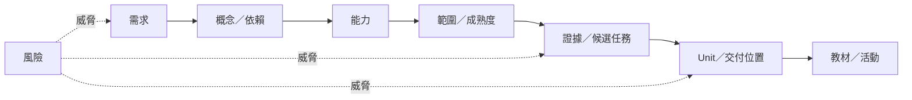

# 課程設計追蹤矩陣

版本：0.1.1  
狀態：可修訂的規劃與追蹤模型  
治理說明：本矩陣記錄既有需求、標準、規劃模型、教材與風險之間的關係，不自行建立新政策。  
對應英文版本：[Course Design Traceability Matrix](10-traceability-matrix.en.md)

## 文件目的

本文件維護從教育需求到概念、能力、範圍、證據型態、交付位置、教材與風險控制的端到端追蹤鏈。

追蹤連結是描述關係，不代表權威來源。若本矩陣與 Constitution、正式學習／評量制度或已核定設計標準衝突，以上位來源為準，並修正本矩陣。

## Constitution 2.0 對齊原則

- 每項核心交付都有需求依據與合適學習證據。
- 不因主題流行、工具方便或容易排週次，就把內容提升為核心。
- 中英文版本使用相同識別碼與實質追蹤關係。
- 正確輸出、成功建置、OJ 通過、出席或工具肯定都不能單獨證明能力。
- AI 與其他外部工具預設為選用；外部協助追蹤只有實際使用時才適用，不得變成普遍完成或評量路徑。
- 技術對應必須區分概念模型與目標實作事實。

---

# 一、追蹤鏈模型



完整核心追蹤鏈通常應能回答：

```text
為什麼需要？
→ 哪些概念／依賴支持？
→ 學生要能做到什麼？
→ 哪個範圍／成熟度？
→ 什麼證據可以觀察？
→ 在哪裡教與練？
→ 哪份教材實作？
→ 哪些風險會讓判定失效？
```

缺口應修正實質設計，而不是只補一條裝飾性連結。

---

# 二、識別碼來源

| 類型 | Prefix | 來源 |
|---|---|---|
| 利害關係人需求 | ST | `02-requirements-map.*` |
| 教育需求 | EDU | `02-requirements-map.*` |
| 核心能力需求 | CAP | `02-requirements-map.*` |
| 橫向需求 | X | `02-requirements-map.*` |
| 交付需求 | DEL | `02-requirements-map.*` |
| 品質／治理需求 | NFR | `02-requirements-map.*` |
| 領域概念 | DM | `03-programming-domain-model.*` |
| 知識節點 | KG | `04-programming-language-knowledge-graph.*` |
| 能力 | PC | `05-competency-map.*` |
| 範圍狀態 | SB | `06-scope-boundary.*` |
| 候選驗收／證據任務 | AT | `07-acceptance-model.*` |
| Concept Registry 項目 | CT | `15-programming-concept-registry.*` |
| 前導／正式 Unit | P-U / F-U | `16-unit-map.*` |
| 風險 | R | `09-risk-register.*` |

---

# 三、最高層教育需求追蹤

| 需求 | 概念／知識基礎 | 主要能力 | 範圍／成熟度方向 | 候選證據 | 主要交付／教材位置 | 主要風險 |
|---|---|---|---|---|---|---|
| EDU-01 可遷移的程式心智模型 | DM-D/C/F/M；KG-D/C/F/M | PC-D、PC-C、PC-F、PC-M、PC-I | 前導基礎 L1–L4；正式核心逐步提高到 L4–L6 | EV-EX、EV-VI、EV-TR、EV-MO；AT-02/03/04/10/12 | P-U01–P-U04；F-U01–F-U12 依主題重用 | R-02、R-04、R-06、R-19 |
| EDU-02 真實問題解決 | DM-F、DM-V；KG-F、KG-V | PC-F、PC-V、PC-I | 前導 L2–L4；正式 L4–L6 | EV-EX、EV-MO、EV-TE、EV-DE；AT-05/06/08/09/10 | P-U02–P-U04；正式整合工作，尤其 F-U10–F-U12 | R-02、R-05、R-09 |
| EDU-03 完整開發循環 | DM-V；KG-V | PC-V、PC-I | 前導 L3–L4；正式 L4–L6 | EV-TE、EV-DE、EV-MO、EV-RE；AT-06/07/08/12 | 每個 Unit 都包含驗證，P-U04 與 F-U11–F-U12 整合最完整 | R-05、R-15、R-16 |
| EDU-04 對被採用外部協助負責 | 條件式 DM-A／KG-A，加上 DM-V／KG-V | 條件式 PC-A 加相關核心能力 | SB-X；無普遍成熟度目標 | 只有適用時使用 EV-AI／AT-11 | 只在學生實際使用外部協助的選用延伸或評量討論中適用 | R-01、R-13、R-14 |

EDU-04 不建立 AI 必用要求。即使完全不經過 DM-A、KG-A、PC-A、EV-AI 或 AT-11，核心開發循環仍然完整成立。

---

# 四、核心能力需求追蹤

## 4.1 資料與狀態

| 需求 | 概念／知識 | 能力 | 前導範圍 | 正式方向 | 候選證據 | 主要 Units | 風險 |
|---|---|---|---|---|---|---|---|
| CAP-D01 值、變數／物件與狀態 | DM-D01–D03；KG-D01–D03 | PC-D01、PC-D03 | SB-C L2–L3 | L4–L5 | EV-TR、EV-EX、EV-VI | P-U02；F-U01 與其他狀態密集 Unit | R-02、R-09 |
| CAP-D02 基本型別 | DM-D01–D02；KG-D01–D02 | PC-D02 | SB-C L2 | L4–L5 | EV-EX、EV-CO、EV-IM | P-U02；F-U01 | R-02、R-09 |
| CAP-D03 運算式 | DM-D05–D07；KG-D04–D06 | PC-D03、PC-D04 | SB-C L3 | L4–L5 | EV-TR、EV-IM、EV-DE | P-U02–P-U03；F-U01–F-U02 | R-05 |
| CAP-D04 輸入輸出 | DM-D08；KG-D07 | PC-D05 | SB-C L4 | L5 | EV-IM、EV-TE、EV-EX | P-U01–P-U02；F-U04／F-U09 延伸互動情境 | R-08、R-18 |

## 4.2 控制流程

| 需求 | 概念／知識 | 能力 | 前導範圍 | 正式方向 | 候選證據 | 主要 Units | 風險 |
|---|---|---|---|---|---|---|---|
| CAP-C01 順序執行 | DM-C01–C02；KG-C01 | PC-C01 | SB-C L3 | L5 | EV-TR、EV-EX | P-U01–P-U02；全課程重用 | R-02、R-05 |
| CAP-C02 條件選擇 | DM-C03–C04；KG-C02–C03 | PC-C02、PC-C03 | SB-C L2–L3 | L4–L5 | EV-TR、EV-IM、EV-TE | P-U03；F-U02 | R-05、R-09 |
| CAP-C03 重複 | DM-C05–C06；KG-C04–C06 | PC-C04–PC-C06 | SB-C L3 | L4–L5 | EV-TR、EV-DE、EV-TE | P-U03；F-U02–F-U04 | R-02、R-05 |
| CAP-C04 組合控制 | DM-C；KG-C | PC-C07、PC-I01 | 基礎／初步整合 | L5 | EV-VI、EV-IM、EV-MO、EV-DE | P-U04；F-U02 與整合 F-U12 | R-02、R-04 |

## 4.3 函數與問題分解

| 需求 | 概念／知識 | 能力 | 前導範圍 | 正式方向 | 候選證據 | 主要 Units | 風險 |
|---|---|---|---|---|---|---|---|
| CAP-F01 函數責任 | DM-F01–F04；KG-F01–F04 | PC-F01 | SB-C L2 | L5 | EV-EX、EV-VI | P-U04；F-U05／F-U10／F-U12 | R-02 |
| CAP-F02 定義／呼叫基本函數 | DM-F03–F07；KG-F03–F08 | PC-F02、PC-F03 | SB-C／基礎 L2–L3 | L4–L5 | EV-IM、EV-TR、EV-TE | P-U04；F-U05／F-U10 | R-05、R-09 |
| CAP-F03 問題分解 | DM-F01–F08；KG-F | PC-F01、PC-F05、PC-I01 | 基礎 | L5–L6 | EV-VI、EV-MO、EV-CO、EV-RE | P-U04；F-U10–F-U12 | R-02、R-04、R-16 |
| CAP-F04 範圍／資料傳遞 | DM-D09–D10、DM-F05–F07；KG-D08–D09、KG-F | PC-D06、PC-F04 | 基礎 | L4–L5 | EV-VI、EV-TR、EV-DE | P-U04 基礎；F-U05／F-U06／F-U10 | R-06、R-09 |

---

# 五、橫向需求

| 需求 | 能力 | 核心證據方向 | 交付覆蓋 | 風險控制 |
|---|---|---|---|---|
| X-01 執行模型 | PC-E01–E04 | EV-EX、EV-VI、EV-DE | P-U01；F-U10–F-U11 等建置／診斷活動重用 | R-08、R-18、R-19 |
| X-02 閱讀與解釋 | 所有核心 PC 群組 | EV-EX、EV-TR、EV-VI | 每個主要 Unit | R-01、R-05 |
| X-03 測試與驗證 | PC-V01、V03、V05 | EV-TE、EV-EX、EV-DE | 每個 Unit 都有驗證；F-U11 深化 | R-05、R-15 |
| X-04 除錯與修改 | PC-E03、PC-V02–V04、PC-I01 | EV-DE、EV-MO、EV-TE | 從前導到 F-U12 持續出現 | R-05、R-08 |
| X-05 溝通與反思 | PC-F01、PC-I01 與其他相關群組 | EV-EX、EV-RE | 持續的學生說明、修改與最終口試證據 | R-01、R-05、R-12 |
| X-06 驗證被採用外部協助 | 條件式 PC-A 加相關核心能力 | 只有適用時使用 EV-AI，並由 EV-TE／EV-DE／EV-EX 支持 | 只屬選用／條件式，不得因完成 Unit 而必做 | R-01、R-13、R-14 |

---

# 六、交付與品質需求

| 需求 | 設計實作 | 驗證方向 | 相關風險 |
|---|---|---|---|
| DEL-01 共用核心能力 | `05`、`06`、`08`、`16` 與成對教材維持共同核心 | 比較 ID、核心問題、技術深度與完成證據 | R-03、R-10 |
| DEL-02 不同節奏、一套基準 | `08` 定義不同前導節奏但不改核心能力 | 確認差異只在節奏／支架 | R-03、R-09 |
| DEL-03 前導—正式連續性 | `06`、`08`、`16` 逐步提高成熟度而非重置 | 檢查重複概念是否使用更高層證據 | R-04 |
| DEL-04 能力先於週次 | `04`–`06`、`16` 從概念／依賴／能力產生 Unit | Unit 必須能追溯能力與證據，而非只靠 week label | R-02、R-07 |
| DEL-05 形成性證據優先 | 由正式政策、驗收規劃與教材落實 | 確認練習支援回饋且沒有偷增第三種成績來源 | R-05 |
| NFR-01 雙語實質等值 | 雙語成對文件／教材 | 比較路徑、版本／狀態、ID、表格、程式碼、連結與實質規則 | R-03、R-10 |
| NFR-02 可追蹤性 | 本矩陣與穩定 ID | 抽樣需求往下追到 Unit／教材／證據並反向檢查 | R-10、R-17 |
| NFR-03 認知負荷 | `06`、`08`、`16` | 檢查新概念量、支架與練習密度 | R-02、R-06、R-09 |
| NFR-04 公平 | 共用核心、不同節奏／支援 | 檢查證據期待與可近性，不只看完成率 | R-03、R-12 |
| NFR-05 可維護性 | 治理索引、穩定 ID、雙語路徑、進行中審查 | 檢查舊連結、過時 ID／狀態、孤兒文件與重複政策 | R-10、R-17 |
| NFR-06 技術正確性 | 技術契約、範例、compiler／可靠來源驗證 | 建置／執行適當範例，驗證標準／工具鏈主張 | R-08、R-18、R-19 |
| NFR-07 可調整性 | 核心標準穩定，例題／節奏可調 | 變更紀錄說明檢查了哪些相依項 | R-02、R-04、R-17 |

---

# 七、能力群組到 Unit 概覽

| 能力群組 | 前導覆蓋 | 正式覆蓋 | 證據重點 |
|---|---|---|---|
| PC-E 翻譯／執行 | P-U01 | F-U10，加上全程診斷 | 解釋、建置證據、診斷 |
| PC-D 資料／狀態 | P-U02 | F-U01 並全程重用 | 追蹤、實作、邊界 |
| PC-C 流程／控制 | P-U03 | F-U02 並全程重用 | 追蹤、測試、診斷 |
| PC-F 函數／抽象 | P-U04 | F-U05、F-U10、F-U12 | 分解、介面、修改 |
| PC-M 記憶體／生命週期 | 前導基礎 | F-U03–F-U08 依主題 | 圖示、有效性、生命週期、失敗案例 |
| PC-O 資料組織 | 前導基礎 | F-U03、F-U04、F-U07、F-U09 | 邊界、配置、轉換 |
| PC-V 測試／除錯／驗證 | 每個前導 Unit | 每個正式 Unit；F-U11 深化 | 預期、測試、診斷、回歸 |
| PC-A 條件式外部協助 | 只屬選用延伸 | 只屬選用延伸 | 只有實際使用時才有 EV-AI |
| PC-I 整合循環 | P-U04 | F-U12 與其他整合工作 | 需求→設計→測試→修改→說明 |

---

# 八、缺口與孤兒檢查

宣告全庫審查或 release 完成前，至少檢查：

1. 每項核心需求是否有能力對應？
2. 每項核心能力是否有需求或核定設計依據？
3. 每項 SB-C 能力是否有合適證據型態？
4. 每個核心 Unit 是否有能力／證據追蹤？
5. 現行學生教材是否對應核定 Unit 或已記錄例外？
6. 是否仍引用過時 ID、舊 Constitution 或已被取代政策？
7. 中英文配對是否實質等值？
8. 選用工具／AI 分支是否被誤升級成普遍先備、必做活動、證據欄位或繳交物？
9. 是否有未經範圍審查新增的進階主題？
10. 高優先風險是否都有緩解與應變？
11. 具體技術主張在需要時是否依指定標準／工具鏈／環境驗證？
12. 是否存在壞連結或孤兒文件？

---

# 九、變更影響規則

| 變更 | 至少重新檢查 |
|---|---|
| Constitution 或正式政策 | 治理索引、受影響標準／模型、教材、rubric、教師指南、審查紀錄 |
| 需求 | 概念／依賴、能力、範圍、證據、交付、教材、風險 |
| 能力 | 需求來源、先備、成熟度、證據、Unit／教材覆蓋、風險 |
| 範圍 | 能力目標、交付、驗收規劃、教材、認知負荷 |
| 驗收／證據模型 | 能力成熟度、公平、正式政策邊界、教師工作量 |
| Unit／交付 | 依賴、核心證據、雙語等值、認知負荷、教材路徑 |
| 新外部工具／AI 活動 | 選用性、可近性、誠信／隱私、驗證、備援、未使用中立性 |
| 技術工具鏈主張 | 目標 compiler／standard mode／platform、可重現命令／證據、雙語範例 |

---

# 十、維護條件

本矩陣維護到位時：

- 任一抽樣核心需求都可追到教學與證據。
- 任一抽樣核心能力都可回溯到需求／設計依據。
- 選用外部協助分支持續維持條件式。
- 不以過時 stage／week 假設當成權威。
- 中英文版本維持實質等值。
- 全庫驗證能找出並修正過時或孤立連結。

## 相關文件

- [教學需求地圖](02-requirements-map.zh-TW.md)
- [程式設計能力地圖](05-competency-map.zh-TW.md)
- [課程範圍邊界](06-scope-boundary.zh-TW.md)
- [能力驗收模型](07-acceptance-model.zh-TW.md)
- [課程交付地圖](08-delivery-map.zh-TW.md)
- [課程風險登錄表](09-risk-register.zh-TW.md)
- [Concept 驅動的 Unit Map](16-unit-map.zh-TW.md)
- [教學內容設計區](README.zh-TW.md)
- [English version](10-traceability-matrix.en.md)
