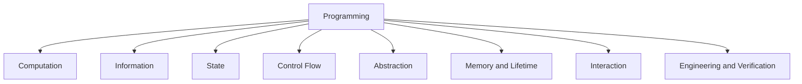
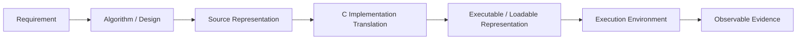

# Programming Concept Tree

Version: 0.1.1  
Status: Active design standard  
Governance note: This standard inventories stable programming concepts and C mappings. It does not independently decide scope, grading, delivery order, or AI/tool policy.  
Corresponding Chinese version: [程式設計 Concept Tree](14-programming-concept-tree.zh-TW.md)

## Document Purpose

This document inventories the cross-language programming concepts used by the course and provides a stable concept source for the Concept Registry, competency/scope standards, Unit composition, and student materials.

It answers:

1. Which concepts does this course system need to name consistently?
2. How are those concepts grouped?
3. How may each concept map to C without confusing a conceptual model with one implementation?

The tree does not determine Unit count, teaching order, weekly pacing, grading, or whether an optional external tool is used.

## Concept Criteria

A concept is a good candidate for this tree when it:

- answers a meaningful “why/what relationship” question rather than merely naming syntax;
- remains useful beyond one keyword or one IDE;
- can participate in prerequisite or composition relationships;
- supports observable reasoning through explanation, prediction, tracing, implementation, testing, debugging, or verification;
- can be mapped to C precisely enough to avoid misleading implementation folklore.

C syntax and library functions such as `if`, `for`, `malloc`, and `fopen` are concrete mappings of broader concepts rather than first-level concepts by themselves.

## Overall Structure

---

# 1. Computation

Core question: **How is a problem represented as computation that an implementation can execute?**

| Concept | Core meaning | C mapping / boundary |
|---|---|---|
| Problem | Situation or need to be solved, transformed, or automated | Task/use context |
| Requirement | Observable behavior, data, constraints, and failure expectations | Specification, contracts, tests |
| Algorithm | Finite computational procedure or strategy | Natural language, pseudocode, flow/state model, C implementation |
| Program | Representation of computation intended for execution | C translation units plus required environment/resources |
| Source Code | Human-readable program text | `.c`, `.h`, generated or included source as applicable |
| Translation | C implementation's transformation of preprocessing translation units toward executable behavior | May involve preprocessing, compilation, code generation, assembly, linking, or fused equivalents; physical stages vary |
| Diagnostic | Implementation feedback about translation/build or execution conditions | Compiler/linker/runtime/tool messages as applicable |
| Program Image | Representation the target environment can load or otherwise execute | Executable file is common but not universal |
| Execution | Evaluation/execution of program behavior in the target environment | C abstract-machine semantics plus implementation behavior |
| Process / Runtime Instance | Running-program environment and resources | OS process is common but not universal across C targets |
| Termination | End of intended or abnormal execution | `return` from `main`, `exit`, environment termination, failures |

The diagram is conceptual. It must not be used to claim that every implementation exposes the same preprocessor/compiler/assembler/linker programs or intermediate files.

---

# 2. Information

Core question: **What information does a program process, and how is it represented and interpreted?**

| Concept | Core meaning | C mapping / boundary |
|---|---|---|
| Data | Information processed, stored, or communicated | Values, objects, streams, files |
| Value | Information content associated with an expression/object | Integer, floating, character, pointer, structure values as applicable |
| Representation | Encoding of information | Binary object representation, character encoding, floating representation; implementation/standard constraints matter |
| Type | Defines/limits values, operations, conversions, and interpretation | C basic, derived, structure/union/enumerated types |
| Identifier | Name token designating entities according to C rules | Variable/function/type/member names as applicable |
| Literal / Constant Form | Source-level representation of values or constant expressions | Integer/floating/character/string literals, enumeration constants; distinguish from `const` objects |
| Expression | Construct evaluated under C rules | Arithmetic, comparison, logical, pointer, function-call expressions |
| Operator | Operation applied to operands | Arithmetic, relational, logical, bitwise, assignment, etc. |
| Evaluation | Producing values/side effects under C sequencing rules | Do not assume unspecified evaluation order |
| Conversion | Transformation/interpretation between types/representations | Integer promotions, usual arithmetic conversions, casts, assignment conversion |
| Collection | Conceptual organization of multiple related elements | Arrays, strings, records depending on mapping |

---

# 3. State

Core question: **How does execution preserve and change information over time?**

| Concept | Core meaning | C mapping / boundary |
|---|---|---|
| State | Relevant values, object contents, stream state, and control position at an observation point | Trace tables, debugger observations, program variables |
| State Change | Difference caused by an evaluation/execution step | Assignment, input, mutation, side effects |
| Object | Region of data storage in the C abstract machine | Variables, array elements, structure objects, allocated objects |
| Variable | Course-friendly name for a named object whose value may change | Distinguish identifier from object when precision matters |
| Declaration | Introduces identifiers/types and properties | Object/function declarations, prototypes |
| Definition | Declaration that also defines the entity/storage/function body as specified by C | Object definitions, function definitions |
| Initialization | Establishes initial stored value/state when an object begins its lifetime | Initializers, zero initialization where rules apply |
| Assignment | Stores a value into a modifiable object | `=` and compound assignments |
| Update | Computes and stores new state | Increment, accumulation, explicit assignment |
| Scope | Region of program text where an identifier is visible | Block/function/file scope as applicable |
| Lifetime | Portion of execution during which an object exists | Related to storage duration, allocation/deallocation |
| Invariant | Property expected to hold at defined points | Loop/data validity reasoning |

---

# 4. Control Flow

Core question: **How is the next action determined, and how can termination be reasoned about?**

| Concept | Core meaning | C mapping / boundary |
|---|---|---|
| Sequence | Ordered relation among evaluations/actions | Statement/control sequencing; do not infer order C does not guarantee |
| Condition | Value/expression used for a decision | Scalar expression interpreted as false/true according to C rules |
| Selection | Choosing an execution path | `if`, `else`, `switch` |
| Branch / Transfer | Control moves to another point | `break`, `continue`, `return`, `goto` when in scope |
| Repetition | Repeated computation under a continuation rule | `while`, `do`, `for` |
| Iteration | One pass through repeated work and its state transition | Loop body/update/test reasoning |
| Loop Condition | Continuation/termination decision | Loop controlling expression |
| Boundary | Inclusion/exclusion or valid-range limit | Index ranges, `<` vs `<=`, capacities |
| Sentinel | Distinguished data/state used to indicate termination/end | Sentinel values, input-return conditions; `EOF` use must match API semantics |
| Nested Control | Control structure inside another | Nested decisions/loops |
| Nontermination | Intended computation fails to reach termination | Missing progress, impossible exit condition, recursion without reachable base condition |

---

# 5. Abstraction

Core question: **How are responsibilities separated behind interfaces so programs remain understandable and modifiable?**

| Concept | Core meaning | C mapping / boundary |
|---|---|---|
| Decomposition | Break a larger problem into responsibilities | Functions/modules |
| Responsibility | Coherent purpose owned by a program part | Function/module contract |
| Function | Callable unit with a type/interface and implementation | Declaration/prototype, definition, call |
| Interface | What a caller must know | Name/type, parameters, return, preconditions, postconditions, lifetime/ownership rules where relevant |
| Implementation | Internal mechanism satisfying an interface | Function body/source file |
| Parameter | Declared function input object/identifier | Formal parameter |
| Argument | Expression supplied by caller | Function-call argument |
| Return Value | Result returned through function interface | `return expression` for non-void functions |
| Call | Transfer of control/data according to function semantics | Function-call expression |
| Activation Model | Conceptual temporary state associated with active calls | Often visualized as stack frames; physical call stack is implementation-dependent |
| Recursion | Direct/indirect recurrence through calls | Recursive functions with termination/base reasoning |
| Module | Related interface and implementation responsibilities | Header/source organization, translation units, separate compilation when applicable |

---

# 6. Memory and Lifetime

Core question: **Where do C objects exist, how are they referenced, and when is access valid?**

| Concept | Core meaning | C mapping / boundary |
|---|---|---|
| Bit | Binary information unit in conceptual/representation reasoning | Bitwise operations/object representation; exact representation constraints matter |
| Byte | C addressable storage unit | `sizeof(char) == 1`; `CHAR_BIT` gives bits per byte |
| Address | Representation/value designating storage/object/function locations under the relevant model | Pointer values; integer representation is not universally portable |
| Object | Data-storage region with type/value representation and lifetime | Automatic/static/allocated objects, array elements, members |
| Layout | Relative arrangement/alignment/padding of objects/members | Array contiguity is guaranteed; structure padding/layout has constraints but is implementation-dependent |
| Pointer | Typed pointer value/object | Object/function pointers, null pointer values |
| Indirection / Dereference | Access through a pointer | `*p`, `p->m`; requires valid pointer, lifetime, bounds/type/alignment preconditions |
| Aliasing | Multiple access paths designate the same/overlapping object | Pointer parameters; C aliasing/effective-type rules matter |
| Null Pointer | Pointer value that does not point to an object/function | `NULL`, `0`/null pointer constant in relevant contexts; distinguish value from representation |
| Storage Duration | Language category governing minimum object lifetime/storage association | automatic, static, thread if supported, allocated |
| Automatic Storage | Objects with automatic storage duration | Often implemented with a stack, but not guaranteed physically |
| Static Storage | Objects with static storage duration | Exists for program execution per C rules; actual section/layout implementation-dependent |
| Allocated Storage | Storage obtained by allocation functions until deallocation | `malloc`, `calloc`, `realloc`, `free`; “heap” is informal implementation language |
| Ownership / Release Responsibility | Design/API responsibility for use, transfer, and deallocation | Not language-enforced in C |
| Memory Safety | Valid lifetime, bounds, alignment, provenance/access preconditions and resource management | Out-of-bounds, dangling use, invalid free, double free, leaks, undefined behavior |

---

# 7. Interaction

Core question: **How does a program exchange information with its environment?**

| Concept | Core meaning | C mapping / boundary |
|---|---|---|
| Input | Data entering a program/function | `fgets`, `scanf`, command-line arguments, file reads |
| Output | Observable data/result leaving a program/function | `printf`, `puts`, file writes, return status |
| Stream | Ordered character I/O abstraction | `stdin`, `stdout`, `stderr`, `FILE *`; stream state/errors matter |
| Format | Rules for text representation/parsing | `printf`/`scanf` conversion specifications, file formats |
| Buffer | Temporary storage with capacity and valid-content bounds | Character arrays, stdio buffering, read/write buffers |
| File | External data source/destination | `fopen`/`fclose` and other file operations; distinguish pathname from stream object |
| End of Input | No more input available through an interface | Function return values/`EOF` conventions; not a literal EOF character in every file |
| Error Channel / Error State | Distinguishes normal results from diagnostics/failure | `stderr`, return values, `ferror`, `errno` where specified |
| Command-Line Input | Environment-provided startup arguments | `argc`, `argv` hosted-environment model |
| Protocol | Shared structure/order/meaning of exchanged data | Function contracts, text formats, simple file protocols |

---

# 8. Engineering and Verification

Core question: **What evidence is needed to trust, diagnose, modify, and maintain a program or technical claim?**

| Concept | Core meaning | C mapping / course activity |
|---|---|---|
| Expected Result / Property | Predicted behavior derived from requirements/contracts before relying on observation | Manual calculation, state/property prediction |
| Test Case | Concrete condition/input plus expectation | Normal, boundary, invalid, and failure cases as relevant |
| Testing | Evaluate selected cases against expectations | Build/run, inspect outputs/state/files, test harnesses |
| Verification | Evidence that implementation/claim satisfies stated technical requirements | Tests, tracing, compiler diagnostics, reliable references |
| Validation | Evidence that behavior addresses the intended need/use context | Requirement/use-scenario review |
| Debugging | Reproduce, narrow, hypothesize, test cause, correct, regress | Diagnostic workflow |
| Error Classification | Categorize failure using evidence | Translation/build, linkage where applicable, runtime/precondition, logic, boundary, requirement |
| Regression Verification | Recheck prior required behavior after changes | Rerun relevant tests/properties |
| Refactoring | Improve internal structure while preserving required observable behavior | Function extraction, naming, modularization |
| Readability | Human ability to understand intent/structure | Naming, formatting, responsibilities, contracts |
| Documentation | Records requirements/interfaces/decisions/usage | README, comments, API notes, test records as appropriate |
| Code Reading | Infer behavior/structure from existing code | Prediction, trace, explanation |
| Comparison | Evaluate multiple plausible solutions or sources | Correctness, readability, modifiability, evidence quality |
| Maintenance | Modify and reverify as requirements change | Change impact and regression |
| Tool Use | Use a compiler, debugger, IDE, terminal, documentation, analyzer, etc. with awareness of role and limits | Tool fluency supports but does not replace programming capability |
| External Assistance | Advice/content from AI, documentation, peers, instructors, or tools | Optional source of claims; adopted results remain learner responsibility |
| Human Review | Evaluate relevance, assumptions, limitations, and fit before adoption | Especially relevant to external suggestions |
| Technical Verification | Reproducible evidence for adopted technical claims | Program/test/diagnostic/reference/trace evidence |
| Contextual Disclosure | Tool-use attribution/record when a specific approved rule requires it | No universal AI log or non-use declaration |

External assistance, including AI, is intentionally not a first-level prerequisite domain. It is optional and conditional: the Engineering concepts of review and verification apply whenever such assistance is actually adopted.

---

# 9. Cross-Domain Composite Concepts

## Array

Composed from collection, type, object, layout, index, boundary, iteration, and memory-safety concepts. C mapping includes array types, indexing, `sizeof` where applicable, and function-parameter adjustment rules.

## String

Composed from character representation, array, sentinel/termination, buffer, format, boundary, and memory safety. In C, a string is a null-terminated character sequence; not every character array is a valid string.

## Structure / Record

Composed from type, object, member, layout, interface, and assignment. C mapping includes `struct`, member access, assignment, pointers to structures, and `typedef` usage.

## File I/O

Composed from stream, file, buffer, format/protocol, end-of-input, error state, and resource lifetime. C mapping includes `FILE *`, open/read/write/close APIs and return-state checks.

## Modular Programming

Composed from decomposition, responsibility, interface, implementation, module, translation/build dependencies, and documentation. C mapping includes headers/source files, declarations/definitions, include guards, separate translation, and linkage where applicable.

---

# 10. Boundary and Maintenance Rules

This Concept Tree covers concepts required to support the approved preparatory/formal C course scope and its cross-cutting testing/debugging/verification practices. It does not by itself add advanced data structures, object-oriented programming, generic programming, concurrency, networking, compiler internals, or platform-specific IDE operation to the core.

When changing this standard:

1. Preserve concept meaning across both language versions.
2. Update the Concept Registry and Unit Map when a stable concept is added/removed/renamed.
3. Check scope/competency standards before turning a concept into a core deliverable.
4. Keep optional external assistance conditional rather than creating an AI-required concept chain.
5. Mark implementation-specific claims and verify them against the target C standard/toolchain/environment.
6. Record material changes in the active repository audit.

## Related Documents

- [Instructional Design Workspace](README.en.md)
- [Programming Domain Model](03-programming-domain-model.en.md)
- [Programming Language Knowledge Dependency Graph](04-programming-language-knowledge-graph.en.md)
- [Programming Competency Map](05-competency-map.en.md)
- [Course Scope Boundary](06-scope-boundary.en.md)
- [Terminology Glossary](11-terminology-glossary.en.md)
- [Programming Concept Registry](15-programming-concept-registry.en.md)
- [Concept-Driven Unit Map](16-unit-map.en.md)
- [繁體中文版](14-programming-concept-tree.zh-TW.md)
