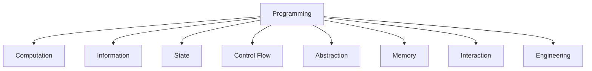
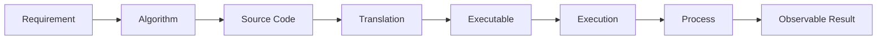

# Programming Concept Tree

Version: 0.1.0  
Status: Concept inventory draft  
Last updated: 2026-08-04  
Corresponding Chinese version: [程式設計 Concept Tree](14-programming-concept-tree.zh-TW.md)

## Document Purpose

This document inventories the core programming concepts that may be used by the course. It establishes a shared knowledge source for the later concept-dependency graph, competency mapping, unit composition, and student-facing teaching materials.

At this stage, the document answers only:

1. Which concepts does the course need?
2. How should the concepts be classified?
3. How does each concept appear in C?

This stage does not determine the number of units, teaching order, weekly schedule, or final chapter structure.

## Criteria for a Core Concept

An item should ordinarily satisfy all of the following conditions before it is treated as a core concept:

1. It answers a “why” question or establishes a mental model rather than merely describing syntax.
2. It does not depend entirely on one programming language’s specific keyword.
3. It remains meaningful across multiple languages or computational environments.
4. It can serve as prerequisite knowledge for other concepts.
5. Students can build understanding through observation, prediction, tracing, implementation, or verification.

Syntax and library functions such as `if`, `for`, and `malloc` are not treated as top-level concepts. They are listed as C-language implementations of broader concepts.

## Overall Structure



---

# 1. Computation

Core question: **How does a program transform a problem into executable computation?**

| Concept | Core meaning | C-language mapping |
|---|---|---|
| Problem | A situation that needs to be solved, transformed, or automated | Task statement and input/output specification |
| Requirement | A precise description of behavior, data, and constraints | Comments, specifications, and test cases |
| Algorithm | A finite process that transforms input into output | Natural language, flowchart, pseudocode, or C program |
| Program | An executable description of computation | C source code and the executable built from it |
| Source Code | A human-readable and editable program representation | `.c` and `.h` files |
| Translation | Conversion from one program representation to another | Preprocessing, compilation, assembly, and linking |
| Compiler | A tool that checks and translates source code | GCC and Clang |
| Executable | A program image that an operating system can start | `a.out` or `.exe` |
| Execution | The process by which instructions produce behavior | Running `main` and evaluating statements |
| Process | A running program together with its resources and state | Operating-system process model |
| Termination | How one computation ends normally or abnormally | `return`, `exit`, or execution failure |

Primary relationship:



---

# 2. Information

Core question: **What information does a program process, and how is that information represented and interpreted?**

| Concept | Core meaning | C-language mapping |
|---|---|---|
| Data | Information that can be stored, transmitted, or processed | Numbers, characters, arrays, and structures |
| Value | Content that can be observed or computed at a point in time | `10`, `3.14`, or `'A'` |
| Representation | The encoding used to store or communicate information | Binary, two’s complement, floating point, and character encoding |
| Type | A constraint and interpretation for a set of values and valid operations | `int`, `double`, `char`, and structure types |
| Identifier | A name used to refer to a program entity | Variable, function, and type names |
| Constant | A value or named entity that should not change during execution | Literals, `const`, enumeration constants, and macro constants |
| Expression | A description that combines values, names, and operations to produce a value | `a + b * 2` |
| Operator | An operation applied to one or more values | Arithmetic, relational, logical, and bitwise operators |
| Evaluation | The process by which an expression produces a value and possible side effects | Precedence, short-circuit evaluation, and function calls |
| Conversion | Transformation between representations or types | Implicit and explicit conversion |
| Collection | An organization of multiple related values | Arrays, strings, and structures |

Important distinctions:

- A `Value` is content.
- A `Type` determines how content is interpreted and operated on.
- A `Representation` is the machine form of that content.
- An `Expression` describes how a new value is produced.

---

# 3. State

Core question: **How does a program remember its current situation and change during execution?**

| Concept | Core meaning | C-language mapping |
|---|---|---|
| State | The combination of relevant information at one point in time | Current variable values, input position, and control position |
| State Change | A difference in state caused by one execution step | Assignment, increment, input, and function side effects |
| Variable | A named program object whose value may change | Variable declaration and use |
| Declaration | Introduction of a name, type, and permitted form of use | `int count;` and function prototypes |
| Definition | Creation of an entity or provision of its complete implementation | Variable definitions and function definitions |
| Initialization | Establishment of an object’s initial state when its lifetime begins | `int count = 0;` |
| Assignment | Writing a new value into an existing object | `count = count + 1;` |
| Update | Computing and storing new state from old state | `count++` and accumulators |
| Scope | The region of program text in which a name is visible | Block, function, and file scope |
| Lifetime | The period during which an object exists | Automatic, static, and allocated storage duration |
| Invariant | A condition that should remain true throughout part of execution | Loop invariants and data-validity conditions |

Typical state transition:

```text
Old state: count = 3
Execute: count = count + 1
New state: count = 4
```

---

# 4. Control Flow

Core question: **How does a program decide which action executes next?**

| Concept | Core meaning | C-language mapping |
|---|---|---|
| Sequence | Actions execute in a defined order | Ordinary statement order |
| Condition | A state or expression that can be judged true or false | Integer truth values, comparisons, and logical expressions |
| Decision | Selection of different paths based on a condition | `if`, `else`, and `switch` |
| Branch | Transfer from the current control position to another path | Conditional branches, `break`, and `continue` |
| Repetition | Repeated execution controlled by a condition or range | `while`, `do-while`, and `for` |
| Iteration | One repetition cycle and its state transition | Loop body, update, and repeated test |
| Loop Condition | The condition that determines whether repetition continues | `while (condition)` |
| Boundary | The dividing line that determines inclusion and exclusion | Start, end, `<`, and `<=` |
| Sentinel | A special input or state that represents termination | `-1` to stop input or EOF |
| Nested Control | A control structure placed inside another control structure | Nested decisions and loops |
| Infinite Execution | Execution that cannot reach a termination condition | Infinite loops and missing updates |

`if`, `switch`, `while`, and `for` are C-language mappings. The underlying concepts are Decision and Repetition.

---

# 5. Abstraction

Core question: **How can unnecessary detail be hidden so programs remain understandable, reusable, and composable?**

| Concept | Core meaning | C-language mapping |
|---|---|---|
| Decomposition | Division of a large problem into understandable responsibilities | Multiple functions and modules |
| Responsibility | The single task that one program part should perform | Function purpose and module responsibility |
| Function | A callable unit that packages computation or behavior | Function declaration, definition, and call |
| Interface | The inputs, outputs, and constraints that a user needs to know | Function prototypes and header files |
| Implementation | The internal method that fulfills an interface | Function body and source file |
| Parameter | A named position that receives data in a function definition | Formal parameter |
| Argument | The actual value or expression supplied during a call | Actual argument |
| Return Value | The mechanism by which a function gives a result back to its caller | `return expression;` |
| Call | Suspension of the current flow to enter another computational unit | Function call |
| Call Stack | Unfinished function calls and their local state | Call frames and local variables |
| Recursion | A computational unit using itself directly or indirectly | Recursive functions and base cases |
| Module | A program unit with a clear interface and responsibility | `.h` and `.c` files and separate compilation |

---

# 6. Memory

Core question: **Where do program objects exist, and how are they located and managed?**

| Concept | Core meaning | C-language mapping |
|---|---|---|
| Bit | The smallest information unit that can represent two states | Binary representation and bitwise operations |
| Byte | The basic addressable storage unit | `sizeof(char) == 1` |
| Address | A value that identifies a memory location | `&object` and pointer values |
| Object | A data entity that occupies storage during execution | Variables, array elements, and structure objects |
| Layout | The arrangement of objects or members in memory | Array contiguity and structure layout |
| Pointer | A value that stores or represents the address of an object or function | `int *p` |
| Indirection | Indirect access to another object through an address | `*p` and `p->member` |
| Aliasing | Multiple names or pointers referring to the same object | Pointer parameters and shared modification |
| Null Reference | An explicit indication that no valid target currently exists | Null pointer and `NULL` |
| Storage Duration | The period during which storage exists | Automatic, static, and allocated storage |
| Stack Storage | Storage typically created and released with function calls | Automatic local variables and call frames |
| Static Storage | Storage that persists for the program’s execution | Global variables and `static` objects |
| Dynamic Allocation | Obtaining and releasing storage during execution | `malloc`, `calloc`, `realloc`, and `free` |
| Ownership | Responsibility for maintaining, transferring, and releasing a resource | API contracts and dynamic-memory responsibility |
| Memory Safety | Ensuring that locations and lifetimes are valid when accessed | Out-of-bounds access, dangling pointers, double free, and leaks |

Arrays and strings are not separate top-level domains. They emerge where Information concepts such as Collection meet Memory concepts such as Layout, Address, Boundary, and Safety.

---

# 7. Interaction

Core question: **How does a program receive information from the outside world and produce observable results?**

| Concept | Core meaning | C-language mapping |
|---|---|---|
| Input | External data entering a program | `scanf`, `fgets`, and command-line arguments |
| Output | Information produced by a program for the outside world | `printf`, `puts`, and file output |
| Stream | An ordered flow of data with a current read/write position | `stdin`, `stdout`, `stderr`, and `FILE *` |
| Format | The way data is converted to or parsed from text | Format strings, field width, and precision |
| Buffer | A region that temporarily accumulates input or output | Standard-I/O buffering and character arrays |
| File | Persisted data accessible by name | `fopen`, `fclose`, and file operations |
| End of Input | The state in which a source has no more data | EOF and input-function return values |
| Error Channel | Diagnostic information separated from ordinary results | `stderr` and compiler diagnostics |
| Command Line | Parameters and environment supplied when a program starts | `argc` and `argv` |
| Protocol | Shared rules for data and interaction order | Input format, function contracts, and file formats |

---

# 8. Engineering

Core question: **How do we judge whether a program is trustworthy, understandable, modifiable, and supported by responsible tool use?**

| Concept | Core meaning | C-language mapping or course activity |
|---|---|---|
| Expected Result | A predicted behavior available for comparison before execution | Manual calculation, output prediction, and state tables |
| Test Case | Concrete input and expected behavior used to check a program | Normal, boundary, error, and regression cases |
| Testing | Systematic execution of cases and comparison of results | Compile, run, and record results |
| Verification | Evidence that an implementation satisfies a technical specification | Expected/actual comparison, tracing, and testing |
| Validation | Evidence that a result solves the actual need | Re-reading requirements and checking use scenarios |
| Debugging | Locating symptoms and causes and verifying a correction | Reproduction, narrowing, hypothesis, and testing |
| Error Classification | Identification of the stage at which a problem occurs | Compile, execution, logic, formatting, and boundary errors |
| Regression | Rechecking previous behavior after a correction or change | Rerunning existing tests |
| Refactoring | Improving internal structure without changing external behavior | Function extraction, naming, and duplication removal |
| Readability | Making program intent and structure understandable to people | Naming, indentation, and separation of responsibility |
| Documentation | Preserving requirements, interfaces, decisions, and usage | README, comments, and test records |
| Code Reading | Inferring structure and behavior from an existing program | Tracing, prediction, and explanation |
| Comparison | Evaluating differences among multiple reasonable solutions | Correctness, readability, and modifiability |
| Maintenance | Continuing to modify and verify a program as requirements change | Requirement changes and regression testing |
| Tool Use | Understanding the role, input, and limits of a tool | Compiler, terminal, IDE, and debugger |
| AI Collaboration | Treating AI as a source of claims that require verification | Preserving pre-AI thought, testing, and acceptance/rejection rationale |

---

# 9. Cross-Domain Composite Concepts

The following topics are important but arise from multiple foundational concepts, so they are not treated as first-level domains.

## Array

Composed from:

- Collection
- Type
- Object
- Layout
- Address
- Index
- Boundary
- Traversal
- Memory Safety

C mapping: array declaration, indexing, `sizeof`, conversion behavior when passed to functions, and multidimensional arrays.

## String

Composed from:

- Character Representation
- Collection
- Array
- Sentinel
- Buffer
- Format
- Boundary
- Memory Safety

C mapping: character arrays, string literals, null terminators, `<string.h>`, safe input, and length management.

## Structure

Composed from:

- Type
- Collection
- Object
- Layout
- Member
- Interface
- Assignment

C mapping: `struct`, member access, structure assignment, pointers to structures, and `typedef`.

## File I/O

Composed from:

- File
- Stream
- Buffer
- Format
- Protocol
- End of Input
- Error Handling
- Resource Lifetime

C mapping: `FILE *`, opening modes, read/write functions, EOF, and closing files.

## Modular Programming

Composed from:

- Decomposition
- Responsibility
- Interface
- Implementation
- Module
- Translation
- Linking
- Documentation

C mapping: header files, source files, include guards, separate compilation, and linking.

---

# 10. Current Boundary

This Concept Tree currently covers:

- Core concepts required by an introductory university C programming course.
- Foundational knowledge connecting the preparatory course to the formal course.
- Cross-unit abilities such as testing, debugging, requirement modification, and AI verification.

It does not yet expand:

- Advanced data structures and algorithm analysis.
- Object-oriented programming, generics, and exception mechanisms typical of other languages.
- Deep operating-system, compiler, networking, or concurrency theory.
- Detailed operation of a specific IDE or platform.

These topics are not rejected. They may become extension layers of the Concept Tree when needed.

## Next Steps

1. Assign a unique ID to every concept.
2. Distinguish core concepts, composite concepts, and C-language mappings.
3. Build a Concept Dependency Graph.
4. Mark target maturity for the preparatory and formal courses.
5. Compose Units from dependency relationships rather than dividing knowledge by week first.
6. Only then write student-facing materials for each Unit.

## Navigation

- [Course Constitution](../CONSTITUTION.en.md)
- [Instructional Design Workspace](README.en.md)
- [Knowledge Dependency Design](04-knowledge-dependencies.en.md)
- [Competency Definitions](05-competencies.en.md)
- [繁體中文版](14-programming-concept-tree.zh-TW.md)
