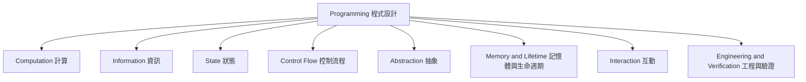
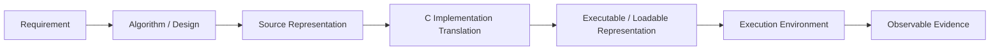

# 程式設計 Concept Tree

版本：0.1.1  
狀態：現行設計標準  
治理說明：本標準盤點穩定程式概念與 C 對應，不自行決定範圍、評分、交付順序或 AI／工具政策。  
對應英文版本：[Programming Concept Tree](14-programming-concept-tree.en.md)

## 文件目的

本文件盤點本課程使用的跨語言程式設計概念，提供 Concept Registry、能力／範圍標準、Unit 組合與學生教材共用的穩定概念來源。

本文件回答：

1. 本課程體系需要一致命名哪些 Concept？
2. 這些 Concept 如何分類？
3. 每個 Concept 如何對應到 C，又不把概念模型誤寫成單一實作保證？

本樹不決定 Unit 數量、授課順序、週次、評分，也不決定是否使用任何選用外部工具。

## Concept 判定原則

適合納入本樹的概念通常：

- 回答有意義的「為什麼／關係是什麼」，而非只命名語法。
- 不依賴單一 keyword 或 IDE 才有意義。
- 可參與先備或組合關係。
- 能透過解釋、預測、追蹤、實作、測試、除錯或驗證建立可觀察證據。
- 能精確對應 C，避免把實作慣例當成語言事實。

`if`、`for`、`malloc`、`fopen` 等 C 語法或函式庫函式，是較廣概念的具體映射，不單獨作為第一層 Concept。

## 整體結構

---

# 一、Computation 計算

核心問題：**問題如何被表示成可由實作執行的計算？**

| Concept | 核心意義 | C 對應／邊界 |
|---|---|---|
| Problem | 需要被解決、轉換或自動化的情境／需求 | 題目／使用情境 |
| Requirement | 可觀察行為、資料、限制與失敗期待 | 規格、契約、測試 |
| Algorithm | 有限的計算程序或策略 | 自然語言、pseudocode、流程／狀態模型、C 實作 |
| Program | 以執行為目的的計算表示 | C translation units 加上必要環境／資源 |
| Source Code | 人類可閱讀程式文字 | `.c`、`.h` 與適用的產生／引入來源 |
| Translation | C 實作把 preprocessing translation unit 轉向可執行行為的過程 | 可能包含前置處理、編譯、code generation、組譯、連結或合併等價步驟；實體階段依實作而異 |
| Diagnostic | 實作針對翻譯／建置或執行條件提供的回饋 | compiler／linker／runtime／tool 訊息（依環境） |
| Program Image | 目標環境可載入或以其他方式執行的程式表示 | executable file 很常見但不是唯一形式 |
| Execution | 程式在目標環境中的求值／執行行為 | C abstract-machine 語意加上實作行為 |
| Process / Runtime Instance | 執行中程式的環境、資源與狀態 | OS process 常見但不是所有 C 目標都必然具有 |
| Termination | 預期或異常執行的終止 | `main` return、`exit`、環境終止、失敗 |

此圖是概念模型，不可用來宣稱每個 C 實作都有相同的獨立 preprocessor／compiler／assembler／linker 程式或中介檔案。

---

# 二、Information 資訊

核心問題：**程式處理什麼資訊，以及如何表示與解讀？**

| Concept | 核心意義 | C 對應／邊界 |
|---|---|---|
| Data | 被處理、儲存或傳遞的資訊 | values、objects、streams、files |
| Value | 與 expression／object 相關的資訊內容 | integer、floating、character、pointer、structure values（依型別） |
| Representation | 資訊的編碼方式 | binary object representation、字元編碼、浮點表示；需注意標準／實作限制 |
| Type | 定義／限制值、操作、轉換與解讀 | C basic、derived、structure／union／enumerated types |
| Identifier | 依 C 規則指定 entity 的名稱 token | variable／function／type／member names 等 |
| Literal / Constant Form | 原始碼中的值或常數運算式形式 | integer／floating／character／string literals、enumeration constants；應與 `const` object 區分 |
| Expression | 依 C 規則求值的構造 | 算術、比較、邏輯、pointer、function-call expressions |
| Operator | 對 operands 執行操作 | arithmetic、relational、logical、bitwise、assignment 等 |
| Evaluation | 依 C sequencing rules 產生值／side effect | 不假設標準未指定的 evaluation order |
| Conversion | 型別／表示之間的轉換／解讀 | integer promotions、usual arithmetic conversions、casts、assignment conversion |
| Collection | 多個相關元素的概念性組織 | arrays、strings、records 等映射 |

---

# 三、State 狀態

核心問題：**執行如何隨時間保存並改變資訊？**

| Concept | 核心意義 | C 對應／邊界 |
|---|---|---|
| State | 某觀察點下相關值、object 內容、stream 狀態與控制位置 | trace table、debugger、程式變數 |
| State Change | 求值／執行一步所造成的差異 | assignment、input、mutation、side effects |
| Object | C abstract machine 中的資料儲存區域 | variables、array elements、structure objects、allocated objects |
| Variable | 可改變值的具名 object 之課程友善用語 | 精確討論時區分 identifier 與 object |
| Declaration | 引入 identifier／type 與相關屬性 | object／function declarations、prototypes |
| Definition | 依 C 規則同時完成 entity／storage／function body 定義的 declaration | object definitions、function definitions |
| Initialization | object lifetime 開始時建立初始 stored value／state | initializers、規則適用時的 zero initialization |
| Assignment | 將值存進 modifiable object | `=`、compound assignments |
| Update | 由舊狀態計算並儲存新狀態 | increment、accumulation、explicit assignment |
| Scope | identifier 在程式文字中可見的區域 | block／function／file scope（依情境） |
| Lifetime | object 存在於執行中的時間 | 與 storage duration、allocation／deallocation 相關 |
| Invariant | 在指定觀察點預期維持成立的性質 | loop／data validity reasoning |

---

# 四、Control Flow 控制流程

核心問題：**下一個動作如何決定，又如何推理終止？**

| Concept | 核心意義 | C 對應／邊界 |
|---|---|---|
| Sequence | evaluations／actions 的有序關係 | statement／control sequencing；不得推論 C 未保證的順序 |
| Condition | 用於控制決策的值／expression | scalar expression 依 C 規則解讀為 false／true |
| Selection | 根據條件選擇執行路徑 | `if`、`else`、`switch` |
| Branch / Transfer | 控制移至另一位置 | `break`、`continue`、`return`、必要時的 `goto` |
| Repetition | 在持續條件下反覆計算 | `while`、`do`、`for` |
| Iteration | 一次重複及其狀態轉移 | loop body／update／test reasoning |
| Loop Condition | 持續／終止判斷 | loop controlling expression |
| Boundary | 包含／排除或有效範圍界線 | index range、`<`／`<=`、capacity |
| Sentinel | 用於表示終止／結束的特殊資料或狀態 | sentinel value、input return condition；`EOF` 必須依 API 語意使用 |
| Nested Control | 控制結構內再包含控制結構 | nested decisions／loops |
| Nontermination | 預期計算無法抵達終止 | 缺少 progress、不可達 exit、recursion 無可達 base case |

---

# 五、Abstraction 抽象

核心問題：**如何把責任隔離在介面後，使程式保持可理解與可修改？**

| Concept | 核心意義 | C 對應／邊界 |
|---|---|---|
| Decomposition | 把大問題拆成責任 | functions／modules |
| Responsibility | 某程式部分負責的凝聚目的 | function／module contract |
| Function | 具 type／interface 與實作的可呼叫單位 | declaration／prototype、definition、call |
| Interface | caller 必須知道的資訊 | name／type、parameters、return、pre/postconditions、適用的 lifetime／ownership rules |
| Implementation | 滿足介面的內部機制 | function body／source file |
| Parameter | 函數宣告的輸入 object／identifier | formal parameter |
| Argument | caller 提供的 expression | function-call argument |
| Return Value | 由函數介面傳回的結果 | non-void function 的 `return expression` |
| Call | 依函數語意移交控制／資料 | function-call expression |
| Activation Model | active calls 相關暫時狀態的概念模型 | 常用 stack frame 視覺化；實體 call stack 依實作而異 |
| Recursion | 透過 call 直接／間接重複 | recursive functions 與 termination／base reasoning |
| Module | 相關 interface 與 implementation responsibility | headers／sources、translation units、適用時的 separate compilation |

---

# 六、Memory and Lifetime 記憶體與生命週期

核心問題：**C object 在哪裡存在、如何被參照，以及何時存取才有效？**

| Concept | 核心意義 | C 對應／邊界 |
|---|---|---|
| Bit | 表示／推理中的二元資訊單位 | bitwise operations／object representation；實際表示需依標準／實作 |
| Byte | C 可定址儲存單位 | `sizeof(char) == 1`；每 byte bit 數由 `CHAR_BIT` 表示 |
| Address | 在相關模型中指定 storage／object／function location 的表示／值 | pointer values；不可把整數表示視為普遍可攜 |
| Object | 具有 type／value representation 與 lifetime 的 data-storage region | automatic／static／allocated objects、array elements、members |
| Layout | objects／members 的相對排列、alignment、padding | array contiguity 有保證；structure padding／layout 受限制但具實作相依性 |
| Pointer | 具型別的 pointer value／object | object/function pointers、null pointer values |
| Indirection / Dereference | 透過 pointer 存取 | `*p`、`p->m`；需滿足 pointer validity、lifetime、bounds／type／alignment 等前提 |
| Aliasing | 多個存取路徑指定同一／重疊 object | pointer parameters；需注意 C aliasing／effective-type rules |
| Null Pointer | 不指向 object／function 的 pointer value | `NULL`、相關 context 的 null pointer constant；value 與 representation 不同 |
| Storage Duration | 語言對 object 最低 lifetime／storage association 的分類 | automatic、static、thread（若支援）、allocated |
| Automatic Storage | automatic storage duration objects | 常以 stack 實作，但實體結構不受 C 保證 |
| Static Storage | static storage duration objects | 依 C 規則跨程式執行期間存在；實際 section／layout 依實作 |
| Allocated Storage | allocation functions 取得、直到 deallocation 的 storage | `malloc`、`calloc`、`realloc`、`free`；「heap」只是常見實作用語 |
| Ownership / Release Responsibility | 誰可使用、轉移、釋放資源的設計／API 責任 | C 不在語言層級強制 ownership |
| Memory Safety | 有效 lifetime、bounds、alignment、provenance／access 前提與資源管理 | out-of-bounds、dangling use、invalid free、double free、leak、undefined behavior |

---

# 七、Interaction 互動

核心問題：**程式如何與外部環境交換資訊？**

| Concept | 核心意義 | C 對應／邊界 |
|---|---|---|
| Input | 進入程式／函數的外部資料 | `fgets`、`scanf`、command-line arguments、file reads |
| Output | 離開程式／函數的可觀察資料／結果 | `printf`、`puts`、file writes、return status |
| Stream | 有序字元 I/O 抽象 | `stdin`、`stdout`、`stderr`、`FILE *`；stream state／error 重要 |
| Format | 文字表示／解析規則 | `printf`／`scanf` conversion specifications、file formats |
| Buffer | 具有容量與有效內容界線的暫存 storage | character arrays、stdio buffering、read/write buffers |
| File | 外部資料來源／目的地 | `fopen`／`fclose` 等；應區分 pathname 與 opened stream |
| End of Input | 介面沒有更多輸入 | function return values／`EOF` conventions；不是每個檔案都真的存一個 EOF 字元 |
| Error Channel / Error State | 區分正常結果與診斷／失敗 | `stderr`、return values、`ferror`、規範適用時的 `errno` |
| Command-Line Input | 執行環境在啟動時提供的 arguments | hosted environment 的 `argc`、`argv` |
| Protocol | 交換資料的共同結構、順序與意義 | function contracts、text formats、simple file protocols |

---

# 八、Engineering and Verification 工程與驗證

核心問題：**需要什麼證據才能信任、診斷、修改與維護程式或技術主張？**

| Concept | 核心意義 | C 對應／課程活動 |
|---|---|---|
| Expected Result / Property | 在依賴觀察前，依需求／契約預測的行為 | 手算、state／property prediction |
| Test Case | 明確條件／輸入與 expectation | 適用的 normal、boundary、invalid、failure cases |
| Testing | 使用選定案例對照 expectation | build／run、inspect outputs／state／files、test harness |
| Verification | 證據顯示實作／主張符合技術需求 | tests、tracing、compiler diagnostics、reliable references |
| Validation | 證據顯示行為符合實際需求／使用情境 | requirement／use-scenario review |
| Debugging | 重現、縮小範圍、假設、驗證原因、修正、回歸 | diagnostic workflow |
| Error Classification | 用證據分類失敗 | translation/build、適用時 linkage、runtime/precondition、logic、boundary、requirement |
| Regression Verification | 修改後重查先前必要行為 | rerun relevant tests／properties |
| Refactoring | 不改必要可觀察行為下改善內部結構 | function extraction、naming、modularization |
| Readability | 人能理解意圖與結構 | naming、formatting、responsibility、contracts |
| Documentation | 保留 requirement／interface／decision／usage | README、comments、API notes、適當 test records |
| Code Reading | 從既有程式推理行為／結構 | prediction、trace、explanation |
| Comparison | 比較多個合理解法／來源 | correctness、readability、modifiability、evidence quality |
| Maintenance | 需求改變後修改並重新驗證 | change impact、regression |
| Tool Use | 理解 compiler、debugger、IDE、terminal、documentation、analyzer 等角色與限制 | 工具熟練支援但不取代程式能力 |
| External Assistance | 來自 AI、文件、同儕、教師或工具的建議／內容 | 選用 claim source；採用結果仍由學生負責 |
| Human Review | 採用前檢查 relevance、assumption、limitation、fit | 外部建議尤其重要 |
| Technical Verification | 對採用技術主張提供可重現證據 | program／test／diagnostic／reference／trace evidence |
| Contextual Disclosure | 特定核准規則要求時的工具使用標註／紀錄 | 不普遍要求 AI log 或未使用聲明 |

External Assistance（含 AI）刻意不放在第一層必備領域。它是選用且條件式的；只有學生實際採用外部協助時，Engineering 中的審查與驗證責任才適用。

---

# 九、跨領域組合 Concept

## Array 陣列

由 collection、type、object、layout、index、boundary、iteration、memory safety 組合。C 對應包含 array type、indexing、適用時的 `sizeof` 與 function parameter adjustment rules。

## String 字串

由 character representation、array、sentinel／termination、buffer、format、boundary、memory safety 組合。C string 是 null-terminated character sequence；不是每個 character array 都是有效 string。

## Structure / Record 結構／記錄

由 type、object、member、layout、interface、assignment 組合。C 對應包含 `struct`、member access、assignment、structure pointer 與 `typedef` 用法。

## File I/O

由 stream、file、buffer、format／protocol、end-of-input、error state、resource lifetime 組合。C 對應包含 `FILE *`、open／read／write／close API 與 return-state check。

## Modular Programming 模組化

由 decomposition、responsibility、interface、implementation、module、translation／build dependency、documentation 組合。C 對應包含 header／source、declaration／definition、include guard、separate translation 與適用的 linkage。

---

# 十、範圍與維護規則

本 Concept Tree 涵蓋支援已核定前導／正式 C 課程範圍與橫向 testing／debugging／verification 所需概念。它不會自行把進階資料結構、OOP、generic programming、concurrency、networking、compiler internals 或 platform-specific IDE operation 納入核心。

修改本標準時：

1. 中英文版本維持概念實質等值。
2. 穩定 Concept 新增／移除／改名時同步 Concept Registry 與 Unit Map。
3. 將 Concept 變成核心交付前先檢查 scope／competency standards。
4. 外部協助維持選用／條件式，不建立 AI 必做 Concept chain。
5. 實作相依主張要標示並依目標 C standard／toolchain／environment 驗證。
6. 重大變更記錄到全庫 active audit。

## 相關文件

- [教學內容設計區](README.zh-TW.md)
- [程式設計領域模型](03-programming-domain-model.zh-TW.md)
- [程式語言知識依賴圖](04-programming-language-knowledge-graph.zh-TW.md)
- [程式設計能力地圖](05-competency-map.zh-TW.md)
- [課程範圍邊界](06-scope-boundary.zh-TW.md)
- [中英文術語對照表](11-terminology-glossary.zh-TW.md)
- [程式設計 Concept Registry](15-programming-concept-registry.zh-TW.md)
- [Concept 驅動的 Unit Map](16-unit-map.zh-TW.md)
- [English version](14-programming-concept-tree.en.md)
