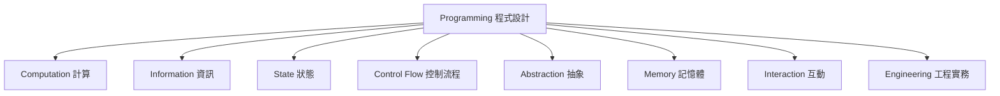
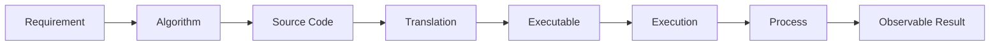

# 程式設計 Concept Tree

版本：0.1.0  
狀態：概念盤點草案  
最後更新：2026-08-04  
對應英文版本：[Programming Concept Tree](14-programming-concept-tree.en.md)

## 文件目的

本文件盤點本課程可能使用的程式設計核心概念，建立後續 Concept 依賴圖、能力對應、Unit 組合與學生教材的共同知識來源。

本文件目前只回答：

1. 課程需要哪些 Concept？
2. Concept 之間如何分類？
3. 每個 Concept 在 C 語言中如何呈現？

本階段不決定 Unit 數量、授課順序、週次或最終教材章節。

## Concept 判定原則

一個項目原則上應同時符合以下條件，才列為核心 Concept：

1. 能回答一個「為什麼」或建立一個心智模型，而不只是說明語法怎麼寫。
2. 不完全依賴某一種程式語言的特定關鍵字。
3. 可跨多種程式語言或運算環境成立。
4. 能成為其他知識的前置概念。
5. 學生能透過觀察、預測、追蹤、實作或驗證建立理解。

`if`、`for`、`malloc` 等語法或函式不單獨視為最高層 Concept，而列為概念在 C 語言中的實作方式。

## 整體架構



---

# 一、Computation｜計算

核心問題：**程式如何把問題轉換成可執行的計算？**

| Concept | 核心意義 | C 語言映射 |
|---|---|---|
| Problem | 需要被解決、轉換或自動化的情境 | 題目需求、輸入輸出規格 |
| Requirement | 對行為、資料與限制的明確描述 | 註解、規格、測試案例 |
| Algorithm | 從輸入得到輸出的有限步驟 | 自然語言、流程圖、虛擬碼、C 程式 |
| Program | 對計算過程的可執行描述 | C 原始碼與其建立出的可執行程式 |
| Source Code | 人類可閱讀與修改的程式表示 | `.c`、`.h` 檔案 |
| Translation | 將一種程式表示轉為另一種表示 | 預處理、編譯、組譯、連結 |
| Compiler | 檢查並翻譯原始碼的工具 | GCC、Clang |
| Executable | 可由作業系統啟動的程式映像 | `a.out`、`.exe` |
| Execution | 指令實際依序產生行為的過程 | 執行 `main`、敘述求值 |
| Process | 正在執行中的程式及其資源與狀態 | 作業系統中的程序概念 |
| Termination | 一次計算如何正常或異常結束 | `return`、`exit`、執行錯誤 |

主要關係：



---

# 二、Information｜資訊

核心問題：**程式處理的資料是什麼，又如何被表示與解讀？**

| Concept | 核心意義 | C 語言映射 |
|---|---|---|
| Data | 可被儲存、傳遞或處理的資訊 | 數值、字元、陣列、結構 |
| Value | 某一時刻可被觀察或計算出的內容 | `10`、`3.14`、`'A'` |
| Representation | 相同資訊在電腦中的編碼方式 | 二進位、補數、浮點表示、字元編碼 |
| Type | 對值集合及允許操作的約束與解讀方式 | `int`、`double`、`char`、結構型別 |
| Identifier | 程式中用來指稱實體的名稱 | 變數名、函數名、型別名 |
| Constant | 執行期間不應被改變的值或名稱 | 常值、`const`、列舉常數、巨集常數 |
| Expression | 由值、名稱與運算組合出的求值描述 | `a + b * 2` |
| Operator | 對一個或多個值執行的操作 | 算術、關係、邏輯、位元運算子 |
| Evaluation | 運算式產生值及可能副作用的過程 | 運算優先序、短路求值、函數呼叫 |
| Conversion | 值在不同表示或型別間的轉換 | 隱式轉型、顯式轉型 |
| Collection | 多個相關值的組織方式 | 陣列、字串、結構 |

重要區分：

- `Value` 是內容。
- `Type` 決定內容如何被解讀與操作。
- `Representation` 是內容在機器中的形式。
- `Expression` 是產生新值的描述。

---

# 三、State｜狀態

核心問題：**程式如何記住目前情況，並在執行中改變？**

| Concept | 核心意義 | C 語言映射 |
|---|---|---|
| State | 某一時刻所有相關資訊的組合 | 變數目前值、輸入位置、控制位置 |
| State Change | 執行一步後狀態產生差異 | 指派、遞增、輸入、函數副作用 |
| Variable | 可透過名稱存取、其值可能改變的程式物件 | 變數宣告與使用 |
| Declaration | 告知名稱、型別及可用方式 | `int count;`、函數原型 |
| Definition | 建立實體或提供完整實作 | 變數定義、函數定義 |
| Initialization | 在物件生命開始時建立初始狀態 | `int count = 0;` |
| Assignment | 在既有物件中寫入新值 | `count = count + 1;` |
| Update | 根據舊狀態計算並寫入新狀態 | `count++`、累加器 |
| Scope | 名稱在程式文字中的可見範圍 | 區塊、函數、檔案範圍 |
| Lifetime | 物件從存在到消失的時間範圍 | 自動、靜態、動態儲存期 |
| Invariant | 執行過程中應持續成立的條件 | 迴圈不變量、資料有效條件 |

典型狀態變化：

```text
舊狀態：count = 3
執行：count = count + 1
新狀態：count = 4
```

---

# 四、Control Flow｜控制流程

核心問題：**程式如何決定下一步要執行什麼？**

| Concept | 核心意義 | C 語言映射 |
|---|---|---|
| Sequence | 動作按照既定次序執行 | 一般敘述順序 |
| Condition | 可判定真假的狀態或運算式 | 整數真值、比較與邏輯運算式 |
| Decision | 根據條件選擇不同路徑 | `if`、`else`、`switch` |
| Branch | 從目前控制位置移到另一條路徑 | 條件分支、`break`、`continue` |
| Repetition | 在條件或範圍控制下重複執行 | `while`、`do-while`、`for` |
| Iteration | 一次重複循環及其狀態變化 | 迴圈本體、更新、重新判斷 |
| Loop Condition | 決定重複是否繼續的條件 | `while (condition)` |
| Boundary | 決定包含與排除位置的界線 | 起點、終點、`<` 與 `<=` |
| Sentinel | 以特殊輸入或狀態表示停止 | `-1` 結束輸入、EOF |
| Nested Control | 控制結構內再包含控制結構 | 巢狀條件、巢狀迴圈 |
| Infinite Execution | 無法抵達終止條件的執行 | 無窮迴圈、未更新狀態 |

`if`、`switch`、`while`、`for` 是 C 語言映射；核心 Concept 分別是 Decision 與 Repetition。

---

# 五、Abstraction｜抽象

核心問題：**如何隱藏不必要細節，讓程式能被理解、重用與組合？**

| Concept | 核心意義 | C 語言映射 |
|---|---|---|
| Decomposition | 將大型問題拆成可理解的責任 | 分解成多個函數與模組 |
| Responsibility | 一個程式部分應完成的單一任務 | 函數用途、模組職責 |
| Function | 將計算或行為包裝成可呼叫單位 | 函數宣告、定義與呼叫 |
| Interface | 使用者需要知道的輸入、輸出與約束 | 函數原型、標頭檔 |
| Implementation | 完成介面承諾的內部做法 | 函數本體、來源檔 |
| Parameter | 函數定義中接收資料的名稱與位置 | 形式參數 |
| Argument | 呼叫函數時提供的實際值或運算式 | 實際引數 |
| Return Value | 函數將結果交回呼叫端的方式 | `return expression;` |
| Call | 暫停目前流程並進入另一個計算單位 | 函數呼叫 |
| Call Stack | 尚未完成的函數呼叫及其區域狀態 | 呼叫框架、區域變數 |
| Recursion | 計算單位直接或間接使用自身 | 遞迴函數與基底情況 |
| Module | 具有明確介面與責任的程式單位 | `.h` 與 `.c`、分離編譯 |

---

# 六、Memory｜記憶體

核心問題：**程式物件存在於何處，又如何被定位與管理？**

| Concept | 核心意義 | C 語言映射 |
|---|---|---|
| Bit | 可表示兩種狀態的最小資訊單位 | 位元運算與二進位表示 |
| Byte | 可定址的基本儲存單位 | `sizeof(char) == 1` |
| Address | 記憶體位置的識別值 | `&object`、指標值 |
| Object | 執行期間佔有儲存空間的資料實體 | 變數、陣列元素、結構物件 |
| Layout | 多個物件或成員如何排列 | 陣列連續性、結構配置 |
| Pointer | 保存或表示物件／函數位址的值 | `int *p` |
| Indirection | 透過位址間接存取另一個物件 | `*p`、`p->member` |
| Aliasing | 多個名稱或指標指向同一物件 | 指標參數、共享修改 |
| Null Reference | 明確表示目前沒有有效目標 | null pointer、`NULL` |
| Storage Duration | 儲存空間存在的期間 | automatic、static、allocated |
| Stack Storage | 隨函數呼叫建立與釋放的典型儲存 | 區域自動變數、呼叫框架 |
| Static Storage | 程式執行期間持續存在的儲存 | 全域變數、`static` 物件 |
| Dynamic Allocation | 執行期間依需求取得與釋放儲存 | `malloc`、`calloc`、`realloc`、`free` |
| Ownership | 誰負責維持、傳遞與釋放資源 | API 約定、動態記憶體責任 |
| Memory Safety | 確保存取位置與生命週期有效 | 越界、懸空指標、重複釋放、洩漏 |

陣列與字串不是獨立的最高層領域，而是 Information 的 Collection 與 Memory 的 Layout、Address、Bounds 等概念交會後形成的 C 語言資料組織方式。

---

# 七、Interaction｜互動

核心問題：**程式如何接收外部資訊並產生可觀察結果？**

| Concept | 核心意義 | C 語言映射 |
|---|---|---|
| Input | 外部資料進入程式 | `scanf`、`fgets`、命令列參數 |
| Output | 程式將資訊提供給外部 | `printf`、`puts`、檔案寫入 |
| Stream | 有順序的資料流與目前讀寫位置 | `stdin`、`stdout`、`stderr`、`FILE *` |
| Format | 資料如何轉成文字或由文字解析 | 格式字串、欄位寬度、精度 |
| Buffer | 暫時累積輸入或輸出的區域 | 標準 I/O 緩衝、字元陣列 |
| File | 可持久保存並依名稱存取的資料 | `fopen`、`fclose`、讀寫函數 |
| End of Input | 外部資料來源已無更多內容 | EOF、輸入函數回傳值 |
| Error Channel | 與一般結果分離的診斷資訊 | `stderr`、編譯器訊息 |
| Command Line | 啟動程式時提供參數與環境 | `argc`、`argv` |
| Protocol | 互動雙方共同遵守的資料與順序規則 | 輸入格式、函數契約、檔案格式 |

---

# 八、Engineering｜工程實務

核心問題：**如何判斷程式可信、可理解、可修改，並負責任地使用工具？**

| Concept | 核心意義 | C 語言映射或課程活動 |
|---|---|---|
| Expected Result | 執行前可被比較的預期行為 | 手算、輸出預測、狀態表 |
| Test Case | 用具體輸入與期待結果檢查行為 | 正常、邊界、錯誤與回歸案例 |
| Testing | 系統性執行案例並比較結果 | 編譯、執行、測試表 |
| Verification | 以證據確認實作符合技術規格 | 預期／實際比較、追蹤、測試 |
| Validation | 確認成果解決真正需求 | 需求重新閱讀、使用情境檢查 |
| Debugging | 找出症狀、原因並驗證修正 | 重現、縮小範圍、假設、測試 |
| Error Classification | 判斷問題發生在哪一階段 | 編譯、執行、邏輯、格式、邊界 |
| Regression | 修正或修改後重新確認原功能 | 重跑既有測試 |
| Refactoring | 不改外部行為而改善內部結構 | 函數拆分、命名、重複移除 |
| Readability | 讓人能理解程式意圖與結構 | 命名、縮排、責任分離 |
| Documentation | 保存需求、介面、判斷與使用方式 | README、註解、測試紀錄 |
| Code Reading | 從既有程式推論結構與行為 | Trace、預測、解釋 |
| Comparison | 評估多種合理解法的差異 | 正確性、可讀性、可修改性 |
| Maintenance | 在需求改變後持續修改與驗證 | 需求變更與回歸測試 |
| Tool Use | 理解工具的角色、輸入與限制 | 編譯器、終端機、IDE、除錯器 |
| AI Collaboration | 將 AI 視為待驗證的建議來源 | 保存原始思考、測試、接受或拒絕理由 |

---

# 九、跨領域組合概念

以下項目非常重要，但由多個基礎 Concept 組合而成，因此不另設為第一層領域。

## Array｜陣列

由以下概念組成：

- Collection
- Type
- Object
- Layout
- Address
- Index
- Boundary
- Traversal
- Memory Safety

C 映射：陣列宣告、索引、`sizeof`、傳遞給函數時的轉換行為、多維陣列。

## String｜字串

由以下概念組成：

- Character Representation
- Collection
- Array
- Sentinel
- Buffer
- Format
- Boundary
- Memory Safety

C 映射：字元陣列、字串常值、null terminator、`<string.h>`、安全輸入與長度管理。

## Structure｜結構

由以下概念組成：

- Type
- Collection
- Object
- Layout
- Member
- Interface
- Assignment

C 映射：`struct`、member access、structure assignment、pointer-to-structure、`typedef`。

## File I/O｜檔案輸入輸出

由以下概念組成：

- File
- Stream
- Buffer
- Format
- Protocol
- End of Input
- Error Handling
- Resource Lifetime

C 映射：`FILE *`、開啟模式、讀寫函數、EOF 與關閉檔案。

## Modular Programming｜模組化程式設計

由以下概念組成：

- Decomposition
- Responsibility
- Interface
- Implementation
- Module
- Translation
- Linking
- Documentation

C 映射：標頭檔、來源檔、include guard、分離編譯與連結。

---

# 十、目前邊界

本 Concept Tree 目前涵蓋：

- 大學入門 C 程式設計課程所需核心概念。
- 可由前導課程銜接至正式課程的基礎知識。
- 測試、除錯、修改需求與 AI 驗證等跨單元能力。

目前暫不展開：

- 進階資料結構與演算法分析。
- 物件導向、泛型與例外處理等其他語言典型機制。
- 作業系統、編譯器、網路或並行程式設計的深入理論。
- 特定 IDE 或平台操作細節。

這些內容未被否定；它們將在需要時作為後續 Concept Tree 的延伸層。

## 下一步

1. 為每個 Concept 建立唯一 ID。
2. 區分核心 Concept、組合 Concept 與 C 語言映射。
3. 建立 Concept Dependency Graph。
4. 標記前導課程與正式課程的目標成熟度。
5. 依依賴關係組成 Unit，而不是先用週次切割知識。
6. 最後才為每個 Unit 撰寫學生教材。

## 導覽

- [課程憲法](../CONSTITUTION.zh-TW.md)
- [教學內容設計區](README.zh-TW.md)
- [知識依賴設計](04-knowledge-dependencies.zh-TW.md)
- [能力定義](05-competencies.zh-TW.md)
- [English version](14-programming-concept-tree.en.md)
