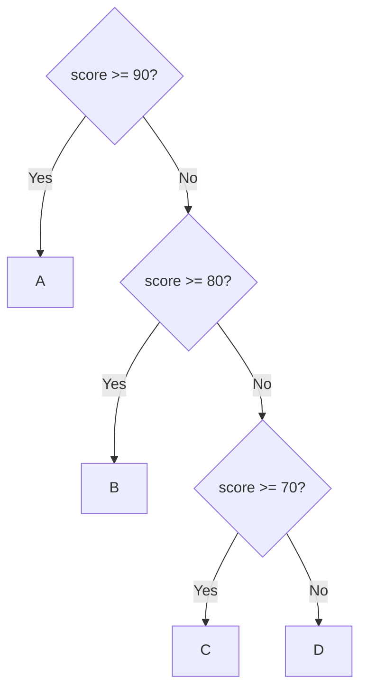

# Formal Unit F-U02: How Can Reliable Multi-Branch and Repetitive Flows Be Built?

Version: 1.0.1  
Status: Official student material  
Last updated: 2026-08-05  
Corresponding Chinese version: [正式單元 F-U02：如何建立可靠的多分支與重複流程？](unit-02-complex-control-flow.zh-TW.md)

## Purpose and Completion Standard

This chapter is for independent reading, practice, and review. Completing it means you can design multi-branch and nested flows, explain the roles of sentinels and invariants, and use path, boundary, input-status, and termination tests to show that a flow is reliable.

## Core Question

> When conditions, boundaries, and repetition rules become complex, how can correctness still be demonstrated?

After completing this chapter, you should be able to:

1. Compare `if` chains and `switch`.
2. Trace nested conditions and loops.
3. Use a sentinel without confusing it with EOF or invalid input.
4. State a simple loop invariant.
5. Verify paths, boundaries, input failures, and termination systematically.

---

## 1. Predict a Multi-Branch Flow

```c
int score = 85;

if (score >= 90) {
    printf("A\n");
} else if (score >= 80) {
    printf("B\n");
} else if (score >= 70) {
    printf("C\n");
} else {
    printf("D\n");
}
```

Write which conditions are tested, where evaluation stops, and what is printed.

---

## 2. Branch Order Is Part of the Rule

In an `if`/`else if` chain, the first true condition selects the path. Stricter or more specific conditions usually belong first.



Tests should cover each branch and each boundary.

---

## 3. `switch` for Discrete Choices

```c
switch (command) {
    case 1:
        printf("Add\n");
        break;
    case 2:
        printf("Delete\n");
        break;
    default:
        printf("Unknown\n");
}
```

`switch` fits discrete choices from one integer-like value. Range conditions such as `score >= 60` still fit `if` better.

Missing `break` may cause fall-through. Intentional fall-through should be clearly explained.

---

## 4. Trace Nested Flow in Layers

```c
if (is_member) {
    if (amount >= 1000) {
        discount = 0.15;
    } else {
        discount = 0.10;
    }
} else {
    discount = 0.0;
}
```

Path table:

| `is_member` | `amount` | Expected discount |
|---|---:|---:|
| false | 1500 | 0.00 |
| true | 999 | 0.10 |
| true | 1000 | 0.15 |

Do not test only the most common path.

---

## 5. Sentinel-Controlled Input Must Also Check Read Status

A sentinel is data with a special meaning. EOF and invalid text are not the sentinel.

```c
#include <stdio.h>

int main(void) {
    int value;
    int sum = 0;

    while (scanf("%d", &value) == 1) {
        if (value == -1) {
            printf("Sum: %d\n", sum);
            return 0;
        }

        sum += value;
    }

    if (feof(stdin)) {
        fprintf(stderr, "Input ended before sentinel\n");
    } else {
        fprintf(stderr, "Invalid input\n");
    }

    return 1;
}
```

`-1` is a sentinel and is not included in the sum. The loop stops safely on conversion failure or EOF instead of reusing an old value. Choose a sentinel that cannot be valid data, or use another protocol.

---

## 6. Loop Invariant

For the sum program:

> At the start of each successful iteration, `sum` equals the total of all previously read non-sentinel values.

Use it to ask:

1. Is it true initially?
2. Does one valid iteration preserve it?
3. Does reaching the sentinel establish the required result?
4. What state is guaranteed when reading fails before the sentinel?

---

## 7. Error Cases and Classification

### Missing `break`

```c
case 1:
    printf("One\n");
case 2:
    printf("Two\n");
```

This compiles and falls through at runtime. It is a logic error when the requirement expected only one action.

### Sentinel Included in the Sum

If data is processed before the sentinel check, `-1` may be counted. This is a logic/order error.

### Unchecked Input in a Sentinel Loop

```c
scanf("%d", &value);
while (value != -1) {
    sum += value;
    scanf("%d", &value);
}
```

If the first conversion fails, `value` is indeterminate and reading it is undefined behavior. If a later conversion fails, the previous value may be processed repeatedly. Control the loop with the read result.

### Missing Nested Combination

Testing only `true/true` does not establish false paths and boundaries. This is insufficient evidence rather than a compiler defect.

---

## 8. Guided Practice

Build a menu: 1 query, 2 modify, 0 exit, otherwise `Invalid`. Check `scanf` before using `command`, and list all discrete paths before using `switch`.

Build the member-discount example after completing its path table.

---

## 9. Independent Practice: Unknown-Length Average

Read scores from 0 through 100 until `-1`, then display count and average.

Required tests:

- one value then sentinel
- several values
- immediate sentinel
- boundaries 0 and 100
- invalid text
- EOF before sentinel
- out-of-range numeric input

Do not divide by zero when there is no data. State whether out-of-range values are rejected, ignored, or terminate the program.

---

## 10. Requirement Modification

New rule: ignore numeric values outside 0–100 without terminating. Update the invariant, count logic, error messages, and test table, then run regression tests. Invalid text and EOF remain separate from out-of-range numeric data.

---

## 11. Explain the Concept to AI

Explain:

> Why does branch order matter? How are a sentinel, EOF, invalid input, and a loop invariant different?

If an AI response conflicts with a path table, read-result rule, trace, or reproducible result, judge it again using evidence.

---

## 12. Self-Check

- I can choose between `if` and `switch`.
- I can trace nested paths.
- I can distinguish a sentinel from EOF and invalid input.
- I can state a simple invariant.
- I check input success before using a value.
- I can test every branch and important boundary.
- I can diagnose fall-through, incorrect counting, and stale-input loops.

## 13. Chapter Summary

Complex control flow is still built from conditions, state, and updates. Reliability comes from clear branch order, complete path tables, suitable sentinels, checked input, preserved invariants, and tests that cover boundaries, failure, and termination. The next Unit organizes many same-type values into arrays.

## Navigation

- [Previous Unit: Representation, Types, and Operations](unit-01-representation-types.en.md)
- [Next Unit: Arrays](unit-03-arrays.en.md)
- [Formal-Course Index](README.en.md)
- [繁體中文版](unit-02-complex-control-flow.zh-TW.md)
