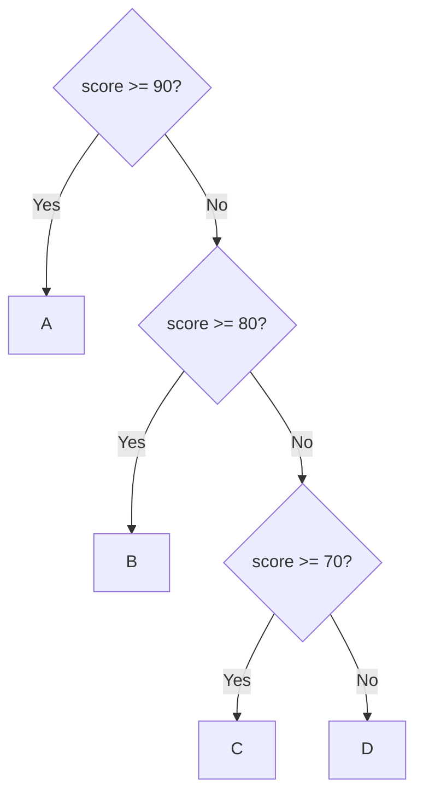

# Formal Unit F-U02: How Can Reliable Multi-Branch and Repetitive Flows Be Built?

Version: 1.0.0  
Status: Official student material  
Last updated: 2026-08-04  
Corresponding Chinese version: [正式單元 F-U02：如何建立可靠的多分支與重複流程？](unit-02-advanced-control.zh-TW.md)

## Purpose and Completion Standard

This chapter is for independent reading, practice, and review. Completing it means you can design multi-branch and nested flows, explain the roles of sentinels and invariants, and use path, boundary, and termination tests to show that a flow is reliable.

## Core Question

> When conditions, boundaries, and repetition rules become complex, how can correctness still be demonstrated?

After completing this chapter, you should be able to:

1. Compare `if` chains and `switch`.
2. Trace nested conditions and loops.
3. Use a sentinel to control unknown-length input.
4. State a simple loop invariant.
5. Verify paths and boundaries systematically.

---

## 1. Predict a Multi-Branch Flow

```c
int score = 85;

if (score >= 90) {
    printf("A\n");
} else if (score >= 80) {
    printf("B\n");
} else if (score >= 70) {
    printf("C\n");
} else {
    printf("D\n");
}
```

Write which conditions are tested, where evaluation stops, and what is printed.

---

## 2. Branch Order Is Part of the Rule

In an `if`/`else if` chain, the first true condition selects the path. Stricter or more specific conditions usually belong first.



Tests should cover each branch and each boundary.

---

## 3. `switch` for Discrete Choices

```c
switch (command) {
    case 1:
        printf("Add\n");
        break;
    case 2:
        printf("Delete\n");
        break;
    default:
        printf("Unknown\n");
}
```

`switch` fits discrete choices from one integer-like value. Range conditions such as `score >= 60` still fit `if` better.

Missing `break` may cause fall-through. Intentional fall-through should be clearly explained.

---

## 4. Trace Nested Flow in Layers

```c
if (is_member) {
    if (amount >= 1000) {
        discount = 0.15;
    } else {
        discount = 0.10;
    }
} else {
    discount = 0.0;
}
```

Path table:

| `is_member` | `amount` | Expected discount |
|---|---:|---:|
| false | 1500 | 0.00 |
| true | 999 | 0.10 |
| true | 1000 | 0.15 |

Do not test only the most common path.

---

## 5. Sentinel-Controlled Input

When the number of inputs is unknown, a special value can mean “stop”:

```c
int value;
int sum = 0;

scanf("%d", &value);
while (value != -1) {
    sum += value;
    scanf("%d", &value);
}
```

`-1` is a sentinel, not ordinary data. A sentinel must not conflict with valid input.

---

## 6. Loop Invariant

An invariant is a statement that should remain true at each loop boundary.

For the sum program:

> At the start of each iteration, `sum` equals the total of all previously read non-sentinel values.

Use it to ask:

1. Is it true initially?
2. Does one iteration preserve it?
3. Does termination let us conclude the required result?

---

## 7. Error Cases

### Missing `break`

```c
case 1:
    printf("One\n");
case 2:
    printf("Two\n");
```

Input 1 may print two lines. Diagnose with path tracing.

### Sentinel Included in the Sum

If data is processed before the sentinel check, `-1` may be counted. Compare “check then process” with “process then check.”

### Missing Nested Combination

Testing only `true/true` does not prove false paths and boundaries.

---

## 8. Guided Practice

Build a menu: 1 query, 2 modify, 0 exit, otherwise `Invalid`. List all discrete paths before using `switch`.

Build the member-discount example after completing its path table.

---

## 9. Independent Practice: Unknown-Length Average

Read nonnegative scores until `-1`, then display count and average.

Required tests:

- one value then stop
- several values
- immediate `-1`
- boundary values 0 and 100

Do not divide by zero when there is no data.

---

## 10. Requirement Modification

New rule: ignore values outside 0–100 without terminating. Update the invariant, count logic, and test table, then run regression tests.

---

## 11. Explain the Concept to AI

Explain:

> Why does branch order matter? How do a sentinel and a loop invariant help us understand a loop?

If an AI response conflicts with a path table, trace, or reproducible result, judge it again using evidence.

---

## 12. Self-Check

- I can choose between `if` and `switch`.
- I can trace nested paths.
- I can design a nonconflicting sentinel.
- I can state a simple invariant.
- I can test every branch and important boundary.
- I can diagnose fall-through and incorrect counting.

## 13. Chapter Summary

Complex control flow is still built from conditions, state, and updates. Reliability comes from clear branch order, complete path tables, suitable sentinels, preserved invariants, and tests that cover boundaries and termination. The next Unit organizes many same-type values into arrays.

## Navigation

- [Previous Unit: Representation, Types, and Operations](unit-01-representation-types.en.md)
- [Next Unit: Arrays](unit-03-arrays.en.md)
- [Formal-Course Index](README.en.md)
- [繁體中文版](unit-02-advanced-control.zh-TW.md)
