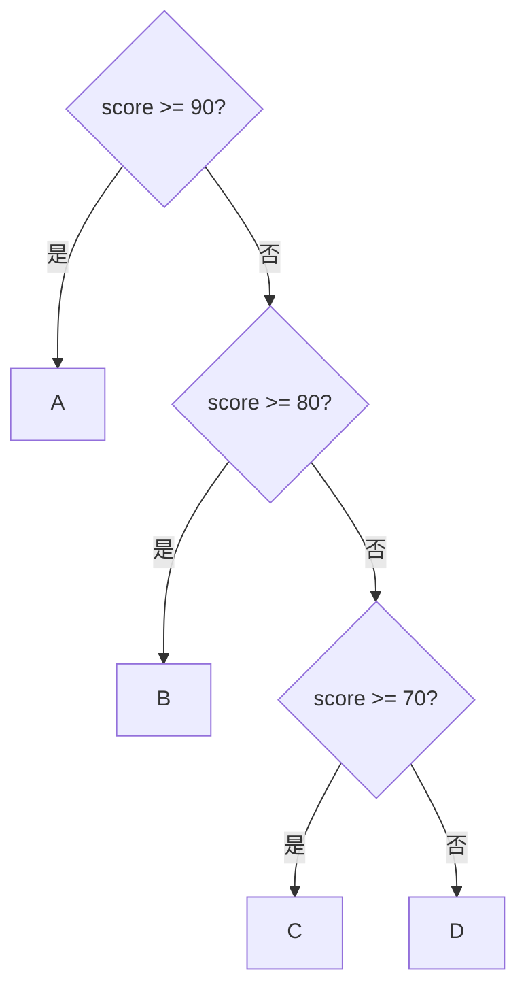

# 正式單元 F-U02：如何建立可靠的多分支與重複流程？

版本：1.0.0  
狀態：正式學生教材  
最後更新：2026-08-04  
對應英文版本：[Formal Unit F-U02: How Can Reliable Multi-Branch and Repetitive Flows Be Built?](unit-02-advanced-control.en.md)

## 文件用途與完成標準

本章供學生獨立閱讀、練習與複習。完成本章代表你能設計多分支與巢狀流程，說明 sentinel 與 invariant 的作用，並能用邊界、路徑與終止測試證明流程可靠。

## 核心問題

> 當條件、邊界與重複規則變複雜時，如何仍能證明流程正確？

完成本章後，你應能：

1. 比較 `if` 鏈與 `switch` 的適用情境。
2. 追蹤巢狀條件與迴圈路徑。
3. 使用 sentinel 控制輸入終止。
4. 用 loop invariant 說明迴圈每一步維持的事實。
5. 以路徑覆蓋與邊界案例驗證流程。

---

## 1. 先預測多分支

```c
int score = 85;

if (score >= 90) {
    printf("A\n");
} else if (score >= 80) {
    printf("B\n");
} else if (score >= 70) {
    printf("C\n");
} else {
    printf("D\n");
}
```

先寫下會檢查哪些條件、在哪一個條件停止，以及輸出什麼。

---

## 2. 多分支的順序就是規則

在 `if`／`else if` 鏈中，第一個成立的條件決定路徑。較嚴格或較特殊的條件通常應放在前面。



測試應至少涵蓋每一個分支與每一個邊界。

---

## 3. `switch` 適合離散選擇

```c
switch (command) {
    case 1:
        printf("Add\n");
        break;
    case 2:
        printf("Delete\n");
        break;
    default:
        printf("Unknown\n");
}
```

`switch` 適合對同一個整數型或列舉型值進行離散選擇。範圍判斷如 `score >= 60` 仍適合 `if`。

漏掉 `break` 可能造成 fall-through。若是刻意 fall-through，應清楚註明原因。

---

## 4. 巢狀流程需要分層追蹤

```c
if (is_member) {
    if (amount >= 1000) {
        discount = 0.15;
    } else {
        discount = 0.10;
    }
} else {
    discount = 0.0;
}
```

建立路徑表：

| `is_member` | `amount` | 預期折扣 |
|---|---:|---:|
| false | 1500 | 0.00 |
| true | 999 | 0.10 |
| true | 1000 | 0.15 |

不要只測最常見路徑。

---

## 5. Sentinel 控制未知次數輸入

當輸入數量事先未知，可用特殊值代表結束：

```c
int value;
int sum = 0;

scanf("%d", &value);
while (value != -1) {
    sum += value;
    scanf("%d", &value);
}
```

`-1` 是 sentinel，不屬於一般資料。設計 sentinel 時要確認它不會與合法輸入衝突。

---

## 6. Loop Invariant

Invariant 是每次迴圈開始或結束時都應成立的敘述。

對加總程式：

> 在每次迴圈開始時，`sum` 等於已讀取且非 sentinel 的所有值總和。

Invariant 幫助你回答：

1. 初始時是否成立？
2. 執行一次後是否仍成立？
3. 終止時能否推出需要的結果？

---

## 7. 錯誤案例

### 漏掉 `break`

```c
case 1:
    printf("One\n");
case 2:
    printf("Two\n");
```

輸入 1 時可能印出兩行。使用路徑追蹤診斷。

### Sentinel 被加入總和

若先加總再判斷，`-1` 可能被誤算。比較「先判斷後處理」與「先處理後判斷」。

### 巢狀條件漏掉組合

只測 `true/true` 不足以證明 `false` 路徑與邊界正確。

---

## 8. 引導練習

建立簡單選單：1 查詢、2 修改、0 離開，其他值輸出 `Invalid`。先列出所有離散路徑，再使用 `switch`。

建立會員折扣程式，先完成三列路徑表再寫程式。

---

## 9. 自主練習：未知筆數平均

持續讀入非負分數，以 `-1` 結束，輸出筆數與平均。

必測：

- 一筆資料後結束
- 多筆資料
- 立即輸入 `-1`
- 邊界 0 與 100

若沒有任何資料，不可除以零。

---

## 10. 需求修改

新增規則：忽略超出 0～100 的值，但不要終止。請更新 invariant、計數方式與測試表，再執行回歸測試。

---

## 11. 向 AI 解釋概念

請向 AI 解釋：

> 多分支的順序為什麼重要？sentinel 與 loop invariant 如何幫助我們理解迴圈？

AI 回應若與路徑表、追蹤或可重現結果不一致，請以證據重新判斷。

---

## 12. 自我檢核

- 我能選擇 `if` 或 `switch`。
- 我能追蹤巢狀路徑。
- 我能設計不衝突的 sentinel。
- 我能寫出簡單 invariant。
- 我能測試每個分支與重要邊界。
- 我能診斷 fall-through、漏算與多算。

## 13. 本章摘要

複雜控制流程仍由條件、狀態與更新構成。可靠性來自清楚的分支順序、完整路徑表、合理 sentinel、可維持的 invariant，以及涵蓋邊界與終止的測試。下一章將把多個同類資料組織成陣列。

## 導覽

- [上一單元：表示、型別與運算](unit-01-representation-types.zh-TW.md)
- [下一單元：陣列](unit-03-arrays.zh-TW.md)
- [正式課程索引](README.zh-TW.md)
- [English version](unit-02-advanced-control.en.md)
