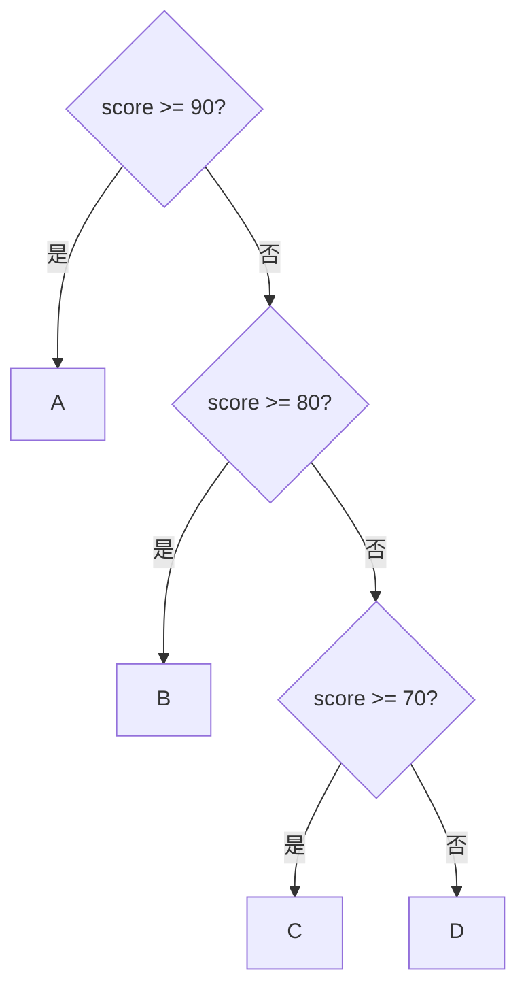

# 正式單元 F-U02：如何建立可靠的多分支與重複流程？

版本：1.0.1  
狀態：正式學生教材  
最後更新：2026-08-05  
對應英文版本：[Formal Unit F-U02: How Can Reliable Multi-Branch and Repetitive Flows Be Built?](unit-02-complex-control-flow.en.md)

## 文件用途與完成標準

本章供學生獨立閱讀、練習與複習。完成本章代表你能設計多分支與巢狀流程，說明 sentinel 與 invariant 的作用，並能用路徑、邊界、輸入狀態與終止測試證明流程可靠。

## 核心問題

> 當條件、邊界與重複規則變複雜時，如何仍能證明流程正確？

完成本章後，你應能：

1. 比較 `if` 鏈與 `switch` 的適用情境。
2. 追蹤巢狀條件與迴圈路徑。
3. 使用 sentinel，並區分 sentinel、EOF 與無效輸入。
4. 用 loop invariant 說明迴圈每一步維持的事實。
5. 系統化驗證路徑、邊界、輸入失敗與終止。

---

## 1. 先預測多分支

```c
int score = 85;

if (score >= 90) {
    printf("A\n");
} else if (score >= 80) {
    printf("B\n");
} else if (score >= 70) {
    printf("C\n");
} else {
    printf("D\n");
}
```

先寫下會檢查哪些條件、在哪一個條件停止，以及輸出什麼。

---

## 2. 多分支的順序就是規則

在 `if`／`else if` 鏈中，第一個成立的條件決定路徑。較嚴格或較特殊的條件通常應放在前面。



測試應至少涵蓋每一個分支與每一個邊界。

---

## 3. `switch` 適合離散選擇

```c
switch (command) {
    case 1:
        printf("Add\n");
        break;
    case 2:
        printf("Delete\n");
        break;
    default:
        printf("Unknown\n");
}
```

`switch` 適合對同一個整數型或列舉型值進行離散選擇。範圍判斷如 `score >= 60` 仍適合 `if`。

漏掉 `break` 可能造成 fall-through。若是刻意 fall-through，應清楚註明原因。

---

## 4. 巢狀流程需要分層追蹤

```c
if (is_member) {
    if (amount >= 1000) {
        discount = 0.15;
    } else {
        discount = 0.10;
    }
} else {
    discount = 0.0;
}
```

建立路徑表：

| `is_member` | `amount` | 預期折扣 |
|---|---:|---:|
| false | 1500 | 0.00 |
| true | 999 | 0.10 |
| true | 1000 | 0.15 |

不要只測最常見路徑。

---

## 5. Sentinel 輸入也必須檢查讀取狀態

Sentinel 是帶有特殊意義的資料；EOF 與無效文字不是 sentinel。

```c
#include <stdio.h>

int main(void) {
    int value;
    int sum = 0;

    while (scanf("%d", &value) == 1) {
        if (value == -1) {
            printf("Sum: %d\n", sum);
            return 0;
        }

        sum += value;
    }

    if (feof(stdin)) {
        fprintf(stderr, "Input ended before sentinel\n");
    } else {
        fprintf(stderr, "Invalid input\n");
    }

    return 1;
}
```

`-1` 是 sentinel，不加入總和。迴圈在轉換失敗或 EOF 時安全停止，不會重複使用舊值。Sentinel 應避免與合法資料衝突，否則應改用其他協定。

---

## 6. Loop Invariant

對加總程式：

> 每次成功讀取後進入迴圈時，`sum` 等於此前所有非 sentinel 值的總和。

Invariant 幫助回答：

1. 初始時是否成立？
2. 一次合法迭代後是否仍成立？
3. 遇到 sentinel 時是否能推出要求結果？
4. 在 sentinel 前讀取失敗時，哪些狀態仍有保證？

---

## 7. 錯誤案例與分類

### 漏掉 `break`

```c
case 1:
    printf("One\n");
case 2:
    printf("Two\n");
```

這可編譯並在執行時 fall-through；若需求只允許一個動作，這是邏輯錯誤。

### Sentinel 被加入總和

若先加總再判斷，`-1` 可能被誤算。這是處理順序的邏輯錯誤。

### Sentinel 迴圈未檢查輸入

```c
scanf("%d", &value);
while (value != -1) {
    sum += value;
    scanf("%d", &value);
}
```

第一次轉換失敗時，`value` 未取得有效值，讀取它屬未定義行為；後續轉換失敗則可能重複處理舊值。應以讀取結果控制迴圈。

### 巢狀條件漏掉組合

只測 `true/true` 不足以證明 false 路徑與邊界正確。這是證據不足，不是編譯器錯誤。

---

## 8. 引導練習

建立簡單選單：1 查詢、2 修改、0 離開，其他值輸出 `Invalid`。使用 `command` 前先檢查 `scanf`，並列出所有離散路徑。

建立會員折扣程式，先完成三列路徑表再寫程式。

---

## 9. 自主練習：未知筆數平均

持續讀入 0～100 的成績，以 `-1` 結束，輸出筆數與平均。

必測：

- 一筆資料後 sentinel
- 多筆資料
- 立即 sentinel
- 邊界 0 與 100
- 無效文字
- sentinel 前 EOF
- 超出範圍的數字

若沒有任何資料，不可除以零。需定義超出範圍的數字是拒絕、忽略或終止。

---

## 10. 需求修改

新增規則：忽略超出 0～100 的數值，但不要終止。請更新 invariant、計數、錯誤訊息與測試表，再執行回歸測試。無效文字與 EOF 仍不同於超出範圍的數字。

---

## 11. 向 AI 解釋概念

請向 AI 解釋：

> 多分支的順序為什麼重要？sentinel、EOF、無效輸入與 loop invariant 有什麼不同？

AI 回應若與路徑表、讀取回傳規則、追蹤或可重現結果不一致，請以證據重新判斷。

---

## 12. 自我檢核

- 我能選擇 `if` 或 `switch`。
- 我能追蹤巢狀路徑。
- 我能區分 sentinel、EOF 與無效輸入。
- 我能寫出簡單 invariant。
- 我會在使用值前檢查輸入成功。
- 我能測試每個分支與重要邊界。
- 我能診斷 fall-through、錯誤計數與 stale-input 迴圈。

## 13. 本章摘要

複雜控制流程仍由條件、狀態與更新構成。可靠性來自清楚的分支順序、完整路徑表、合理 sentinel、輸入檢查、可維持的 invariant，以及涵蓋邊界、失敗與終止的測試。下一章將把多個同類資料組織成陣列。

## 導覽

- [上一單元：表示、型別與運算](unit-01-representation-types.zh-TW.md)
- [下一單元：陣列](unit-03-arrays.zh-TW.md)
- [正式課程索引](README.zh-TW.md)
- [English version](unit-02-complex-control-flow.en.md)
