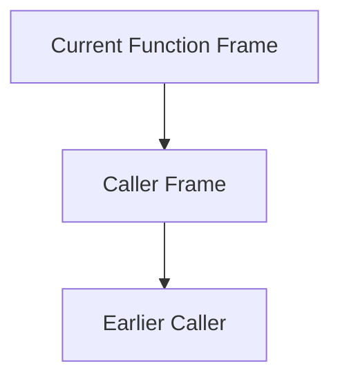

# Formal Unit F-U05: How Does a Function Call Create a New Execution Environment?

Version: 1.0.0  
Status: Official student material  
Last updated: 2026-08-04  
Corresponding Chinese version: [正式單元 F-U05：函數呼叫如何建立新的執行環境？](unit-05-call-stack-recursion.zh-TW.md)

## Purpose and Completion Standard

This chapter is for independent reading, practice, and review. Completing it means you can explain call frames, scope, and lifetime, trace the call stack, and diagnose recursion that lacks a base case or does not move toward termination.

## Core Question

> During a function call, how are parameters, local state, and unfinished work preserved?

After completing this chapter, you should be able to:

1. Explain the call stack and call frames.
2. Distinguish scope from lifetime.
3. Trace nested function calls.
4. Explain recursive and base cases.
5. Explain the conceptual cause of stack overflow.

---

## 1. What Must a Call Preserve?

```c
int square(int x) {
    int result = x * x;
    return result;
}
```

When `main` calls `square(5)`, execution must preserve the return location, parameter `x`, local variable `result`, and unfinished caller work.

---

## 2. Call Stack Model



Each call creates a call frame. When a function returns, the top frame is removed.

```text
square frame
main frame
```

---

## 3. Scope and Lifetime

```c
int function(void) {
    int local = 10;
    return local;
}
```

- Scope: where a name can be used in program text.
- Lifetime: how long an object exists during execution.

`local` is visible only inside the function and exists during that call.

---

## 4. Nested Call Trace

```c
int double_value(int x) {
    return x * 2;
}

int add_one_then_double(int x) {
    return double_value(x + 1);
}
```

Calling `add_one_then_double(4)`:

```text
main
→ add_one_then_double(4)
→ double_value(5)
→ return 10
→ return 10
```

---

## 5. Recursion

```c
int factorial(int n) {
    if (n <= 1) {
        return 1;
    }
    return n * factorial(n - 1);
}
```

- base case: `n <= 1`
- recursive case: `n * factorial(n - 1)`

Calling `factorial(4)` creates several frames and completes them in reverse order.

---

## 6. Recursion Trace

```text
factorial(4)
= 4 * factorial(3)
= 4 * 3 * factorial(2)
= 4 * 3 * 2 * factorial(1)
= 4 * 3 * 2 * 1
= 24
```

Each level preserves its own `n` and unfinished multiplication.

---

## 7. Error Cases

### Missing Base Case

```c
int countdown(int n) {
    return countdown(n - 1);
}
```

Calls continue creating frames and may eventually exhaust stack space.

### Not Moving Toward the Base Case

```c
return factorial(n + 1);
```

A base case exists, but the state moves in the wrong direction.

### Returning the Address of a Local Object

The local object's lifetime ends when the function returns. The pointer Unit deepens this problem.

---

## 8. Guided Practice

1. Trace every frame of `factorial(3)`.
2. Write recursive `sum_to_n(n)` after defining its base case.
3. Compare iterative and recursive state preservation.

---

## 9. Independent Practice: Recursive String Length

Create:

```c
int recursive_length(const char text[]);
```

Return 0 at `\0`; otherwise return `1 +` the length of the remaining string. Trace `"cat"` first.

---

## 10. Requirement Modification

Change `factorial` to reject negative input. Define how the interface reports an error, then update tests and the caller.

---

## 11. Explain the Concept to AI

Explain:

> What is the relationship among the call stack, call frames, scope, and lifetime? Why does recursion need a base case?

If an AI response conflicts with a call trace or reproducible result, judge it again using evidence.

---

## 12. Self-Check

- I can draw a simple call stack.
- I can distinguish scope and lifetime.
- I can trace nested calls.
- I can identify a recursive base case.
- I can judge whether a recursive case approaches termination.
- I can explain the conceptual cause of stack overflow.

## 13. Chapter Summary

Each function call creates a new execution frame that preserves parameters, local state, and a return location. Recursion uses multiple frames to preserve unfinished work and must have a reachable base case. The next Unit accesses data indirectly through addresses and pointers.

## Navigation

- [Previous Unit: Strings](unit-04-strings.en.md)
- [Next Unit: Pointers](unit-06-pointers.en.md)
- [Formal-Course Index](README.en.md)
- [繁體中文版](unit-05-call-stack-recursion.zh-TW.md)
