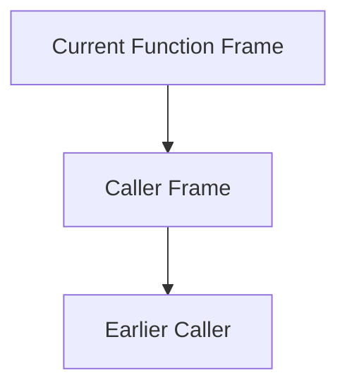

# Formal Unit F-U05: How Does a Function Call Create a New Execution Environment?

Version: 1.0.1  
Status: Official student material  
Last updated: 2026-08-05  
Corresponding Chinese version: [正式單元 F-U05：函數呼叫如何建立新的執行環境？](unit-05-call-stack-recursion.zh-TW.md)

## Purpose and Completion Standard

This chapter is for independent reading, practice, and review. Completing it means you can explain call frames, scope, and lifetime, trace the call stack, and diagnose recursion that lacks a reachable base case, moves away from termination, or produces a value outside the selected integer type.

## Core Question

> During a function call, how are parameters, local state, and unfinished work preserved?

After completing this chapter, you should be able to:

1. Explain the call stack and call frames.
2. Distinguish scope from lifetime.
3. Trace nested function calls.
4. Explain recursive and base cases.
5. Separate termination correctness from result-range correctness.
6. Explain the conceptual cause of stack overflow.

---

## 1. What Must a Call Preserve?

```c
int square(int x) {
    int result = x * x;
    return result;
}
```

When `main` calls `square(5)`, execution must preserve the return location, parameter `x`, local variable `result`, and unfinished caller work.

---

## 2. Call Stack Model



Each call creates a call frame. When a function returns, the top frame is removed.

```text
square frame
main frame
```

---

## 3. Scope and Lifetime

```c
int function(void) {
    int local = 10;
    return local;
}
```

- Scope: where a name can be used in program text.
- Lifetime: how long an object exists during execution.

`local` is visible only inside the function and exists during that call.

---

## 4. Nested Call Trace

```c
int double_value(int x) {
    return x * 2;
}

int add_one_then_double(int x) {
    return double_value(x + 1);
}
```

Calling `add_one_then_double(4)`:

```text
main
→ add_one_then_double(4)
→ double_value(5)
→ return 10
→ return 10
```

---

## 5. A Recursive Interface Must Define Its Valid Domain

A safe factorial interface should not silently treat negative input as a valid base case, and it should reject values that cannot be represented by the selected result type.

```c
#include <limits.h>

int factorial_checked(int n, unsigned long long *result) {
    if (result == NULL || n < 0) {
        return 0;
    }

    if (n == 0 || n == 1) {
        *result = 1;
        return 1;
    }

    unsigned long long smaller;
    if (!factorial_checked(n - 1, &smaller)) {
        return 0;
    }

    if (smaller > ULLONG_MAX / (unsigned long long)n) {
        return 0;
    }

    *result = (unsigned long long)n * smaller;
    return 1;
}
```

This interface separates three questions:

1. Does recursion terminate?
2. Is the input valid?
3. Does the mathematical result fit the selected type?

For a typical 64-bit `unsigned long long`, `20!` fits and `21!` does not, but the code checks the implementation's actual `ULLONG_MAX` instead of assuming a fixed width.

---

## 6. Recursion Trace

For valid input 4:

```text
factorial_checked(4)
→ factorial_checked(3)
→ factorial_checked(2)
→ factorial_checked(1)
→ result 1
→ result 2
→ result 6
→ result 24
```

Each level preserves its own `n`, local `smaller`, output pointer, and unfinished multiplication.

Test at least:

| Input | Expected result |
|---:|---|
| -1 | failure |
| 0 | success, 1 |
| 1 | success, 1 |
| 4 | success, 24 |
| largest fitting value | success |
| next value | failure because of overflow risk |
| valid input with `result == NULL` | failure |

---

## 7. Error Cases and Classification

### Missing Base Case

```c
int countdown(int n) {
    return countdown(n - 1);
}
```

This compiles, but the recursive calls do not have a terminating branch. Execution may eventually exhaust stack space. This is a runtime termination/resource defect, not a compile error.

### Not Moving Toward the Base Case

```c
return factorial_checked(n + 1, result);
```

A base case may exist, but the state moves in the wrong direction. This is a logic and termination defect.

### Negative Input Accidentally Accepted

```c
if (n <= 1) {
    return 1;
}
```

For a mathematical factorial interface, this incorrectly accepts every negative input. The recursion terminates, but the result violates the requirement. Termination alone does not establish correctness.

### Signed Integer Overflow

```c
int factorial(int n) {
    if (n <= 1) {
        return 1;
    }
    return n * factorial(n - 1);
}
```

For sufficiently large valid input, signed multiplication may overflow, which is undefined behavior in C. Use a wider unsigned type only when its range is part of the contract, and still check before multiplication.

### Returning the Address of a Local Object

The local object's lifetime ends when the function returns. Dereferencing the returned pointer later is undefined behavior. The pointer Unit deepens this problem.

---

## 8. Guided Practice

1. Trace every frame of `factorial_checked(3, &answer)`.
2. Write recursive `sum_to_n(n)` after defining valid input and overflow behavior.
3. Compare iterative and recursive state preservation.
4. Explain why a terminating recursion can still return an invalid result.

---

## 9. Independent Practice: Recursive String Length

Create:

```c
int recursive_length(const char text[], int *length);
```

Define `text == NULL` and `length == NULL` as failure. Return 0 at `\0`; otherwise obtain the remaining length recursively and add one only after success. Trace `"cat"` first.

---

## 10. Requirement Modification

Change the factorial contract to use a caller-selected maximum input. Update the function contract, tests, and caller while preserving overflow checks.

---

## 11. Explain the Concept to AI

Explain:

> What is the relationship among the call stack, call frames, scope, and lifetime? Why are a reachable base case, valid input domain, and representable result range separate requirements?

If an AI response conflicts with a call trace, type limit, or reproducible result, judge it again using evidence.

---

## 12. Self-Check

- I can draw a simple call stack.
- I can distinguish scope and lifetime.
- I can trace nested calls.
- I can identify a recursive base case.
- I can judge whether a recursive case approaches termination.
- I can distinguish nontermination from overflow and requirement failure.
- I can explain the conceptual cause of stack overflow.

## 13. Chapter Summary

Each function call creates a new execution frame that preserves parameters, local state, and a return location. Recursion uses multiple frames to preserve unfinished work and must have a reachable base case. Reliable recursive interfaces also define valid input, output parameters, and representable result range. The next Unit accesses data indirectly through addresses and pointers.

## Navigation

- [Previous Unit: Strings](unit-04-strings.en.md)
- [Next Unit: Pointers](unit-06-pointers.en.md)
- [Formal-Course Index](README.en.md)
- [繁體中文版](unit-05-call-stack-recursion.zh-TW.md)
