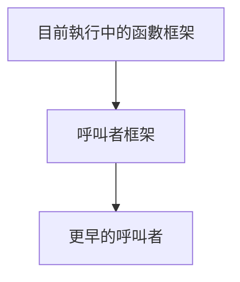

# 正式單元 F-U05：函數呼叫如何建立新的執行環境？

版本：1.0.0  
狀態：正式學生教材  
最後更新：2026-08-04  
對應英文版本：[Formal Unit F-U05: How Does a Function Call Create a New Execution Environment?](unit-05-call-stack-recursion.en.md)

## 文件用途與完成標準

本章供學生獨立閱讀、練習與複習。完成本章代表你能說明函數呼叫框架、作用域與生命週期，能追蹤呼叫堆疊，並能診斷遞迴缺少 base case 或無法接近終止條件的問題。

## 核心問題

> 函數呼叫時，參數、區域狀態與未完成工作如何被保存？

完成本章後，你應能：

1. 說明 call stack 與 call frame。
2. 區分作用域與生命週期。
3. 追蹤巢狀函數呼叫。
4. 說明遞迴的 base case 與 recursive case。
5. 診斷 stack overflow 的概念原因。

---

## 1. 一次呼叫需要保存什麼？

```c
int square(int x) {
    int result = x * x;
    return result;
}
```

當 `main` 呼叫 `square(5)` 時，必須保存呼叫返回位置、參數 `x`、區域變數 `result` 與尚未完成的工作。

---

## 2. Call Stack 模型



每次函數呼叫建立一個 call frame；函數回傳時，最上方框架被移除。

```text
square frame
main frame
```

---

## 3. 作用域與生命週期

```c
int function(void) {
    int local = 10;
    return local;
}
```

- 作用域：名稱在程式文字中可被使用的範圍。
- 生命週期：物件在執行期間存在的時間。

`local` 只在函數內可見，並在函數呼叫期間存在。

---

## 4. 巢狀呼叫追蹤

```c
int double_value(int x) {
    return x * 2;
}

int add_one_then_double(int x) {
    return double_value(x + 1);
}
```

呼叫 `add_one_then_double(4)`：

```text
main
→ add_one_then_double(4)
→ double_value(5)
→ 回傳 10
→ 回傳 10
```

---

## 5. 遞迴

```c
int factorial(int n) {
    if (n <= 1) {
        return 1;
    }
    return n * factorial(n - 1);
}
```

- base case：`n <= 1`
- recursive case：`n * factorial(n - 1)`

呼叫 `factorial(4)` 會建立多個框架，回傳時依相反順序完成。

---

## 6. 遞迴追蹤

```text
factorial(4)
= 4 * factorial(3)
= 4 * 3 * factorial(2)
= 4 * 3 * 2 * factorial(1)
= 4 * 3 * 2 * 1
= 24
```

每一層保存自己的 `n` 與未完成乘法。

---

## 7. 錯誤案例

### 缺少 base case

```c
int countdown(int n) {
    return countdown(n - 1);
}
```

呼叫持續建立框架，最終可能耗盡 stack 空間。

### 沒有接近 base case

```c
return factorial(n + 1);
```

即使存在 base case，狀態若朝錯誤方向更新仍不會終止。

### 回傳區域物件位址

區域變數生命週期結束後，位址不再指向有效物件。指標單元會深化此問題。

---

## 8. 引導練習

1. 追蹤 `factorial(3)` 的每一個 frame。
2. 寫遞迴 `sum_to_n(n)`，先定義 base case。
3. 比較迭代與遞迴版本的狀態保存方式。

---

## 9. 自主練習：字串長度遞迴版

建立函數：

```c
int recursive_length(const char text[]);
```

遇到 `\0` 時回傳 0，否則回傳 `1 +` 剩餘字串長度。先追蹤 `"cat"`。

---

## 10. 需求修改

將 `factorial` 改為拒絕負數輸入。先定義介面如何表示錯誤，再更新測試與呼叫端。

---

## 11. 向 AI 解釋概念

請向 AI 解釋：

> Call stack、call frame、作用域與生命週期之間有什麼關係？遞迴為什麼需要 base case？

AI 回應若與呼叫追蹤或可重現結果衝突，應以證據重新判斷。

---

## 12. 自我檢核

- 我能畫出簡單 call stack。
- 我能區分作用域與生命週期。
- 我能追蹤巢狀呼叫。
- 我能指出遞迴 base case。
- 我能判斷 recursive case 是否接近終止。
- 我能解釋 stack overflow 的概念原因。

## 13. 本章摘要

每次函數呼叫建立新的執行框架，保存參數、區域狀態與返回位置。遞迴使用多個框架保存尚未完成的工作，必須有可到達的 base case。下一章將透過位址與指標間接存取資料。

## 導覽

- [上一單元：字串](unit-04-strings.zh-TW.md)
- [下一單元：指標](unit-06-pointers.zh-TW.md)
- [正式課程索引](README.zh-TW.md)
- [English version](unit-05-call-stack-recursion.en.md)
