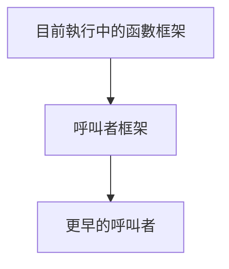

# 正式單元 F-U05：函數呼叫如何建立新的執行環境？

版本：1.0.1  
狀態：正式學生教材  
最後更新：2026-08-05  
對應英文版本：[Formal Unit F-U05: How Does a Function Call Create a New Execution Environment?](unit-05-call-stack-recursion.en.md)

## 文件用途與完成標準

本章供學生獨立閱讀、練習與複習。完成本章代表你能說明函數呼叫框架、作用域與生命週期，能追蹤呼叫堆疊，並能診斷遞迴缺少可到達的 base case、無法接近終止條件，或結果超出所選整數型別可表示範圍的問題。

## 核心問題

> 函數呼叫時，參數、區域狀態與未完成工作如何被保存？

完成本章後，你應能：

1. 說明 call stack 與 call frame。
2. 區分作用域與生命週期。
3. 追蹤巢狀函數呼叫。
4. 說明遞迴的 base case 與 recursive case。
5. 區分終止正確與結果範圍正確。
6. 診斷 stack overflow 的概念原因。

---

## 1. 一次呼叫需要保存什麼？

```c
int square(int x) {
    int result = x * x;
    return result;
}
```

當 `main` 呼叫 `square(5)` 時，必須保存呼叫返回位置、參數 `x`、區域變數 `result` 與尚未完成的工作。

---

## 2. Call Stack 模型



每次函數呼叫建立一個 call frame；函數回傳時，最上方框架被移除。

```text
square frame
main frame
```

---

## 3. 作用域與生命週期

```c
int function(void) {
    int local = 10;
    return local;
}
```

- 作用域：名稱在程式文字中可被使用的範圍。
- 生命週期：物件在執行期間存在的時間。

`local` 只在函數內可見，並在函數呼叫期間存在。

---

## 4. 巢狀呼叫追蹤

```c
int double_value(int x) {
    return x * 2;
}

int add_one_then_double(int x) {
    return double_value(x + 1);
}
```

呼叫 `add_one_then_double(4)`：

```text
main
→ add_one_then_double(4)
→ double_value(5)
→ 回傳 10
→ 回傳 10
```

---

## 5. 遞迴介面必須定義有效範圍

安全的階乘介面不應把負數默默當成合法 base case，也應拒絕所選結果型別無法表示的值。

```c
#include <limits.h>

int factorial_checked(int n, unsigned long long *result) {
    if (result == NULL || n < 0) {
        return 0;
    }

    if (n == 0 || n == 1) {
        *result = 1;
        return 1;
    }

    unsigned long long smaller;
    if (!factorial_checked(n - 1, &smaller)) {
        return 0;
    }

    if (smaller > ULLONG_MAX / (unsigned long long)n) {
        return 0;
    }

    *result = (unsigned long long)n * smaller;
    return 1;
}
```

這個介面把三個問題分開：

1. 遞迴是否終止？
2. 輸入是否有效？
3. 數學結果是否能由所選型別表示？

在常見 64 位元 `unsigned long long` 中，`20!` 可表示而 `21!` 不可表示；但程式以實際實作的 `ULLONG_MAX` 檢查，不假設固定寬度。

---

## 6. 遞迴追蹤

有效輸入 4：

```text
factorial_checked(4)
→ factorial_checked(3)
→ factorial_checked(2)
→ factorial_checked(1)
→ result 1
→ result 2
→ result 6
→ result 24
```

每一層保存自己的 `n`、區域變數 `smaller`、輸出指標與尚未完成的乘法。

至少測試：

| 輸入 | 預期結果 |
|---:|---|
| -1 | 失敗 |
| 0 | 成功，1 |
| 1 | 成功，1 |
| 4 | 成功，24 |
| 最大可表示值 | 成功 |
| 下一個值 | 因溢位風險而失敗 |
| 合法輸入但 `result == NULL` | 失敗 |

---

## 7. 錯誤案例與分類

### 缺少 base case

```c
int countdown(int n) {
    return countdown(n - 1);
}
```

這段程式可編譯，但遞迴呼叫沒有終止分支；執行時可能耗盡 stack 空間。這是執行期終止／資源缺陷，不是編譯錯誤。

### 沒有接近 base case

```c
return factorial_checked(n + 1, result);
```

即使存在 base case，狀態若朝錯誤方向更新仍不會終止。這是邏輯與終止缺陷。

### 負數輸入被錯誤接受

```c
if (n <= 1) {
    return 1;
}
```

若介面定義的是數學階乘，這會錯誤接受所有負數。遞迴雖然終止，但結果違反需求；終止不等於正確。

### 有號整數溢位

```c
int factorial(int n) {
    if (n <= 1) {
        return 1;
    }
    return n * factorial(n - 1);
}
```

合法輸入夠大時，有號乘法可能溢位；在 C 中屬未定義行為。即使改用較寬的無號型別，也必須在乘法前檢查範圍。

### 回傳區域物件位址

區域變數生命週期在函數回傳後結束；之後解參照回傳指標屬未定義行為。指標單元會深化此問題。

---

## 8. 引導練習

1. 追蹤 `factorial_checked(3, &answer)` 的每一個 frame。
2. 寫遞迴 `sum_to_n(n)`，先定義有效輸入與溢位行為。
3. 比較迭代與遞迴版本的狀態保存方式。
4. 說明為什麼「會終止」的遞迴仍可能回傳錯誤結果。

---

## 9. 自主練習：字串長度遞迴版

建立函數：

```c
int recursive_length(const char text[], int *length);
```

定義 `text == NULL` 或 `length == NULL` 時失敗。遇到 `\0` 時回傳長度 0；否則先遞迴取得剩餘長度，成功後再加一。先追蹤 `"cat"`。

---

## 10. 需求修改

讓呼叫者可以指定允許的最大輸入。更新函數契約、測試與呼叫端，同時保留溢位檢查。

---

## 11. 向 AI 解釋概念

請向 AI 解釋：

> Call stack、call frame、作用域與生命週期之間有什麼關係？為什麼可到達的 base case、有效輸入範圍與可表示結果範圍是三個不同要求？

AI 回應若與呼叫追蹤、型別上限或可重現結果衝突，應以證據重新判斷。

---

## 12. 自我檢核

- 我能畫出簡單 call stack。
- 我能區分作用域與生命週期。
- 我能追蹤巢狀呼叫。
- 我能指出遞迴 base case。
- 我能判斷 recursive case 是否接近終止。
- 我能區分不終止、溢位與需求錯誤。
- 我能解釋 stack overflow 的概念原因。

## 13. 本章摘要

每次函數呼叫建立新的執行框架，保存參數、區域狀態與返回位置。遞迴使用多個框架保存尚未完成的工作，必須有可到達的 base case。可靠的遞迴介面也必須定義有效輸入、輸出參數與可表示結果範圍。下一章將透過位址與指標間接存取資料。

## 導覽

- [上一單元：字串](unit-04-strings.zh-TW.md)
- [下一單元：指標](unit-06-pointers.zh-TW.md)
- [正式課程索引](README.zh-TW.md)
- [English version](unit-05-call-stack-recursion.en.md)
