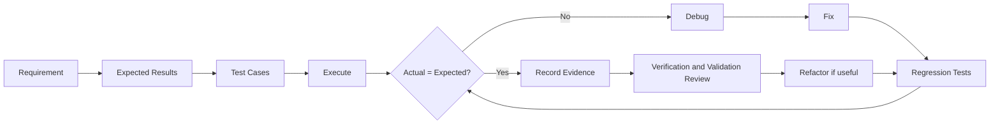

# Formal Unit F-U11: How Can Programs Be Tested, Diagnosed, and Improved Systematically?

Version: 1.0.1  
Status: Student material  
Last updated: 2026-08-06  
Corresponding Chinese version: [正式單元 F-U11：如何系統化地測試、診斷與改善程式？](unit-11-testing-debugging.zh-TW.md)

---

## Document Purpose and Completion Standard

This chapter is written for students who can already build multi-function C programs. It explains how to decide whether a program is trustworthy, how to reproduce and narrow a defect, and how to improve code without changing required behavior.

Completing the chapter means you can distinguish testing, verification, validation, debugging, regression testing, and refactoring, and can use evidence to explain why a program should or should not be trusted.

Core completion does not depend on AI use. Not using AI does not affect completion, classroom participation, or assessment; Section 12 is a directly skippable optional extension.

No submission is required. Keep your test cases, defect notes, fixes, and explanations for later review.

---

## Core Question

> What evidence beyond “it printed the right answer once” is needed before a program can be trusted?

After this chapter, you should be able to:

1. Distinguish testing, verification, validation, debugging, regression testing, and refactoring.
2. Build normal, boundary, and invalid test cases from a requirement.
3. Reproduce a defect and narrow its location.
4. Correct a defect and run regression tests.
5. Refactor code while preserving observable behavior.

Prerequisites: functions, arrays or strings, basic files or modules, and prior experience predicting expected results.

---

## 1. One Correct Output Is Not Enough

Suppose a function is intended to return the larger of two integers:

```c
int max_of_two(int a, int b) {
    return a > b ? a : b;
}
```

If you test only `max_of_two(5, 3)`, the output is correct. But that does not prove the function is correct for:

- `a < b`
- `a == b`
- negative values
- extreme values

A trustworthy claim needs more than one successful example.

---

## 2. Six Related but Different Activities

### Testing

Execute the program with selected inputs and compare actual results with expected results.

### Verification

Ask whether the implementation matches the specification or design.

### Validation

Ask whether the specification itself solves the real user need.

### Debugging

Find and correct the cause of an observed defect.

### Regression Testing

After a change, rerun tests that previously passed to confirm that existing behavior still works.

### Refactoring

Improve code structure without intentionally changing required external behavior.

These activities support one another, but they are not interchangeable.

---

## 3. A Visual Workflow



The important idea is that correction is not the end. A fix must be followed by regression testing.

---

## 4. Building a Small Test Table

Requirement:

> Return `true` when a score is between 0 and 100 inclusive.

```c
#include <stdbool.h>

bool is_valid_score(int score) {
    return score >= 0 && score <= 100;
}
```

Test table:

| Type | Input | Expected result |
|---|---:|---|
| Normal | 80 | true |
| Lower boundary | 0 | true |
| Below boundary | -1 | false |
| Upper boundary | 100 | true |
| Above boundary | 101 | false |

The table comes from the requirement, not from guessing random inputs.

---

## 5. A Reproducible Defect

Defective code:

```c
bool is_valid_score(int score) {
    return score > 0 && score < 100;
}
```

Observed failures:

- `0` incorrectly returns `false`
- `100` incorrectly returns `false`

### Diagnosis Process

1. Reproduce the defect with the smallest clear case.
2. Compare the condition with the requirement wording “inclusive.”
3. Identify the incorrect operators.
4. Change `>` to `>=` and `<` to `<=`.
5. Rerun all five tests.

The defect was an off-by-one boundary error.

---

## 6. Narrowing the Source of a Problem

For a larger program, do not inspect every line at once.

Use evidence to narrow the search:

1. Identify the first observable difference from the expected result.
2. Identify which function produced that value.
3. Test that function independently.
4. Inspect only the data and conditions that affect the failure.
5. Form a hypothesis and run a test that could disprove it.

A good debugging hypothesis is testable.

Bad statement:

> The program is weird.

Better statement:

> The upper-bound test fails because the condition excludes 100.

---

## 7. Regression Testing

Assume you fix the upper-bound defect. Do not test only `100`.

Rerun:

- `80`
- `0`
- `-1`
- `100`
- `101`

Why? A change that fixes one case can accidentally break another.

Regression testing asks:

> What behavior should remain unchanged after this modification?

---

## 8. Refactoring without Changing Behavior

Original code:

```c
if (score >= 0) {
    if (score <= 100) {
        return true;
    }
}
return false;
```

Refactored code:

```c
return score >= 0 && score <= 100;
```

The second version is shorter, but shorter is not automatically better. The refactoring is acceptable only if the same test cases still produce the same required results.

---

## 9. Guided Practice

Given a function that calculates shipping cost:

- weight from 1 to 5 kilograms: 60
- weight from 6 to 10 kilograms: 100
- otherwise: invalid

Before writing code:

1. Write normal and boundary cases.
2. Write one invalid case below the range.
3. Write one invalid case above the range.
4. Implement the function.
5. Create one boundary defect deliberately.
6. Diagnose, fix, and run regression tests.

---

## 10. Independent Practice

Choose one earlier Unit program and produce:

- a clear requirement statement
- an expected-result table
- at least five tests
- one reproducible defect
- a diagnosis explanation
- a correction
- regression-test results
- one small refactoring

The final explanation should distinguish which evidence supports verification and which supports validation.

---

## 11. Requirement Modification

Change the valid score range from `0–100` to `1–100`.

Before editing code:

1. Identify which expected results change.
2. Update the test table.
3. Modify the condition.
4. Run both changed and unchanged cases.
5. Explain why `100` remains a regression case even though its expected result did not change.

---

## 12. Optional Extension: Use AI to Check Your Explanation

This section may be skipped. It is not part of core completion, and no fixed prompt, saved conversation, submission, or non-use declaration is required.

If you choose to use AI, first explain in your own words the differences among testing, verification, validation, debugging, regression testing, and refactoring. Then compare the response against the requirement, test table, failure cases, and reproducible program behavior. Treat conflicts as claims to verify, not as answers to accept.

---

## 13. Self-Check

- I can build tests from requirement boundaries.
- I can distinguish a test failure from its underlying cause.
- I can write a testable debugging hypothesis.
- I can explain why a fix requires regression testing.
- I can refactor and verify behavior remains unchanged.
- I can distinguish verification from validation.

---

## 14. Unit Summary

A program is trustworthy only when its behavior is supported by evidence. Testing compares actual and expected results. Verification checks the implementation against the specification. Validation checks whether the specification solves the real problem. Debugging finds and corrects causes. Regression testing protects existing behavior after changes. Refactoring improves structure while preserving required behavior.

The final Unit combines requirements, data, memory, files, modules, and engineering evidence in one integrated application.

---

## Navigation

- [Formal Course Materials Index](README.en.md)
- [Previous Unit: Modular Programming](unit-10-modular-programming.en.md)
- [Next Unit: Integrated Application](unit-12-integrated-application.en.md)
- [繁體中文版](unit-11-testing-debugging.zh-TW.md)
