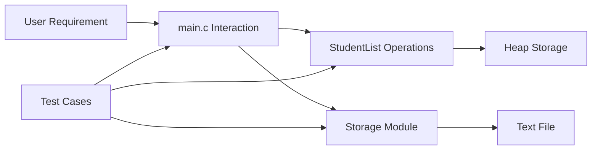

# Formal Unit F-U12: How Can Concepts Across the Course Be Integrated into One Application?

Version: 1.0.2  
Status: Official student material  
Last updated: 2026-08-07  
Corresponding Chinese version: [正式單元 F-U12：如何完成跨 Concept 的整合程式？](unit-12-integrated-application.zh-TW.md)

## Document Purpose and Completion Standard

This chapter is written for students who have completed the earlier Units. It guides the integration of requirements, data modeling, functions, dynamic memory, files, modules, testing, debugging, and explanation into one maintainable C application.

Completing the Unit means you can design and implement a small integrated program, explain its decomposition and data flow, test normal and boundary behavior, modify a requirement, and justify the resulting changes with evidence.

No submission is required by this material. Keep your design, program, tests, defects, and explanations for review and discussion. AI is not a completion requirement. Choosing not to use AI does not affect Unit completion, classroom participation, or assessment. The AI activity near the end is a directly skippable optional extension.

---

## Core Question

> How can requirements, data, control flow, functions, memory, files, modules, and engineering evidence be integrated into one program?

After this Unit, you should be able to:

1. Convert a small user need into explicit requirements and testable outcomes.
2. Design a data model and divide responsibilities among modules and functions.
3. Use dynamic storage and files responsibly when the requirement needs them.
4. Define nullability, ownership, capacity, empty-collection, and load policies.
5. Build the application incrementally instead of writing everything at once.
6. Test, diagnose, modify, and explain the integrated result.

Prerequisites: all earlier preparatory and formal Units.

---

## 1. Integrated Application Scenario

Build a small score-record manager.

Required behavior:

1. Add a student record containing an ID, name, and score.
2. List all records.
3. Find a record by ID.
4. Calculate the average score.
5. Save records to a text file.
6. Load records from a text file.
7. Reject scores outside 0–100.
8. Report invalid input, allocation failure, and file-format failure distinctly.

The goal is not to maximize features. The goal is to integrate Concepts while keeping responsibilities understandable and testable.

---

## 2. Begin with Requirements, Not Code

Before implementation, define observable outcomes.

| Requirement | Example evidence |
|---|---|
| Add a valid record | Count increases and the record appears in the list |
| Reject an invalid score | Count does not increase and a specific failure is reported |
| Calculate average | Result matches a hand-calculated example |
| Empty average | Function reports that no average exists and does not divide by zero |
| Save data | File contents match the in-memory records and close succeeds |
| Load data | A new run reconstructs the same records according to the load policy |

A feature is not complete merely because a function exists. Its required behavior must be observable.

---

## 3. Data Model and Invariant

```c
#include <stddef.h>
#include <stdlib.h>

#define NAME_SIZE 50

typedef struct {
    int id;
    char name[NAME_SIZE];
    int score;
} Student;

typedef struct {
    Student *items;
    size_t count;
    size_t capacity;
} StudentList;
```

Invariant:

```text
0 <= count <= capacity
capacity == 0 implies items == NULL
capacity > 0 implies items points to capacity Student objects
items[0] through items[count - 1] are initialized records
```

Use `size_t` for object counts and allocation sizes. Do not mix signed negative values into capacity calculations.

---

## 4. Responsibility Decomposition

```c
int list_init(StudentList *list);
void list_destroy(StudentList *list);
int list_add(StudentList *list, const Student *student);
const Student *list_find_by_id(const StudentList *list, int id);
int list_average(const StudentList *list, double *average);
int list_save(const StudentList *list, const char *path);
int list_load_replace(StudentList *list, const char *path);
```

Possible module structure:

```text
student.h / student.c
    record validation and bounded name handling

student_list.h / student_list.c
    collection ownership, search, add, average, destroy

storage.h / storage.c
    file protocol, save, and transactional load

main.c
    checked user input and application flow
```

Each interface must state nullability, modified objects, ownership, success/failure, and failure-state guarantees.

---

## 5. Visual Architecture



`main` coordinates work; it should not manipulate list capacity or heap ownership directly.

---

## 6. Safe Initialization and Destruction

```c
int list_init(StudentList *list) {
    if (list == NULL) {
        return 0;
    }

    list->items = NULL;
    list->count = 0;
    list->capacity = 0;
    return 1;
}

void list_destroy(StudentList *list) {
    if (list == NULL) {
        return;
    }

    free(list->items);
    list->items = NULL;
    list->count = 0;
    list->capacity = 0;
}
```

After `list_destroy`, the list returns to the empty invariant and may be initialized or destroyed again safely.

---

## 7. Example: Adding a Record Safely

```c
#include <stdint.h>

int list_add(StudentList *list, const Student *student) {
    if (list == NULL || student == NULL) {
        return 0;
    }

    if (student->score < 0 || student->score > 100) {
        return 0;
    }

    if (list->count > list->capacity) {
        return 0; /* invariant already broken */
    }

    if (list->count == list->capacity) {
        size_t new_capacity = list->capacity == 0 ? 4 : list->capacity * 2;

        if (new_capacity < list->capacity ||
            new_capacity > SIZE_MAX / sizeof *list->items) {
            return 0;
        }

        Student *new_items = realloc(
            list->items,
            new_capacity * sizeof *list->items
        );

        if (new_items == NULL) {
            return 0;
        }

        list->items = new_items;
        list->capacity = new_capacity;
    }

    list->items[list->count] = *student;
    list->count++;
    return 1;
}
```

Failure leaves `items`, `count`, and `capacity` unchanged except when the incoming list already violated its invariant. The temporary pointer preserves the old allocation on `realloc` failure. The arithmetic checks prevent capacity and byte-size wraparound.

The `Student` record itself must already contain a terminated name. A checked record initializer or setter from F-U07 should enforce that contract.

---

## 8. Empty-Collection Average Contract

```c
int list_average(const StudentList *list, double *average) {
    if (list == NULL || average == NULL || list->count == 0) {
        return 0;
    }

    double sum = 0.0;
    for (size_t i = 0; i < list->count; i++) {
        sum += (double)list->items[i].score;
    }

    *average = sum / (double)list->count;
    return 1;
}
```

Each score is constrained to 0–100. Accumulating in `double` avoids signed-integer sum overflow. Extremely large collections can still be affected by floating-point precision, so a production interface should define a maximum record count and acceptable error and verify that contract with tests.

Empty lists return failure and do not write the output. They never divide by zero.

---

## 9. State and Ownership Trace

Before adding the first record:

```text
items = NULL
count = 0
capacity = 0
```

After successful growth:

```text
items -> heap block for 4 Student objects
count = 0
capacity = 4
```

After copying one record:

```text
items[0] = the new Student
count = 1
capacity = 4
```

At shutdown, `list_destroy` releases the list-owned block and restores the empty invariant.

---

## 10. File Format and Load Policy

A simple text format may be:

```text
1001,Alice,80
1002,Bob,95
```

Define whether names may contain commas, whether blank lines are allowed, and how malformed or out-of-range records are reported.

Use a transactional replace policy:

1. Load and validate into a temporary `StudentList`.
2. On any failure, destroy the temporary list and leave the original list unchanged.
3. On complete success, destroy the original list and move the temporary list into it.

This prevents a malformed file or allocation failure from leaving a partially replaced collection.

Every successful `fopen` path must call `fclose`, and save success requires checking both writes and close.

---

## 11. Integrated Test Plan

| Area | Test |
|---|---|
| Nullability | Null list, record, path, and output pointers |
| Add | Add one valid record |
| Boundary | Scores 0 and 100 |
| Invalid | Scores -1 and 101; unterminated/overlong name rejected by record initializer |
| Growth | Add beyond initial capacity and preserve earlier records |
| Capacity arithmetic | Simulated or reasoned near-`SIZE_MAX` growth failure leaves state unchanged |
| Average | Hand calculation; one record; empty list failure |
| Search | Existing and missing IDs; duplicate-ID policy |
| Save/load | Round trip and final line without newline |
| Malformed file | Invalid field count, score, ID, or overlong name |
| Transaction | Failed load leaves original list unchanged |
| Regression | Rerun all earlier tests after module split or requirement change |

Expected results should be written before execution.

---

## 12. Typical Integrated Defects and Classification

### Losing the Old Pointer during `realloc`

```c
list->items = realloc(list->items, new_size);
```

On failure, the only pointer to the old block may be lost, causing a memory leak and state loss.

### Capacity Multiplication Overflow

```c
size_t new_capacity = list->capacity * 2;
```

Unsigned wraparound is defined, but allocating the wrapped smaller size and then writing according to the larger logical capacity causes out-of-bounds access. Check before multiplication.

### Incrementing Count before Success

If `count` changes before validation, growth, and copy succeed, the invariant becomes false. This is a state-consistency logic defect.

### Empty Average

Dividing by `list->count` when it is zero is invalid. For floating arithmetic it may produce a non-finite result depending on the environment, but it violates this interface contract; for integer arithmetic it would be undefined behavior.

### Saving but Never Checking `fclose`

A successful `fprintf` call alone does not guarantee that all buffered data reached storage.

### Loading into Existing Data without a Policy

Appending, replacing, and rejecting are different requirements. Partial replacement after a failure is a transactional defect.

---

## 13. Guided Integration Activity

Implement only these features first:

1. initialize an empty list
2. add two fixed, validated records
3. list them
4. calculate the average through a checked output interface
5. destroy the list

Before adding files or user input, verify the invariant after every operation and run null, empty, boundary, and allocation-failure reasoning tests.

---

## 14. Independent Integrated Practice

Complete the score-record manager with explicit requirements, diagrams, a working incremental history, checked interfaces, normal/boundary/invalid/regression tests, one documented defect, transactional save/load behavior, and one requirement modification.

A simple numbered terminal menu is sufficient. Every `scanf` or `fgets` result must be checked before using input.

---

## 15. Requirement Modification

New requirement:

> Each student may have several scores, and the program displays that student’s average.

Before coding, identify changes to the data model, nested ownership, allocation limits, file format, interfaces, empty-score behavior, tests, and migration of old files.

---

## 16. Optional Extension: Use AI to Check the Integration Explanation

This section may be skipped directly. It is not part of Unit completion, the core self-check, classroom participation, or assessment. If you choose to use AI, first explain in your own words how requirements, invariants, nullability, capacity arithmetic, ownership, files, modules, and testing cooperate in the application, then ask the AI to identify a missing constraint or counterexample.

No fixed prompt, saved conversation, submission, or non-use declaration is required. AI responses may omit constraints or assume a different design. Compare every suggestion with your actual interfaces, type limits, diagrams, tests, and reproducible program behavior; adoption remains governed by your engineering evidence.

---

## 17. Self-Check

- I can explain the application’s requirements and acceptance evidence.
- I can state and preserve the list invariant.
- I can explain ownership and nullability.
- I check capacity arithmetic before allocation.
- I define empty average and load transaction behavior.
- I can reproduce and diagnose an integrated defect.
- I can support claims with tests and observable evidence.

---

## 18. Unit Summary

An integrated application is a coordinated system of requirements, data, responsibilities, memory, files, and evidence. Reliable integration requires explicit invariants, checked interfaces, safe capacity arithmetic, transactional file loading, and regression tests that protect behavior during change.

## Navigation

- [Formal Course Materials Index](README.en.md)
- [Previous Unit: Testing and Debugging](unit-11-testing-debugging.en.md)
- [Materials Index](../README.en.md)
- [繁體中文版](unit-12-integrated-application.zh-TW.md)
