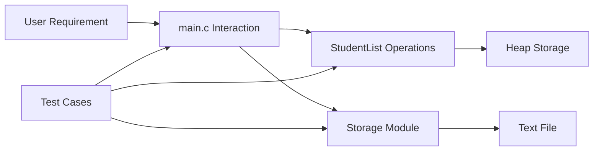

# Formal Unit F-U12: How Can Concepts Across the Course Be Integrated into One Application?

Version: 1.0.0  
Status: Student material  
Last updated: 2026-08-04  
Corresponding Chinese version: [正式單元 F-U12：如何把整門課的 Concept 整合成一個應用程式？](unit-12-integrated-application.zh-TW.md)

---

## Document Purpose and Completion Standard

This chapter is written for students who have completed the earlier Units. It guides the integration of requirements, data modeling, functions, dynamic memory, files, modules, testing, debugging, and explanation into one maintainable C application.

Completing the Unit means you can design and implement a small integrated program, explain its decomposition and data flow, test normal and boundary behavior, modify a requirement, and justify the resulting changes with evidence.

No submission is required by this material. Keep your design, program, tests, defects, and explanations for review and discussion.

---

## Core Question

> How can requirements, data, control flow, functions, memory, files, modules, and engineering evidence be integrated into one program?

After this Unit, you should be able to:

1. Convert a small user need into explicit requirements and testable outcomes.
2. Design a data model and divide responsibilities among modules and functions.
3. Use dynamic storage and files responsibly when the requirement needs them.
4. Build the application incrementally instead of writing everything at once.
5. Test, diagnose, modify, and explain the integrated result.

Prerequisites: all earlier preparatory and formal Units.

---

## 1. Integrated Application Scenario

Build a small score-record manager.

Required behavior:

1. Add a student record containing a name and score.
2. List all records.
3. Calculate the average score.
4. Save records to a text file.
5. Load records from a text file.
6. Reject scores outside 0–100.

The goal is not to maximize features. The goal is to integrate Concepts while keeping responsibilities understandable and testable.

---

## 2. Begin with Requirements, Not Code

Before implementation, define observable outcomes.

Example acceptance table:

| Requirement | Example evidence |
|---|---|
| Add a valid record | Count increases and the record appears in the list |
| Reject an invalid score | Count does not increase and an error message appears |
| Calculate average | Result matches a hand-calculated example |
| Save data | File contents match the in-memory records |
| Load data | A new run reconstructs the same records |

A feature is not complete merely because a function exists. Its required behavior must be observable.

---

## 3. Data Model

```c
#define NAME_SIZE 50

typedef struct {
    char name[NAME_SIZE];
    int score;
} Student;

typedef struct {
    Student *items;
    size_t count;
    size_t capacity;
} StudentList;
```

The model separates:

- one student record
- the collection of records
- current count
- allocated capacity

This makes the dynamic-memory responsibility explicit.

---

## 4. Responsibility Decomposition

Possible functions:

```c
void list_init(StudentList *list);
bool list_add(StudentList *list, const Student *student);
void list_print(const StudentList *list);
double list_average(const StudentList *list);
bool list_save(const StudentList *list, const char *path);
bool list_load(StudentList *list, const char *path);
void list_destroy(StudentList *list);
```

Possible module structure:

```text
student.h / student.c
    data model and list operations

storage.h / storage.c
    file save and load

main.c
    user interaction and application flow
```

A different decomposition may also be reasonable. Each function and module should still have a clear responsibility.

---

## 5. Visual Architecture



The diagram emphasizes that `main` coordinates work; it should not contain every implementation detail.

---

## 6. Build in Small Increments

Recommended sequence:

1. Define `Student` and print one fixed record.
2. Define `StudentList` with fixed initial capacity.
3. Add one record and list records.
4. Add validation for score range.
5. Add average calculation.
6. Add capacity growth with `realloc`.
7. Add save.
8. Add load.
9. Split code into modules.
10. Run regression tests after every step.

At each step, keep the last working version available.

---

## 7. Example: Adding a Record

```c
bool list_add(StudentList *list, const Student *student) {
    if (student->score < 0 || student->score > 100) {
        return false;
    }

    if (list->count == list->capacity) {
        size_t new_capacity = list->capacity == 0 ? 4 : list->capacity * 2;
        Student *new_items = realloc(list->items,
                                     new_capacity * sizeof *new_items);
        if (new_items == NULL) {
            return false;
        }
        list->items = new_items;
        list->capacity = new_capacity;
    }

    list->items[list->count] = *student;
    list->count++;
    return true;
}
```

This function combines validation, capacity management, copying a record, and state update. It should be tested independently from user input.

---

## 8. State and Ownership Trace

Before adding the first record:

```text
items = NULL
count = 0
capacity = 0
```

After successful growth:

```text
items -> heap block for 4 Student objects
count = 0
capacity = 4
```

After copying one record:

```text
items[0] = the new Student
count = 1
capacity = 4
```

At program shutdown:

```c
free(list->items);
list->items = NULL;
list->count = 0;
list->capacity = 0;
```

The list owns the heap block and is responsible for releasing it.

---

## 9. File Format

A simple text format may be:

```text
Alice,80
Bob,95
```

Before choosing a format, decide:

- Can names contain commas?
- What happens with malformed lines?
- Are blank lines allowed?
- How are out-of-range scores handled?

A file format is a protocol. Both writer and reader must agree on it.

---

## 10. Integrated Test Plan

Minimum tests:

| Area | Test |
|---|---|
| Add | Add one valid record |
| Boundary | Add scores 0 and 100 |
| Invalid | Reject -1 and 101 |
| Growth | Add more records than the initial capacity |
| Average | Compare with hand calculation |
| Empty list | Define the average behavior clearly |
| Save/load | Save, restart, load, and compare records |
| Malformed file | Reject or report an invalid line safely |
| Regression | Rerun earlier tests after module split or requirement changes |

Expected results should be written before execution.

---

## 11. Typical Integrated Defects

### Defect A: Losing the Old Pointer during `realloc`

Unsafe pattern:

```c
list->items = realloc(list->items, new_size);
```

If allocation fails, the original pointer may be lost. Use a temporary pointer first.

### Defect B: Incrementing Count before Success

If `count` changes before validation or allocation succeeds, list state becomes inconsistent.

### Defect C: Saving but Never Checking `fclose`

A successful `fprintf` call alone does not guarantee that all buffered data was written successfully.

### Defect D: Loading into Existing Data without a Policy

Decide whether loading replaces, appends to, or rejects existing records.

For each defect, reproduce a clear case, identify the first incorrect state, correct the cause, and run regression tests.

---

## 12. Guided Integration Activity

Implement only these features first:

1. initialize an empty list
2. add two fixed records
3. list them
4. print the average
5. destroy the list

Before adding files or user input, verify:

- count changes correctly
- records remain intact
- average is correct
- memory is released

This creates a stable core before more interaction is added.

---

## 13. Independent Integrated Practice

Complete the score-record manager with:

- explicit requirements
- a data-model diagram
- a responsibility or module diagram
- a working incremental history
- normal, boundary, invalid, and regression tests
- one documented defect and diagnosis
- save/load behavior
- one requirement modification
- a final explanation of ownership and file protocol

The program does not need a complex interface. A simple numbered terminal menu is sufficient.

---

## 14. Requirement Modification

New requirement:

> Each student may have several scores, and the program displays that student’s average.

Before coding, identify changes to:

- the data model
- ownership and dynamic memory
- file format
- function interfaces
- existing tests
- migration of old files, if supported

Do not immediately patch the existing code. Redesign the affected Concepts first.

---

## 15. Explain the Concept to AI

Explain how requirements, data modeling, functions, dynamic memory, files, modules, and testing cooperate in your application.

AI responses may omit constraints or assume a different design. Compare every suggestion with your actual requirements, diagrams, tests, and reproducible program behavior.

---

## 16. Self-Check

- I can explain the application’s requirements and acceptance evidence.
- I can explain the data model and ownership.
- I can explain why each function or module exists.
- I can trace one record from input to memory, file, and output.
- I can reproduce and diagnose an integrated defect.
- I can modify a requirement and identify all affected parts.
- I can support claims with tests and observable evidence.

---

## 17. Unit Summary

An integrated application is not merely a large collection of syntax. It is a coordinated system of requirements, data, responsibilities, memory, interaction, and evidence. Build it incrementally, keep responsibilities clear, make ownership explicit, define file protocols, and use tests to protect behavior during change.

The course ends here, but the same cycle continues in larger programs:

```text
Understand
→ Model
→ Decompose
→ Implement
→ Observe
→ Test
→ Diagnose
→ Modify
→ Explain
```

---

## Navigation

- [Formal Course Materials Index](README.en.md)
- [Previous Unit: Testing and Debugging](unit-11-testing-debugging.en.md)
- [Materials Index](../README.en.md)
- [繁體中文版](unit-12-integrated-application.zh-TW.md)
