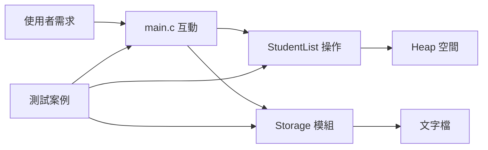

# 正式單元 F-U12：如何完成跨 Concept 的整合程式？

版本：1.0.1  
狀態：正式學生教材  
最後更新：2026-08-05  
對應英文版本：[Formal Unit F-U12: How Can Concepts Across the Course Be Integrated into One Application?](unit-12-integrated-application.en.md)

## 文件用途與完成標準

本章供已完成前面 Unit 的學生獨立閱讀、實作與複習。它引導你把需求、資料模型、函數、動態記憶體、檔案、模組、測試、除錯與說明整合成一個可維護的 C 應用程式。

完成本章代表你能設計並實作小型整合程式，說明責任分解與資料流，測試正常與邊界行為，修改需求，並以證據說明修改結果。

本章活動不需繳交；請自行保留設計、程式、測試、缺陷與說明，供複習與討論。

---

## 核心問題

> 如何把需求、資料、控制流程、函數、記憶體、檔案、模組與工程證據整合成一個程式？

完成本章後，你應能：

1. 把小型使用者需求轉成明確需求與可測試結果。
2. 設計資料模型並分配模組與函數責任。
3. 在需求需要時安全使用動態空間與檔案。
4. 定義 nullability、ownership、capacity、空集合與載入政策。
5. 逐步建立程式，而不是一次完成所有功能。
6. 測試、診斷、修改並說明整合成果。

前置知識：所有前導與正式 Unit。

---

## 1. 綜合案例：成績紀錄管理器

需求：

1. 新增包含學號、姓名與成績的學生紀錄。
2. 顯示所有紀錄。
3. 依學號查詢。
4. 計算平均成績。
5. 儲存到文字檔。
6. 從文字檔載入。
7. 拒絕 0～100 以外的成績。
8. 區分無效輸入、配置失敗與檔案格式錯誤。

重點不是功能越多越好，而是每個 Concept 的責任都清楚、可測試、可修改。

---

## 2. 先定義可觀察需求

| 需求 | 範例證據 |
|---|---|
| 新增有效紀錄 | 筆數增加且列表出現該紀錄 |
| 拒絕無效成績 | 筆數不增加並回報具體失敗 |
| 計算平均 | 與手算案例一致 |
| 空集合平均 | 回報沒有平均，不除以零 |
| 儲存資料 | 檔案內容與記憶體一致，且關閉成功 |
| 載入資料 | 依載入政策重建相同紀錄 |

函數存在不代表功能完成；需求行為必須可觀察。

---

## 3. 資料模型與 invariant

```c
#include <stddef.h>

#define NAME_SIZE 50

typedef struct {
    int id;
    char name[NAME_SIZE];
    int score;
} Student;

typedef struct {
    Student *items;
    size_t count;
    size_t capacity;
} StudentList;
```

Invariant：

```text
0 <= count <= capacity
capacity == 0 時 items == NULL
capacity > 0 時 items 指向 capacity 個 Student 的空間
items[0] 到 items[count - 1] 都是已初始化紀錄
```

物件數與配置大小使用 `size_t`，避免把負數混入容量運算。

---

## 4. 責任分解

```c
int list_init(StudentList *list);
void list_destroy(StudentList *list);
int list_add(StudentList *list, const Student *student);
const Student *list_find_by_id(const StudentList *list, int id);
int list_average(const StudentList *list, double *average);
int list_save(const StudentList *list, const char *path);
int list_load_replace(StudentList *list, const char *path);
```

模組可能分為：

```text
student.h / student.c
    紀錄驗證與有界姓名處理

student_list.h / student_list.c
    集合所有權、查詢、新增、平均、釋放

storage.h / storage.c
    檔案格式、儲存與 transactional load

main.c
    檢查輸入並協調流程
```

每個介面都要說明是否允許 `NULL`、會修改哪些物件、所有權、成功／失敗與失敗時狀態。

---

## 5. 架構圖



`main` 負責協調，不應直接修改容量或 heap 所有權。

---

## 6. 安全初始化與釋放

```c
int list_init(StudentList *list) {
    if (list == NULL) {
        return 0;
    }

    list->items = NULL;
    list->count = 0;
    list->capacity = 0;
    return 1;
}

void list_destroy(StudentList *list) {
    if (list == NULL) {
        return;
    }

    free(list->items);
    list->items = NULL;
    list->count = 0;
    list->capacity = 0;
}
```

`list_destroy` 後回到空集合 invariant，可以再次初始化或安全地重複 destroy。

---

## 7. 安全新增紀錄

```c
#include <stdint.h>
#include <stdlib.h>

int list_add(StudentList *list, const Student *student) {
    if (list == NULL || student == NULL) {
        return 0;
    }

    if (student->score < 0 || student->score > 100) {
        return 0;
    }

    if (list->count > list->capacity) {
        return 0;
    }

    if (list->count == list->capacity) {
        size_t new_capacity = list->capacity == 0 ? 4 : list->capacity * 2;

        if (new_capacity < list->capacity ||
            new_capacity > SIZE_MAX / sizeof *list->items) {
            return 0;
        }

        Student *new_items = realloc(
            list->items,
            new_capacity * sizeof *list->items
        );

        if (new_items == NULL) {
            return 0;
        }

        list->items = new_items;
        list->capacity = new_capacity;
    }

    list->items[list->count] = *student;
    list->count++;
    return 1;
}
```

失敗時 `items`、`count`、`capacity` 保持不變，除非傳入清單原本已破壞 invariant。暫存指標保留 `realloc` 失敗時的舊配置；容量與位元組檢查防止 unsigned wraparound。

`Student` 本身必須已有終止的姓名字串，應由 F-U07 的 checked initializer／setter 保證。

---

## 8. 空集合平均契約

```c
int list_average(const StudentList *list, double *average) {
    if (list == NULL || average == NULL || list->count == 0) {
        return 0;
    }

    long long sum = 0;
    for (size_t i = 0; i < list->count; i++) {
        sum += list->items[i].score;
    }

    *average = (double)sum / (double)list->count;
    return 1;
}
```

因每筆成績已限制在 0～100，最大總和為 `100 * count`。實際產品仍需考慮 `count > LLONG_MAX / 100`；本教材可定義實際最大紀錄數，或加入 checked accumulation。

空集合回傳失敗且不寫入輸出，不會除以零。

---

## 9. 狀態與所有權追蹤

加入第一筆前：

```text
items = NULL
count = 0
capacity = 0
```

成功成長後：

```text
items -> 4 個 Student 的 heap block
count = 0
capacity = 4
```

複製一筆後：

```text
items[0] = 新 Student
count = 1
capacity = 4
```

結束時由 `list_destroy` 釋放清單持有的空間並恢復空 invariant。

---

## 10. 檔案格式與載入政策

簡單格式可為：

```text
1001,Alice,80
1002,Bob,95
```

需定義姓名是否可含逗號、空白行是否允許，以及錯誤欄位或超出範圍成績如何回報。

採用 transactional replace：

1. 載入並驗證到暫存 `StudentList`。
2. 任一失敗時釋放暫存清單，原清單保持不變。
3. 全部成功後才釋放原清單並移入暫存資料。

每條成功 `fopen` 路徑都要呼叫 `fclose`；儲存成功必須同時檢查寫入與關閉。

---

## 11. 整合測試計畫

| 範圍 | 測試 |
|---|---|
| Nullability | 空 list、record、path、output pointer |
| 新增 | 一筆有效紀錄 |
| 邊界 | 成績 0 與 100 |
| 無效 | 成績 -1、101；未終止或過長姓名由 initializer 拒絕 |
| 成長 | 超過初始容量後舊資料仍完整 |
| 容量運算 | 接近 `SIZE_MAX` 的成長失敗不改變狀態 |
| 平均 | 手算、單筆、空集合失敗 |
| 查詢 | 存在／不存在學號與重複學號政策 |
| 儲存載入 | round trip 與最後一行無換行 |
| 錯誤檔案 | 欄位數、成績、學號或姓名錯誤 |
| Transaction | 載入失敗時原清單不變 |
| 回歸 | 模組拆分或需求修改後重跑所有測試 |

執行前先寫預期結果。

---

## 12. 整合錯誤案例與分類

### `realloc` 遺失舊指標

```c
list->items = realloc(list->items, new_size);
```

失敗時可能失去舊區塊唯一位址，造成 memory leak 與狀態遺失。

### 容量乘法溢位

```c
size_t new_capacity = list->capacity * 2;
```

Unsigned wraparound 雖有定義，但若依較大的邏輯容量寫入較小區塊，就會越界。必須在乘法前檢查。

### 成功前先增加 count

驗證、成長或複製尚未成功就改變 `count`，會破壞 invariant；這是狀態一致性邏輯錯誤。

### 空集合平均

`count == 0` 時不可除法。浮點除零可能依浮點環境產生非有限值，但仍違反此介面；整數除零則屬未定義行為。

### 只檢查 `fprintf` 不檢查 `fclose`

緩衝資料可能在關閉時才回報失敗。

### 載入既有資料卻沒有政策

Append、replace、reject 是不同需求。失敗後留下部分替換資料是 transaction defect。

---

## 13. 引導整合活動

先完成：

1. 初始化空清單
2. 新增兩筆已驗證固定資料
3. 顯示資料
4. 透過 checked output 計算平均
5. 釋放清單

加入檔案與使用者輸入前，逐操作驗證 invariant，並測試 null、空集合、邊界與配置失敗推理。

---

## 14. 自主整合練習

完成具有明確需求、圖、增量歷史、checked interface、正常／邊界／無效／回歸測試、一個缺陷診斷、transactional save/load 與一項需求修改的管理器。

簡單文字選單即可。每個 `scanf` 或 `fgets` 回傳值都要先檢查再使用輸入。

---

## 15. 需求修改

> 每位學生可有多次成績，並顯示個人平均。

實作前先分析資料模型、巢狀所有權、配置限制、檔案格式、介面、空成績行為、測試與舊檔轉換。

---

## 16. 向 AI 解釋概念

請說明需求、invariant、nullability、capacity arithmetic、ownership、檔案、模組與測試如何共同支撐應用程式。

AI 回應若省略限制或假設不同設計，應與實際介面、型別上限、圖、測試與可重現行為比較。

---

## 17. 自我檢核

- 我能說明需求與驗收證據。
- 我能寫出並維持 list invariant。
- 我能說明 ownership 與 nullability。
- 我會在配置前檢查容量運算。
- 我能定義空平均與載入 transaction。
- 我能重現並診斷整合缺陷。
- 我能以測試與可觀察證據支持結論。

---

## 18. 本章摘要

整合程式是需求、資料、責任、記憶體、檔案與證據協調運作的系統。可靠整合需要明確 invariant、checked interface、安全容量運算、transactional load，以及在修改時保護既有行為的回歸測試。

## 導覽

- [上一單元：測試、驗證與除錯](unit-11-testing-debugging.zh-TW.md)
- [正式課程索引](README.zh-TW.md)
- [教材總索引](../README.zh-TW.md)
- [English version](unit-12-integrated-application.en.md)
