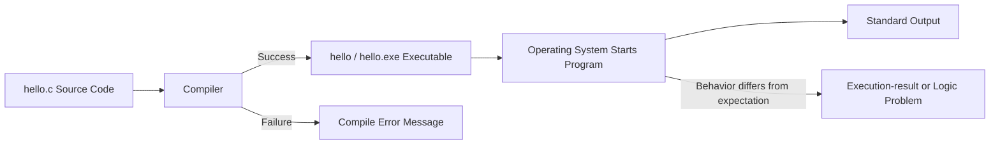

# Preparatory Unit 1: How a Program Begins to Run

Version: 0.2.0  
Status: Official teaching material  
Last updated: 2026-08-03  
Major change summary: Removed submission, per-assignment passing, remediation, and repeated micro-oral wording; reframed activities as independent practice, formative classroom discussion, and preparation for the single final oral examination.  
Corresponding Chinese version: [前導單元 1：程式如何開始執行](unit-01-execution.zh-TW.md)

## Document Purpose

This material is for direct use by instructors, teaching assistants, and students. It supports Chinese Session 1 and English Session 1.

Homework and learning records in this unit are not submitted, graded, or individually marked. Students retain their own programs, predictions, tests, corrections, and AI-use notes for classroom discussion and final oral-examination preparation.

## Basic Information

- Requirement IDs: `X-01`, `X-02`, `X-03`, `X-04`, `CAP-D01`, `DEL-01`, `DEL-02`
- Competency IDs: `PC-E01`, `PC-E03`, `PC-E04`, `PC-D01`, `PC-D03`, `PC-V01`, `PC-V02`
- Target maturity: L2–L4
- Scope state: `SB-C`
- Formative task references: `AT-02`, `AT-04`, `AT-05`, `AT-07`
- Final oral reference: `AT-12`
- Estimated time: 100–120 minutes in Chinese; 120 minutes in English

## Learning Objectives

Students can:

1. Explain the major stages through which C source code becomes executable behavior.
2. Create, compile, and run a minimal C program.
3. Predict output before execution and compare expected with actual results.
4. Distinguish a compile-stage problem from an incorrect execution result.
5. Distinguish source code, a source file, an executable, a running program, and output.

## Required Tools and Environment

- GCC or Clang with C17 support.
- Recommended filename: `hello.c`

```bash
gcc -std=c17 -Wall -Wextra -pedantic hello.c -o hello
./hello
```

Windows PowerShell:

```powershell
.\hello.exe
```

When the environment fails, use a prepared classroom computer, an instructor-tested online environment, paper tracing, or instructor demonstration. Tool failure is not non-participation.

## Core Question

> How does human-readable C source code become behavior that the computer actually runs?

## Visual Model



Key observations:

- Compilation and execution are different stages.
- Compilation failure means `main` has not begun to run.
- Successful compilation does not prove that the requirement is satisfied.
- Editing source code does not update an existing executable until recompilation.

## Minimal Program

```c
#include <stdio.h>

int main(void) {
    printf("Hello, C!\n");
    return 0;
}
```

Expected output:

```text
Hello, C!
```

## Prediction and Trace

| Step | Event | State | Expected result |
|---|---|---|---|
| 1 | Compile `hello.c` | Program is not running | Create an executable or show a compile error |
| 2 | Start the executable | Enter `main` | No output yet |
| 3 | Execute `printf` | Write to standard output | Display `Hello, C!` and a newline |
| 4 | Execute `return 0` | Program ends | Return to the terminal |

Formative classroom prompts:

- Does successful compilation automatically display output?
- If compilation fails, has `main` begun to run?
- Which version runs after editing without recompiling?

These are classroom prompts, not separate oral examinations.

## Common Error Cases

### Missing Semicolon

```c
#include <stdio.h>

int main(void) {
    printf("Hello, C!\n")
    return 0;
}
```

Diagnosis cycle:

1. Classify the stage.
2. Locate the useful part of the compiler message.
3. Compare with the last working version.
4. Correct the defect.
5. Recompile and run a regression check.

### Editing Without Recompiling

Change the text to `Hello, Student!`, save the source, and run the old executable.

Expected observation: the old output remains until recompilation.

## Guided Practice

Predict the original output, compile and run, change the output to the student's English name, recompile, and run again.

Students retain:

- Two expected outputs.
- Two actual outputs.
- Compile and execution commands.
- One sentence explaining why recompilation was required.

No submission is required.

## Independent Practice

Create a program that prints:

```text
My name is <your English name>.
I am learning C.
```

Constraints:

- Use one `main` function.
- Use one or two `printf` calls.
- End each line correctly.
- Input, variables, and conditions are not required.

Students retain their source code, expected output, actual output, and one explanation linking statements to output lines. This work is used in the next classroom discussion and may be selected as preparation material for the final oral examination.

## Testing and Verification

| Type | Action | Expected result |
|---|---|---|
| Normal | Compile and run the original version | Required output appears |
| Formatting | Remove the final `\n` | The next shell prompt may appear on the same line |
| Error | Remove a semicolon and compile | Compilation fails; no updated executable is created |
| Regression | Restore the semicolon and recompile | Required output works again |

## Requirement Modification

Change the first line to `Student: <name>` and add:

```text
Prediction before execution.
```

Students must update the expected output before changing the program, identify affected statements, recompile, and verify both the original and revised behaviors.

## AI Use Rules

Permitted:

- Ask for help interpreting an error message after making a first attempt.
- Ask for candidate causes and verify them independently.
- Ask AI to review a student-written toolchain explanation.

Not permitted:

- Asking AI for the prediction before making an independent prediction.
- Asking AI to complete the practice and copying it unchanged.
- Treating “AI says so” as technical evidence.

Students retain:

- Their pre-AI understanding or program.
- Their own expected result.
- A summary of the AI suggestion.
- Verification steps and results.
- The reason for accepting, modifying, or rejecting the suggestion.

## Self-Check

- I can distinguish source code from an executable.
- I can explain that compilation failure occurs before execution.
- I can predict output before running.
- I can recompile after a source change.
- I can use compiler messages as diagnostic evidence.

This self-check is not an assignment grade.

## Classroom Participation Evidence

Participation may include:

- Asking a question about compilation or execution.
- Explaining a prediction.
- Sharing an error or failed attempt.
- Operating the compiler for a group.
- Writing a process order or trace.
- Suggesting a test.
- Correcting or revising an explanation.

Attendance or speaking frequency alone is not participation evidence.

## Final Oral Preparation

Students should be prepared to explain, trace, modify, or diagnose an equivalent example during the one final one-on-one oral examination. This unit does not define the oral examination's detailed format, timing, or question-selection procedure.

## Suggested Teaching Schedule

| Time | Activity |
|---:|---|
| 0–10 min | Core question and environment check |
| 10–25 min | Toolchain visual and process ordering |
| 25–40 min | Minimal-program reading and prediction |
| 40–60 min | Compile, run, and compare |
| 60–75 min | Missing-semicolon diagnosis |
| 75–90 min | Edit-without-recompiling experiment |
| 90–105 min | Independent practice and requirement change |
| 105–120 min | Reflection, questions, and homework preparation |

## Navigation

- [Assessment precedence note](ASSESSMENT-NOTE.en.md)
- [Instructor implementation guide](../instructor/session-guides.en.md)
- [C17 examples and defect cases](../../examples/README.md)
- [Materials index](../README.en.md)
- [繁體中文版](unit-01-execution.zh-TW.md)
