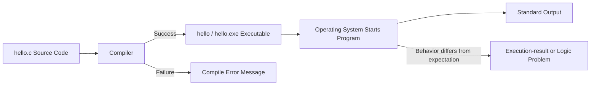

# Preparatory Unit 1: How a Program Begins to Run

Version: 0.1.0  
Status: Teaching draft  
Last updated: 2026-08-03  
Major change summary: Established a complete unit for the toolchain, a minimal C program, prediction, error classification, and initial verification.  
Corresponding Chinese version: [前導單元 1：程式如何開始執行](unit-01-execution.zh-TW.md)

## Document Purpose

This document is designed for direct use by instructors, teaching assistants, and students. The Chinese preparatory class may use it in the first 100–120 minutes of Session 1; the English preparatory class uses this version for its full first two-hour session.

## Basic Information

- Applicable courses: Chinese preparatory class / English preparatory class
- Chinese session: Session 1
- English session: Session 1
- Requirement IDs: `X-01`, `X-02`, `X-03`, `X-04`, `CAP-D01`, `DEL-01`, `DEL-02`
- Competency IDs: `PC-E01`, `PC-E03`, `PC-E04`, `PC-D01`, `PC-D03`, `PC-V01`, `PC-V02`
- Target maturity: L2–L4
- Scope state: `SB-C`
- Acceptance tasks: `AT-02`, `AT-04`, `AT-05`, `AT-07`, `AT-12`
- Risk IDs: `R-02`, `R-05`, `R-08`, `R-09`
- Estimated time: 100–120 minutes in Chinese; 120 minutes in English

## 1. Learning Objectives

After completing this unit, students can:

1. Explain in their own words the major stages through which C source code becomes executable behavior.
2. Create, compile, and run a minimal C program and explain the input and result of each step.
3. Predict output before execution and compare expected and actual results.
4. Use an error message or observed behavior to distinguish an initial compile-stage problem from an incorrect execution result.
5. Distinguish source code, a source file, an executable, a running program, and output.

## 2. Prerequisites

No prior programming experience is required. Students only need to be able to:

- Create and save a text file.
- Type short text with a keyboard.
- Open a terminal or the assigned development environment with instructor guidance.

When a student cannot open the environment, use the instructor-provided fallback environment for prediction, reading, and error-classification activities. Installation problems must not replace the learning activity.

## 3. Required Tools and Environment

- Recommended compiler: GCC or Clang with C17 support.
- Recommended filename: `hello.c`
- Recommended commands:

```bash
gcc -std=c17 -Wall -Wextra -pedantic hello.c -o hello
./hello
```

On Windows PowerShell, execution may use:

```powershell
.\hello.exe
```

- Fallback environment: an instructor-tested online C environment or a prepared classroom computer.
- Students are not expected to understand PATH, Makefiles, ABI, object-file formats, or assembly-language details in this unit.

## 4. Information Priority

### Must Understand

- Source code is not the form directly executed by the CPU.
- Compilation and execution are different stages.
- Trustworthy output begins with an expected result that can be checked.
- Error messages are diagnostic evidence, not merely failure notifications.

### Must Complete

- Predict the output of the minimal program.
- Compile and run the program successfully, or complete an equivalent operation in the fallback environment.
- Produce and classify one compile error.
- Draw or complete the source-to-execution flowchart.
- Answer one micro-oral check.

### Recommended Practice

- Modify the output text and compile again.
- Compare running without recompiling against running after recompilation.

### Extension Exploration

- Inspect the compiler version.
- Use `-Wall -Wextra -pedantic` to observe warnings.

### May Be Deferred

- Detailed preprocessing expansion.
- Assembler output and machine code.
- Linker symbol tables, ABI, and loader relocation.

## 5. Core Question

> How does human-readable C source code become behavior that the computer actually runs?

A program does not work magically after a Run button is pressed. Tools must read, check, transform, and build the source code into an executable, and the operating system must then start it. Distinguishing these stages helps students identify where a problem occurs.

## 6. Visual Model



What to observe:

- The compiler takes source code as input and produces an executable when successful.
- When compilation fails, the program has not begun to run.
- Successful execution does not guarantee that the result satisfies the requirement.
- Editing source code does not automatically update the existing executable; recompilation is required.

Student verification: modify the output text, run the old executable without recompiling, then recompile and run again. Compare the two results.

## 7. Core Concepts and Language Logic

### Need

We need a readable way for humans to describe programs and a form computers can execute.

### Design Purpose

Source code supports human reading and maintenance; the compiler checks and transforms it; the executable is what the operating system starts.

### Language Logic

```text
Write source code
→ Compiler reads and checks it
→ Successful compilation creates an executable
→ Operating system starts the program
→ The program produces behavior and output
→ A human compares expected and actual results
```

### Minimum Terms to Recognize

- Source Code
- Compiler
- Compilation
- Executable
- Execution
- Standard Output
- Compile Error
- Execution-result or Logic Problem

## 8. Minimal Executable Example

The following is a complete program:

```c
#include <stdio.h>

int main(void) {
    printf("Hello, C!\n");
    return 0;
}
```

### Expected Input

```text
None
```

### Expected Output

```text
Hello, C!
```

### Execution Command

```bash
gcc -std=c17 -Wall -Wextra -pedantic hello.c -o hello
./hello
```

### Syntax Needed for Now

- `#include <stdio.h>` allows the program to use standard-output functionality.
- `main` is where program execution begins.
- `printf` outputs text.
- `\n` creates a newline.
- `return 0` indicates normal completion.

Students do not need to memorize full formal definitions yet, but they must identify where the program begins and which statement produces output.

## 9. Prediction and Execution Trace

Complete this before running:

| Step | Statement / Event | Program State | Expected Result |
|---|---|---|---|
| 1 | Compile `hello.c` | Program not running yet | Create an executable or show a compile error |
| 2 | Operating system starts the executable | Enter `main` | No output yet |
| 3 | Execute `printf` | Write to standard output | Display `Hello, C!` and a newline |
| 4 | Execute `return 0` | Program ends | Return to the terminal |

Micro-prompts:

- Does successful compilation automatically display `Hello, C!`? Why or why not?
- If compilation fails, has `main` begun to run?
- After editing the text without recompiling, which version is being executed?

## 10. Common Errors and Error Cases

### Error Case A: Missing Semicolon

```c
#include <stdio.h>

int main(void) {
    printf("Hello, C!\n")
    return 0;
}
```

The exact message depends on the compiler, but it usually points near `printf` and reports a missing `;`.

Diagnosis process:

1. Identify this as a compile-stage error; the program has not run.
2. Locate the line number and nearby code mentioned by the message.
3. Compare with the last compilable version.
4. Add the semicolon and compile again.
5. Run the original normal case to confirm that the correction did not break the expected output.

### Error Case B: Editing the File Without Recompiling

Change the output text to `Hello, Student!`, save the file, and immediately run the old executable.

Observed incorrect behavior: it still displays `Hello, C!`.

Initial hypothesis: the executable was created from the previous source version.

Verification: recompile and run again, then check whether the output updates.

## 11. Guided Practice

### Task: Predict, Run, and Modify

- What to do: write the expected output first, compile and run the program, change the output to your English name, then compile and run again.
- Why: verify the relationship among source code, executable, and actual output.
- Permitted resources: this material, compiler error messages, and the instructor command card.
- Prohibited resources: asking AI for the complete finished program or for the prediction before making your own attempt.
- What to submit or demonstrate: two expected outputs, two actual outputs, the compile and execution commands used, and one sentence explaining the difference.
- Completion criteria: both versions behave correctly, and the student can explain why recompilation was required.

## 12. Independent Practice

### Task: Two-Line Introduction

Create a complete program that prints:

```text
My name is <your English name>.
I am learning C.
```

Constraints:

- Use one `main` function.
- Use one or two `printf` calls.
- End each line correctly.
- Input, variables, and conditions are not required.

AI rules:

- After completing your first version, you may ask AI to help interpret a compile error.
- You may not request a complete answer and submit it unchanged.
- When AI is used, retain your first version, a summary of the AI suggestion, and the verification result.

Required evidence:

- Expected output before execution.
- Complete source code.
- Compile and execution results.
- One sentence explaining which statement produces which output line.

## 13. Testing and Verification

This unit has no input. Testing focuses on output format and recompilation.

| Type | Action | Expected Result | Actual Result | Judgment |
|---|---|---|---|---|
| Normal case | Compile and run the original version | Display the required two lines |  |  |
| Boundary case | Remove the final `\n` | The final line may remain on the same line as the next prompt |  |  |
| Error case | Remove a semicolon and compile | Compilation fails and no new executable version is created |  |  |
| Regression case | Restore the semicolon and recompile | The required output works again |  |  |

## 14. Requirement Modification

New requirement: change the first line to `Student: <name>` and add a third line:

```text
Prediction before execution.
```

Students must:

1. Write the new expected output before editing.
2. Identify which `printf` must be changed or added.
3. Modify and recompile.
4. Check both the original two-line requirement and the new three-line requirement.
5. Explain why changing only a screenshot or running the old executable would not satisfy the requirement.

## 15. AI Use Rules

### Permitted

- After creating your own first version, ask what a particular compiler message may indicate.
- Ask AI for two possible causes, then verify each one yourself.
- Ask AI to review your toolchain explanation for missing stages.

### Prohibited

- Asking AI for the output before making your own prediction.
- Asking AI to complete the independent task and submitting it unchanged.
- Using “AI says it is a compile error” instead of reading the message and recompiling.

### Must Be Retained

- Your program or understanding before using AI.
- Your own expected result.
- A summary of the AI suggestion.
- The actual verification steps and result.
- The reason for accepting, modifying, or rejecting the suggestion.

## 16. Self-Check

- I can distinguish source code from an executable.
- I can explain that a program has not begun to run when compilation fails.
- I can write expected output before execution.
- I can modify output, recompile, and verify the result.
- I can use an error message to identify a compile-stage problem.
- I can explain which judgment responsibilities remain mine when I use AI.

## 17. Acceptance and Remediation

### Target Competencies and Maturity

- `PC-E01`: L2
- `PC-E03`: L2
- `PC-E04`: L4
- `PC-D01` / `PC-D03`: initial L1–L2 foundation
- `PC-V01` / `PC-V02`: L2–L3

### Required Understanding-Oriented Evidence

- A toolchain flowchart or verbal explanation.
- A prediction made before execution.
- A reasoned classification of a compile error versus an incorrect execution result.

### Required Action-Oriented Evidence

- Build and run the minimal program successfully.
- Recompile and verify after a requirement change.
- Reproduce and correct one compile error.

### Micro-Oral Questions

1. Why must you compile again after changing `hello.c`?
2. When the compiler reports an error, has `printf` run?
3. Which file is designed for people to read, and which file does the operating system start?
4. How can you prove that you are running the latest version?

### Passing Criteria

- Complete the minimal build and one modification.
- Correctly answer at least three micro-oral questions, including an explanation that compilation and execution are different stages.
- Provide expected and actual results rather than only a successful screenshot.
- Reproduce, classify, and correct one simple compile error.

### Remediation

- Environment operation incomplete: repeat the build and modification in the fallback environment.
- Program correct but explanation weak: receive a new output requirement and perform prediction, modification, and oral explanation live.
- Can only copy commands: reorder shuffled process cards and explain every step.
- Error classification unstable: compare one compile error with one incorrect-output case.

## 18. Suggested Teaching Schedule

### Chinese Track: 100–120 Minutes

| Time | Activity |
|---:|---|
| 0–10 min | Core question, environment check, and fallback routing |
| 10–25 min | Toolchain visual and process-card ordering |
| 25–40 min | Minimal-program reading and prediction |
| 40–60 min | Build, compile, run, and compare results |
| 60–75 min | Error Case A: missing semicolon and diagnosis |
| 75–90 min | Experiment: edit without recompiling |
| 90–105 min | Independent practice and requirement change |
| 105–120 min | Micro-oral checks, remediation, and exit evidence |

### English Track: 120 Minutes

Use more terminology cards, sentence frames, and pair explanation time, while preserving the same tasks, evidence, and passing criteria.

## 19. Instructor and Teaching-Assistant Notes

### Classroom Observations

- Does the student treat Run as one indivisible button?
- Is a prediction recorded before execution?
- Are compile errors confused with incorrect output?
- Can the student explain why source edits require recompilation?

### Common Misconceptions

- Compilation happens only when Run is pressed.
- Saving the file automatically updates the executable.
- Successful compilation proves the requirement is satisfied.
- The line number in an error message is always the only error location.

### Remediation Strategies

- Use three physical cards: source code, compiler, executable; ask students to order them.
- Compare pre-edit and post-edit executable behavior and ask for a testable hypothesis.
- Focus beginners on the first useful part of a long error message rather than requiring full interpretation.

### What Must Be Preserved if Time Is Short

- Toolchain flowchart.
- Prediction before execution.
- Minimal program build.
- One reproducible compile error.
- One modification followed by recompilation.
- A micro-oral check or equivalent explanatory evidence.

### Optional Additions if Time Permits

- Compare a warning with an error.
- Record the environment with `gcc --version`.
- Exchange programs and predict a partner’s output.

### Out-of-Scope Content That Must Not Be Added

- Pointers, dynamic memory, or data structures.
- Assembly language or object-file format details.
- Complex IDE project configuration.
- Multiple files, library linking, or macro techniques.

## 20. Unit Summary

- Source code must be compiled to create an executable.
- Compilation and execution are different stages, and errors must be classified by stage.
- Prediction before execution and comparison afterward are the first steps toward trustworthy results.
- Source changes require recompilation before the latest version can run.
- The next unit will use variables, types, and expressions to observe how program state changes.

## Navigation

- [Materials and Activity Resources](../README.en.md)
- [Instructional Design Workspace](../../design/README.en.md)
- [繁體中文版](unit-01-execution.zh-TW.md)
