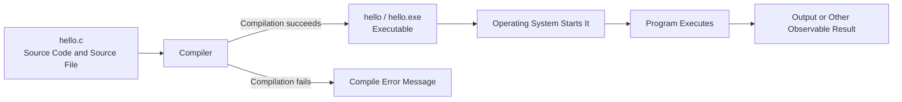

# Preparatory Unit P-U01: How Does Program Text Become an Execution Result?

Version: 1.0.2  
Status: Student-material trial version  
Last updated: 2026-08-06  
Corresponding Chinese version: [前導單元 P-U01：程式如何從文字變成執行結果？](unit-01-execution.zh-TW.md)

---

## Document Purpose and Completion Standard

This is a student-facing chapter for independent reading, practice, review, and later reference. It is not an instructor schedule, assessment policy, or submission guide.

Completing the chapter means more than making a program run. You should be able to explain how source code is compiled into an executable, predict a result before execution, and use compiler messages and observed behavior to revise your understanding.

The activities in this chapter do not need to be submitted. You are encouraged to keep your predictions, programs, errors, and corrections for later review or classroom discussion.

AI is optional in this chapter. Skipping every AI-related activity does not affect chapter completion, and the core self-check does not assess whether AI was used.

## What Question Does This Chapter Answer?

The C program you type into an editor is only a text file. Saving it does not make the computer immediately understand it, and code that looks correct does not automatically produce a result.

This chapter answers one core question:

> How does human-readable C source code become behavior that a computer actually executes?

After reading the chapter and completing its activities, you should be able to:

1. Distinguish source code, a source file, an executable, a running program, and output.
2. Explain that compilation and execution are different stages.
3. Create, compile, and run a minimal C program.
4. Write an expected output before execution and compare it with the actual result.
5. Decide whether a problem occurs before execution or after the program has started running.
6. Explain why source code must be recompiled after it changes.

No prior programming experience is required. You only need to be able to create a text file and use a terminal or the development environment selected by the instructor.

---

## 1. Make a Prediction First

Suppose you create a file named `hello.c` with the following contents:

```c
#include <stdio.h>

int main(void) {
    printf("Hello, C!\n");
    return 0;
}
```

Before reading further, answer these questions:

1. Does saving `hello.c` immediately display `Hello, C!`?
2. After you press “compile,” has the program already run?
3. If compilation fails, has `main` started running?
4. If you edit the text and then run the old executable without recompiling, will you see the new text or the old text?

Write down your answers. They do not need to be correct yet. Their purpose is to let you compare what you originally believed with what actually happens.

---

## 2. Five Things That Are Easy to Confuse

Beginners often call all five of the following things “the program,” but they are not the same.

### 2.1 Source Code

Source code is program text that humans can read and edit, for example:

```c
printf("Hello, C!\n");
```

It describes intended behavior, but it is not yet the behavior being executed by the computer.

### 2.2 Source File

A source file stores source code. This chapter uses:

```text
hello.c
```

The `.c` extension indicates a C source file.

### 2.3 Compiler

A compiler is a tool. It reads source code, checks some kinds of errors, and attempts to translate the program into a form that the computer can later execute.

This course may use GCC or Clang.

### 2.4 Executable

After successful compilation, you obtain a file that the operating system can start, such as:

```text
hello
```

or on Windows:

```text
hello.exe
```

The executable and `hello.c` are different files. Editing `hello.c` does not automatically change an existing `hello.exe`.

### 2.5 Running Program and Output

The program begins to execute only after the operating system starts the executable. A running program performs instructions in sequence. It may produce output, and that output may still differ from what you expected.

Output is one observable result of execution. It is not the source code and it is not the executable itself.

---

## 3. The Complete Path from Source Code to Output



The most important part of the diagram is the order of the stages:

```text
Source code
→ Compilation
→ Executable
→ Start
→ Execution
→ Output
```

Notice that:

- If compilation fails, the new program has not started running.
- Successful compilation only means an executable was produced; it does not prove that the requirement is satisfied.
- Successful execution only means that some behavior completed; it does not prove that the behavior matches your purpose.
- After source code changes, it must be compiled again to produce a corresponding new executable.

---

## 4. Your First Minimal C Program

```c
#include <stdio.h>

int main(void) {
    printf("Hello, C!\n");
    return 0;
}
```

You do not need to memorize all of the syntax yet. For now, recognize the role of each part.

### `#include <stdio.h>`

This allows the program to use standard input and output facilities. The `printf` used in this chapter depends on it.

### `int main(void)`

`main` is the primary function entered when the program starts. Functions will be studied more fully in a later Unit.

### `printf("Hello, C!\n");`

This asks the program to send text to standard output.

The sequence:

```text
\n
```

represents a newline.

### `return 0;`

This ends `main`, using `0` to indicate normal completion. For this chapter, it is enough to know that it ends the minimal program.

---

## 5. Predict First, Then Run

Before executing the program, write the expected output:

```text
Hello, C!
```

Then create `hello.c` and compile it.

Linux, macOS, or a Unix-like terminal:

```bash
gcc -std=c17 -Wall -Wextra -pedantic hello.c -o hello
./hello
```

Windows PowerShell:

```powershell
gcc -std=c17 -Wall -Wextra -pedantic hello.c -o hello.exe
.\hello.exe
```

When using Clang, replace `gcc` with `clang`.

### What Does Each Command Do?

```bash
gcc ... hello.c -o hello
```

This is compilation. It attempts to create an executable named `hello` from `hello.c`.

```bash
./hello
```

This is execution. It asks the operating system to start the executable that was just created.

The compilation command and the execution command cannot replace one another.

---

## 6. Trace What Happens over Time

| Step | Event | Is the program running? | Observable result |
|---|---|---:|---|
| 1 | Edit and save `hello.c` | No | Source-file contents change |
| 2 | Run the compile command | No | An executable is created, or a compile error appears |
| 3 | Run `./hello` or `.\hello.exe` | Yes | The operating system enters `main` |
| 4 | Execute `printf` | Yes | `Hello, C!` and a newline are displayed |
| 5 | Execute `return 0` | About to end | Control returns to the terminal |

Return to the predictions you wrote in Section 1. Which were correct? Which need revision?

---

## 7. Error Case One: A Missing Semicolon

Change the program to:

```c
#include <stdio.h>

int main(void) {
    printf("Hello, C!\n")
    return 0;
}
```

The semicolon at the end of the `printf` line is missing.

### Decide Before Compiling

1. Will the problem appear during compilation or execution?
2. Will `Hello, C!` be printed?
3. Does the line number in a compiler message always identify the exact location where the defect began?

### Diagnosis Steps

1. First classify this as a compilation-stage problem.
2. Read the first useful error message.
3. Inspect the nearby code rather than staring at only one character.
4. Compare it with the last version that compiled successfully.
5. Restore the semicolon.
6. Compile again.
7. Run again and confirm that the original behavior has returned.

The final step is a regression check: after correcting a defect, verify that behavior that should still work continues to work.

### Why Might the Message Point to the Next Line?

The compiler reads the program progressively. When one line is missing a semicolon, it may not know that the syntax cannot continue until it reaches the next line. A compiler message is therefore diagnostic evidence, not always a complete answer.

---

## 8. Error Case Two: Editing Source Code but Running the Old Version

First compile and run the original program successfully:

```text
Hello, C!
```

Then change the source code to:

```c
printf("Hello, Student!\n");
```

Save the file, but do not compile it again yet. Run the old `hello` or `hello.exe` directly.

### Predict First

Will the screen display:

```text
Hello, C!
```

or:

```text
Hello, Student!
```

### What Does the Experiment Show?

Without recompilation, the operating system still starts the executable that was built earlier, so you will normally see the old output.

Think of the relationship this way:

```text
hello.c (new contents)

not recompiled yet

hello.exe (still built from the old contents)
```

Only after recompilation does the new source code produce a new executable.

---

## 9. Successful Compilation Does Not Mean the Program Is Correct

The following program can compile successfully:

```c
#include <stdio.h>

int main(void) {
    printf("Goodbye, C!\n");
    return 0;
}
```

But suppose the requirement is:

```text
Display Hello, C!
```

The program still fails to satisfy the requirement.

You must therefore distinguish three ideas.

### Compilation Is Successful

The program follows rules accepted by the compiler and an executable is produced.

### Execution Completes

The program starts and ends without an obvious interruption.

### The Result Is Correct

The actual result agrees with both the requirement and the expected result.

These three statements are not equivalent.

---

## 10. Guided Practice: Change the Output to Your Name

Do not change the program immediately. First write the output you want, for example:

```text
Hello, Alex!
```

Then:

1. Identify the part of the program that must change.
2. Modify the text inside the string.
3. Save the source file.
4. Compile again.
5. Run the new executable.
6. Compare the expected output with the actual output.

Finally, answer in one sentence:

> Why can you not edit `hello.c` and then only run the old `hello.exe`?

---

## 11. Independent Practice: A Two-Line Introduction

Create a program that displays:

```text
My name is <your English name>.
I am learning C.
```

Constraints:

- Use one `main` function.
- Use one or two `printf` calls.
- End each line correctly.
- Input, variables, conditions, and loops are not needed.

### Suggested Learning Records to Keep

- The expected output written before execution.
- The source code.
- The compile command used.
- The actual output.
- Any errors and corrections.
- One sentence explaining which `printf` corresponds to each output line.

This independent practice does not need to be submitted. It can be kept for later classroom discussion and review.

---

## 12. A Small Test Table

| Type | Change or action | Expected result |
|---|---|---|
| Normal case | Compile and run the original version | `Hello, C!` appears |
| Formatting case | Remove the final `\n` | The terminal prompt may appear on the same line |
| Compile error | Remove a semicolon and compile | Compilation fails; no corresponding new version is created |
| Regression check | Restore the semicolon, recompile, and run | Correct output returns |
| Old-version experiment | Edit the text but do not recompile | The contents of the old executable still run |

The purpose of the table is not to add busywork. It makes clear what you intend to observe before each operation.

---

## 13. Requirement Modification

The requirement now changes to three lines:

```text
Student: <your English name>
I am learning C.
Prediction before execution.
```

Complete these steps in order:

1. Write the complete expected output first.
2. Decide which parts of the original program must change.
3. Modify the source code.
4. Compile again.
5. Run and compare the result.
6. Run one more time to confirm that the result is reproducible.

This process will appear repeatedly in later Units:

```text
Understand the requirement
→ Establish an expectation
→ Modify the program
→ Compile
→ Execute
→ Compare
→ Correct
```

---

## 14. Optional Extension: Use AI to Check Your Explanation

This section is optional and may be skipped without affecting chapter completion.

Explain the following in your own words to an AI system:

> What is the relationship among source code, a compiler, an executable, and program execution?

You do not need a fixed prompt, and you do not need to save or submit the conversation. No declaration is required when you skip this activity. Its only purpose is to help you notice whether your own explanation contains a gap.

An AI response may still be incomplete or incorrect. If it conflicts with the chapter diagram, compiler behavior, or reproducible execution results, judge it using observable evidence rather than accepting it as an answer.

---

## 15. Self-Check

After reading this chapter, check whether you can:

- Explain the relationship between source code and a source file.
- Distinguish a source file from an executable.
- Distinguish compilation from execution.
- Explain that a program has not started executing when compilation fails.
- Write an expected output before running a program.
- Recompile after source code changes.
- Use the missing-semicolon case to describe a basic diagnosis cycle.
- Explain why successful compilation does not prove that a requirement is satisfied.

For any item that remains uncertain, return to the corresponding section and repeat the prediction and experiment.

---

## 16. Chapter Summary

C source code is text that humans can read and modify. A compiler reads the source code and, when successful, creates an executable. The program begins to run only after the operating system starts that executable, and execution may then produce output.

Remember four central judgments:

1. Compilation and execution are different stages.
2. When compilation fails, the new program has not started executing.
3. Source code must be recompiled after it changes.
4. Neither successful compilation nor completed execution alone proves that the result satisfies the requirement.

The next Unit asks a new question: how does a program preserve data and change its state while it executes?

---

## Navigation

- [Materials Index](../README.en.md)
- [Next Unit: Data, Types, and Program State](unit-02-data-state.en.md)
- [繁體中文版](unit-01-execution.zh-TW.md)