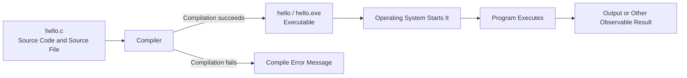

# Preparatory Unit P-U01: How Does Program Text Become an Execution Result?

Version: 1.1.0  
Status: Student material  
Last updated: 2026-08-09  
Corresponding Chinese version: [前導單元 P-U01：程式如何從文字變成執行結果？](unit-01-execution.zh-TW.md)

---

## What Question Does This Chapter Answer?

The C program you type into an editor begins as nothing more than a text file. Pressing “save” does not make it run automatically, and code that looks correct does not mean the computer has already produced the result you want.

This chapter follows the first important question:

> How does human-readable C source code become behavior that a computer actually executes?

We will begin with a tiny `hello.c` file and walk through the complete path: edit → compile → run → observe. No prior programming experience is required. You only need to be able to create a text file and use a terminal or the development environment selected by the instructor.

By the end, you should be able to:

1. Distinguish source code, a source file, an executable, a running program, and output.
2. Explain why compilation and execution are different stages.
3. Create, compile, and run a minimal C program.
4. Predict a result before execution and compare it with what actually happens.
5. Decide whether a problem occurs during compilation or after the program has started running.
6. Explain why source code must be recompiled after it changes.

The activities in this chapter do not need to be submitted. If you want, keep your predictions, errors, and corrections for later review. There is also a completely optional AI extension near the end; skipping it does not affect the chapter.

---

## 1. First, Guess What Will Happen

Suppose you create a file named `hello.c` with the following contents:

```c
#include <stdio.h>

int main(void) {
    printf("Hello, C!\n");
    return 0;
}
```

Before looking for the answers, think about four questions:

1. Does saving `hello.c` immediately display `Hello, C!`?
2. After you press “compile,” has the program already run?
3. If compilation fails, has `main` started running?
4. If you edit the text and then run the old executable without recompiling, will you see the new text or the old text?

Write down your answers first. Do not worry about being wrong. The value of these predictions is that they let you compare what you expected with what actually happens later.

---

## 2. Five Different Things That Often Get Called “the Program”

When you are new to programming, the word “program” can easily refer to several different things. Separating them now will make the rest of the chapter much easier to follow.

### 2.1 Source Code

Source code is program text that humans can read and edit, for example:

```c
printf("Hello, C!\n");
```

It describes what you want the computer to do, but it is not yet the behavior being executed by the computer.

### 2.2 Source File

A source file stores source code. This chapter uses:

```text
hello.c
```

The `.c` extension indicates a C source file.

### 2.3 Compiler

A compiler is a tool. It reads source code, checks some kinds of errors, and attempts to translate the program into a form that the computer can later execute.

This course may use GCC or Clang.

### 2.4 Executable

After successful compilation, you obtain a file that the operating system can start, such as:

```text
hello
```

or on Windows:

```text
hello.exe
```

The executable and `hello.c` are two different files. This point matters: editing `hello.c` does not automatically change an executable that was already built earlier.

### 2.5 Running Program and Output

The program begins to execute only after the operating system starts the executable. A running program carries out its instructions and may produce output. That output may still be different from what you expected.

Output is only one observable result of execution. It is not the source code, and it is not the executable itself.

---

## 3. Connect the Whole Path

Now connect those ideas into one sequence:



If you ignore the details for a moment and remember only the order, read it like this:

```text
Source code
→ Compilation
→ Executable
→ Start
→ Execution
→ Output
```

Following this path gives four important conclusions:

- If compilation fails, the new program has not started running.
- Successful compilation only means an executable was produced; it does not prove that the requirement is satisfied.
- A program that finishes running still may not have done what you wanted.
- After source code changes, it must be compiled again before the new contents can appear in a new executable.

Next, we will actually walk through that path.

---

## 4. Your First Minimal C Program

```c
#include <stdio.h>

int main(void) {
    printf("Hello, C!\n");
    return 0;
}
```

You do not need to memorize all of the syntax yet. For now, treat it as four parts with different jobs.

### `#include <stdio.h>`

This lets the program use standard input and output facilities. The `printf` used in this chapter depends on it.

### `int main(void)`

`main` is the primary function entered after this program begins running. Functions will be studied more fully in a later Unit.

### `printf("Hello, C!\n");`

This asks the program to send text to standard output, which for now is the output you see in the terminal.

The sequence:

```text
\n
```

represents a newline.

### `return 0;`

This ends `main`, using `0` to indicate normal completion. For now, it is enough to think of it as “this minimal program ends here.”

---

## 5. Compile Once, Then Run Once

Before running the program, write down what you expect to see:

```text
Hello, C!
```

Then create `hello.c` and use the commands for your environment.

Linux, macOS, or a Unix-like terminal:

```bash
gcc -std=c17 -Wall -Wextra -pedantic hello.c -o hello
./hello
```

Windows PowerShell:

```powershell
gcc -std=c17 -Wall -Wextra -pedantic hello.c -o hello.exe
.\hello.exe
```

When using Clang, replace `gcc` with `clang`.

The most important detail here is that the two lines do different jobs.

```bash
gcc ... hello.c -o hello
```

The first line is **compilation**. It attempts to create an executable named `hello` from `hello.c`.

```bash
./hello
```

The second line is **execution**. It asks the operating system to start the executable that was just created.

So “compiled” does not mean “already ran,” and the two steps cannot replace one another.

---

## 6. Look at the Same Process over Time

Now place the steps in the order in which they happened:

| Step | Event | Is the program running? | Observable result |
|---|---|---:|---|
| 1 | Edit and save `hello.c` | No | Source-file contents change |
| 2 | Run the compile command | No | An executable is created, or a compile error appears |
| 3 | Run `./hello` or `.\hello.exe` | Yes | The program starts and enters `main` |
| 4 | Execute `printf` | Yes | `Hello, C!` and a newline are displayed |
| 5 | Execute `return 0` | About to end | The program ends and control returns to the terminal |

Return to the four predictions from Section 1. Which matched what happened? Which need to change?

---

## 7. Deliberately Create Your First Error: Remove a Semicolon

Change the program to:

```c
#include <stdio.h>

int main(void) {
    printf("Hello, C!\n")
    return 0;
}
```

The semicolon at the end of the `printf` line is gone.

Before compiling, decide:

1. Will the problem appear during compilation or execution?
2. Will `Hello, C!` be printed?
3. If the compiler points to one line, is that line always exactly where the defect began?

Now compile and inspect the message. For a problem like this, a useful sequence is:

1. Decide which stage the problem belongs to.
2. Read the first useful error message.
3. Inspect the nearby code instead of staring at only one character.
4. Compare it with the last version that compiled successfully.
5. Restore the semicolon.
6. Compile again.
7. Run again and confirm that the original behavior has returned.

The last step is a **regression check**: after correcting a defect, verify that behavior that should still work continues to work. You will use this habit repeatedly later in the course.

### Why Might the Message Point to the Next Line?

The compiler reads the program progressively. When one line is missing a semicolon, it may not know that the syntax cannot continue until it reaches the next line. A compiler message is therefore best treated as diagnostic evidence, not always as a complete answer.

---

## 8. A Second Experiment: Edit the Source but Do Not Recompile

First compile and run the original program successfully:

```text
Hello, C!
```

Then change the source code to:

```c
printf("Hello, Student!\n");
```

Save the file, but do not compile it again yet. Run the old `hello` or `hello.exe` directly.

Before you do, guess whether the screen will display:

```text
Hello, C!
```

or:

```text
Hello, Student!
```

Without recompilation, the operating system still starts the executable that was built earlier, so you will normally see the old output.

Think of the situation this way:

```text
hello.c (contents have changed)

not recompiled yet

hello.exe (still built from the old contents)
```

Only after recompilation does the new source code produce a new executable. That is why “I changed the program, but the result did not change” can sometimes mean that the source file was edited correctly but the executable was never rebuilt.

---

## 9. A Program Can Compile Successfully and Still Do the Wrong Thing

Look at this program:

```c
#include <stdio.h>

int main(void) {
    printf("Goodbye, C!\n");
    return 0;
}
```

It can compile successfully and run to completion. But suppose the requirement is:

```text
Display Hello, C!
```

The program still does the wrong thing.

So when a program “shows no error,” ask three separate questions.

### Did Compilation Succeed?

The compiler accepted the program and produced an executable.

### Did the Program Finish Running?

The program started and ended without an obvious interruption.

### Did the Result Match the Requirement?

The observed result agrees with the requirement and with the expectation you established beforehand.

These ideas are related, but they are not equivalent.

---

## 10. Make Your First Change: Put Your Name in the Output

Do not edit the code immediately. First write down what you want to see, for example:

```text
Hello, Alex!
```

Then follow the process you just learned:

1. Identify the part of the program that must change.
2. Modify the text inside the string.
3. Save the source file.
4. Compile again.
5. Run the new executable.
6. Compare the expected output with the actual output.

When you finish, answer in your own words:

> Why can you not edit `hello.c` and then only run the old `hello.exe`?

---

## 11. Try It Yourself: A Two-Line Introduction

Now create a new program that displays:

```text
My name is <your English name>.
I am learning C.
```

Use only things you have already seen:

- one `main` function,
- one or two `printf` calls,
- correct line endings.

You do not need input, variables, conditions, or loops yet.

If you want to keep a learning record, the three most useful things are your prediction before execution, the final working program, and one error you encountered together with how you corrected it. Nothing needs to be submitted, but those records are often more useful later than keeping only the final answer.

---

## 12. Turn the Earlier Operations into Small Experiments

Each experiment below uses the same `hello.c`. The point is not to complete a table for its own sake. The point is to know what you are trying to observe before you act.

| Experiment | What you do | What you expect to observe |
|---|---|---|
| Normal run | Compile and run the original version | `Hello, C!` appears |
| Remove the newline | Remove the final `\n` | The terminal prompt may appear on the same line |
| Create a compile error | Remove a semicolon and compile | Compilation fails; no corresponding new version is created |
| Check after fixing | Restore the semicolon, recompile, and run | Correct output returns |
| Run the old version | Edit the text but do not recompile | The contents of the old executable still run |

If a result differs from your prediction, do not treat that difference as failure. That difference is exactly what is worth investigating.

---

## 13. Change the Requirement One More Time

The requirement now becomes three lines:

```text
Student: <your English name>
I am learning C.
Prediction before execution.
```

This time, try not to copy the earlier steps mechanically. Walk through the process yourself:

1. Write the complete expected output first.
2. Decide which parts of the original program must change.
3. Modify the source code.
4. Compile again.
5. Run and compare the result.
6. Run one more time to confirm that the result is reproducible.

You are already practicing a workflow that will appear repeatedly later:

```text
Understand the requirement
→ Establish an expectation
→ Modify the program
→ Compile
→ Execute
→ Compare
→ Correct
```

The program is tiny now, but this process remains useful as programs become larger.

---

## 14. Optional: Use AI to Challenge Your Explanation

If you want one more exercise, first answer this question in your own words without looking back at the chapter:

> What is the relationship among source code, a compiler, an executable, and program execution?

Then you may give your explanation to an AI system and ask it to identify anything unclear or incomplete. This section is completely optional. You do not need a fixed prompt, and you do not need to save the conversation.

An AI response may still be incomplete or incorrect. If it conflicts with the chapter diagram, compiler behavior, or an execution result that you can reproduce, return to the observable evidence and judge the claim again instead of accepting the AI response as the answer.

---

## 15. Try Answering Without Looking Back

Cover the earlier sections for a moment and see whether you can answer these questions:

- What is the relationship between source code and a source file?
- How is a source file different from an executable?
- What do compilation and execution each do?
- Why has the new program not started running when compilation fails?
- Why must source code be recompiled after it changes?
- If a semicolon is missing, where would you begin diagnosing the problem?
- Why does “compiles successfully” still not prove that the program satisfies its requirement?

If one answer does not come easily, return to the matching experiment and try it again. Being able to explain the idea in your own words matters more than remembering the chapter’s wording.

---

## 16. Wrap-Up

You can now answer the question from the beginning. C source code first exists as text in a source file. A compiler reads that source code and, when successful, creates an executable. The program begins running only after the operating system starts the executable, and execution may then produce output.

If you remember only four things, keep these:

1. Compilation and execution are different stages.
2. When compilation fails, the new program has not started executing.
3. Source code must be recompiled after it changes.
4. Neither successful compilation nor completed execution alone proves that the result satisfies the requirement.

The next Unit follows the same story one step further: once a program is running, how does it keep data, and how can that data change as the program works?

---

## Navigation

- [Materials Index](../README.en.md)
- [Next Unit: Data, Types, and Program State](unit-02-data-state.en.md)
- [繁體中文版](unit-01-execution.zh-TW.md)