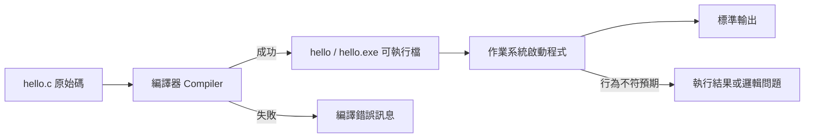

# 前導單元 1：程式如何開始執行

版本：0.1.0  
狀態：教學草案  
最後更新：2026-08-03  
重大變更摘要：建立工具鏈、最小 C 程式、預測、錯誤分類與初步驗證的完整教學單元。  
對應英文版本：[Preparatory Unit 1: How a Program Begins to Run](unit-01-execution.en.md)

## 文件用途

本文件供教師、助教與學生直接使用。中文前導班可安排於第 1 堂前 100–120 分鐘；英文前導班使用等值英文版本完成 Session 1。

## 基本資料

- 適用課程：中文前導班／英文前導班
- 中文堂次：第 1 堂
- 英文堂次：Session 1
- 需求 ID：`X-01`、`X-02`、`X-03`、`X-04`、`CAP-D01`、`DEL-01`、`DEL-02`
- 能力 ID：`PC-E01`、`PC-E03`、`PC-E04`、`PC-D01`、`PC-D03`、`PC-V01`、`PC-V02`
- 目標成熟度：L2–L4
- 範圍狀態：`SB-C`
- 驗收任務：`AT-02`、`AT-04`、`AT-05`、`AT-07`、`AT-12`
- 風險 ID：`R-02`、`R-05`、`R-08`、`R-09`
- 預估時間：中文 100–120 分鐘；英文 120 分鐘

## 一、學習目標

完成本單元後，學生能夠：

1. 用自己的話說明 C 原始碼從文字成為可執行行為的主要階段。
2. 建立、編譯並執行一個最小 C 程式，說明每一步的輸入與結果。
3. 在執行前預測輸出，並比較預期與實際結果。
4. 根據錯誤訊息或現象，初步區分編譯階段問題與執行結果問題。
5. 區分程式碼、程式檔案、可執行檔、執行中的程式與輸出。

## 二、前置知識

本單元不要求既有程式設計經驗。學生只需能：

- 建立與儲存文字檔案。
- 使用鍵盤輸入簡短文字。
- 依教師指示開啟終端機或指定開發環境。

若學生無法開啟環境，先使用教師提供的備援環境完成預測、閱讀與錯誤分類，不得讓安裝問題取代學習活動。

## 三、所需工具與環境

- 建議編譯器：GCC 或 Clang，支援 C17。
- 建議檔名：`hello.c`
- 建議指令：

```bash
gcc -std=c17 -Wall -Wextra -pedantic hello.c -o hello
./hello
```

Windows PowerShell 執行檔可能使用：

```powershell
.\hello.exe
```

- 備援環境：教師預先測試的線上 C 編譯環境或已安裝完成的教室電腦。
- 本單元不要求學生理解 PATH、Makefile、ABI、目的檔格式或組合語言細節。

## 四、資訊優先級

### 必須理解

- 原始碼不是 CPU 直接執行的形式。
- 編譯與執行是不同階段。
- 正確輸出需要先有可檢查的預期結果。
- 錯誤訊息是診斷證據，不只是失敗通知。

### 必須完成

- 預測最小程式的輸出。
- 成功編譯並執行程式，或在備援環境完成等值操作。
- 製造並分類一個編譯錯誤。
- 畫出或補完原始碼到執行的流程圖。
- 回答一次微型口試。

### 建議練習

- 修改輸出文字並重新編譯。
- 比較「沒有重新編譯就執行」與「修改後重新編譯」的差異。

### 延伸探索

- 觀察編譯器版本。
- 使用 `-Wall -Wextra -pedantic` 查看警告。

### 目前可跳過

- 前置處理器展開細節。
- 組譯器輸出與機器碼。
- 連結器符號表、ABI 與載入重定位。

## 五、核心問題

> 人類寫下的 C 原始碼，如何成為電腦實際執行的行為？

程式不是按下「執行」後就神奇地工作。原始碼需要被工具讀取、檢查、轉換並建立成可執行檔，作業系統再啟動它。學會區分這些階段，才能看懂錯誤發生在哪裡。

## 六、視覺模型



觀察重點：

- 編譯器的輸入是原始碼，成功時產生可執行檔。
- 編譯失敗時，程式尚未開始執行。
- 執行成功不代表結果一定符合需求。
- 修改原始碼後，舊的可執行檔不會自動更新；需要重新編譯。

學生驗證方式：修改輸出文字，先不重新編譯直接執行，再重新編譯後執行，比較兩次結果。

## 七、核心概念與語言邏輯

### 需求

我們需要用可閱讀文字描述程式，又要讓電腦執行。

### 設計目的

原始碼服務人類閱讀與維護；編譯器負責檢查並轉換；可執行檔提供作業系統啟動。

### 語言邏輯

```text
撰寫原始碼
→ 編譯器讀取與檢查
→ 成功時建立可執行檔
→ 作業系統啟動程式
→ 程式產生行為與輸出
→ 人類比較預期與實際結果
```

### 最少需要辨識的術語

- 原始碼 Source Code
- 編譯器 Compiler
- 編譯 Compilation
- 可執行檔 Executable
- 執行 Execution
- 標準輸出 Standard Output
- 編譯錯誤 Compile Error
- 執行結果問題 Runtime/Logic Result Problem

## 八、最小可執行範例

以下是完整程式：

```c
#include <stdio.h>

int main(void) {
    printf("Hello, C!\n");
    return 0;
}
```

### 預期輸入

```text
無
```

### 預期輸出

```text
Hello, C!
```

### 執行方式

```bash
gcc -std=c17 -Wall -Wextra -pedantic hello.c -o hello
./hello
```

### 暫時只需知道的語法

- `#include <stdio.h>`：讓程式可以使用標準輸出功能。
- `main`：程式開始執行的位置。
- `printf`：輸出文字。
- `\n`：換行。
- `return 0`：表示程式正常結束。

本單元不要求背誦完整語法定義，但學生必須能指出程式從哪裡開始、哪一行產生輸出。

## 九、執行前預測與追蹤

執行前先完成：

| 步驟 | 敘述／事件 | 程式狀態 | 預期結果 |
|---|---|---|---|
| 1 | 編譯 `hello.c` | 尚未執行程式 | 成功建立可執行檔，或顯示編譯錯誤 |
| 2 | 作業系統啟動可執行檔 | 進入 `main` | 尚未輸出 |
| 3 | 執行 `printf` | 寫入標準輸出 | 顯示 `Hello, C!` 並換行 |
| 4 | 執行 `return 0` | 程式結束 | 回到終端機 |

微型追問：

- 編譯成功時，畫面一定會出現 `Hello, C!` 嗎？為什麼？
- 編譯失敗時，`main` 有沒有開始執行？
- 修改文字後沒有重新編譯，執行的是哪個版本？

## 十、常見錯誤與錯誤案例

### 錯誤案例 A：漏掉分號

```c
#include <stdio.h>

int main(void) {
    printf("Hello, C!\n")
    return 0;
}
```

可能看到的訊息會依編譯器不同而異，但通常指出 `printf` 附近缺少 `;`。

診斷流程：

1. 先確認這是編譯階段錯誤，程式尚未執行。
2. 找到訊息提到的行號與附近位置。
3. 比較上一個可編譯版本。
4. 補上分號並重新編譯。
5. 執行原本的正常案例，確認輸出未被破壞。

### 錯誤案例 B：只修改檔案但沒有重新編譯

將程式文字改成 `Hello, Student!`，儲存後直接執行舊可執行檔。

錯誤行為：仍顯示 `Hello, C!`。

初步假設：目前執行的是修改前建立的舊可執行檔。

驗證：重新編譯後再執行，確認輸出是否更新。

## 十一、引導練習

### 任務：預測、執行與修改

- 要做什麼：先寫下原程式輸出，再編譯與執行；將輸出改成自己的英文名字，重新編譯並執行。
- 為什麼要做：驗證原始碼、可執行檔與實際輸出的關係。
- 可以使用的資源：本教材、編譯器錯誤訊息、教師提供的指令卡。
- 不可使用的資源：直接請 AI 產生整份完成程式或代答預測。
- 要提交或展示什麼：兩次預期輸出、兩次實際輸出、使用過的編譯與執行指令，以及一句差異說明。
- 完成標準：修改前後結果正確，並能說明為何修改後需要重新編譯。

## 十二、獨立練習

### 任務：兩行自我介紹

建立完整程式，輸出兩行：

```text
My name is <你的英文名字>.
I am learning C.
```

限制：

- 使用一個 `main` 函數。
- 可使用一個或兩個 `printf`。
- 每行正確換行。
- 不要求輸入、變數或條件。

AI 規則：

- 可以在完成第一版後，詢問 AI 如何解讀編譯錯誤。
- 不可要求 AI 直接提供完整答案後原樣提交。
- 使用 AI 時，保留自己的第一版、AI 建議摘要與驗證結果。

必要證據：

- 執行前的預期輸出。
- 完整原始碼。
- 編譯與執行結果。
- 一句說明：哪一行程式造成哪一行輸出。

## 十三、測試與驗證

本單元沒有輸入，測試重點是輸出格式與重新編譯。

| 類型 | 操作 | 預期結果 | 實際結果 | 判定 |
|---|---|---|---|---|
| 正常案例 | 編譯並執行原始版本 | 顯示指定兩行文字 |  |  |
| 邊界案例 | 移除最後一個 `\n` | 最後一行可能不立即換到新提示行 |  |  |
| 錯誤案例 | 移除分號後編譯 | 編譯失敗且不建立新的可執行版本 |  |  |
| 回歸案例 | 修正分號並重新編譯 | 再次成功輸出指定文字 |  |  |

## 十四、需求修改

新需求：第一行改成 `Student: <名字>`，並在第三行加入：

```text
Prediction before execution.
```

學生必須：

1. 在修改前寫出新的預期輸出。
2. 指出需要修改或新增的 `printf`。
3. 修改並重新編譯。
4. 執行原本兩行需求與新三行需求的檢查。
5. 說明為何不能只改畫面截圖或舊可執行檔。

## 十五、AI 使用規則

### 允許

- 完成自己的第一版後，詢問某段錯誤訊息可能代表什麼。
- 請 AI 提供兩個可能原因，再由學生逐一驗證。
- 請 AI 檢查學生寫出的工具鏈說明是否遺漏重要階段。

### 禁止

- 在預測前要求 AI 告訴輸出。
- 要求 AI 直接完成獨立練習並原樣提交。
- 以「AI 說是編譯錯誤」取代閱讀錯誤訊息與實際重新編譯。

### 必須保留

- 使用 AI 前的程式或理解。
- 自行建立的預期結果。
- AI 建議摘要。
- 實際驗證步驟與結果。
- 採用、修改或拒絕建議的理由。

## 十六、自我檢核

- 我能指出原始碼與可執行檔的差別。
- 我能說明編譯失敗時程式尚未開始執行。
- 我能在執行前寫出預期輸出。
- 我能修改輸出、重新編譯並驗證結果。
- 我能用錯誤訊息判斷一個問題發生在編譯階段。
- 我能說明使用 AI 時自己保留了哪些判斷責任。

## 十七、驗收與補驗

### 目標能力與成熟度

- `PC-E01`：L2
- `PC-E03`：L2
- `PC-E04`：L4
- `PC-D01`／`PC-D03`：L1–L2 初步建立
- `PC-V01`／`PC-V02`：L2–L3

### 必要理解型證據

- 工具鏈流程圖或口頭說明。
- 執行前預測。
- 編譯錯誤與執行結果問題的分類理由。

### 必要行動型證據

- 成功建立並執行最小程式。
- 修改需求後重新編譯與驗證。
- 重現並修正一個編譯錯誤。

### 微型口試問題

1. 你修改 `hello.c` 後，為什麼需要重新編譯？
2. 編譯器顯示錯誤時，`printf` 有沒有被執行？
3. 哪個檔案是給人閱讀的？哪個檔案是作業系統啟動的？
4. 你如何證明目前執行的是最新版本？

### 通過判準

- 能完成最小程式建置與一次修改。
- 能正確回答至少三個口試問題，其中必須包含「編譯與執行不同」的說明。
- 能提供預期與實際結果，而非只有成功畫面。
- 能重現、分類並修正一個簡單編譯錯誤。

### 補驗方式

- 若環境操作未完成：改用備援環境重新進行建置與修改。
- 若程式正確但無法解釋：提供新輸出需求，現場預測、修改與口試。
- 若只會照指令操作：打亂流程卡，要求重新排列並說明每一步。
- 若錯誤分類不穩定：提供一個編譯錯誤與一個輸出不符案例進行比較。

## 十八、建議教學時間配置

### 中文班 100–120 分鐘

| 時間 | 活動 |
|---:|---|
| 0–10 分 | 核心問題、環境確認與備援分流 |
| 10–25 分 | 工具鏈視覺模型與流程卡排序 |
| 25–40 分 | 最小程式閱讀與執行前預測 |
| 40–60 分 | 建立、編譯、執行與結果比較 |
| 60–75 分 | 錯誤案例 A：漏分號與診斷 |
| 75–90 分 | 修改後未重新編譯的實驗 |
| 90–105 分 | 獨立練習與需求修改 |
| 105–120 分 | 微型口試、補救與離堂證據 |

### 英文班 120 分鐘

英文版本採較多術語卡、句型支架與成對說明時間，但使用相同任務、證據與通過標準。

## 十九、教師與助教備註

### 課堂觀察重點

- 學生是否將「Run」視為一個不可分解的按鈕。
- 是否在執行前留下預測。
- 是否把編譯錯誤與錯誤輸出混為一談。
- 是否能說明修改原始碼後需要重新編譯。

### 常見誤解

- 按下執行才叫編譯。
- 儲存檔案會自動更新可執行檔。
- 編譯成功代表需求一定正確。
- 錯誤訊息中的行號永遠就是唯一錯誤位置。

### 補救策略

- 使用三張實體卡：原始碼、編譯器、可執行檔，要求學生排序。
- 使用修改前後兩個可執行結果，讓學生提出可驗證假設。
- 將長錯誤訊息縮小到第一個關鍵位置，不要求初學者理解所有文字。

### 時間不足時必須保留

- 工具鏈流程圖。
- 執行前預測。
- 最小程式建置。
- 一個可重現編譯錯誤。
- 一次修改與重新編譯。
- 微型口試或等值說明證據。

### 時間充足時可增加

- 比較警告與錯誤。
- 使用 `gcc --version` 記錄環境。
- 讓學生交換程式並預測彼此輸出。

### 不得加入的範圍外內容

- 指標、動態記憶體或資料結構。
- 組合語言與目的檔格式細節。
- 複雜 IDE 專案設定。
- 多檔案、函式庫連結或巨集技巧。

## 二十、單元摘要

- 原始碼需要經過編譯，才能建立可執行檔。
- 編譯與執行是不同階段，錯誤也需要按階段分類。
- 執行前預測與執行後比較，是建立可信結果的第一步。
- 修改原始碼後必須重新編譯，才能執行最新版本。
- 下一單元將以變數、型別與運算式觀察程式狀態如何改變。

## 導覽

- [教材與活動資源](../README.zh-TW.md)
- [教學內容設計區](../../design/README.zh-TW.md)
- [English version](unit-01-execution.en.md)
