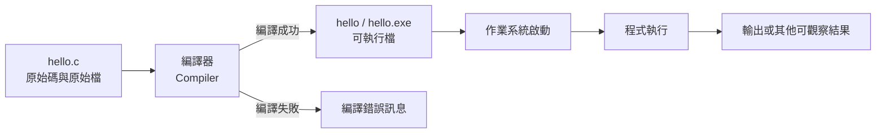

# 前導單元 P-U01：程式如何從文字變成執行結果？

版本：1.1.0  
狀態：學生教材  
最後更新：2026-08-09  
對應英文版本：[Preparatory Unit P-U01: How Does Program Text Become an Execution Result?](unit-01-execution.en.md)

---

## 這一章要回答什麼？

你在編輯器裡輸入的 C 程式，剛開始其實只是一份文字檔。按下「儲存」不會讓它自動開始執行；就算程式碼看起來沒有問題，也不代表電腦已經產生了你想要的結果。

這一章要追蹤的是第一個最重要的問題：

> 人類可讀的 C 原始碼，究竟怎麼變成電腦真正執行的行為？

我們會從一個很小的 `hello.c` 開始，親自走過「編輯 → 編譯 → 執行 → 觀察結果」的完整過程。你不需要先學過程式設計；只要能建立文字檔，並使用終端機或教師指定的開發環境即可。

讀到最後，你應該能夠：

1. 分清楚原始碼、原始檔、可執行檔、執行中的程式與輸出。
2. 說明編譯和執行為什麼是兩個不同階段。
3. 建立、編譯並執行一個最小 C 程式。
4. 在執行前先預測結果，再和實際結果比較。
5. 判斷一個問題發生在編譯階段，還是程式開始執行之後。
6. 說明為什麼修改原始碼後必須重新編譯。

這一章的活動不用繳交。若你願意，可以保留自己的預測、錯誤和修正結果，之後會很適合拿來複習。文末也有一個完全選做的 AI 延伸；直接跳過不會影響這一章的學習。

---

## 1. 先猜猜看會發生什麼

假設你建立了一個名為 `hello.c` 的檔案，內容如下：

```c
#include <stdio.h>

int main(void) {
    printf("Hello, C!\n");
    return 0;
}
```

先不要急著往下找答案。想一想下面四個問題：

1. 儲存 `hello.c` 後，畫面會立即出現 `Hello, C!` 嗎？
2. 按下「編譯」後，程式已經執行了嗎？
3. 如果編譯失敗，`main` 有開始執行嗎？
4. 修改文字後直接執行舊的可執行檔，會出現新文字還是舊文字？

把你的答案先記下來。不必擔心答錯；這些預測的價值，就是讓你稍後能看見「原本以為會發生什麼」和「實際發生什麼」之間的差異。

---

## 2. 五個很容易都被叫成「程式」的東西

初學時，「程式」這個詞常常被拿來指不同東西。先把它們拆開，後面的流程就會清楚很多。

### 2.1 原始碼（source code）

原始碼是人類可以閱讀和編輯的程式文字，例如：

```c
printf("Hello, C!\n");
```

它描述你希望電腦做什麼，但它本身還不是電腦正在執行的行為。

### 2.2 原始檔（source file）

原始檔是保存原始碼的檔案。本章使用：

```text
hello.c
```

`.c` 副檔名表示這是一個 C 原始檔。

### 2.3 編譯器（compiler）

編譯器是一個工具。它讀取原始碼、檢查其中一部分錯誤，並嘗試把程式轉換成電腦可以進一步執行的形式。

本課程可以使用 GCC 或 Clang。

### 2.4 可執行檔（executable）

編譯成功後，會得到一個可由作業系統啟動的檔案，例如：

```text
hello
```

或在 Windows 中：

```text
hello.exe
```

可執行檔和 `hello.c` 是兩個不同的檔案。這一點非常重要：修改 `hello.c`，不會自動改變先前已經產生的 `hello.exe`。

### 2.5 執行中的程式與輸出

當作業系統啟動可執行檔之後，程式才真正開始執行。執行中的程式會依照自己的指令進行工作，可能產生輸出，也可能得到和你原本預期不同的結果。

輸出只是「執行後可以觀察到的結果」之一。它不是原始碼，也不是可執行檔本身。

---

## 3. 把整條路徑連起來

現在把剛才的五個概念接成一條流程：



如果先不管圖中的細節，只記住順序，可以把它讀成：

```text
原始碼
→ 編譯
→ 可執行檔
→ 啟動
→ 執行
→ 輸出
```

沿著這條路徑，可以得到四個重要判斷：

- 編譯失敗時，這次的新程式沒有開始執行。
- 編譯成功只代表產生了可執行檔，不代表需求一定正確。
- 程式順利執行完，也不代表結果符合你的目的。
- 修改原始碼後，必須再次編譯，新的內容才會進入新的可執行檔。

接下來我們真的走一次這條路。

---

## 4. 第一個最小 C 程式

```c
#include <stdio.h>

int main(void) {
    printf("Hello, C!\n");
    return 0;
}
```

現在完全不需要背下所有語法。先把它當成四個有不同工作的部分。

### `#include <stdio.h>`

讓程式可以使用標準輸入輸出相關功能。本章會用到的 `printf` 需要它。

### `int main(void)`

`main` 是這個程式開始執行後會進入的主要函數。更完整的函數概念會在後面的 Unit 再學。

### `printf("Hello, C!\n");`

要求程式把文字送到標準輸出，也就是目前終端機上會看到的輸出位置。

其中：

```text
\n
```

代表換行。

### `return 0;`

表示 `main` 結束，並用 `0` 表示正常結束。現在先把它理解成「這個最小程式到這裡結束」就可以了。

---

## 5. 真的編譯一次，再執行一次

執行之前，先寫下你預期看到的內容：

```text
Hello, C!
```

接著建立 `hello.c`，然後依照你的環境操作。

Linux、macOS 或類 Unix 終端機：

```bash
gcc -std=c17 -Wall -Wextra -pedantic hello.c -o hello
./hello
```

Windows PowerShell：

```powershell
gcc -std=c17 -Wall -Wextra -pedantic hello.c -o hello.exe
.\hello.exe
```

如果使用 Clang，可以把 `gcc` 改成 `clang`。

這裡最值得注意的是：上面的兩行指令做的是不同事情。

```bash
gcc ... hello.c -o hello
```

第一行是**編譯**：它嘗試從 `hello.c` 建立可執行檔 `hello`。

```bash
./hello
```

第二行才是**執行**：它要求作業系統啟動剛剛建立的可執行檔。

所以「有編譯」不等於「已經執行」，兩個步驟也不能互相取代。

---

## 6. 按照時間重新看一次

把剛才的操作按照發生順序排開：

| 步驟 | 發生的事情 | 此時程式是否正在執行？ | 可觀察結果 |
|---|---|---:|---|
| 1 | 編輯並儲存 `hello.c` | 否 | 原始檔內容改變 |
| 2 | 執行編譯指令 | 否 | 建立可執行檔，或顯示編譯錯誤 |
| 3 | 執行 `./hello` 或 `.\hello.exe` | 是 | 程式開始執行並進入 `main` |
| 4 | 執行 `printf` | 是 | 顯示 `Hello, C!` 並換行 |
| 5 | 執行 `return 0` | 即將結束 | 程式結束，回到終端機 |

現在回頭看第 1 節的四個預測。哪些和實際情況一致？哪些需要修改？

---

## 7. 第一個故意製造的錯誤：少一個分號

把程式改成下面這樣：

```c
#include <stdio.h>

int main(void) {
    printf("Hello, C!\n")
    return 0;
}
```

`printf` 那一行末尾的分號被拿掉了。

先不要編譯，先判斷：

1. 問題會在編譯時出現，還是執行時出現？
2. `Hello, C!` 會被印出來嗎？
3. 如果編譯器指出某一行，那一行一定就是錯誤真正開始的地方嗎？

接著再實際編譯，看看錯誤訊息怎麼說。遇到這類問題時，可以依序做：

1. 先判斷問題發生在哪一個階段。
2. 閱讀第一個有用的錯誤訊息。
3. 查看錯誤位置附近的程式碼，不要只盯著單一字元。
4. 和上一個可以正常編譯的版本比較。
5. 補回分號。
6. 重新編譯。
7. 再次執行，確認原本的功能恢復。

最後一步叫做**回歸確認**：修正一個錯誤之後，再確認原本應該正常的行為沒有被破壞。這個習慣之後還會一直用到。

### 為什麼錯誤訊息有時會指向下一行？

編譯器會依序讀取程式。上一行缺少分號時，它可能直到讀到下一行，才確定前面的語法無法繼續。因此，錯誤訊息比較像是「診斷線索」，不一定會直接告訴你真正的原因在哪裡。

---

## 8. 第二個實驗：改了原始碼，卻沒有重新編譯

先讓原始程式成功編譯並執行：

```text
Hello, C!
```

接著把原始碼改成：

```c
printf("Hello, Student!\n");
```

儲存檔案，但先不要重新編譯，直接再次執行舊的 `hello` 或 `hello.exe`。

先猜猜看，畫面會顯示：

```text
Hello, C!
```

還是：

```text
Hello, Student!
```

如果沒有重新編譯，作業系統啟動的仍是先前建立的可執行檔，所以通常會看到舊輸出。

可以把這個狀態想成：

```text
hello.c（內容已經改新）

尚未重新編譯

hello.exe（仍然是舊內容產生的版本）
```

重新編譯之後，新的原始碼才會產生新的可執行檔。這就是為什麼「我明明改了程式，結果怎麼沒變」常常不是程式碼沒有儲存，而是忘了重新編譯。

---

## 9. 編譯成功，也可能做錯事情

看看下面這個程式：

```c
#include <stdio.h>

int main(void) {
    printf("Goodbye, C!\n");
    return 0;
}
```

它可以成功編譯，也可以順利執行。但是如果需求其實是：

```text
輸出 Hello, C!
```

那麼程式仍然做錯了事情。

因此，之後看到一個程式「沒有報錯」時，要再多問兩步：

### 編譯成功了嗎？

編譯器接受了程式，並成功建立可執行檔。

### 程式執行完了嗎？

程式被啟動，而且沒有因明顯問題提前中止。

### 結果符合需求嗎？

實際觀察到的結果和需求、以及你事先建立的預期一致。

這三件事彼此相關，但不能畫上等號。

---

## 10. 動手改第一次：把輸出換成自己的名字

先不要立刻改程式。先寫下你希望看到的輸出，例如：

```text
Hello, Alex!
```

接著按照剛才學到的流程：

1. 找出程式中必須改變的部分。
2. 修改字串裡的文字。
3. 儲存原始檔。
4. 重新編譯。
5. 執行新的可執行檔。
6. 比較預期輸出和實際輸出。

做完後，用一句自己的話回答：

> 為什麼不能只修改 `hello.c`，然後直接執行舊的 `hello.exe`？

---

## 11. 自己完成：兩行自我介紹

現在建立一個新的程式，輸出：

```text
My name is <你的英文名字>.
I am learning C.
```

這次只需要使用目前已經看過的東西：

- 一個 `main`。
- 一個或兩個 `printf`。
- 正確的換行。

還不需要輸入、變數、條件或迴圈。

如果你想留下練習紀錄，最有用的是三樣東西：執行前的預測、最後成功的程式碼，以及中間遇到過的一個錯誤和你怎麼修正它。這些紀錄不需要繳交，但之後回頭看時，通常比只留下最後答案更有價值。

---

## 12. 把剛才的操作變成小實驗

下面幾個小實驗都圍繞同一個 `hello.c`。重點不是把表格做完，而是在動手之前，先知道自己準備觀察什麼。

| 實驗 | 你要做的事 | 你預期會看到什麼 |
|---|---|---|
| 正常執行 | 編譯並執行原始版本 | 出現 `Hello, C!` |
| 拿掉換行 | 移除最後的 `\n` | 終端機提示可能接在同一行 |
| 製造編譯錯誤 | 移除分號後編譯 | 編譯失敗，不產生對應的新版本 |
| 修正後再確認 | 補回分號、重新編譯並執行 | 正確輸出恢復 |
| 執行舊版本 | 修改文字但不重新編譯 | 仍執行舊可執行檔中的內容 |

如果某個結果和你的預測不同，不要急著把它當成失敗。那個差異正是最值得追查的地方。

---

## 13. 再改一次需求

現在把需求改成三行：

```text
Student: <你的英文名字>
I am learning C.
Prediction before execution.
```

這次盡量不要回頭照抄前面的步驟，而是自己走一次：

1. 先寫下完整預期輸出。
2. 判斷原程式哪些地方需要修改。
3. 修改原始碼。
4. 重新編譯。
5. 執行並比較結果。
6. 再執行一次，確認結果可以重現。

你其實已經在練習一個之後會反覆出現的工作方式：

```text
理解需求
→ 建立預期
→ 修改程式
→ 編譯
→ 執行
→ 比較
→ 修正
```

現在的程式很小，但這個流程不會因為程式變大就失去作用。

---

## 14. 選做：用 AI 挑戰自己的解釋

如果你想多做一個練習，可以先不用看本章內容，用自己的話回答：

> 原始碼、編譯器、可執行檔與程式執行之間有什麼關係？

接著再把你的解釋交給 AI，請它找出可能不清楚或不完整的地方。這一節完全選做，不需要固定 Prompt，也不需要保存對話。

AI 的回應仍可能不完整或錯誤。如果它的說法和本章流程圖、編譯結果或你可以重現的執行現象不一致，請回到實際證據重新判斷，而不是直接把 AI 的回應當成答案。

---

## 15. 讀完後，試著不用翻書回答

先把前面的內容暫時蓋住，看看自己能不能回答：

- 原始碼和原始檔有什麼關係？
- 原始檔和可執行檔有什麼不同？
- 編譯和執行分別在做什麼？
- 為什麼編譯失敗時，新程式其實還沒開始執行？
- 為什麼修改原始碼後要重新編譯？
- 少一個分號時，你會先從哪裡開始診斷？
- 為什麼「編譯成功」仍然不能證明程式符合需求？

哪一題答得不順，就回到對應的實驗再做一次。能用自己的話說清楚，比記住本章原句更重要。

---

## 16. 本章收尾

現在可以重新回答開頭的問題了：C 原始碼先以文字形式存在原始檔中；編譯器讀取它，成功時建立可執行檔；作業系統啟動可執行檔後，程式才真正開始執行，並可能產生輸出。

如果只帶走四件事，記住：

1. 編譯與執行是不同階段。
2. 編譯失敗時，新程式尚未開始執行。
3. 原始碼改變後，需要重新編譯。
4. 編譯成功或執行完成，都不能單獨證明結果符合需求。

下一個 Unit 會沿著這條路繼續往前：程式已經開始執行了，那麼它要怎麼保存資料，又怎麼讓資料隨著操作改變？

---

## 導覽

- [教材索引](../README.zh-TW.md)
- [下一單元：資料、型別與程式狀態](unit-02-data-state.zh-TW.md)
- [English version](unit-01-execution.en.md)