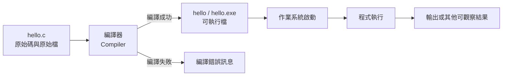

# 前導單元 P-U01：程式如何從文字變成執行結果？

版本：1.0.0  
狀態：學生教材試作版  
最後更新：2026-08-04  
對應英文版本：[Preparatory Unit P-U01: How Does Program Text Become an Execution Result?](unit-01-execution.en.md)

---

## 這一章要回答什麼？

你在編輯器裡輸入的 C 程式，只是一份文字檔。電腦不會因為你按下儲存就立即理解它，也不會因為程式碼看起來正確就自動產生結果。

這一章要回答的核心問題是：

> 人類可讀的 C 原始碼，如何變成電腦真正執行的行為？

讀完並完成本章活動後，你應該能夠：

1. 區分原始碼、原始檔、可執行檔、執行中的程式與輸出。
2. 說明編譯與執行是兩個不同階段。
3. 建立、編譯並執行一個最小 C 程式。
4. 在執行前先寫下預期輸出，再比較實際結果。
5. 判斷問題發生在編譯之前，還是程式開始執行之後。
6. 說明為什麼修改原始碼後必須重新編譯。

本章不要求你已經學過程式設計。你只需要會建立文字檔，並能使用終端機或教師指定的開發環境。

---

## 1. 先做一個預測

假設你建立了一個名為 `hello.c` 的檔案，內容如下：

```c
#include <stdio.h>

int main(void) {
    printf("Hello, C!\n");
    return 0;
}
```

在繼續閱讀之前，先回答：

1. 儲存 `hello.c` 後，畫面會立即出現 `Hello, C!` 嗎？
2. 按下「編譯」後，程式已經執行了嗎？
3. 如果編譯失敗，`main` 有開始執行嗎？
4. 修改文字後直接執行舊的可執行檔，會出現新文字還是舊文字？

先寫下你的答案。這些答案不需要一開始就正確；它們的用途，是讓你之後能比較「原本怎麼想」和「實際發生什麼」。

---

## 2. 五個容易混在一起的東西

初學者常把下面五個東西都叫做「程式」，但它們其實不相同。

### 2.1 原始碼（source code）

原始碼是人類可以閱讀和編輯的程式文字，例如：

```c
printf("Hello, C!\n");
```

它描述你希望電腦做什麼，但它本身還不是電腦正在執行的行為。

### 2.2 原始檔（source file）

原始檔是保存原始碼的檔案。本章使用：

```text
hello.c
```

`.c` 副檔名表示這是一個 C 原始檔。

### 2.3 編譯器（compiler）

編譯器是一個工具。它讀取原始碼、檢查其中一部分錯誤，並嘗試把程式轉換成電腦可以進一步執行的形式。

本課程可使用 GCC 或 Clang。

### 2.4 可執行檔（executable）

編譯成功後，會得到一個可由作業系統啟動的檔案，例如：

```text
hello
```

或在 Windows 中：

```text
hello.exe
```

可執行檔和 `hello.c` 是不同檔案。修改 `hello.c` 不會自動改變既有的 `hello.exe`。

### 2.5 執行中的程式與輸出

當作業系統啟動可執行檔後，程式才真正開始執行。執行中的程式會依序執行指令，可能產生輸出，也可能得到和你預期不同的結果。

輸出只是程式執行後可觀察到的結果之一，它不是原始碼，也不是可執行檔本身。

---

## 3. 從原始碼到輸出的完整路徑



這張圖最重要的不是箭頭名稱，而是各階段的先後關係：

```text
原始碼
→ 編譯
→ 可執行檔
→ 啟動
→ 執行
→ 輸出
```

請注意：

- 編譯失敗時，這次的新程式沒有開始執行。
- 編譯成功只代表產生了可執行檔，不代表需求一定正確。
- 執行成功只代表程式完成了某些行為，不代表結果符合你的目的。
- 修改原始碼後，必須再次編譯，才能產生對應的新可執行檔。

---

## 4. 第一個最小 C 程式

```c
#include <stdio.h>

int main(void) {
    printf("Hello, C!\n");
    return 0;
}
```

現在不需要背下所有語法，只需要先認得每一部分的角色。

### `#include <stdio.h>`

讓程式可以使用標準輸入輸出相關功能。本章使用的 `printf` 需要它。

### `int main(void)`

`main` 是程式開始執行時進入的主要函數。更完整的函數概念會在後續 Unit 學習。

### `printf("Hello, C!\n");`

要求程式把文字送到標準輸出。

其中：

```text
\n
```

代表換行。

### `return 0;`

表示 `main` 結束，並用 `0` 表示正常結束。本章只需要知道它會讓這個最小程式結束。

---

## 5. 先預測，再執行

在執行程式前，先寫下預期輸出：

```text
Hello, C!
```

然後建立 `hello.c` 並編譯。

Linux、macOS 或類 Unix 終端機：

```bash
gcc -std=c17 -Wall -Wextra -pedantic hello.c -o hello
./hello
```

Windows PowerShell：

```powershell
gcc -std=c17 -Wall -Wextra -pedantic hello.c -o hello.exe
.\hello.exe
```

如果使用 Clang，可以把 `gcc` 改成 `clang`。

### 這兩行指令分別做什麼？

```bash
gcc ... hello.c -o hello
```

這是編譯。它嘗試從 `hello.c` 建立可執行檔 `hello`。

```bash
./hello
```

這是執行。它要求作業系統啟動剛剛建立的可執行檔。

編譯指令與執行指令不能互相取代。

---

## 6. 按照時間追蹤發生的事情

| 步驟 | 發生的事情 | 此時程式是否正在執行？ | 可觀察結果 |
|---|---|---:|---|
| 1 | 編輯並儲存 `hello.c` | 否 | 原始檔內容改變 |
| 2 | 執行編譯指令 | 否 | 建立可執行檔，或顯示編譯錯誤 |
| 3 | 執行 `./hello` 或 `.\hello.exe` | 是 | 作業系統進入 `main` |
| 4 | 執行 `printf` | 是 | 顯示 `Hello, C!` 並換行 |
| 5 | 執行 `return 0` | 即將結束 | 回到終端機 |

回頭檢查你在第 1 節寫下的預測。哪些正確？哪些需要修正？

---

## 7. 錯誤案例一：少了一個分號

將程式改成：

```c
#include <stdio.h>

int main(void) {
    printf("Hello, C!\n")
    return 0;
}
```

`printf` 那一行末尾缺少分號。

### 執行前先判斷

1. 問題會在編譯時出現，還是執行時出現？
2. `Hello, C!` 會被印出來嗎？
3. 編譯器顯示的行號是否一定就是錯誤真正發生的位置？

### 診斷步驟

1. 先確認這是編譯階段問題。
2. 閱讀第一個有用的錯誤訊息。
3. 查看錯誤位置附近的程式碼，而不是只盯著一個字。
4. 和上一個可正常編譯的版本比較。
5. 補回分號。
6. 重新編譯。
7. 再次執行，確認原本功能恢復。

這最後一步稱為回歸確認：修正一個錯誤後，再確認原本應該正常的功能仍然正常。

### 為什麼錯誤訊息可能指向下一行？

編譯器逐步閱讀程式。當上一行缺少分號時，它可能直到讀到下一行才確定語法無法繼續。因此，錯誤訊息提供的是診斷線索，不一定是完整答案。

---

## 8. 錯誤案例二：修改了原始碼，卻執行舊版本

先讓原始程式成功編譯並執行：

```text
Hello, C!
```

接著把原始碼改成：

```c
printf("Hello, Student!\n");
```

儲存檔案，但先不要重新編譯，直接再次執行舊的 `hello` 或 `hello.exe`。

### 先預測

畫面會顯示：

```text
Hello, C!
```

還是：

```text
Hello, Student!
```

### 實驗結果代表什麼？

若你沒有重新編譯，作業系統啟動的仍是先前建立的可執行檔，因此通常會看到舊輸出。

這可以用下面的關係理解：

```text
hello.c（新內容）

尚未重新編譯

hello.exe（仍是舊內容產生的版本）
```

重新編譯後，新的原始碼才會產生新的可執行檔。

---

## 9. 編譯成功，不等於程式正確

下面的程式可以成功編譯：

```c
#include <stdio.h>

int main(void) {
    printf("Goodbye, C!\n");
    return 0;
}
```

但假設需求是：

```text
輸出 Hello, C!
```

那麼這個程式仍然不符合需求。

因此必須區分：

### 編譯正確

程式符合編譯器能接受的語法與基本規則，成功建立可執行檔。

### 執行完成

程式被啟動並結束，沒有因明顯問題中止。

### 結果正確

實際結果和需求及預期結果一致。

這三件事並不相同。

---

## 10. 引導練習：把輸出改成自己的名字

先不要修改程式。先寫下你想得到的輸出，例如：

```text
Hello, Alex!
```

接著：

1. 找出需要修改的程式位置。
2. 修改字串內容。
3. 儲存原始檔。
4. 重新編譯。
5. 執行新可執行檔。
6. 比較預期輸出與實際輸出。

最後用一句話回答：

> 為什麼修改 `hello.c` 後，不能只執行舊的 `hello.exe`？

---

## 11. 自主練習：兩行自我介紹

建立一個程式，輸出：

```text
My name is <你的英文名字>.
I am learning C.
```

限制：

- 使用一個 `main`。
- 使用一個或兩個 `printf`。
- 每一行都正確換行。
- 不需要使用輸入、變數、條件或迴圈。

### 建議保留的學習紀錄

- 執行前寫下的預期輸出。
- 原始碼。
- 使用的編譯指令。
- 實際輸出。
- 曾遇到的錯誤與修正。
- 一句說明：哪一個 `printf` 對應哪一行輸出。

這份自主練習不需要繳交，可留作後續課堂討論與複習。

---

## 12. 小型測試表

| 類型 | 修改或操作 | 預期結果 |
|---|---|---|
| 正常案例 | 編譯並執行原始版本 | 顯示 `Hello, C!` |
| 格式案例 | 移除最後的 `\n` | 終端機提示字元可能接在同一行 |
| 編譯錯誤 | 移除分號並編譯 | 編譯失敗，不建立對應的新版本 |
| 回歸確認 | 補回分號、重新編譯並執行 | 恢復正確輸出 |
| 舊版本實驗 | 修改文字但不重新編譯 | 仍執行舊可執行檔的內容 |

這張表的目的不是增加工作量，而是讓你在操作前先知道「這次要觀察什麼」。

---

## 13. 需求修改

現在需求改成輸出三行：

```text
Student: <你的英文名字>
I am learning C.
Prediction before execution.
```

請依序完成：

1. 先寫出完整預期輸出。
2. 判斷原程式哪些地方需要修改。
3. 修改原始碼。
4. 重新編譯。
5. 執行並比較結果。
6. 再執行一次，確認結果可重現。

這個流程會在後續 Unit 不斷重複：

```text
理解需求
→ 建立預期
→ 修改程式
→ 編譯
→ 執行
→ 比較
→ 修正
```

---

## 14. 向 AI 解釋這個概念

請用自己的話向 AI 解釋：

> 原始碼、編譯器、可執行檔與程式執行之間有什麼關係？

你不需要使用固定 Prompt，也不需要保留或繳交對話紀錄。這個活動只是讓你把自己的理解說出來，並看看對話是否讓你發現仍不清楚的地方。

---

## 15. 自我檢核

閱讀完本章後，檢查自己是否能夠：

- 說明原始碼與原始檔的關係。
- 區分原始檔與可執行檔。
- 區分編譯與執行。
- 說明編譯失敗時程式尚未開始執行。
- 在執行前寫下預期輸出。
- 修改原始碼後重新編譯。
- 用「少分號」案例說明基本診斷流程。
- 說明為什麼編譯成功不代表需求正確。

對任何一項沒有把握時，回到相對應的章節，重新做一次預測與實驗。

---

## 16. 本章摘要

C 原始碼是人類可以閱讀與修改的文字。編譯器讀取原始碼，成功時建立可執行檔；作業系統啟動可執行檔後，程式才真正開始執行並產生輸出。

請記住四個最重要的判斷：

1. 編譯和執行是不同階段。
2. 編譯失敗時，新程式尚未開始執行。
3. 修改原始碼後必須重新編譯。
4. 編譯成功與執行完成，都不能單獨證明結果符合需求。

下一個 Unit 將進一步回答：程式如何保存資料，並在執行過程中改變自己的狀態？

---

## 導覽

- [教材索引](../README.zh-TW.md)
- [下一單元：資料、型別與程式狀態](unit-02-data-state.zh-TW.md)
- [English version](unit-01-execution.en.md)
