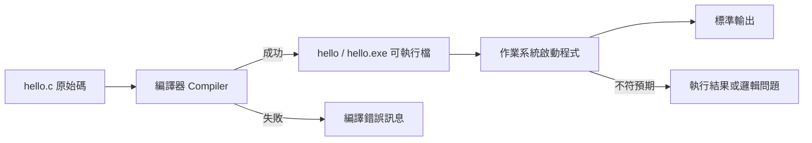

# 前導單元 1：程式如何開始執行

版本：0.2.0  
狀態：正式教學教材  
最後更新：2026-08-03  
重大變更摘要：依現行評量制度移除繳交、逐份通過、補驗與微型口試語意，改為自主保存、課堂形成性追問與最終口試準備。  
對應英文版本：[Preparatory Unit 1: How a Program Begins to Run](unit-01-execution.en.md)

## 文件用途

供教師、助教與學生直接使用。中文前導班安排於第 1 堂前 100–120 分鐘；英文前導班使用等值英文版本完成 Session 1。

本單元所有練習皆為自主學習活動：不繳交、不逐份計分。學生自行保存預測、程式、測試、錯誤與修正紀錄，作為課堂討論及最終一對一口試準備素材。

## 基本資料

- 適用課程：中文前導班／英文前導班
- 中文堂次：第 1 堂
- 英文堂次：Session 1
- 需求 ID：`X-01`、`X-02`、`X-03`、`X-04`、`CAP-D01`、`DEL-01`、`DEL-02`
- 能力 ID：`PC-E01`、`PC-E03`、`PC-E04`、`PC-D01`、`PC-D03`、`PC-V01`、`PC-V02`
- 目標成熟度：L2–L4
- 範圍狀態：`SB-C`
- 學習活動：`AT-02`、`AT-04`、`AT-05`、`AT-07`
- 最終口試能力來源：`AT-12`
- 風險 ID：`R-02`、`R-05`、`R-08`、`R-09`
- 預估時間：中文 100–120 分鐘；英文 120 分鐘

## 一、學習目標

完成本單元後，學生能夠：

1. 用自己的話說明 C 原始碼成為可執行行為的主要階段。
2. 建立、編譯並執行最小 C 程式。
3. 在執行前預測輸出，並比較預期與實際結果。
4. 初步區分編譯階段問題與執行結果問題。
5. 區分原始碼、原始檔、可執行檔、執行中的程式與輸出。

## 二、前置知識

本單元不要求既有程式設計經驗。學生只需能建立文字檔、輸入簡短文字，以及依教師指示開啟終端機或開發環境。

若環境無法使用，改用教師備援環境完成預測、閱讀、流程排序與錯誤分類；不得讓安裝問題取代學習活動。

## 三、工具與環境

- GCC 或 Clang，支援 C17。
- 建議檔名：`hello.c`

```bash
gcc -std=c17 -Wall -Wextra -pedantic hello.c -o hello
./hello
```

Windows PowerShell：

```powershell
.\hello.exe
```

本單元不深入 PATH、Makefile、ABI、目的檔、組合語言或連結器細節。

## 四、核心問題

> 人類寫下的 C 原始碼，如何成為電腦實際執行的行為？

## 五、視覺模型



觀察重點：

- 編譯器成功時建立可執行檔。
- 編譯失敗時，程式尚未執行。
- 執行成功不等於符合需求。
- 修改原始碼後需要重新編譯。

## 六、最小範例

```c
#include <stdio.h>

int main(void) {
    printf("Hello, C!\n");
    return 0;
}
```

預期輸出：

```text
Hello, C!
```

暫時只需辨識：`#include <stdio.h>`、`main`、`printf`、`\n`、`return 0`。

## 七、執行前預測與追蹤

| 步驟 | 事件 | 程式狀態 | 預期結果 |
|---|---|---|---|
| 1 | 編譯 `hello.c` | 尚未執行 | 建立可執行檔或顯示編譯錯誤 |
| 2 | 作業系統啟動 | 進入 `main` | 尚未輸出 |
| 3 | 執行 `printf` | 寫入標準輸出 | 顯示 `Hello, C!` 並換行 |
| 4 | 執行 `return 0` | 程式結束 | 回到終端機 |

課堂形成性追問：

- 編譯成功時，畫面一定已經輸出嗎？
- 編譯失敗時，`main` 是否開始執行？
- 修改後未重新編譯，執行的是哪個版本？

這些追問用於討論與理解，不是獨立口試或逐次計分。

## 八、錯誤案例

### 案例 A：漏掉分號

```c
#include <stdio.h>

int main(void) {
    printf("Hello, C!\n")
    return 0;
}
```

診斷流程：

1. 判斷為編譯階段問題。
2. 閱讀第一個有用的錯誤訊息與附近程式。
3. 修正後重新編譯。
4. 執行原正常案例進行回歸確認。

### 案例 B：修改後未重新編譯

將文字改為 `Hello, Student!`，但直接執行舊可執行檔。先提出假設，再重新編譯驗證。

## 九、引導練習

先預測原程式輸出，再編譯執行；修改輸出為自己的英文名字，重新編譯並比較結果。

學生自行保存：

- 修改前後的預期與實際輸出。
- 使用的編譯與執行指令。
- 一句說明：為什麼原始碼修改後需要重新編譯。

## 十、自主作業：兩行自我介紹

建立程式輸出：

```text
My name is <你的英文名字>.
I am learning C.
```

限制：

- 使用一個 `main`。
- 使用一個或兩個 `printf`。
- 每行正確換行。
- 不使用輸入、變數或條件。

作業不繳交、不逐份計分。下一堂課可用於提問、分享錯誤、比較解法與參與活動。

學生自行保存：預期輸出、原始碼、執行結果、錯誤與修正，以及一句程式—輸出對應說明。

## 十一、測試與需求修改

| 類型 | 操作 | 預期結果 |
|---|---|---|
| 正常 | 編譯並執行 | 顯示指定文字 |
| 格式 | 移除最後的 `\n` | 下一個提示可能接在同一行 |
| 錯誤 | 移除分號並編譯 | 編譯失敗，不產生新版本 |
| 回歸 | 修正分號並重新編譯 | 恢復正確輸出 |

新需求：第一行改成 `Student: <名字>`，並加入第三行 `Prediction before execution.`。修改前先寫預期輸出，修改後重新編譯與驗證。

## 十二、AI 使用規則

允許：完成第一版後，請 AI 解釋已遇到的錯誤訊息或提出候選原因。  
禁止：在自行預測前索取答案；將 AI 完整程式原樣當成自己的理解。  
自行保存：使用前版本、自建預期結果、AI 建議摘要、驗證步驟與採用／修改／拒絕理由。

錯誤 AI 建議案例與測試請參考：[C17 測試案例與錯誤 AI 建議](../../examples/TESTS-AND-AI.zh-TW.md)。

## 十三、自我檢核與最終口試準備

學生應確認自己能：

- 區分原始碼與可執行檔。
- 說明編譯與執行的差異。
- 在執行前建立預期結果。
- 修改、重新編譯並驗證。
- 用錯誤訊息支持診斷。
- 說明使用 AI 時仍由自己負責的判斷。

這些能力可能成為最終一對一口試的抽查來源，但本單元不另外安排正式口試，也不以本單元作業做逐份通過判定。

## 十四、教師與助教指引

- 先要求預測，再執行。
- 將學生錯誤匿名化後用於討論。
- 觀察提問、追蹤、測試、程式操作與書面回應等多元參與。
- 不以點名、出席或發言次數代替參與證據。
- 時間不足時保留：工具鏈圖、最小程式、可重現編譯錯誤、修改後重新編譯與形成性追問。

## 十五、單元摘要

原始碼必須經過編譯才能建立可執行檔；編譯與執行是不同階段。可信的程式結果來自執行前預測、執行後比較、錯誤診斷與修改後驗證。

## 導覽

- [教材評量制度補充規則](ASSESSMENT-NOTE.zh-TW.md)
- [教師執行指引](../instructor/session-guides.zh-TW.md)
- [教材索引](../README.zh-TW.md)
- [English version](unit-01-execution.en.md)
