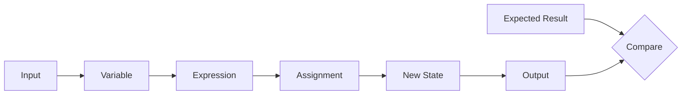

# Preparatory Unit 2: Data, Types, and Program State

Version: 0.2.0  
Status: Official teaching material  
Last updated: 2026-08-03  
Major change summary: Removed submission, per-assignment passing, remediation, and repeated micro-oral wording; reframed activities as independent practice, formative classroom discussion, and preparation for the single final oral examination.  
Corresponding Chinese version: [前導單元 2：資料、型別與程式狀態](unit-02-data-state.zh-TW.md)

## Document Purpose

For direct use by instructors, teaching assistants, and students. The Chinese preparatory track uses it across the latter part of Session 1 and Session 2; the English preparatory track uses it in Session 2.

Homework and learning records in this unit are not submitted, graded, or individually marked. Students retain their state traces, programs, tests, errors, and AI-use notes for the next classroom discussion and final one-on-one oral-examination preparation.

## Basic Information

- Requirement IDs: `CAP-D01` through `CAP-D04`, `X-02`, `X-03`, `X-04`
- Competency IDs: `PC-D01` through `PC-D05`, `PC-V01`, `PC-V03`
- Target maturity: L2–L4
- Scope state: `SB-C`
- Formative task references: `AT-02`, `AT-03`, `AT-05`, `AT-06`, `AT-08`
- Final oral reference: `AT-12`
- Risk IDs: `R-02`, `R-05`, `R-09`
- Estimated time: Chinese 150–180 minutes; English 120 minutes

## 1. Learning Objectives

Students can:

1. Distinguish a value, type, variable name, and current value.
2. Trace state changes caused by declaration, initialization, assignment, and expression evaluation.
3. Select `int` or `double` according to data meaning.
4. Build a basic input–process–output program.
5. Modify one requirement and update expected results and tests.

## 2. Prerequisites

- Build, compile, and run a minimal C program.
- Write expected output before execution.
- Distinguish compilation problems from incorrect results.

When these capabilities are still unstable, use Unit 1 fallback activities and formative recovery practice rather than copying a complete program.

## 3. Tools and Environment

- GCC or Clang with C17 support.
- Compile with: `gcc -std=c17 -Wall -Wextra -pedantic score.c -o score`
- Fallback: an instructor-tested online compiler, paper tracing, or instructor equipment.

Tool failure is not non-participation or proof of missing capability.

## 4. Information Priority

### Must Understand

- A variable name is not the value itself.
- A type constrains representation and operations.
- Assignment changes program state.
- Input is an assumption, and output must be checked against an expected result.

### Must Complete

- One state-trace table.
- One input–process–output program.
- One diagnosis of a type or expression error.
- One requirement modification with regression testing.

Students retain these records themselves; no submission is required.

### May Be Deferred

- Bit-level representation, complete overflow taxonomy, complex casts, and a full undefined-behavior taxonomy.

## 5. Core Question

> How does a program remember data, change data, and let us verify that the new result is reasonable?

## 6. Visual Model



Verification method: calculate first, then run. When results differ, locate the first state that differs.

## 7. Core Concepts

- Value: actual data, such as `80`.
- Type: representation and permitted operations, such as `int` or `double`.
- Variable: a name used to refer to current data state.
- Initialization: assigning an initial value during declaration.
- Assignment: writing a new result into a variable.
- Expression: values, variables, and operators combined to produce a result.

## 8. Minimal Executable Example

```c
#include <stdio.h>

int main(void) {
    int score = 80;
    score = score + 5;
    printf("%d\n", score);
    return 0;
}
```

Expected output:

```text
85
```

## 9. State Trace

| Step | Statement | `score` Before | Evaluated Result | `score` After |
|---|---|---:|---:|---:|
| 1 | `int score = 80;` | does not exist | 80 | 80 |
| 2 | `score = score + 5;` | 80 | 85 | 85 |
| 3 | `printf(...)` | 85 | 85 | 85 |

Formative classroom prompt: What roles do the `score` on the right and the `score` on the left play?

This is a classroom discussion prompt, not a separate oral examination.

## 10. Input–Process–Output Example

```c
#include <stdio.h>

int main(void) {
    int score;
    scanf("%d", &score);
    score = score + 5;
    printf("Adjusted score: %d\n", score);
    return 0;
}
```

Normal case: input `80`, expected `Adjusted score: 85`.  
Boundary case: input `0`, expected `Adjusted score: 5`.

In this unit, treat `&score` only as the form required for `scanf` to write into the variable; pointer semantics are intentionally deferred.

## 11. Common Errors

### Integer Division

```c
int total = 5;
int count = 2;
double average = total / count;
```

The result may be `2.0`, not `2.5`. Trace operand types first, then change it to:

```c
double average = (double) total / count;
```

Students must explain the reason rather than merely replacing the code with an AI suggestion.

### Format and Type Mismatch

Using `%d` for a `double` or `%lf` to read an `int` is incorrect. Verify with compiler warnings, observed behavior, and the type table.

## 12. Guided Practice

Build a “temperature plus one” program: read an integer temperature, add one, and print it.

Students retain:

1. An input–process–output table.
2. Two expected results.
3. The program and actual results.
4. One sentence explaining the state change.

## 13. Independent Homework

### Score Adjuster

Read an original score and bonus, then print the adjusted score.

- Input: two integers.
- Output: `Final score: <value>`.
- Constraint: use meaningful variable names and define three tests first.
- Student-retained records: state table, program, test table, and explanation.

Alternative reasonable solutions are permitted. Homework is not submitted or individually graded; the next class may discuss errors, tests, or alternative solutions from this work.

## 14. Requirement Modification

Add this rule: “The adjusted score may not exceed 100.” Students must:

1. Identify the affected processing step.
2. Update expected results and add a case above 100.
3. Modify the program.
4. Re-run prior cases.
5. Explain why the original tests were insufficient.

## 15. AI Use Rules

Permitted: after completing a first version, ask AI for potentially missing tests or for help interpreting a compiler warning.  
Prohibited: request a complete answer before producing a state table and initial approach; use code that cannot be explained.  
Must retain: pre-AI approach, self-created tests, suggestion summary, verification method, and reason for accepting or rejecting it.

## 16. Self-Check

- I can distinguish values, types, variable names, and current values.
- I can trace state before and after assignment.
- I can explain why `5 / 2` differs from `5.0 / 2`.
- I can update tests after a requirement change.
- I can verify rather than simply trust an AI suggestion.

This self-check is not an assignment grade.

## 17. Classroom Participation Evidence

Participation may include:

- Explaining a state change.
- Proposing a test or boundary case.
- Sharing an integer-division or type error.
- Operating the program, writing a trace, or submitting an anonymous question.
- Revising one's own or a peer's reasoning.

Attendance or speaking frequency alone is not participation evidence.

## 18. Final Oral Preparation

Students should be prepared to explain, trace, modify, or diagnose an equivalent example during the one final one-on-one oral examination. This unit does not fix the oral examination's detailed format, timing, or question-selection method.

## 19. Instructor and TA Guidance

- Require hand calculation before execution.
- Do not expand `scanf` address syntax into a pointer lesson.
- When time is short, retain state tracing, the type error, and requirement modification; reduce exercise count.
- Successful output alone does not establish capability.
- Use formative prompts instead of per-assignment grading or repeated micro-orals.

## 20. Unit Summary

This unit establishes the model that program execution changes state. The next unit uses conditions and repetition to decide how state changes.

## Navigation

- [Assessment precedence note](ASSESSMENT-NOTE.en.md)
- [Instructor implementation guide](../instructor/session-guides.en.md)
- [C17 examples and defect cases](../../examples/README.md)
- [Materials Index](../README.en.md)
- [繁體中文版](unit-02-data-state.zh-TW.md)
