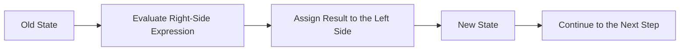

# Preparatory Unit P-U02: How Does a Program Remember Data and Change State?

Version: 1.2.0  
Status: Student material  
Last updated: 2026-08-09  
Corresponding Chinese version: [前導單元 P-U02：程式如何記住資料並改變狀態？](unit-02-data-state.zh-TW.md)

## What Question Does This Chapter Answer?

The previous Unit used very simple programs: enter `main`, execute a few statements in order, print fixed text, and then end. But as soon as a program needs to work with scores, temperatures, money, or any information that can change, fixed output is no longer enough.

A program needs to “remember what it has now,” perform an operation, and then continue with new contents. That is the question this chapter follows:

> How does a program preserve current data and change its state step by step while it runs?

We will begin with a three-line `score` example, watch the value change, and then carry the same idea into input, integer and floating-point operations, and a few common mistakes.

By the end, you should be able to:

1. Distinguish data, value, type, variable name, and current value.
2. Trace state changes caused by initialization, assignment, and expressions line by line.
3. Recognize basic differences between integer and floating-point operations.
4. Read a simple program as input → processing → output.
5. Understand why external input should be treated as usable data only after it succeeds.
6. Update expected results and tests before changing code when a requirement changes.

If you can already trace a minimal C program through the execution order introduced in P-U01, you are ready to begin.

---

## 1. Do Not Run It Yet: Trace `score`

Look at these three lines:

```c
int score = 80;
score = score + 5;
printf("%d\n", score);
```

Do not run them yet. Walk through them on paper or in your head:

1. What is `score` after the first line?
2. Does the `score` on the right side of the second line read the old value or the updated value?
3. What is the current value of `score` after the second line finishes?
4. What will be printed?

If `score = score + 5` looks strange, that is useful. In mathematics, a number is not normally equal to itself plus five. In C, however, `=` is not mathematical equality. We will unpack that next.

---

## 2. Separate Five Ideas First

Before tracing more code, give names to a few ideas that will keep appearing throughout the course.

### Data

Information a program works with, such as a score, temperature, quantity, or character.

### Value

The actual contents at one moment, such as `80`, `3.5`, or `'A'`.

### Type

A type tells C how a value is represented and what kinds of operations can be performed on it. For example:

```c
int count = 5;
double temperature = 23.5;
char grade = 'A';
```

For now, recognize three common cases: `int` is used for integers, `double` can represent values with fractional parts, and `char` represents one character.

### Variable

A variable gives a name to a value that the program currently stores. For example, `score` is the name, while `80` is the value stored there at one moment.

The same name can hold different current values at different times. That is one reason programs can change while they run.

### State

If we write down the current values of all important variables at one moment, we have a description of the program’s state at that moment.

This example has only one variable, so the state is simple:

```text
score = 80
```

After another statement runs, it may become:

```text
score = 85
```

---

## 3. What Does `score = score + 5` Actually Do?

Start with this model:



For this statement:

```c
score = score + 5;
```

read it step by step:

```text
Read the old value 80 from score on the right
→ compute 80 + 5
→ obtain 85
→ write 85 back into score on the left
```

So `=` here means **assignment**: evaluate the right side first, then store the result on the left.

Before the statement:

```text
score = 80
```

After the statement:

```text
score = 85
```

That is one state change.

---

## 4. Put It Back into a Complete Program

```c
#include <stdio.h>

int main(void) {
    int score = 80;
    score = score + 5;
    printf("%d\n", score);
    return 0;
}
```

Expected output:

```text
85
```

If we record `score` before and after each statement:

| Step | Statement | `score` before | Result of this step | `score` after |
|---|---|---:|---:|---:|
| 1 | `int score = 80;` | not created yet | 80 | 80 |
| 2 | `score = score + 5;` | 80 | 85 | 85 |
| 3 | `printf(...)` | 85 | prints 85 | 85 |

Notice the third line: `printf` uses the current value of `score`, but it does not change it. A statement can execute without changing the program state we are tracking.

---

## 5. Initialization and Assignment Look Similar but Are Not the Same

Giving a value when a variable is first created is called **initialization**:

```c
int score = 80;
```

Changing the current value of a variable that already exists is called **assignment**:

```c
score = 90;
```

Both lines contain `=`, but they happen at different moments. The first creates `score` and gives it an initial value; the second updates an existing `score`.

This distinction will appear again later when the course discusses variable lifetime, functions, and memory. For now, it is enough to distinguish “create and give an initial value” from “update a value that already exists.”

---

## 6. Data Can Also Enter from Outside the Program

So far, the value `80` has been written directly into the source code. Now let the user provide the score.

```c
#include <stdio.h>

int main(void) {
    int score;

    if (scanf("%d", &score) != 1) {
        fprintf(stderr, "Invalid input\n");
        return 1;
    }

    score = score + 5;
    printf("Adjusted score: %d\n", score);

    return 0;
}
```

This program contains a few symbols you have not formally studied yet. You do not need to understand all of them at once.

- `scanf("%d", &score)` attempts to read one integer and place it into `score`.
- The full meaning of `&score` involves pointers and will be studied later. For now, treat the whole form as the way `scanf` writes input into `score`.
- `if (...)` is a conditional. The next Unit studies conditions formally. Here, you only need to know that if one integer was not read successfully, the program prints an error and stops before using `score`.

Why check first? The user might enter:

```text
abc
```

If that input was never successfully converted to an integer, the program should not pretend that `score` now contains a reliable score.

Try four inputs:

| Input | Expected result |
|---:|---|
| 80 | `Adjusted score: 85` |
| 0 | `Adjusted score: 5` |
| -5 | `Adjusted score: 0` |
| `abc` | print an error and stop without calculating an adjusted score |

The main idea here is not the syntax of `if`. Keep one habit: **external data becomes trustworthy program state only after the program has confirmed that the input operation succeeded.**

---

## 7. The First Surprising Case: Integer Division

Now look at one way in which a type can change the result of an expression:

```c
int total = 5;
int count = 2;
double average = total / count;
printf("%.1f\n", average);
```

You may expect `2.5`, but the actual result is:

```text
2.0
```

The reason is this expression:

```c
total / count
```

Both operands are `int`, so C performs integer division first and produces `2`. Only afterward is that `2` converted to `double`, becoming `2.0`.

If the division itself should use floating-point arithmetic, one way to write it is:

```c
double average = (double) total / count;
```

Compare three cases: `5 / 2`, `4 / 2`, and `1 / 2`. Predict each one before running it.

---

## 8. A Second Common Mistake: Output Format and Type Do Not Match

Consider these two lines:

```c
int score = 80;
printf("%f\n", score);
```

`score` is an `int`, but `%f` expects a different corresponding value type. This is not merely a formatting problem; the mismatch causes undefined behavior. Do not judge the code by one accidental screen result. Compiler warnings are important diagnostic evidence here.

The correct form is:

```c
printf("%d\n", score);
```

Keep this small reference nearby for now:

| Type | `printf` | `scanf` |
|---|---|---|
| `int` | `%d` | `%d` |
| `double` | `%f` | `%lf` |
| `char` | `%c` | `%c` |

You do not need to memorize the whole table yet. When you use a type, check which format belongs with it.

---

## 9. Trace It Yourself: Increase a Temperature

The requirement is simple: read an integer temperature, add one, and print the result.

Before writing the complete program, establish two expectations:

```text
input 20 → output 21
input -1 → output 0
```

Then draw a small state table containing only `temperature` and trace what “read input” and “add one” each do to the state.

Finally, write the program, compile it, run it, and compare the results. Also try a nonnumeric input once and confirm that the program does not continue as though a valid temperature had been read.

---

## 10. Try It Yourself: Score Adjuster

Now make the earlier example slightly larger. The program reads two integers—an original score and a bonus—and displays:

```text
Final score: <value>
```

For example:

```text
original score 80, bonus 5 → Final score: 85
```

You can use two variables such as `score` and `bonus`. If you have not seen how `scanf` reads two integers at once, start from this form:

```c
scanf("%d %d", &score, &bonus)
```

As before, confirm that both values were read successfully before using them.

Try several cases: a normal bonus, zero bonus, a negative value, and invalid input. Predict first, then compare with what actually happens.

---

## 11. Meet a Requirement That Needs a Tool We Have Not Learned Yet

Now the product requirement adds one rule:

> The adjusted score may not exceed 100.

Do not search for new syntax yet. First update only the tests:

| Original score | Bonus | Expected result |
|---:|---:|---:|
| 80 | 5 | 85 |
| 98 | 5 | 100 |
| 100 | 0 | 100 |

If you run the current program with `98 + 5`, it will probably produce `103`. That does not mean assignment or addition is broken. It means we have not yet told the program:

> “Only when the result is above 100, replace it with 100.”

That gives us the next chapter’s problem. The program now knows how to preserve and update state. The next step is to let it use the current state to decide **which path should happen next**.

---

## 12. Optional: Use AI to Challenge Your Explanation of State

If you want one more exercise, first answer in your own words:

> What is the relationship among a variable, a value, a type, and program state? How does `score = score + 5` change that state?

Then you may give your explanation to an AI system and ask it to point out anything unclear or incomplete. This section is completely optional. You do not need a fixed prompt, and you do not need to save the conversation.

If the AI’s explanation conflicts with your state table, a compiler warning, or a reproducible execution result, return to the evidence and judge the claim again.

---

## 13. Try Answering Without Looking Back

- How is the name `score` different from the value currently stored in it?
- What is the difference between initialization and assignment?
- Why is `score = score + 5` not a mathematical contradiction?
- Which statements change state, and which may only read the current state?
- Why should a program confirm that `scanf` succeeded before using the input?
- Why can `5 / 2` and `5.0 / 2` produce different results?
- Why must a `printf` format correspond to the type of the value being printed?

If one answer is difficult to explain, return to the matching program and trace the state again.

---

## 14. Wrap-Up

The previous Unit traced how statements produce observable results after the program starts running. This Unit moved one step further inside: while the program runs, it reads current values, computes new results, and uses assignment to change state.

Variables give names to current values. Types affect how values are represented and operated on. Expressions produce results. Assignments place those results back into a new state. Data read from outside the program should also be confirmed before it becomes part of later computation.

One question remains from the requirement we just encountered: if `score` is greater than 100, how can the program decide to replace it with 100 while leaving other results alone?

The next Unit begins with that question. Conditions and repetition will let the program do more than change state—they will let it decide how the state should change next.

## Navigation

- [Previous Unit: Once a Program Starts Running, How Do Statements Become Results?](unit-01-execution.en.md)
- [Next Unit: How Does a Program Select and Repeat?](unit-03-control-flow.en.md)
- [Materials Index](../README.en.md)
- [繁體中文版](unit-02-data-state.zh-TW.md)
